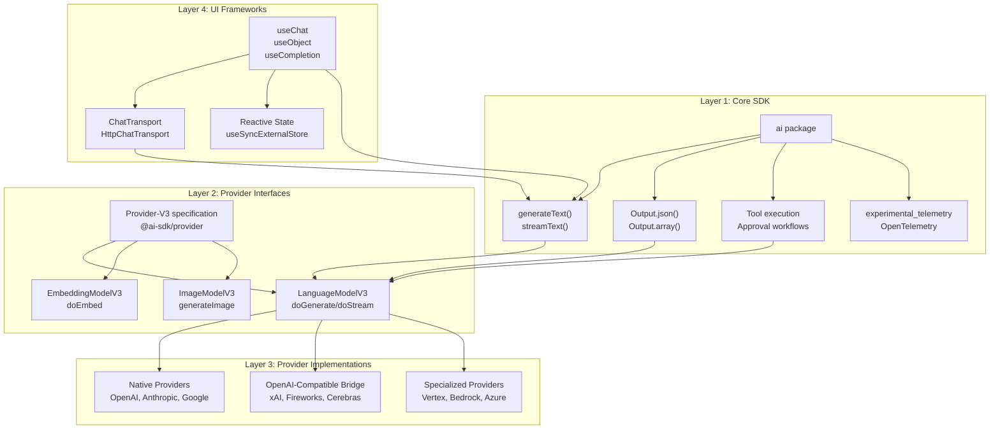
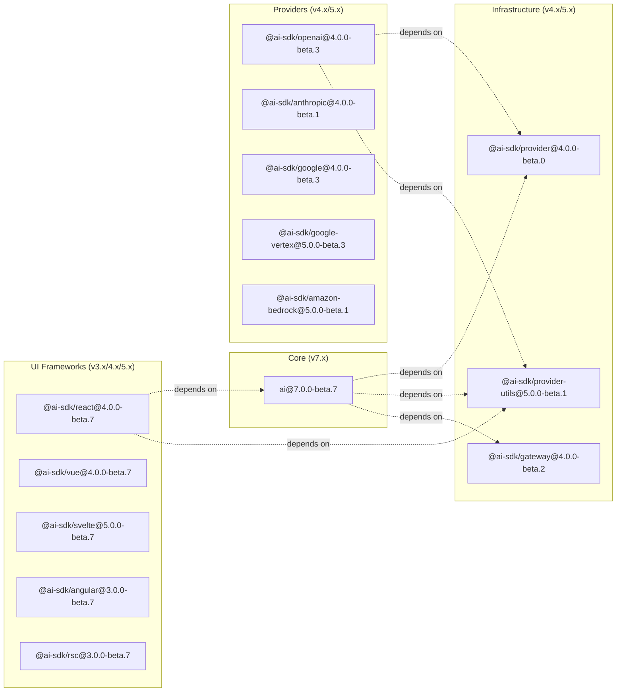
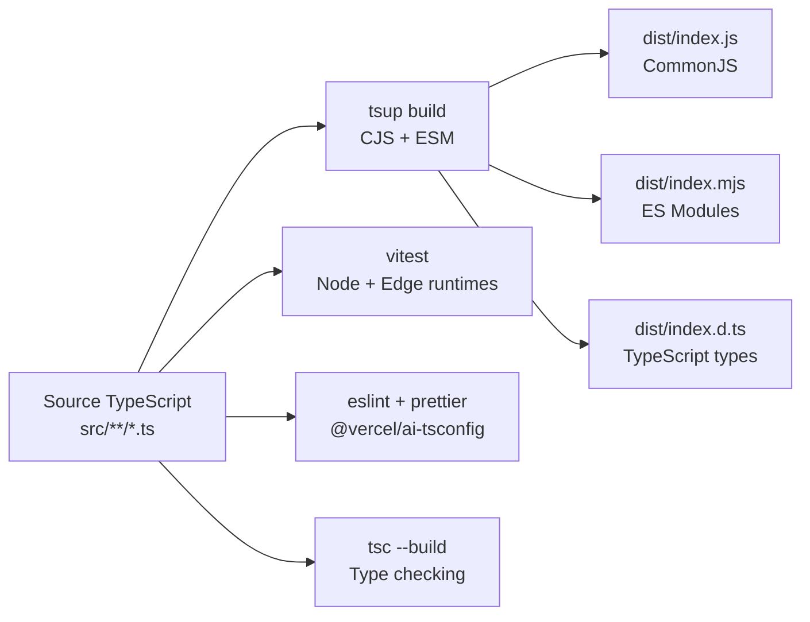

# Overview

<details>
<summary>Relevant source files</summary>

The following files were used as context for generating this wiki page:

- [.changeset/pre.json](.changeset/pre.json)
- [examples/express/package.json](examples/express/package.json)
- [examples/fastify/package.json](examples/fastify/package.json)
- [examples/hono/package.json](examples/hono/package.json)
- [examples/nest/package.json](examples/nest/package.json)
- [examples/next-fastapi/package.json](examples/next-fastapi/package.json)
- [examples/next-google-vertex/package.json](examples/next-google-vertex/package.json)
- [examples/next-langchain/package.json](examples/next-langchain/package.json)
- [examples/next-openai-kasada-bot-protection/package.json](examples/next-openai-kasada-bot-protection/package.json)
- [examples/next-openai-pages/package.json](examples/next-openai-pages/package.json)
- [examples/next-openai-telemetry-sentry/package.json](examples/next-openai-telemetry-sentry/package.json)
- [examples/next-openai-telemetry/package.json](examples/next-openai-telemetry/package.json)
- [examples/next-openai-upstash-rate-limits/package.json](examples/next-openai-upstash-rate-limits/package.json)
- [examples/node-http-server/package.json](examples/node-http-server/package.json)
- [examples/nuxt-openai/package.json](examples/nuxt-openai/package.json)
- [examples/sveltekit-openai/package.json](examples/sveltekit-openai/package.json)
- [packages/ai/CHANGELOG.md](packages/ai/CHANGELOG.md)
- [packages/ai/package.json](packages/ai/package.json)
- [packages/amazon-bedrock/CHANGELOG.md](packages/amazon-bedrock/CHANGELOG.md)
- [packages/amazon-bedrock/package.json](packages/amazon-bedrock/package.json)
- [packages/anthropic/CHANGELOG.md](packages/anthropic/CHANGELOG.md)
- [packages/anthropic/package.json](packages/anthropic/package.json)
- [packages/google-vertex/CHANGELOG.md](packages/google-vertex/CHANGELOG.md)
- [packages/google-vertex/package.json](packages/google-vertex/package.json)
- [packages/google/CHANGELOG.md](packages/google/CHANGELOG.md)
- [packages/google/package.json](packages/google/package.json)
- [packages/react/CHANGELOG.md](packages/react/CHANGELOG.md)
- [packages/react/package.json](packages/react/package.json)
- [packages/rsc/CHANGELOG.md](packages/rsc/CHANGELOG.md)
- [packages/rsc/package.json](packages/rsc/package.json)
- [packages/rsc/tests/e2e/next-server/CHANGELOG.md](packages/rsc/tests/e2e/next-server/CHANGELOG.md)
- [packages/svelte/CHANGELOG.md](packages/svelte/CHANGELOG.md)
- [packages/svelte/package.json](packages/svelte/package.json)
- [packages/vue/CHANGELOG.md](packages/vue/CHANGELOG.md)
- [packages/vue/package.json](packages/vue/package.json)
- [pnpm-lock.yaml](pnpm-lock.yaml)
- [tools/tsconfig/base.json](tools/tsconfig/base.json)

</details>


This document provides a high-level introduction to the AI SDK repository architecture, package structure, and core design principles. The AI SDK is a modular TypeScript framework for building AI-powered applications with unified interfaces to multiple AI providers and reactive UI framework integrations.

For detailed information about specific subsystems, see:
- Core SDK functionality: [Core SDK Functionality](#2)
- Provider implementations: [Provider Ecosystem](#3)
- UI framework integrations: [UI Framework Integrations](#4)
- Development workflows: [Development and Contribution](#6)

## What is the AI SDK

The AI SDK (`ai` package at [packages/ai]()) is a comprehensive TypeScript framework that provides:

- **Unified Provider Interfaces**: Standardized V3 specification ([`@ai-sdk/provider`]()) for language models, embedding models, image models, and other AI capabilities
- **Framework-Agnostic Core**: Text generation (`generateText`, `streamText`), structured outputs, tool calling, and multi-step agents in the core `ai` package
- **UI Framework Adapters**: Ready-to-use reactive hooks and components for React, Vue, Svelte, Angular, and Solid
- **15+ AI Provider Integrations**: Native implementations for OpenAI, Anthropic, Google, and OpenAI-compatible providers
- **Production Features**: Observability (OpenTelemetry), middleware, streaming, file handling, and approval workflows

The repository is structured as a **pnpm workspace monorepo** containing 20+ SDK packages, 50+ example applications, and comprehensive documentation.

**Sources:** [packages/ai/package.json](), [pnpm-lock.yaml:1-64](), [.changeset/pre.json:1-100]()

## Repository Structure

The monorepo follows a clear organizational hierarchy divided into packages, examples, and supporting infrastructure:

```mermaid
graph TB
    ROOT[/"Root<br/>pnpm workspace"/]
    
    subgraph "Core Packages"
        AI["ai<br/>packages/ai"]
        PROVIDER["@ai-sdk/provider<br/>packages/provider"]
        UTILS["@ai-sdk/provider-utils<br/>packages/provider-utils"]
        GATEWAY["@ai-sdk/gateway<br/>packages/gateway"]
    end
    
    subgraph "UI Framework Packages"
        REACT["@ai-sdk/react<br/>packages/react"]
        VUE["@ai-sdk/vue<br/>packages/vue"]
        SVELTE["@ai-sdk/svelte<br/>packages/svelte"]
        ANGULAR["@ai-sdk/angular<br/>packages/angular"]
        RSC["@ai-sdk/rsc<br/>packages/rsc"]
    end
    
    subgraph "Provider Packages"
        OPENAI["@ai-sdk/openai<br/>packages/openai"]
        ANTHROPIC["@ai-sdk/anthropic<br/>packages/anthropic"]
        GOOGLE["@ai-sdk/google<br/>packages/google"]
        VERTEX["@ai-sdk/google-vertex<br/>packages/google-vertex"]
        BEDROCK["@ai-sdk/amazon-bedrock<br/>packages/amazon-bedrock"]
        COMPAT["@ai-sdk/openai-compatible<br/>packages/openai-compatible"]
    end
    
    subgraph "Examples"
        NEXT["examples/next<br/>examples/next-*"]
        SVELTE_EX["examples/sveltekit-openai"]
        NUXT["examples/nuxt-openai"]
        EXPRESS["examples/express"]
    end
    
    ROOT --> AI
    ROOT --> PROVIDER
    ROOT --> UTILS
    ROOT --> GATEWAY
    ROOT --> REACT
    ROOT --> VUE
    ROOT --> SVELTE
    ROOT --> ANGULAR
    ROOT --> RSC
    ROOT --> OPENAI
    ROOT --> ANTHROPIC
    ROOT --> GOOGLE
    ROOT --> VERTEX
    ROOT --> BEDROCK
    ROOT --> COMPAT
    ROOT --> NEXT
    ROOT --> SVELTE_EX
    ROOT --> NUXT
    ROOT --> EXPRESS
```



**Package Dependency Pattern:**
- All packages use `workspace:*` dependencies for internal packages
- Core packages (`ai`, `@ai-sdk/provider`, `@ai-sdk/provider-utils`) are dependency roots
- UI framework packages depend on `ai` and `@ai-sdk/provider-utils`
- Provider packages depend on `@ai-sdk/provider` and `@ai-sdk/provider-utils`
- Examples consume packages via workspace links for real-world testing

**Sources:** [pnpm-lock.yaml:1-64](), [packages/ai/package.json:62-67](), [packages/react/package.json:39-44](), [packages/anthropic/package.json:53-56]()

## Layered Architecture

The AI SDK implements a three-layer architecture with clear separation of concerns:



**Layer Responsibilities:**

| Layer | Package(s) | Primary Exports | Purpose |
|-------|-----------|-----------------|---------|
| Core SDK | `ai` | `generateText`, `streamText`, `Output`, tool execution | Framework-agnostic AI operations |
| Provider Spec | `@ai-sdk/provider` | `LanguageModelV3`, `EmbeddingModelV3`, `ImageModelV3` | Standardized model interfaces |
| Provider Utils | `@ai-sdk/provider-utils` | `postJsonToApi`, validation, streaming handlers | Shared provider utilities |
| Providers | `@ai-sdk/openai`, `@ai-sdk/anthropic`, etc. | Model factory functions, provider-specific tools | AI service integrations |
| UI Frameworks | `@ai-sdk/react`, `@ai-sdk/vue`, etc. | `useChat`, `useObject`, reactive state | Client-side UI integration |
| Gateway | `@ai-sdk/gateway` | Model routing, failover | Multi-provider coordination |

**Sources:** [packages/ai/package.json:1-117](), [packages/react/package.json:39-44](), [packages/anthropic/package.json:53-56]()

## Package Organization and Versioning

### Package Categories

The monorepo organizes packages into distinct categories with coordinated versioning:



### Beta Pre-release Mode

The repository is currently in **v7 beta pre-release mode** coordinated via Changesets:

**Key Configuration:**
- Pre-release tag: `beta` (defined in `.changeset/pre.json`)
- Core package version: `ai@7.0.0-beta.7`
- All packages synchronized to beta versions
- Changesets tracked in `.changeset/pre.json:85-99`

**Package Exports Pattern:**
All packages follow a consistent dual-format export pattern:

```json
"exports": {
  "./package.json": "./package.json",
  ".": {
    "types": "./dist/index.d.ts",
    "import": "./dist/index.mjs",
    "require": "./dist/index.js"
  }
}
```

This provides:
- **CommonJS** (`dist/index.js`) for Node.js compatibility
- **ES Modules** (`dist/index.mjs`) for modern bundlers
- **TypeScript types** (`dist/index.d.ts`) with full type safety
- **Tree-shaking** via `"sideEffects": false`

**Sources:** [.changeset/pre.json:1-100](), [packages/ai/package.json:6-60](), [packages/react/package.json:5-27]()

## Core Package Structure

### The `ai` Package

The central `ai` package ([packages/ai]()) provides the framework-agnostic core:

**Primary Exports:**
- `generateText()` - Synchronous text generation
- `streamText()` - Streaming text generation with real-time responses
- `Output.json()`, `Output.array()`, `Output.choice()`, `Output.text()` - Structured output modes
- Tool execution framework with approval workflows
- `experimental_telemetry` - OpenTelemetry integration
- Middleware: `wrapLanguageModel()`, `wrapImageModel()`, `wrapEmbeddingModel()`

**Internal Structure:**
```
packages/ai/
├── src/
│   ├── index.ts              # Main exports
│   ├── core/                 # Core functionality
│   │   ├── generate-text/    # generateText, streamText
│   │   ├── generate-object/  # Structured outputs
│   │   └── tool/             # Tool execution
│   ├── ui/                   # UI-related utilities
│   └── internal/             # Internal APIs
├── dist/                     # Compiled output (CJS + ESM)
└── docs/                     # Copied documentation
```

**Multiple Export Targets:**
- Main: `ai` (default exports from `index.ts`)
- Internal: `ai/internal` (experimental/internal APIs)
- Test utilities: `ai/test` (testing helpers)

**Sources:** [packages/ai/package.json:1-117](), [packages/ai/package.json:42-61]()

### Provider Specification Package

The `@ai-sdk/provider` package defines standardized interfaces:

**Core Interfaces:**
- `LanguageModelV3` - Language model contract with `doGenerate()` and `doStream()`
- `EmbeddingModelV3` - Embedding model contract with `doEmbed()`
- `ImageModelV3` - Image generation contract
- `SpeechModelV3`, `TranscriptionModelV3` - Audio model contracts
- `Provider-V3` - Provider factory specification

All provider packages implement these interfaces to ensure compatibility with the core `ai` package.

**Sources:** File list references to provider interfaces

## Example Applications

The repository includes 50+ example applications demonstrating real-world usage patterns:

**Example Categories:**

| Category | Examples | Purpose |
|----------|----------|---------|
| Next.js | `examples/next`, `examples/next-agent`, `examples/next-openai-*` | App Router, Pages Router, RSC, production features |
| SvelteKit | `examples/sveltekit-openai` | SvelteKit integration with Svelte 5 |
| Nuxt | `examples/nuxt-openai` | Vue 3 + Nuxt 3 integration |
| Angular | `examples/angular` | Angular integration with signals |
| Server Frameworks | `examples/express`, `examples/fastify`, `examples/hono`, `examples/nest` | Backend-only implementations |
| Production Features | `examples/next-openai-telemetry`, `examples/next-openai-kasada-bot-protection` | OpenTelemetry, rate limiting, bot protection |
| LangChain | `examples/next-langchain` | LangGraph integration |

All examples use `workspace:*` dependencies, consuming packages directly from the monorepo for testing against the latest code.

**Sources:** [pnpm-lock.yaml:65-212](), [examples/next/package.json](), [examples/sveltekit-openai/package.json](), [examples/nuxt-openai/package.json]()

## Development Infrastructure

### Build and Quality Tooling



**Standard Package Scripts:**
```json
{
  "build": "pnpm clean && tsup --tsconfig tsconfig.build.json",
  "test": "pnpm test:node && pnpm test:edge",
  "test:node": "vitest --config vitest.node.config.js --run",
  "test:edge": "vitest --config vitest.edge.config.js --run",
  "lint": "eslint \"./**/*.ts*\"",
  "type-check": "tsc --build"
}
```

**Documentation Copying:**
Many provider packages copy their documentation during the `prepack` phase:
```bash
prepack: mkdir -p docs && cp ../../content/providers/.../provider-name.mdx ./docs/
postpack: del-cli docs
```

This ensures published packages include their own documentation files.

**Sources:** [packages/ai/package.json:26-40](), [packages/anthropic/package.json:24-37](), [packages/google-vertex/package.json:26-39]()

### Release Management with Changesets

The repository uses **Changesets** for version management and coordinated releases:

**Changeset Workflow:**
1. Developers create changesets for changes: `.changeset/*.md`
2. Changes accumulated in `.changeset/pre.json:85-99`
3. Versions synchronized across all packages in beta pre-release mode
4. CHANGELOGs automatically generated (e.g., `packages/ai/CHANGELOG.md`)

**Pre-release Configuration:**
```json
{
  "mode": "pre",
  "tag": "beta",
  "initialVersions": {
    "ai": "6.0.116",
    "@ai-sdk/react": "3.0.118",
    ...
  },
  "changesets": [...]
}
```

**Sources:** [.changeset/pre.json:1-100](), [packages/ai/CHANGELOG.md:1-100](), [packages/react/CHANGELOG.md:1-100]()

## Getting Started

To understand specific aspects of the AI SDK:

1. **For building applications:** Start with [UI Framework Integrations](#4) to see `useChat`, `useObject`, and other reactive hooks
2. **For provider integration:** See [Provider Ecosystem](#3) for implementing the Provider-V3 specification
3. **For core AI operations:** Review [Core SDK Functionality](#2) for `generateText`, `streamText`, and tool calling
4. **For contributing:** See [Development and Contribution](#6) for monorepo setup, testing, and release processes

The repository homepage provides comprehensive documentation at `https://ai-sdk.dev/docs`.

**Sources:** [packages/ai/package.json:91](), [packages/react/package.json:72]()