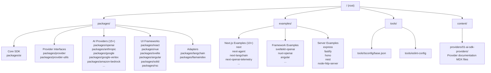
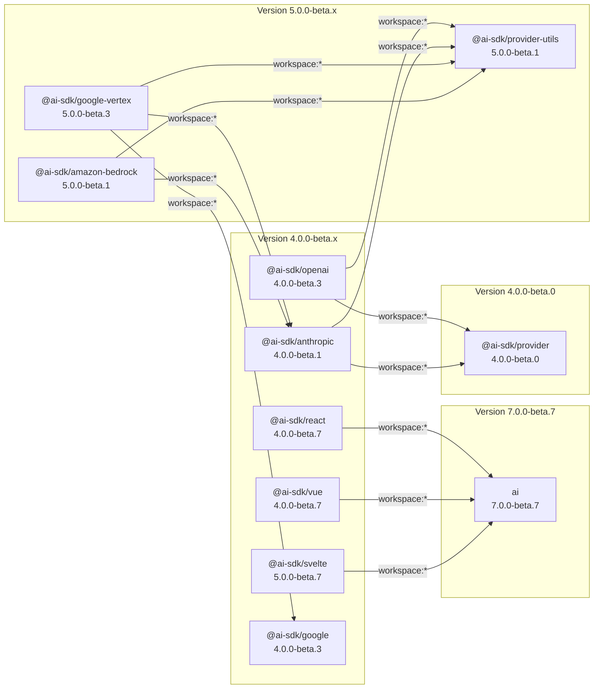
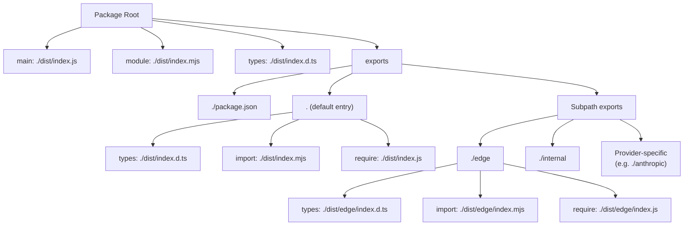
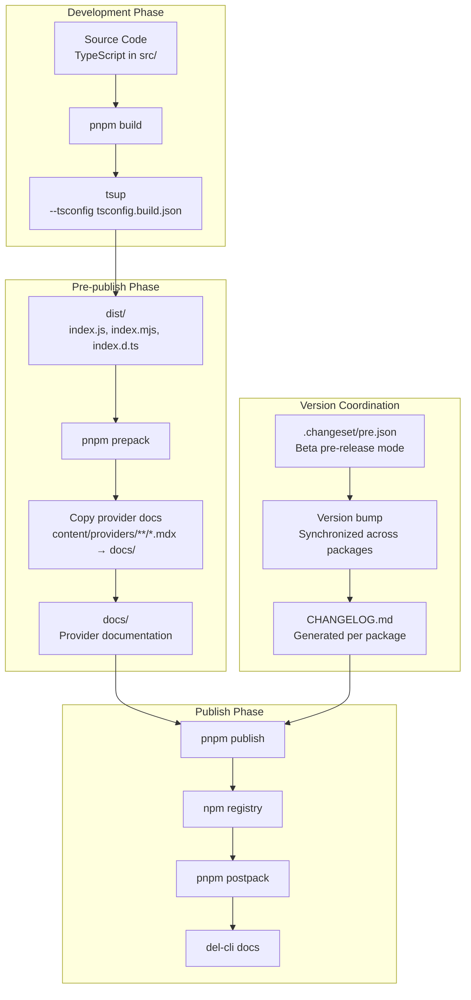
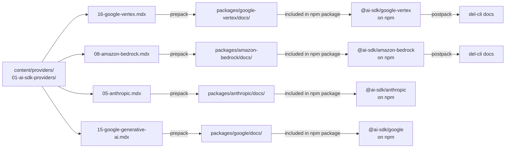

# Package Structure and Organization

<details>
<summary>Relevant source files</summary>

The following files were used as context for generating this wiki page:

- [.changeset/pre.json](.changeset/pre.json)
- [examples/express/package.json](examples/express/package.json)
- [examples/fastify/package.json](examples/fastify/package.json)
- [examples/hono/package.json](examples/hono/package.json)
- [examples/nest/package.json](examples/nest/package.json)
- [examples/next-fastapi/package.json](examples/next-fastapi/package.json)
- [examples/next-google-vertex/package.json](examples/next-google-vertex/package.json)
- [examples/next-langchain/package.json](examples/next-langchain/package.json)
- [examples/next-openai-kasada-bot-protection/package.json](examples/next-openai-kasada-bot-protection/package.json)
- [examples/next-openai-pages/package.json](examples/next-openai-pages/package.json)
- [examples/next-openai-telemetry-sentry/package.json](examples/next-openai-telemetry-sentry/package.json)
- [examples/next-openai-telemetry/package.json](examples/next-openai-telemetry/package.json)
- [examples/next-openai-upstash-rate-limits/package.json](examples/next-openai-upstash-rate-limits/package.json)
- [examples/node-http-server/package.json](examples/node-http-server/package.json)
- [examples/nuxt-openai/package.json](examples/nuxt-openai/package.json)
- [examples/sveltekit-openai/package.json](examples/sveltekit-openai/package.json)
- [packages/amazon-bedrock/CHANGELOG.md](packages/amazon-bedrock/CHANGELOG.md)
- [packages/amazon-bedrock/package.json](packages/amazon-bedrock/package.json)
- [packages/anthropic/CHANGELOG.md](packages/anthropic/CHANGELOG.md)
- [packages/anthropic/package.json](packages/anthropic/package.json)
- [packages/google-vertex/CHANGELOG.md](packages/google-vertex/CHANGELOG.md)
- [packages/google-vertex/package.json](packages/google-vertex/package.json)
- [packages/google/CHANGELOG.md](packages/google/CHANGELOG.md)
- [packages/google/package.json](packages/google/package.json)
- [pnpm-lock.yaml](pnpm-lock.yaml)
- [tools/tsconfig/base.json](tools/tsconfig/base.json)

</details>


This document describes the physical organization of the AI SDK monorepo, including the directory structure, package categorization, workspace dependency management, and build/distribution patterns. For the layered architecture and design principles that guide this organization, see [Architecture and Design Principles](#1.1). For development workflows and contribution guidelines, see [Development and Contribution](#6).

---

## Monorepo Structure

The AI SDK uses a **pnpm workspace** monorepo with over 20 SDK packages, 50+ example applications, and supporting infrastructure. The entire repository operates in **beta pre-release mode** (v7) coordinated via changesets.



**Sources:** [pnpm-lock.yaml:1-63](), [.changeset/pre.json:1-100]()

---

## Package Categories by Layer

Packages are organized into distinct layers matching the architectural design. Each category serves a specific purpose in the SDK ecosystem.

### Core SDK Layer

| Package | Path | Purpose |
|---------|------|---------|
| `ai` | `packages/ai` | Core SDK with `generateText`, `streamText`, structured outputs, tool calling |
| `@ai-sdk/provider` | `packages/provider` | Provider-V3 specification interfaces |
| `@ai-sdk/provider-utils` | `packages/provider-utils` | Shared utilities for provider implementations |
| `@ai-sdk/gateway` | `packages/gateway` | Model routing and failover |

**Sources:** [pnpm-lock.yaml:139-141](), Diagram 1 from context

### AI Provider Packages

| Category | Packages | Description |
|----------|----------|-------------|
| **Native Implementations** | `@ai-sdk/openai`, `@ai-sdk/anthropic`, `@ai-sdk/google` | Direct provider integrations with provider-specific features |
| **OpenAI-Compatible** | `@ai-sdk/openai-compatible`, `@ai-sdk/xai`, `@ai-sdk/fireworks`, `@ai-sdk/cerebras`, `@ai-sdk/togetherai`, `@ai-sdk/deepseek` | Providers using shared OpenAI-compatible bridge |
| **Specialized** | `@ai-sdk/azure`, `@ai-sdk/google-vertex`, `@ai-sdk/amazon-bedrock` | Providers that extend or compose other providers |
| **Additional** | `@ai-sdk/mistral`, `@ai-sdk/cohere`, `@ai-sdk/groq`, `@ai-sdk/perplexity` | Other provider implementations |

**Sources:** [packages/google-vertex/package.json:1-100](), [packages/amazon-bedrock/package.json:1-89](), [packages/anthropic/package.json:1-85](), [packages/google/package.json:1-86]()

### UI Framework Packages

| Package | Path | Peer Dependencies |
|---------|------|-------------------|
| `@ai-sdk/react` | `packages/react` | `react >= 18` |
| `@ai-sdk/vue` | `packages/vue` | `vue >= 3.5` |
| `@ai-sdk/svelte` | `packages/svelte` | `svelte >= 5` |
| `@ai-sdk/angular` | `packages/angular` | `@angular/core >= 16.0.0` |
| `@ai-sdk/solid` | `packages/solid` | `solid-js` |
| `@ai-sdk/rsc` | `packages/rsc` | `react`, `next >= 15` |

**Sources:** [examples/nuxt-openai/package.json:12-16](), [examples/sveltekit-openai/package.json:19-27](), [examples/angular/package.json:408-437]()

### Adapter Packages

- `@ai-sdk/langchain` - LangChain/LangGraph integration
- `@ai-sdk/llamaindex` - LlamaIndex integration

**Sources:** Diagram 1 from context

---

## Workspace Dependencies and Version Coordination

All packages use `workspace:*` protocol for internal dependencies, enabling synchronized development and testing.



### Dependency Declaration Pattern

Internal dependencies are declared using the `workspace:*` protocol in `package.json`:

```json
{
  "dependencies": {
    "@ai-sdk/provider": "workspace:*",
    "@ai-sdk/provider-utils": "workspace:*"
  }
}
```

This resolves to local packages during development and is replaced with exact versions during publish.

**Sources:** [packages/google-vertex/package.json:64-69](), [packages/amazon-bedrock/package.json:52-59](), [packages/anthropic/package.json:53-56](), [pnpm-lock.yaml:1-6]()

---

## Package Export Structure

All SDK packages follow a consistent dual-format export pattern supporting both CommonJS and ESM, with TypeScript declaration files.

### Standard Export Configuration



### Example: Google Vertex Package Exports

The `@ai-sdk/google-vertex` package demonstrates the full export pattern:

```json
{
  "exports": {
    "./package.json": "./package.json",
    ".": {
      "types": "./dist/index.d.ts",
      "import": "./dist/index.mjs",
      "require": "./dist/index.js"
    },
    "./edge": {
      "types": "./dist/edge/index.d.ts",
      "import": "./dist/edge/index.mjs",
      "require": "./dist/edge/index.js"
    },
    "./anthropic": {
      "types": "./dist/anthropic/index.d.ts",
      "import": "./dist/anthropic/index.mjs",
      "require": "./dist/anthropic/index.js"
    },
    "./anthropic/edge": {
      "types": "./dist/anthropic/edge/index.d.ts",
      "import": "./dist/anthropic/edge/index.mjs",
      "require": "./dist/anthropic/edge/index.js"
    }
  }
}
```

This enables usage like:
- `import { vertex } from '@ai-sdk/google-vertex'` (default)
- `import { vertex } from '@ai-sdk/google-vertex/edge'` (edge runtime)
- `import { vertexAnthropic } from '@ai-sdk/google-vertex/anthropic'` (Anthropic via Vertex)

**Sources:** [packages/google-vertex/package.json:41-63](), [packages/google/package.json:39-52](), [packages/anthropic/package.json:39-52]()

---

## Package Distribution Structure

Each package includes specific files in its distribution, controlled by the `files` field in `package.json`.

### Standard Distribution Contents

| File/Directory | Purpose |
|----------------|---------|
| `dist/**/*` | Compiled JavaScript, TypeScript declarations, source maps |
| `docs/**/*` | Provider-specific documentation (copied during `prepack`) |
| `src/` | Source TypeScript files (for source map resolution) |
| `!src/**/*.test.ts` | Exclude test files |
| `!src/**/__snapshots__` | Exclude test snapshots |
| `CHANGELOG.md` | Version history |
| `README.md` | Package documentation |
| `*.d.ts` | TypeScript declaration files for subpath exports |

### Tree-Shaking Optimization

All packages set `"sideEffects": false` to enable aggressive tree-shaking by bundlers:

```json
{
  "sideEffects": false
}
```

This indicates that no module in the package has side effects when imported, allowing unused exports to be safely eliminated.

**Sources:** [packages/google-vertex/package.json:5-25](), [packages/google/package.json:5-23](), [packages/anthropic/package.json:5-23]()

---

## Build and Release Workflow

The monorepo uses a sophisticated build and release pipeline coordinated across all packages.



### Build Script Pattern

Each package uses `tsup` for building with consistent configuration:

```json
{
  "scripts": {
    "build": "pnpm clean && tsup --tsconfig tsconfig.build.json",
    "build:watch": "pnpm clean && tsup --watch",
    "clean": "del-cli dist docs *.tsbuildinfo"
  }
}
```

The build process:
1. **Clean** - Remove previous build artifacts (`dist/`, `docs/`, `*.tsbuildinfo`)
2. **tsup** - Bundle TypeScript with `tsconfig.build.json`, generating CJS, ESM, and declarations
3. **Watch mode** - Available for development with auto-rebuild

**Sources:** [packages/google-vertex/package.json:26-29](), [packages/anthropic/package.json:25-27]()

---

## Documentation Propagation System

The monorepo implements a **documentation propagation system** that copies provider-specific documentation from the central `content/` directory into each package's distribution.



### prepack/postpack Scripts

```json
{
  "scripts": {
    "prepack": "mkdir -p docs && cp ../../content/providers/01-ai-sdk-providers/16-google-vertex.mdx ./docs/",
    "postpack": "del-cli docs"
  }
}
```

This workflow ensures:
1. Documentation is centrally maintained in `content/`
2. Each published package includes its own documentation
3. Documentation is cleaned up after publishing to avoid committing generated files
4. Users can access documentation offline with the installed package

**Sources:** [packages/google-vertex/package.json:30-31](), [packages/amazon-bedrock/package.json:28-29](), [packages/anthropic/package.json:28-29](), [packages/google/package.json:28-29]()

---

## Example Applications Structure

The repository includes 50+ example applications demonstrating SDK usage across different frameworks and use cases.

### Example Categories

| Category | Count | Examples |
|----------|-------|----------|
| **Next.js** | 10+ | `next`, `next-agent`, `next-langchain`, `next-openai-telemetry`, `next-openai-kasada-bot-protection`, `next-openai-upstash-rate-limits`, `next-fastapi`, `next-google-vertex` |
| **Frontend Frameworks** | 3 | `sveltekit-openai`, `nuxt-openai`, `angular` |
| **Server Frameworks** | 5 | `express`, `fastify`, `hono`, `nest`, `node-http-server` |
| **Specialized** | 2+ | `mcp` (Model Context Protocol), `ai-functions` (comprehensive test suite) |

### Example Dependency Pattern

Examples use specific version constraints to test against beta releases:

```json
{
  "dependencies": {
    "@ai-sdk/react": "4.0.0-beta.7",
    "@ai-sdk/openai": "4.0.0-beta.3",
    "ai": "7.0.0-beta.7"
  }
}
```

vs. workspace links for development:

```json
{
  "dependencies": {
    "@ai-sdk/react": "link:../../packages/react",
    "@ai-sdk/openai": "link:../../packages/openai",
    "ai": "link:../../packages/ai"
  }
}
```

**Sources:** [examples/next/package.json:684-713](), [examples/sveltekit-openai/package.json:1-46](), [examples/nuxt-openai/package.json:1-34](), [examples/angular/package.json:408-474](), [examples/express/package.json:1-22](), [examples/fastify/package.json:1-20](), [examples/hono/package.json:1-23](), [examples/nest/package.json:1-66](), [examples/next-langchain/package.json:1-40]()

---

## Shared Development Tools

The monorepo provides shared configuration for consistent development across all packages.

### TypeScript Configuration

Base TypeScript configuration shared across all packages:

```json
{
  "$schema": "https://json.schemastore.org/tsconfig",
  "compilerOptions": {
    "composite": false,
    "declaration": true,
    "declarationMap": true,
    "esModuleInterop": true,
    "module": "ESNext",
    "moduleResolution": "Bundler",
    "skipLibCheck": true,
    "strict": true,
    "types": ["@types/node"]
  }
}
```

Individual packages extend this with `tsconfig.build.json`:

```json
{
  "extends": "../../tools/tsconfig/base.json",
  "compilerOptions": {
    "outDir": "./dist",
    "rootDir": "./src"
  },
  "include": ["src/**/*"],
  "exclude": ["src/**/*.test.ts"]
}
```

### ESLint Configuration

Shared ESLint configuration via `eslint-config-vercel-ai`:

```json
{
  "devDependencies": {
    "eslint-config-vercel-ai": "workspace:*"
  }
}
```

Referenced in root and individual packages as:

```json
{
  "devDependencies": {
    "eslint": "8.57.1",
    "eslint-config-vercel-ai": "workspace:*"
  }
}
```

**Sources:** [tools/tsconfig/base.json:1-23](), [pnpm-lock.yaml:22-24]()

---

## Package Metadata and Publishing

All SDK packages share consistent metadata for discovery and publishing.

### Standard Metadata Fields

```json
{
  "license": "Apache-2.0",
  "engines": {
    "node": ">=18"
  },
  "publishConfig": {
    "access": "public"
  },
  "homepage": "https://ai-sdk.dev/docs",
  "repository": {
    "type": "git",
    "url": "git+https://github.com/vercel/ai.git"
  },
  "bugs": {
    "url": "https://github.com/vercel/ai/issues"
  },
  "keywords": ["ai"]
}
```

### Peer Dependencies

Packages declare peer dependencies for optional integrations:

```json
{
  "peerDependencies": {
    "zod": "^3.25.76 || ^4.1.8"
  }
}
```

This allows users to choose their schema validation library version while ensuring compatibility.

**Sources:** [packages/google-vertex/package.json:69-99](), [packages/amazon-bedrock/package.json:68-88](), [packages/anthropic/package.json:64-85](), [packages/google/package.json:65-85]()