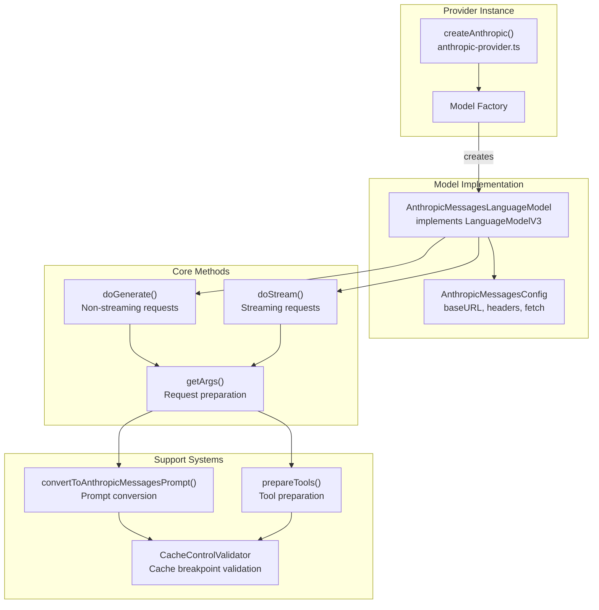
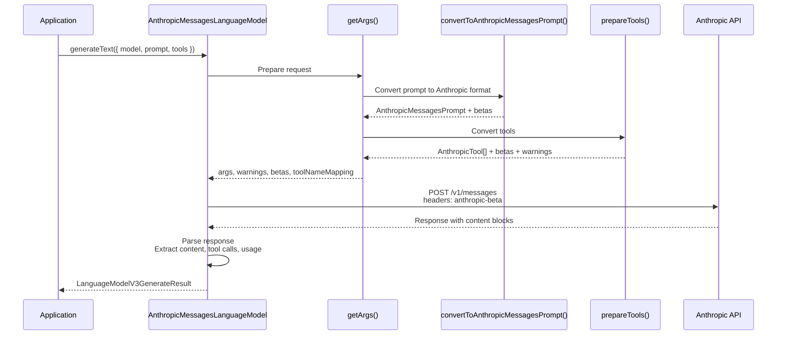
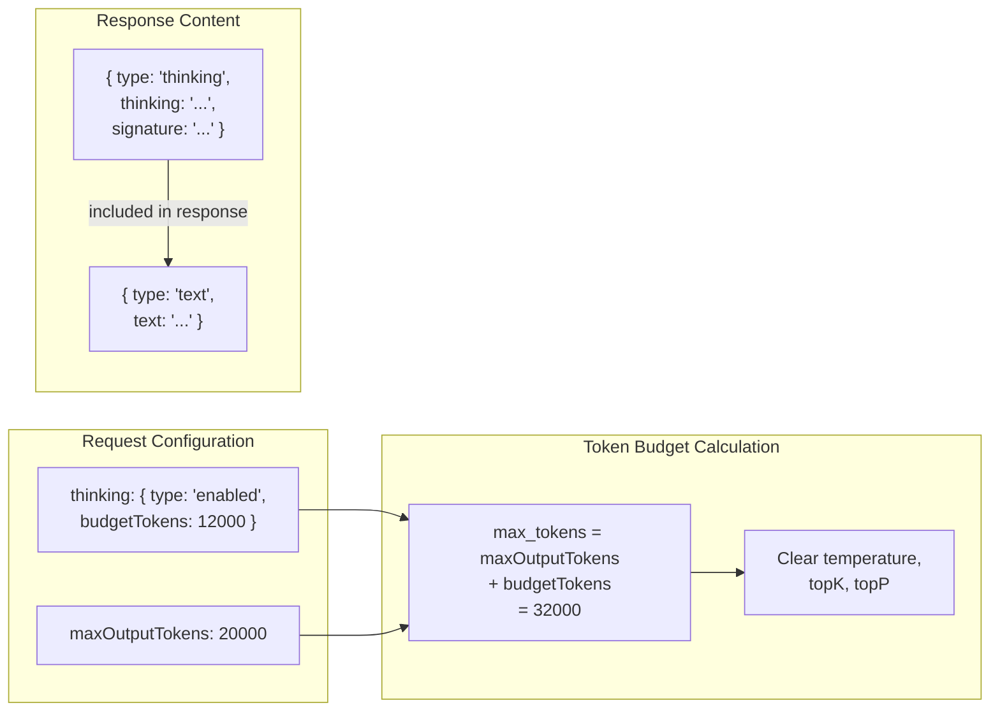
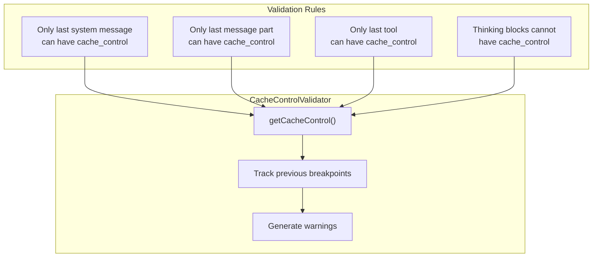
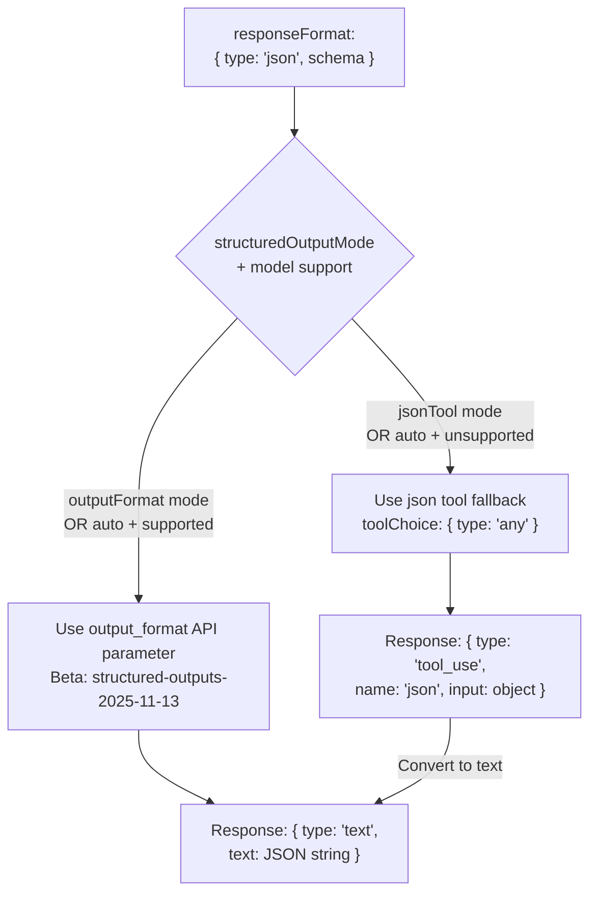
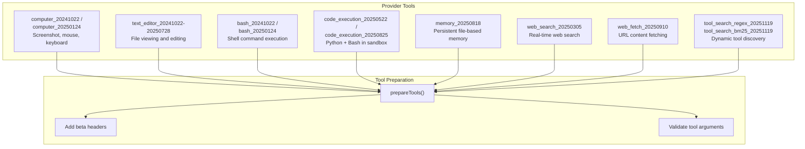
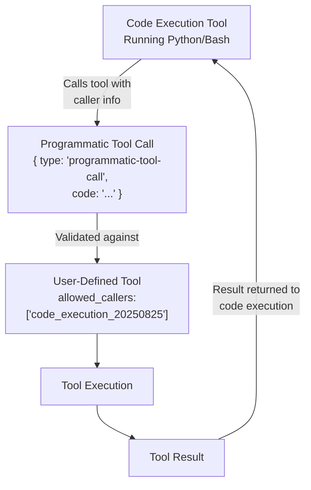
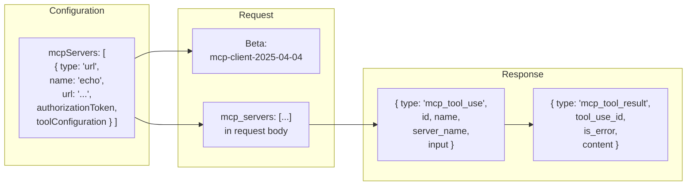
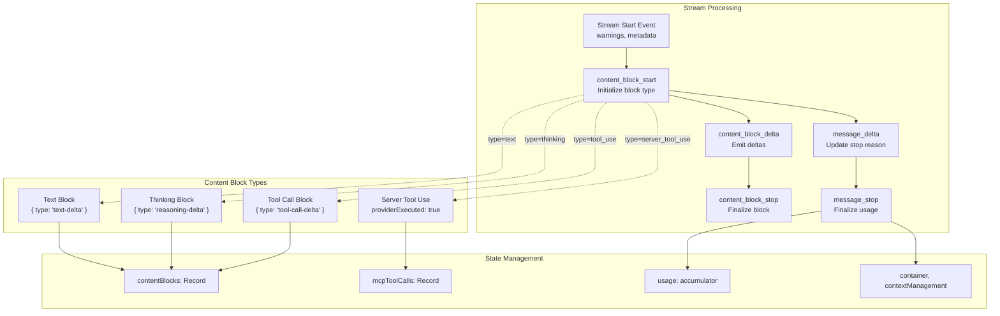

# Anthropic Provider

<details>
<summary>Relevant source files</summary>

The following files were used as context for generating this wiki page:

- [.changeset/pre.json](.changeset/pre.json)
- [content/docs/02-foundations/02-providers-and-models.mdx](content/docs/02-foundations/02-providers-and-models.mdx)
- [content/providers/01-ai-sdk-providers/05-anthropic.mdx](content/providers/01-ai-sdk-providers/05-anthropic.mdx)
- [content/providers/01-ai-sdk-providers/index.mdx](content/providers/01-ai-sdk-providers/index.mdx)
- [examples/ai-functions/src/stream-text/anthropic/fine-grained-tool-streaming.ts](examples/ai-functions/src/stream-text/anthropic/fine-grained-tool-streaming.ts)
- [examples/express/package.json](examples/express/package.json)
- [examples/fastify/package.json](examples/fastify/package.json)
- [examples/hono/package.json](examples/hono/package.json)
- [examples/nest/package.json](examples/nest/package.json)
- [examples/next-fastapi/package.json](examples/next-fastapi/package.json)
- [examples/next-google-vertex/package.json](examples/next-google-vertex/package.json)
- [examples/next-langchain/package.json](examples/next-langchain/package.json)
- [examples/next-openai-kasada-bot-protection/package.json](examples/next-openai-kasada-bot-protection/package.json)
- [examples/next-openai-pages/package.json](examples/next-openai-pages/package.json)
- [examples/next-openai-telemetry-sentry/package.json](examples/next-openai-telemetry-sentry/package.json)
- [examples/next-openai-telemetry/package.json](examples/next-openai-telemetry/package.json)
- [examples/next-openai-upstash-rate-limits/package.json](examples/next-openai-upstash-rate-limits/package.json)
- [examples/node-http-server/package.json](examples/node-http-server/package.json)
- [examples/nuxt-openai/package.json](examples/nuxt-openai/package.json)
- [examples/sveltekit-openai/package.json](examples/sveltekit-openai/package.json)
- [packages/amazon-bedrock/CHANGELOG.md](packages/amazon-bedrock/CHANGELOG.md)
- [packages/amazon-bedrock/package.json](packages/amazon-bedrock/package.json)
- [packages/anthropic/CHANGELOG.md](packages/anthropic/CHANGELOG.md)
- [packages/anthropic/package.json](packages/anthropic/package.json)
- [packages/anthropic/src/__snapshots__/anthropic-messages-language-model.test.ts.snap](packages/anthropic/src/__snapshots__/anthropic-messages-language-model.test.ts.snap)
- [packages/anthropic/src/anthropic-messages-api.ts](packages/anthropic/src/anthropic-messages-api.ts)
- [packages/anthropic/src/anthropic-messages-language-model.test.ts](packages/anthropic/src/anthropic-messages-language-model.test.ts)
- [packages/anthropic/src/anthropic-messages-language-model.ts](packages/anthropic/src/anthropic-messages-language-model.ts)
- [packages/anthropic/src/anthropic-messages-options.ts](packages/anthropic/src/anthropic-messages-options.ts)
- [packages/anthropic/src/anthropic-prepare-tools.test.ts](packages/anthropic/src/anthropic-prepare-tools.test.ts)
- [packages/anthropic/src/anthropic-prepare-tools.ts](packages/anthropic/src/anthropic-prepare-tools.ts)
- [packages/anthropic/src/anthropic-tools.ts](packages/anthropic/src/anthropic-tools.ts)
- [packages/anthropic/src/convert-anthropic-messages-usage.test.ts](packages/anthropic/src/convert-anthropic-messages-usage.test.ts)
- [packages/anthropic/src/convert-anthropic-messages-usage.ts](packages/anthropic/src/convert-anthropic-messages-usage.ts)
- [packages/anthropic/src/convert-to-anthropic-messages-prompt.test.ts](packages/anthropic/src/convert-to-anthropic-messages-prompt.test.ts)
- [packages/anthropic/src/convert-to-anthropic-messages-prompt.ts](packages/anthropic/src/convert-to-anthropic-messages-prompt.ts)
- [packages/google-vertex/CHANGELOG.md](packages/google-vertex/CHANGELOG.md)
- [packages/google-vertex/package.json](packages/google-vertex/package.json)
- [packages/google/CHANGELOG.md](packages/google/CHANGELOG.md)
- [packages/google/package.json](packages/google/package.json)
- [pnpm-lock.yaml](pnpm-lock.yaml)

</details>


The Anthropic provider integrates Anthropic's Claude models into the AI SDK through the Messages API. It implements the Provider-V3 specification with support for advanced features including extended thinking, prompt caching, provider-executed tools, and agent skills.

For OpenAI provider implementation, see [3.2](#3.2) and [3.3](#3.3). For general provider architecture, see [3.1](#3.1).

## Provider Architecture

The Anthropic provider is built around the `AnthropicMessagesLanguageModel` class, which implements the `LanguageModelV3` interface to provide compatibility with core SDK functions like `generateText` and `streamText`.



Sources: [packages/anthropic/src/anthropic-messages-language-model.ts:114-129](), [packages/anthropic/src/anthropic-provider.ts]()

### Configuration and Initialization

The provider supports customization through `createAnthropic` or uses defaults from the `anthropic` singleton instance.

| Configuration Option | Type | Purpose |
|---------------------|------|---------|
| `baseURL` | string | API endpoint (default: `https://api.anthropic.com/v1`) |
| `apiKey` | string | Authentication key (from `ANTHROPIC_API_KEY` env var) |
| `headers` | Resolvable<Record<string, string>> | Custom request headers |
| `fetch` | FetchFunction | Custom fetch implementation |
| `generateId` | () => string | ID generator for sources and citations |
| `supportsNativeStructuredOutput` | boolean | Enable native structured outputs (default: true) |

Sources: [packages/anthropic/src/anthropic-messages-language-model.ts:98-112]()

## Model Catalog and Capabilities

The provider defines model capabilities including maximum output tokens and structured output support. These capabilities inform request validation and token limit enforcement.

```typescript
// From get-model-capabilities.ts
interface ModelCapabilities {
  maxOutputTokens: number;
  supportsStructuredOutput: boolean;
  isKnownModel: boolean;
}
```

**Known Models:**

| Model ID | Max Output Tokens | Structured Output | Extended Thinking |
|----------|------------------|-------------------|-------------------|
| `claude-opus-4-5` | 64000 | ✓ | ✓ |
| `claude-opus-4-1` | 64000 | ✓ | ✓ |
| `claude-opus-4-0` | 64000 | ✓ | ✓ |
| `claude-sonnet-4-5` | 64000 | ✓ | ✓ |
| `claude-sonnet-4-0` | 64000 | ✓ | ✓ |
| `claude-3-7-sonnet-20250219` | 64000 | ✓ | ✓ |
| `claude-haiku-4-5` | 64000 | ✓ | - |
| `claude-3-5-haiku-latest` | 8192 | ✓ | - |
| `claude-3-haiku-20240307` | 4096 | - | - |

Sources: [packages/anthropic/src/anthropic-messages-options.ts:4-22](), [packages/anthropic/src/get-model-capabilities.ts]()

## Request Flow and Message Conversion



Sources: [packages/anthropic/src/anthropic-messages-language-model.ts:143-545](), [packages/anthropic/src/anthropic-messages-language-model.ts:633-1026]()

### Prompt Conversion Pipeline

The `convertToAnthropicMessagesPrompt` function transforms `LanguageModelV3Prompt` into Anthropic's message format, handling multi-modal content, tool results, and cache control breakpoints.

**Message Grouping Strategy:**

The converter groups consecutive messages of the same type into "blocks" to handle Anthropic's constraint that messages must alternate between user and assistant roles:

- System messages at the start → single `system` field
- Consecutive user + tool messages → single user message with multiple content parts
- Consecutive assistant messages → single assistant message with multiple content parts

Sources: [packages/anthropic/src/convert-to-anthropic-messages-prompt.ts:52-67]()

**Content Type Mapping:**

| SDK Content Type | Anthropic Content Type | Beta Header |
|-----------------|------------------------|-------------|
| Text part | `{ type: 'text', text }` | - |
| Image part | `{ type: 'image', source }` | - |
| File (PDF) | `{ type: 'document', source, media_type: 'application/pdf' }` | `pdfs-2024-09-25` |
| File (text/plain) | `{ type: 'document', source, media_type: 'text/plain' }` | - |
| Tool result | `{ type: 'tool_result', tool_use_id, content }` | - |
| Reasoning | `{ type: 'thinking', thinking, signature }` | - |

Sources: [packages/anthropic/src/convert-to-anthropic-messages-prompt.ts:156-254]()

## Extended Thinking and Reasoning

Extended thinking enables Claude to show its reasoning process before providing answers. It requires enabling the `thinking` configuration with a token budget.



**Implementation Details:**

- Thinking blocks require a minimum budget of 1,024 tokens
- The budget is added to `max_tokens` in the API request
- Temperature, topK, and topP are not supported with thinking enabled
- Thinking blocks include a cryptographic signature for verification
- The model may return redacted thinking blocks (`redacted_thinking`) with opaque data

Sources: [packages/anthropic/src/anthropic-messages-language-model.ts:274-436]()

**Response Extraction:**

Thinking responses are converted to `reasoning` content type in the SDK response:

```typescript
// From anthropic-messages-language-model.ts:690-711
case 'thinking': {
  content.push({
    type: 'reasoning',
    text: part.thinking,
    providerMetadata: {
      anthropic: {
        signature: part.signature,
      }
    },
  });
  break;
}
```

Sources: [packages/anthropic/src/anthropic-messages-language-model.ts:690-711]()

## Prompt Caching

Anthropic's prompt caching reduces latency and costs by caching portions of the request context. Cache control breakpoints are set using `providerOptions` on messages, message parts, and tools.

### Cache Control Validation

The `CacheControlValidator` ensures cache control is applied correctly according to Anthropic's rules:



Sources: [packages/anthropic/src/get-cache-control.ts]()

**Cache Control Configuration:**

```typescript
// From anthropic-messages-options.ts
cacheControl: {
  type: 'ephemeral',
  ttl?: '5m' | '1h'  // Optional longer cache duration
}
```

**Minimum Cacheable Lengths:**

| Model | Minimum Tokens |
|-------|---------------|
| Claude Opus 4.5 | 4096 |
| Claude Opus 4.1, 4, Sonnet 4.5, 4, 3.7, Opus 3 | 1024 |
| Claude Haiku 4.5 | 4096 |
| Claude Haiku 3.5, 3 | 2048 |

Sources: [packages/anthropic/src/anthropic-messages-language-model.ts:242](), [content/providers/01-ai-sdk-providers/05-anthropic.mdx:423-430]()

## Structured Outputs

The provider supports two modes for structured outputs: native `output_format` (newer models) and JSON tool fallback (older models).



Sources: [packages/anthropic/src/anthropic-messages-language-model.ts:217-237]()

**Mode Selection Logic:**

| `structuredOutputMode` | Model Support | Result |
|----------------------|---------------|--------|
| `"outputFormat"` | Any | Use `output_format` |
| `"jsonTool"` | Any | Use JSON tool |
| `"auto"` (default) | Supported | Use `output_format` |
| `"auto"` (default) | Unsupported | Use JSON tool |

The JSON tool approach creates a synthetic tool named `json` with the schema as its input schema, forces its use with `toolChoice: { type: 'any' }`, and extracts the result from the tool call.

Sources: [packages/anthropic/src/anthropic-messages-language-model.ts:227-237](), [packages/anthropic/src/anthropic-messages-language-model.ts:715-726]()

## Context Management

Context management automatically clears tool uses or thinking content when certain conditions are met, optimizing token usage in long conversations.

### Clear Tool Uses Edit

```typescript
// From anthropic-messages-options.ts:162-194
{
  type: 'clear_tool_uses_20250919',
  trigger?: { type: 'input_tokens' | 'tool_uses', value: number },
  keep?: { type: 'tool_uses', value: number },
  clearAtLeast?: { type: 'input_tokens', value: number },
  clearToolInputs?: boolean,
  excludeTools?: string[]
}
```

**Parameters:**

- `trigger` - When to clear (e.g., after 10,000 input tokens)
- `keep` - How many recent tool uses to preserve
- `clearAtLeast` - Minimum tokens to free up
- `clearToolInputs` - Whether to clear tool input parameters
- `excludeTools` - Tool names that should never be cleared

### Clear Thinking Edit

```typescript
// From anthropic-messages-options.ts:195-206
{
  type: 'clear_thinking_20251015',
  keep?: 'all' | { type: 'thinking_turns', value: number }
}
```

### Response Metadata

Applied edits are returned in `providerMetadata.anthropic.contextManagement`:

```typescript
// From anthropic-message-metadata.ts
contextManagement: {
  appliedEdits: Array<
    | { type: 'clear_tool_uses_20250919',
        clearedToolUses: number,
        clearedInputTokens: number }
    | { type: 'clear_thinking_20251015',
        clearedThinkingTurns: number,
        clearedInputTokens: number }
  >
}
```

Sources: [packages/anthropic/src/anthropic-messages-language-model.ts:346-387](), [packages/anthropic/src/anthropic-message-metadata.ts]()

## Provider Tools Ecosystem

Anthropic provides several provider-executed tools that run on their infrastructure. These tools are prepared by `prepareTools` and identified by the `provider` tool type with an `anthropic.*` ID prefix.



Sources: [packages/anthropic/src/anthropic-prepare-tools.ts:100-273]()

### Computer Use Tool

Enables Claude to control a computer through screenshots, mouse, and keyboard actions.

**Tool Definition:**

```typescript
// From anthropic-prepare-tools.ts:122-132
{
  name: 'computer',
  type: 'computer_20250124',
  display_width_px: number,
  display_height_px: number,
  display_number: number
}
```

**Actions:**
- `screenshot` - Capture display (returns image)
- `mouse_move` - Move to coordinates
- `left_click`, `right_click`, `middle_click`, `double_click` - Mouse clicks
- `left_click_drag` - Drag from current position
- `key` - Press key
- `type` - Type text
- `cursor_position` - Get cursor location

**Beta Header:** `computer-use-2025-01-24` or `computer-use-2024-10-22`

Sources: [packages/anthropic/src/tool/computer_20250124.ts](), [packages/anthropic/src/anthropic-prepare-tools.ts:122-145]()

### Text Editor Tool

Provides file viewing and editing capabilities with multiple versions supporting different model generations.

**Available Versions:**

| Version | Models | Commands |
|---------|--------|----------|
| `text_editor_20241022` | Claude Sonnet 3.5 | view, create, str_replace, insert, undo_edit |
| `text_editor_20250124` | Claude Sonnet 3.7 | view, create, str_replace, insert, undo_edit |
| `text_editor_20250429` | Claude Sonnet 4, Opus 4, 4.1 | view, create, str_replace, insert |
| `text_editor_20250728` | Claude Sonnet 4, Opus 4, 4.1 | view, create, str_replace, insert + `max_characters` |

**Commands:**

- `view` - Display file contents (with optional line range)
- `create` - Create new file
- `str_replace` - Replace text (old_str → new_str)
- `insert` - Insert at line number
- `undo_edit` - Revert last edit (not available in newer versions)

Sources: [packages/anthropic/src/tool/text-editor_20250728.ts](), [packages/anthropic/src/anthropic-prepare-tools.ts:146-184]()

### Code Execution Tool

Executes code in a sandboxed environment with file system access.

**Version Comparison:**

| Feature | `code_execution_20250522` | `code_execution_20250825` |
|---------|--------------------------|--------------------------|
| Python support | ✓ | ✓ |
| Bash support | - | ✓ |
| File operations | ✓ | ✓ (enhanced) |
| Programmatic tool calling | - | ✓ |
| Agent skills | - | ✓ |
| Beta header | `code-execution-2025-05-22` | `code-execution-2025-08-25` |

**Response Structure (20250825):**

```typescript
// Bash execution
{
  type: 'bash_code_execution_result',
  stdout: string,
  stderr: string,
  return_code: number,
  content: Array<{ type: 'bash_code_execution_output', file_id: string }>
}

// Text editor execution
{
  type: 'text_editor_code_execution_create_result'
  | 'text_editor_code_execution_view_result'
  | 'text_editor_code_execution_str_replace_result',
  // ... type-specific fields
}
```

Sources: [packages/anthropic/src/tool/code-execution_20250825.ts](), [packages/anthropic/src/anthropic-prepare-tools.ts:105-121]()

### Programmatic Tool Calling

Code execution 20250825 supports programmatic tool calling, where Claude can invoke user-defined tools from within executing code.



**Tool Configuration:**

```typescript
// From anthropic-prepare-tools.ts:77-79
{
  name: 'myTool',
  // ...
  allowed_callers: ['code_execution_20250825']
}
```

**Input Format Detection:**

The provider detects programmatic tool calls by checking for the `type: 'programmatic-tool-call'` field in the input, which is stripped before sending to Anthropic.

Sources: [packages/anthropic/src/convert-to-anthropic-messages-prompt.ts:547-567](), [packages/anthropic/src/anthropic-prepare-tools.ts:77-79]()

### Web Search and Web Fetch Tools

**Web Search (`web_search_20250305`):**

Provides real-time web search with domain filtering and geolocation.

```typescript
{
  type: 'web_search_20250305',
  name: 'web_search',
  max_uses?: number,
  allowed_domains?: string[],
  blocked_domains?: string[],
  user_location?: {
    type: 'approximate',
    city?: string,
    region?: string,
    country?: string,
    timezone?: string
  }
}
```

**Web Fetch (`web_fetch_20250910`):**

Fetches content from specific URLs with citation support.

```typescript
{
  type: 'web_fetch_20250910',
  name: 'web_fetch',
  max_uses?: number,
  allowed_domains?: string[],
  blocked_domains?: string[],
  citations?: { enabled: boolean },
  max_content_tokens?: number
}
```

**Beta Header:** `web-fetch-2025-09-10`

Sources: [packages/anthropic/src/tool/web-search_20250305.ts](), [packages/anthropic/src/tool/web-fetch-20250910.ts](), [packages/anthropic/src/anthropic-prepare-tools.ts:212-244]()

### Tool Search Tools

Enable Claude to work with large tool catalogs by dynamically discovering tools on-demand instead of loading all definitions upfront.

**BM25 (Natural Language Search):**

```typescript
{
  type: 'tool_search_tool_bm25_20251119',
  name: 'tool_search_tool_bm25'
}
```

**Regex Search:**

```typescript
{
  type: 'tool_search_tool_regex_20251119',
  name: 'tool_search_tool_regex'
}
```

**Deferred Tool Loading:**

Tools marked with `deferLoading: true` are not sent in the initial request:

```typescript
// From anthropic-prepare-tools.ts:65-76
{
  name: 'myTool',
  description: '...',
  input_schema: {...},
  defer_loading: true  // Tool discovered via search
}
```

**Beta Header:** `advanced-tool-use-2025-11-20`

Sources: [packages/anthropic/src/tool/tool-search-bm25_20251119.ts](), [packages/anthropic/src/tool/tool-search-regex_20251119.ts](), [packages/anthropic/src/anthropic-prepare-tools.ts:65-76]()

### Memory Tool

Provides persistent file-based memory that Claude can use across conversations.

```typescript
{
  name: 'memory',
  type: 'memory_20250818'
}
```

**Beta Header:** `context-management-2025-06-27`

**Supported Models:** Claude Sonnet 4.5, Claude Sonnet 4, Claude Opus 4.1, Claude Opus 4

Sources: [packages/anthropic/src/tool/memory_20250818.ts](), [packages/anthropic/src/anthropic-prepare-tools.ts:204-210]()

## MCP Connectors

MCP (Model Context Protocol) servers provide dynamic tools that Claude can discover and use during execution.



**Configuration:**

```typescript
// From anthropic-messages-options.ts:108-125
mcpServers: [
  {
    type: 'url',
    name: 'serverName',
    url: 'https://...',
    authorizationToken?: string,
    toolConfiguration?: {
      enabled?: boolean,
      allowedTools?: string[]
    }
  }
]
```

**Dynamic Tool Calls:**

MCP tools are marked as `dynamic: true` in the SDK response, indicating unknown schemas:

```typescript
// From anthropic-messages-language-model.ts:803-816
{
  type: 'tool-call',
  toolCallId: part.id,
  toolName: part.name,
  input: JSON.stringify(part.input),
  providerExecuted: true,
  dynamic: true,  // Schema unknown
  providerMetadata: {
    anthropic: {
      type: 'mcp-tool-use',
      serverName: part.server_name
    }
  }
}
```

Sources: [packages/anthropic/src/anthropic-messages-language-model.ts:308-323](), [packages/anthropic/src/anthropic-messages-language-model.ts:803-830]()

## Agent Skills

Agent skills enable Claude to perform specialized tasks like document processing and data analysis. Requires code execution tool to be enabled.

```typescript
// From anthropic-messages-options.ts:127-145
container: {
  id?: string,  // Optional container ID for continuity
  skills?: Array<{
    type: 'anthropic' | 'custom',
    skillId: string,
    version?: string
  }>
}
```

**Available Skills:**

- Document processing: PPTX, DOCX, PDF, XLSX
- Data analysis and visualization

**Container Format:**

When skills are provided, the container is sent as an object; otherwise, just the ID string is sent:

```typescript
// From anthropic-messages-language-model.ts:326-340
container: skills && skills.length > 0
  ? {
      id: container.id,
      skills: skills.map(skill => ({
        type: skill.type,
        skill_id: skill.skillId,
        version: skill.version,
      }))
    }
  : container.id
```

**Required Betas:**
- `code-execution-2025-08-25`
- `skills-2025-10-02`
- `files-api-2025-04-14`

**Response Metadata:**

Container information with expiration is returned in provider metadata:

```typescript
container: {
  expiresAt: string,
  id: string,
  skills: Array<{
    type: 'anthropic' | 'custom',
    skillId: string,
    version: string
  }> | null
}
```

Sources: [packages/anthropic/src/anthropic-messages-language-model.ts:326-485](), [packages/anthropic/src/anthropic-message-metadata.ts]()

## Citations

Citations link generated text to source documents, supporting both PDF and text documents with page/character location tracking.

### Document Citation Configuration

```typescript
// File part with citations enabled
{
  type: 'file',
  data: '...',
  mediaType: 'application/pdf',
  filename: 'document.pdf',
  providerOptions: {
    anthropic: {
      citations: { enabled: true },
      title?: 'Custom Title',
      context?: 'Additional metadata'
    }
  }
}
```

**Beta Header:** `pdfs-2024-09-25` (for PDF documents)

Sources: [packages/anthropic/src/anthropic-messages-options.ts:26-54](), [packages/anthropic/src/convert-to-anthropic-messages-prompt.ts:186-216]()

### Citation Extraction

Citations are extracted from text blocks and converted to `source` content in the response:

```typescript
// From anthropic-messages-language-model.ts:55-96
function createCitationSource(
  citation: Citation,
  citationDocuments: Array<{ title, filename?, mediaType }>,
  generateId: () => string
): LanguageModelV3Source | undefined {
  const documentInfo = citationDocuments[citation.document_index];
  
  return {
    type: 'source',
    sourceType: 'document',
    id: generateId(),
    mediaType: documentInfo.mediaType,
    title: citation.document_title ?? documentInfo.title,
    filename: documentInfo.filename,
    providerMetadata: {
      anthropic: {
        citedText: citation.cited_text,
        // Page or character location
      }
    }
  };
}
```

**Citation Types:**

| Type | Fields |
|------|--------|
| `page_location` | `startPageNumber`, `endPageNumber`, `citedText` |
| `char_location` | `startCharIndex`, `endCharIndex`, `citedText` |
| `web_search_result_location` | `url`, `title`, `encryptedIndex`, `citedText` |

Sources: [packages/anthropic/src/anthropic-messages-language-model.ts:55-96](), [packages/anthropic/src/anthropic-messages-language-model.ts:673-686]()

## Streaming Implementation

The `doStream` method implements streaming with progressive content delivery and state management.



Sources: [packages/anthropic/src/anthropic-messages-language-model.ts:1028-1626]()

### Content Block State Management

Each content block is tracked in the `contentBlocks` record with its current state:

```typescript
// From anthropic-messages-language-model.ts:1070-1086
contentBlocks: Record<
  number,  // block index
  | { type: 'tool-call';
      toolCallId: string;
      toolName: string;
      input: string;  // accumulated JSON
      providerExecuted?: boolean;
      firstDelta: boolean;
      providerToolName?: string;
      caller?: { type, toolId? };
    }
  | { type: 'text' | 'reasoning' }
>
```

**Stream Event Processing:**

1. `content_block_start` - Initialize block type and emit start event
2. `content_block_delta` - Accumulate deltas and emit progressive updates
3. `content_block_stop` - Finalize block and emit stop event

For tool calls, the input JSON is accumulated across deltas, enabling progressive parsing with `toolStreaming` enabled.

Sources: [packages/anthropic/src/anthropic-messages-language-model.ts:1147-1466]()

### Tool Streaming

When `toolStreaming` is enabled (default), tool calls emit progressive deltas as the input is streamed:

```typescript
// Emitted events for tool calls
{ type: 'tool-call-start', toolCallId, toolName }
{ type: 'tool-call-delta', toolCallId, input: '{"par' }
{ type: 'tool-call-delta', toolCallId, input: 'ameter": "val' }
{ type: 'tool-call-delta', toolCallId, input: 'ue"}' }
{ type: 'tool-call', toolCallId, toolName, input: '{"parameter":"value"}' }
```

**Beta Header:** `fine-grained-tool-streaming-2025-05-14`

To disable tool streaming:

```typescript
providerOptions: {
  anthropic: { toolStreaming: false }
}
```

Sources: [packages/anthropic/src/anthropic-messages-language-model.ts:492-494](), [packages/anthropic/src/anthropic-messages-language-model.ts:1253-1292]()

## Error Handling and Warnings

The provider generates warnings for unsupported features, parameter constraints, and configuration issues.

**Warning Types:**

| Type | Example |
|------|---------|
| `unsupported` | Frequency penalty not supported |
| `compatibility` | Thinking budget required when enabled |
| `other` | Cache control misplaced |

**Parameter Validation:**

```typescript
// Temperature clamping (anthropic-messages-language-model.ts:177-191)
if (temperature > 1) {
  warnings.push({
    type: 'unsupported',
    feature: 'temperature',
    details: `${temperature} exceeds anthropic maximum of 1.0. clamped to 1.0`
  });
  temperature = 1;
}

// Max tokens limiting (anthropic-messages-language-model.ts:439-449)
if (isKnownModel && baseArgs.max_tokens > maxOutputTokensForModel) {
  warnings.push({
    type: 'unsupported',
    feature: 'maxOutputTokens',
    details: `${baseArgs.max_tokens} is greater than ${this.modelId} ${maxOutputTokensForModel} max output tokens`
  });
  baseArgs.max_tokens = maxOutputTokensForModel;
}
```

Sources: [packages/anthropic/src/anthropic-messages-language-model.ts:163-204](), [packages/anthropic/src/anthropic-messages-language-model.ts:439-451]()

## Beta Header Management

Beta features require specific headers that are automatically managed based on enabled features.

```typescript
// Beta accumulation across features
const betas = new Set<string>();

// From prompt conversion
betas.add('pdfs-2024-09-25');  // PDF documents

// From tool preparation
betas.add('computer-use-2025-01-24');
betas.add('code-execution-2025-08-25');
betas.add('web-fetch-2025-09-10');
betas.add('advanced-tool-use-2025-11-20');

// From configuration
if (contextManagement) betas.add('context-management-2025-06-27');
if (mcpServers) betas.add('mcp-client-2025-04-04');
if (structuredOutput) betas.add('structured-outputs-2025-11-13');
if (skills) betas.add('skills-2025-10-02');
if (effort) betas.add('effort-2025-11-24');

// Applied to request
headers['anthropic-beta'] = Array.from(betas).join(',');
```

User-supplied betas from headers are also merged into the set before sending.

Sources: [packages/anthropic/src/anthropic-messages-language-model.ts:541](), [packages/anthropic/src/anthropic-messages-language-model.ts:561-577]()