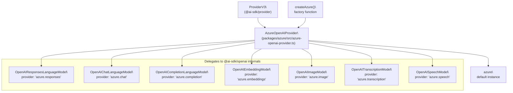
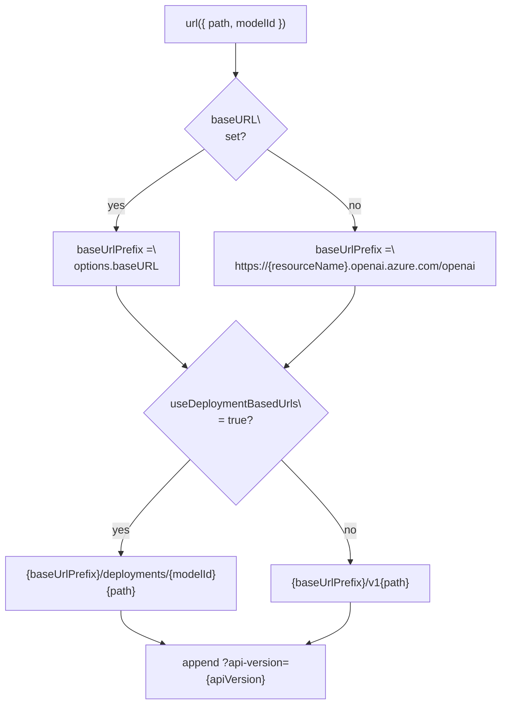
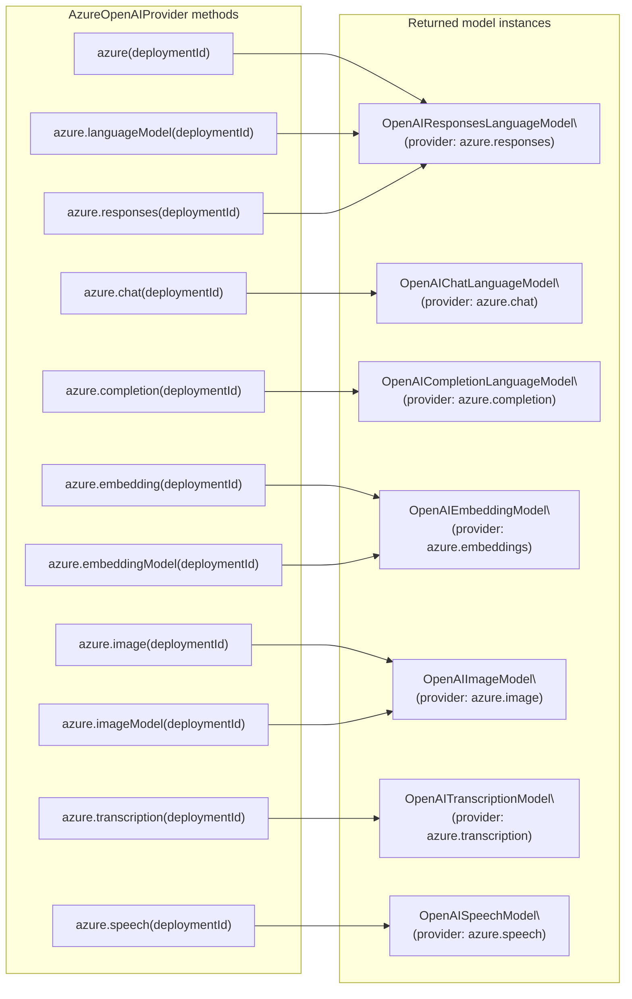

# Azure OpenAI Provider

<details>
<summary>Relevant source files</summary>

The following files were used as context for generating this wiki page:

- [.changeset/pre.json](.changeset/pre.json)
- [examples/express/package.json](examples/express/package.json)
- [examples/fastify/package.json](examples/fastify/package.json)
- [examples/hono/package.json](examples/hono/package.json)
- [examples/nest/package.json](examples/nest/package.json)
- [examples/next-fastapi/package.json](examples/next-fastapi/package.json)
- [examples/next-google-vertex/package.json](examples/next-google-vertex/package.json)
- [examples/next-langchain/package.json](examples/next-langchain/package.json)
- [examples/next-openai-kasada-bot-protection/package.json](examples/next-openai-kasada-bot-protection/package.json)
- [examples/next-openai-pages/package.json](examples/next-openai-pages/package.json)
- [examples/next-openai-telemetry-sentry/package.json](examples/next-openai-telemetry-sentry/package.json)
- [examples/next-openai-telemetry/package.json](examples/next-openai-telemetry/package.json)
- [examples/next-openai-upstash-rate-limits/package.json](examples/next-openai-upstash-rate-limits/package.json)
- [examples/node-http-server/package.json](examples/node-http-server/package.json)
- [examples/nuxt-openai/package.json](examples/nuxt-openai/package.json)
- [examples/sveltekit-openai/package.json](examples/sveltekit-openai/package.json)
- [packages/amazon-bedrock/CHANGELOG.md](packages/amazon-bedrock/CHANGELOG.md)
- [packages/amazon-bedrock/package.json](packages/amazon-bedrock/package.json)
- [packages/anthropic/CHANGELOG.md](packages/anthropic/CHANGELOG.md)
- [packages/anthropic/package.json](packages/anthropic/package.json)
- [packages/azure/CHANGELOG.md](packages/azure/CHANGELOG.md)
- [packages/azure/package.json](packages/azure/package.json)
- [packages/google-vertex/CHANGELOG.md](packages/google-vertex/CHANGELOG.md)
- [packages/google-vertex/package.json](packages/google-vertex/package.json)
- [packages/google/CHANGELOG.md](packages/google/CHANGELOG.md)
- [packages/google/package.json](packages/google/package.json)
- [packages/mistral/CHANGELOG.md](packages/mistral/CHANGELOG.md)
- [packages/mistral/package.json](packages/mistral/package.json)
- [packages/openai/CHANGELOG.md](packages/openai/CHANGELOG.md)
- [packages/openai/package.json](packages/openai/package.json)
- [packages/provider-utils/CHANGELOG.md](packages/provider-utils/CHANGELOG.md)
- [packages/provider-utils/package.json](packages/provider-utils/package.json)
- [pnpm-lock.yaml](pnpm-lock.yaml)

</details>


The `@ai-sdk/azure` package provides an AI SDK provider for [Azure OpenAI Service](https://azure.microsoft.com/en-us/products/ai-services/openai-service). It wraps the internal model classes from `@ai-sdk/openai` and adapts them to the Azure endpoint conventions, including deployment-based routing and API key authentication via the `api-key` header.

This page covers `@ai-sdk/azure` specifically — the `createAzure` factory, `AzureOpenAIProvider`, all supported model factory methods, URL construction, and Azure-specific built-in tools. For the underlying model implementations that this provider reuses, see the OpenAI provider pages: [3.2]() (Responses API) and [3.3]() (Chat Completions). For the general provider interface contract, see [3.1]().

---

## Package Overview

| Field | Value |
|---|---|
| Package name | `@ai-sdk/azure` |
| NPM package | `@ai-sdk/azure` |
| Source directory | `packages/azure/src/` |
| Main provider file | `packages/azure/src/azure-openai-provider.ts` |
| Direct dependency | `@ai-sdk/openai` (workspace) |
| Node requirement | `>=18` |

The package exports one entry point (`"."`) containing `createAzure`, `azure`, and the `AzureOpenAIProvider` type.

Sources: [packages/azure/package.json:1-79](), [packages/azure/src/azure-openai-provider.ts:1-10]()

---

## Architecture

The Azure provider is a thin adapter layer. It does not define its own language model classes; instead it instantiates the internal classes from `@ai-sdk/openai` with Azure-specific configuration: endpoint URL construction, authentication headers, and provider identity strings.

**Provider class hierarchy diagram:**



Sources: [packages/azure/src/azure-openai-provider.ts:1-268]()

---

## `createAzure` Factory

`createAzure` is the main export of the package. It accepts an `AzureOpenAIProviderSettings` object and returns an `AzureOpenAIProvider` instance.

```ts
import { createAzure } from '@ai-sdk/azure';

const azure = createAzure({
  resourceName: 'my-resource',
  apiKey: 'my-api-key',
});
```

A pre-constructed default instance named `azure` is also exported:

```ts
import { azure } from '@ai-sdk/azure';
```

Sources: [packages/azure/src/azure-openai-provider.ts:144-273]()

---

## `AzureOpenAIProviderSettings`

All fields are optional. Settings resolve in order: explicit option → environment variable → error/default.

| Option | Type | Default / Env Variable | Description |
|---|---|---|---|
| `resourceName` | `string` | `AZURE_RESOURCE_NAME` | Azure resource name, used to build `https://{resourceName}.openai.azure.com/openai`. Mutually exclusive with `baseURL`. |
| `baseURL` | `string` | — | Overrides the URL prefix entirely. Takes precedence over `resourceName`. Resolved URL: `{baseURL}/v1{path}`. |
| `apiKey` | `string` | `AZURE_API_KEY` | Sent as the `api-key` request header. |
| `apiVersion` | `string` | `"v1"` | Appended as `?api-version={apiVersion}` to every request URL. |
| `headers` | `Record<string, string>` | — | Additional HTTP headers merged into every request. |
| `fetch` | `FetchFunction` | global `fetch` | Custom fetch implementation for proxying or testing. |
| `useDeploymentBasedUrls` | `boolean` | `false` | When `true`, uses the legacy format `{baseURL}/deployments/{deploymentId}{path}?api-version={apiVersion}`. |

Sources: [packages/azure/src/azure-openai-provider.ts:96-139](), [content/providers/01-ai-sdk-providers/04-azure.mdx:51-98]()

---

## URL Construction

The internal `url` function selects between two URL formats based on `useDeploymentBasedUrls`:

**URL format selection diagram:**



The `modelId` / deployment name is embedded in the URL only when `useDeploymentBasedUrls` is `true`. In the default `v1` format, the deployment name is passed in the request body.

Sources: [packages/azure/src/azure-openai-provider.ts:169-183]()

---

## Authentication

The API key is sent as an `api-key` HTTP header (not as `Authorization: Bearer`). This is the Azure OpenAI convention, distinct from the standard OpenAI API.

The `loadApiKey` helper from `@ai-sdk/provider-utils` resolves the key from `options.apiKey` or the `AZURE_API_KEY` environment variable. A `User-Agent` suffix `ai-sdk/azure/{VERSION}` is appended to all requests via `withUserAgentSuffix`.

Sources: [packages/azure/src/azure-openai-provider.ts:147-157]()

---

## Model Factory Methods

The `AzureOpenAIProvider` object exposes the following methods. All accept a `deploymentId` string corresponding to the Azure deployment name.



| Method | Returns | Provider ID | Notes |
|---|---|---|---|
| `azure(deploymentId)` | `LanguageModelV3` | `azure.responses` | Default; calls Responses API |
| `azure.languageModel(deploymentId)` | `LanguageModelV3` | `azure.responses` | Alias for default |
| `azure.responses(deploymentId)` | `LanguageModelV3` | `azure.responses` | Explicit Responses API |
| `azure.chat(deploymentId)` | `LanguageModelV3` | `azure.chat` | Chat Completions API |
| `azure.completion(deploymentId)` | `LanguageModelV3` | `azure.completion` | Legacy completions endpoint |
| `azure.embedding(deploymentId)` | `EmbeddingModelV3` | `azure.embeddings` | Text embeddings |
| `azure.embeddingModel(deploymentId)` | `EmbeddingModelV3` | `azure.embeddings` | Alias for `embedding` |
| `azure.textEmbedding(deploymentId)` | `EmbeddingModelV3` | `azure.embeddings` | **Deprecated** |
| `azure.textEmbeddingModel(deploymentId)` | `EmbeddingModelV3` | `azure.embeddings` | **Deprecated** |
| `azure.image(deploymentId)` | `ImageModelV3` | `azure.image` | DALL-E image generation |
| `azure.imageModel(deploymentId)` | `ImageModelV3` | `azure.image` | Alias for `image` |
| `azure.transcription(deploymentId)` | `TranscriptionModelV3` | `azure.transcription` | Audio transcription (Whisper) |
| `azure.speech(deploymentId)` | `SpeechModelV3` | `azure.speech` | Text-to-speech |

Sources: [packages/azure/src/azure-openai-provider.ts:27-93](), [packages/azure/src/azure-openai-provider.ts:253-268]()

---

## Default Model: Responses API

The direct call `azure(deploymentId)` and `azure.languageModel(deploymentId)` both invoke `createResponsesModel`, which returns an `OpenAIResponsesLanguageModel` configured with provider `'azure.responses'`.

A notable Azure-specific configuration in the Responses model: `fileIdPrefixes` is set to `['assistant-']`. This differs from the standard OpenAI provider where it is `['file-']`. This affects how file IDs are recognized and handled in Responses API requests.

```ts
// From packages/azure/src/azure-openai-provider.ts
const createResponsesModel = (modelId: string) =>
  new OpenAIResponsesLanguageModel(modelId, {
    provider: 'azure.responses',
    url,
    headers: getHeaders,
    fetch: options.fetch,
    fileIdPrefixes: ['assistant-'],
  });
```

Sources: [packages/azure/src/azure-openai-provider.ts:210-218]()

---

## Azure-Specific Built-in Tools

The `azure.tools` property exposes a set of built-in Responses API tools. These are re-exported from `@ai-sdk/openai/internal` under the Azure provider surface.

| Tool | Exported from `@ai-sdk/openai/internal` |
|---|---|
| `azure.tools.codeInterpreter` | `codeInterpreter` |
| `azure.tools.fileSearch` | `fileSearch` |
| `azure.tools.imageGeneration` | `imageGeneration` |
| `azure.tools.webSearchPreview` | `webSearchPreview` |

These tools are passed to `generateText` or `streamText` via the `tools` option. They are provider-executed, meaning the model calls them server-side rather than routing execution back to the application.

Sources: [packages/azure/src/azure-openai-tools.ts:1-18]()

---

## Provider Metadata

When using the Responses API via `azure.responses()` or the default call, result objects include a `providerMetadata.azure` namespace (not `providerMetadata.openai`). This namespace distinction was explicitly added to differentiate Azure vs. OpenAI Responses API responses.

Exported types from `@ai-sdk/openai` for Azure:

| Type | Description |
|---|---|
| `AzureResponsesProviderMetadata` | Top-level provider metadata for Azure Responses API |
| `AzureResponsesReasoningProviderMetadata` | Metadata attached to reasoning parts |
| `AzureResponsesTextProviderMetadata` | Metadata attached to text output parts |
| `AzureResponsesSourceDocumentProviderMetadata` | Metadata for source document annotations |

Sources: [packages/openai/CHANGELOG.md:103-107](), [packages/openai/CHANGELOG.md:185-189]()

---

## Tested API Endpoints

The test suite in `packages/azure/src/azure-openai-provider.test.ts` mocks the following Azure endpoints:

| Endpoint | Model Method |
|---|---|
| `.../openai/v1/responses` | `azure(...)`, `azure.responses(...)` |
| `.../openai/v1/chat/completions` | `azure.chat(...)` |
| `.../openai/v1/completions` | `azure.completion(...)` |
| `.../openai/v1/embeddings` | `azure.embedding(...)` |
| `.../openai/v1/images/generations` | `azure.image(...)` |
| `.../openai/v1/audio/transcriptions` | `azure.transcription(...)` |
| `.../openai/v1/audio/speech` | `azure.speech(...)` |
| `.../openai/deployments/{name}/audio/transcriptions` | `azure.transcription(...)` with deployment URL |

Sources: [packages/azure/src/azure-openai-provider.test.ts:82-92]()

---

## Relationship to `@ai-sdk/openai`

The Azure package has a direct workspace dependency on `@ai-sdk/openai`. It imports all model classes from the `@ai-sdk/openai/internal` entry point:

```
@ai-sdk/openai/internal exports:
  OpenAIChatLanguageModel
  OpenAICompletionLanguageModel
  OpenAIEmbeddingModel
  OpenAIImageModel
  OpenAIResponsesLanguageModel
  OpenAISpeechModel
  OpenAITranscriptionModel
  codeInterpreter, fileSearch, imageGeneration, webSearchPreview
```

The Azure provider does not subclass any of these — it passes Azure-specific `url` and `headers` functions as constructor arguments.

Sources: [packages/azure/src/azure-openai-provider.ts:1-9](), [packages/openai/src/internal/index.ts:1-19]()

---

## Reasoning Models (DeepSeek-R1 on Azure)

Azure may expose DeepSeek-R1 reasoning through `<think>` tags in the generated text. The `extractReasoningMiddleware` from the core `ai` package can extract this into a separate `reasoning` property:

```ts
import { azure } from '@ai-sdk/azure';
import { wrapLanguageModel, extractReasoningMiddleware } from 'ai';

const model = wrapLanguageModel({
  model: azure('your-deepseek-r1-deployment'),
  middleware: extractReasoningMiddleware({ tagName: 'think' }),
});
```

For documentation of `wrapLanguageModel` and middleware, see [2.6]().

Sources: [content/providers/01-ai-sdk-providers/04-azure.mdx:111-125]()