# Google AI Providers (Generative AI and Vertex AI)

<details>
<summary>Relevant source files</summary>

The following files were used as context for generating this wiki page:

- [.changeset/google-validated-strict-tools.md](.changeset/google-validated-strict-tools.md)
- [.changeset/pre.json](.changeset/pre.json)
- [content/providers/01-ai-sdk-providers/15-google-generative-ai.mdx](content/providers/01-ai-sdk-providers/15-google-generative-ai.mdx)
- [content/providers/03-community-providers/18-gemini-cli.mdx](content/providers/03-community-providers/18-gemini-cli.mdx)
- [content/providers/03-community-providers/31-opencode-sdk.mdx](content/providers/03-community-providers/31-opencode-sdk.mdx)
- [content/providers/03-community-providers/47-apertis.mdx](content/providers/03-community-providers/47-apertis.mdx)
- [content/providers/03-community-providers/49-cencori.mdx](content/providers/03-community-providers/49-cencori.mdx)
- [examples/ai-functions/src/generate-text/google/gemini-3-1-flash-lite.ts](examples/ai-functions/src/generate-text/google/gemini-3-1-flash-lite.ts)
- [examples/ai-functions/src/generate-text/google/image-search.ts](examples/ai-functions/src/generate-text/google/image-search.ts)
- [examples/ai-functions/src/generate-text/google/search-types.ts](examples/ai-functions/src/generate-text/google/search-types.ts)
- [examples/ai-functions/src/stream-text/google/gemini-3-1-flash-lite.ts](examples/ai-functions/src/stream-text/google/gemini-3-1-flash-lite.ts)
- [examples/ai-functions/src/stream-text/google/image-search.ts](examples/ai-functions/src/stream-text/google/image-search.ts)
- [examples/ai-functions/src/stream-text/google/search-types.ts](examples/ai-functions/src/stream-text/google/search-types.ts)
- [examples/express/package.json](examples/express/package.json)
- [examples/fastify/package.json](examples/fastify/package.json)
- [examples/hono/package.json](examples/hono/package.json)
- [examples/nest/package.json](examples/nest/package.json)
- [examples/next-fastapi/package.json](examples/next-fastapi/package.json)
- [examples/next-google-vertex/package.json](examples/next-google-vertex/package.json)
- [examples/next-langchain/package.json](examples/next-langchain/package.json)
- [examples/next-openai-kasada-bot-protection/package.json](examples/next-openai-kasada-bot-protection/package.json)
- [examples/next-openai-pages/package.json](examples/next-openai-pages/package.json)
- [examples/next-openai-telemetry-sentry/package.json](examples/next-openai-telemetry-sentry/package.json)
- [examples/next-openai-telemetry/package.json](examples/next-openai-telemetry/package.json)
- [examples/next-openai-upstash-rate-limits/package.json](examples/next-openai-upstash-rate-limits/package.json)
- [examples/node-http-server/package.json](examples/node-http-server/package.json)
- [examples/nuxt-openai/package.json](examples/nuxt-openai/package.json)
- [examples/sveltekit-openai/package.json](examples/sveltekit-openai/package.json)
- [packages/amazon-bedrock/CHANGELOG.md](packages/amazon-bedrock/CHANGELOG.md)
- [packages/amazon-bedrock/package.json](packages/amazon-bedrock/package.json)
- [packages/anthropic/CHANGELOG.md](packages/anthropic/CHANGELOG.md)
- [packages/anthropic/package.json](packages/anthropic/package.json)
- [packages/gateway/src/gateway-language-model-settings.ts](packages/gateway/src/gateway-language-model-settings.ts)
- [packages/google-vertex/CHANGELOG.md](packages/google-vertex/CHANGELOG.md)
- [packages/google-vertex/package.json](packages/google-vertex/package.json)
- [packages/google-vertex/src/google-vertex-options.ts](packages/google-vertex/src/google-vertex-options.ts)
- [packages/google-vertex/src/google-vertex-tools.ts](packages/google-vertex/src/google-vertex-tools.ts)
- [packages/google/CHANGELOG.md](packages/google/CHANGELOG.md)
- [packages/google/package.json](packages/google/package.json)
- [packages/google/src/google-generative-ai-language-model.test.ts](packages/google/src/google-generative-ai-language-model.test.ts)
- [packages/google/src/google-generative-ai-language-model.ts](packages/google/src/google-generative-ai-language-model.ts)
- [packages/google/src/google-generative-ai-options.ts](packages/google/src/google-generative-ai-options.ts)
- [packages/google/src/google-prepare-tools.test.ts](packages/google/src/google-prepare-tools.test.ts)
- [packages/google/src/google-prepare-tools.ts](packages/google/src/google-prepare-tools.ts)
- [packages/google/src/google-tools.ts](packages/google/src/google-tools.ts)
- [packages/google/src/tool/enterprise-web-search.ts](packages/google/src/tool/enterprise-web-search.ts)
- [packages/google/src/tool/google-search.ts](packages/google/src/tool/google-search.ts)
- [pnpm-lock.yaml](pnpm-lock.yaml)

</details>


## Purpose and Scope

This document describes the Google provider packages (`@ai-sdk/google` and `@ai-sdk/google-vertex`) that implement support for Google's Gemini models through both the Google Generative AI API and Vertex AI. These packages provide language model support implementing the `LanguageModelV3` interface from the Provider V3 specification. The document covers the `GoogleGenerativeAILanguageModel` class implementation, supported model IDs, provider-specific options (thinking configuration, safety settings, media resolution), provider-defined tools (Google Search, Google Maps, URL Context, File Search, Code Execution, RAG Store), grounding metadata extraction, the architectural differences between the Google AI and Vertex AI provider configurations, and the additional model types available exclusively in `@ai-sdk/google-vertex`: embedding models (`GoogleVertexEmbeddingModel`), image models (`GoogleVertexImageModel`), video models (`GoogleVertexVideoModel`), and the Vertex Anthropic sub-provider.

For information about the Provider V3 specification and `LanguageModelV3` interface, see [Provider Architecture and V3 Specification](#3.1). For Anthropic Claude capabilities in depth, see [Anthropic Provider](#3.4). For information about other providers, see [Provider Ecosystem](#3).
</thinking>
</old_str>
<new_str>
The document covers the `GoogleGenerativeAILanguageModel` class implementation, supported model IDs, provider-specific options (thinking configuration, safety settings, media resolution), provider-defined tools (Google Search, Google Maps, URL Context, File Search, Code Execution, RAG Store), grounding metadata extraction, the architectural differences between the Google AI and Vertex AI provider configurations, and the additional model types available exclusively in `@ai-sdk/google-vertex`: embedding models (`GoogleVertexEmbeddingModel`), image models (`GoogleVertexImageModel`), video models (`GoogleVertexVideoModel`), and the Vertex Anthropic sub-provider.

For information about the Provider V3 specification and `LanguageModelV3` interface, see [Provider Architecture and V3 Specification](#3.1). For Anthropic Claude capabilities in depth, see [Anthropic Provider](#3.4). For information about other providers, see [Provider Ecosystem](#3).

---

## Core Architecture

### GoogleGenerativeAILanguageModel Implementation

The `GoogleGenerativeAILanguageModel` class serves as the primary implementation of the `LanguageModelV3` interface for both Google Generative AI and Vertex AI APIs. This class handles message conversion, request construction, streaming, and response parsing for Gemini models.

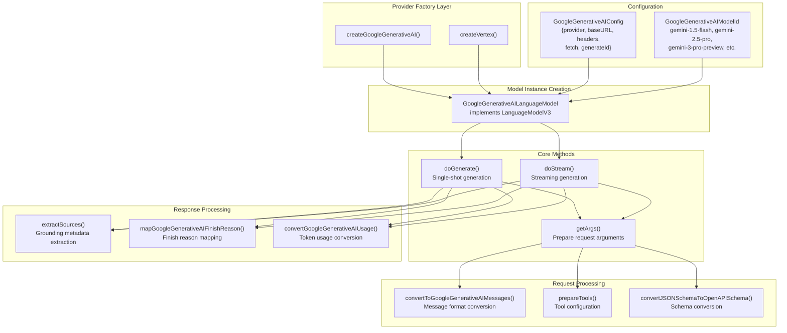

**Sources**: [packages/google/src/google-generative-ai-language-model.ts:58-673]()

The class constructor accepts a model ID and configuration object. The configuration differs between Google AI and Vertex AI based on the `provider` field:

| Configuration Field | Type | Purpose |
|-------------------|------|---------|
| `provider` | `string` | Provider identifier (e.g., "google", "google.vertex.us-central1") |
| `baseURL` | `string` | API endpoint base URL |
| `headers` | `Resolvable<Record<string, string>>` | Request headers (can be async/function) |
| `fetch` | `FetchFunction` | Custom fetch implementation |
| `generateId` | `() => string` | ID generator for tool calls and sources |
| `supportedUrls` | `() => LanguageModelV3['supportedUrls']` | Supported URL types for file inputs |

**Sources**: [packages/google/src/google-generative-ai-language-model.ts:45-56]()

### Request Flow Architecture

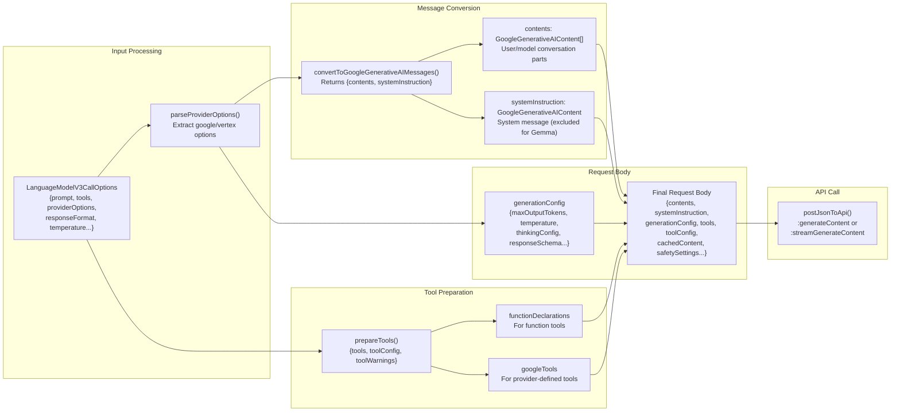

**Sources**: [packages/google/src/google-generative-ai-language-model.ts:83-206](), [packages/google/src/google-generative-ai-language-model.ts:208-349]()

---

## Supported Model IDs

The Google provider supports multiple Gemini model families with different capabilities. Model IDs are type-safe through the `GoogleGenerativeAIModelId` type.

### Model Family Overview

| Model Family | Example IDs | Key Features |
|-------------|------------|--------------|
| **Gemini 1.5** | `gemini-1.5-flash`, `gemini-1.5-flash-8b`, `gemini-1.5-pro` | Stable models, multi-modal support, tool calling |
| **Gemini 2.0** | `gemini-2.0-flash`, `gemini-2.0-flash-lite`, `gemini-2.0-flash-exp-image-generation` | Enhanced reasoning, thinking tokens with `thinkingBudget`, image generation |
| **Gemini 2.5** | `gemini-2.5-pro`, `gemini-2.5-flash`, `gemini-2.5-flash-lite`, `gemini-2.5-flash-preview-tts`, `gemini-2.5-flash-native-audio-latest`, `gemini-2.5-computer-use-preview-10-2025` | Advanced thinking, File Search, implicit caching, TTS, native audio, computer use |
| **Gemini 3** (Preview) | `gemini-3-pro-preview`, `gemini-3-flash-preview`, `gemini-3.1-pro-preview`, `gemini-3.1-flash-image-preview` | Latest generation, `thinkingLevel` control, custom tools support |
| **Gemma** | `gemma-3-12b-it`, `gemma-3-27b-it`, `gemma-3n-e4b-it`, `gemma-3n-e2b-it` | Open-weights models, no system instruction support |
| **Latest Aliases** | `gemini-pro-latest`, `gemini-flash-latest`, `gemini-flash-lite-latest` | Automatically updated to latest stable version |
| **Specialized** | `deep-research-pro-preview-12-2025`, `nano-banana-pro-preview` | Research-focused, experimental models |

**Sources**: [packages/google/src/google-generative-ai-options.ts:4-46]()

### Model Selection in Code

The provider factory methods accept model IDs as the first argument:

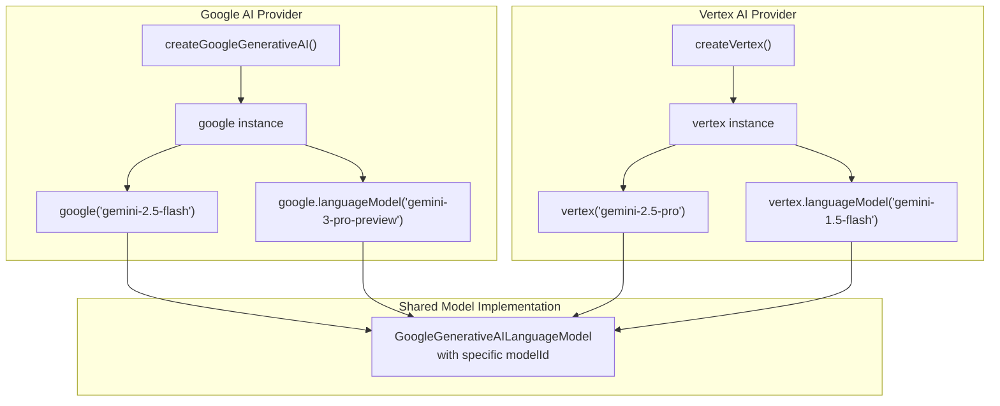

**Sources**: [content/providers/01-ai-sdk-providers/15-google-generative-ai.mdx:72-92](), [content/providers/01-ai-sdk-providers/16-google-vertex.mdx:251-258]()

### Gemma Model Special Handling

Gemma models do not support system instructions. The `getArgs()` method detects Gemma models via the model ID pattern and sets the `isGemmaModel` flag, which causes `convertToGoogleGenerativeAIMessages()` to exclude the system instruction:

**Diagram: Gemma Model Detection and System Instruction Exclusion**

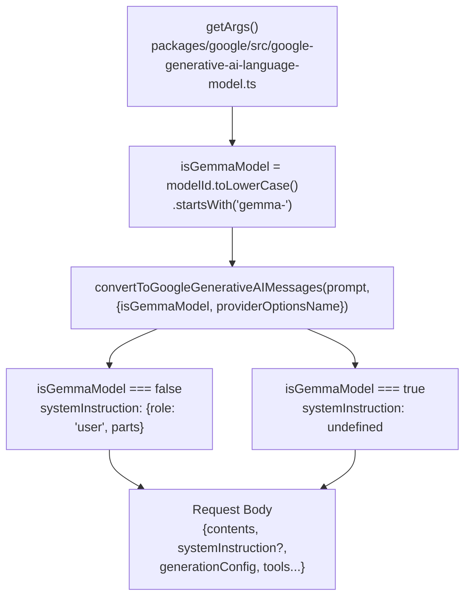

**Sources**: [packages/google/src/google-generative-ai-language-model.ts:134-139](), [packages/google/src/google-generative-ai-language-model.ts:191]()

---

## Provider Options

Provider-specific options are passed through the `providerOptions.google` (for Google AI) or `providerOptions.vertex` (for Vertex AI) field. The options schema is defined in `googleGenerativeAIProviderOptions`.

### Complete Provider Options Schema

```mermaid
graph TB
    subgraph "Generation Configuration"
        responseModalities["responseModalities<br/>string[]<br/>['TEXT', 'IMAGE']"]
        thinkingConfig["thinkingConfig<br/>{thinkingBudget?, includeThoughts?,<br/>thinkingLevel?}"]
        cachedContent["cachedContent<br/>string<br/>cachedContents/{id}"]
        structuredOutputs["structuredOutputs<br/>boolean<br/>Enable/disable schema validation"]
    end
    
    subgraph "Safety and Content"
        safetySettings["safetySettings<br/>[{category, threshold}]<br/>Content filtering rules"]
        threshold["threshold<br/>string (optional)<br/>Standalone threshold setting"]
    end
    
    subgraph "Media Processing"
        audioTimestamp["audioTimestamp<br/>boolean<br/>Enable audio timestamp understanding"]
        mediaResolution["mediaResolution<br/>enum<br/>LOW, MEDIUM, HIGH, UNSPECIFIED"]
        imageConfig["imageConfig<br/>{aspectRatio?, imageSize?}<br/>Image generation settings"]
    end
    
    subgraph "Grounding and Retrieval"
        retrievalConfig["retrievalConfig<br/>{latLng?}<br/>Location context for grounding"]
    end
    
    subgraph "Vertex-Only"
        labels["labels<br/>Record<string, string><br/>Billing labels"]
    end
    
    googleGenerativeAIProviderOptions["googleGenerativeAIProviderOptions<br/>Zod Schema"]
    
    googleGenerativeAIProviderOptions --> responseModalities
    googleGenerativeAIProviderOptions --> thinkingConfig
    googleGenerativeAIProviderOptions --> cachedContent
    googleGenerativeAIProviderOptions --> structuredOutputs
    googleGenerativeAIProviderOptions --> safetySettings
    googleGenerativeAIProviderOptions --> threshold
    googleGenerativeAIProviderOptions --> audioTimestamp
    googleGenerativeAIProviderOptions --> mediaResolution
    googleGenerativeAIProviderOptions --> imageConfig
    googleGenerativeAIProviderOptions --> retrievalConfig
    googleGenerativeAIProviderOptions --> labels
```

**Sources**: [packages/google/src/google-generative-ai-options.ts:48-189]()

### Provider Option Resolution

The `getArgs()` method in `GoogleGenerativeAILanguageModel` resolves provider options with a fallback mechanism for Vertex AI:

**Diagram: Provider Options Resolution with Fallback**

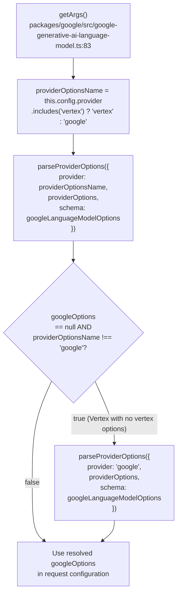

This design allows Vertex AI users to specify options under either `providerOptions.vertex` or `providerOptions.google`, with `vertex` taking precedence. If no `vertex` options are found, the resolver attempts `google` as a fallback.

**Sources**: [packages/google/src/google-generative-ai-language-model.ts:100-115]()

### Thinking Configuration Details

The `thinkingConfig` option controls the model's internal reasoning process:

| Field | Type | Models | Description |
|-------|------|--------|-------------|
| `thinkingBudget` | `number` | Gemini 2.5 | Token budget for thinking. Set to 0 to disable. Allocated tokens used for internal reasoning. |
| `thinkingLevel` | `'minimal' \| 'low' \| 'medium' \| 'high'` | Gemini 3 | Reasoning depth control. Flash supports all 4 levels, Pro supports 'low' and 'high'. |
| `includeThoughts` | `boolean` | Gemini 2.5+, Gemini 3 | Return synthesized thought summaries in response. When `true`, the `reasoning` field in the response contains the thought process. |

**Safety Settings**: The schema includes both a `safetySettings` array (with per-category thresholds) and a standalone `threshold` option. The standalone threshold applies to all harm categories. Valid threshold values: `HARM_BLOCK_THRESHOLD_UNSPECIFIED`, `BLOCK_LOW_AND_ABOVE`, `BLOCK_MEDIUM_AND_ABOVE`, `BLOCK_ONLY_HIGH`, `BLOCK_NONE`, `OFF`.

**Sources**: [packages/google/src/google-generative-ai-options.ts:53-62](), [packages/google/src/google-generative-ai-options.ts:91-116](), [content/providers/01-ai-sdk-providers/15-google-generative-ai.mdx:162-183]()

---

## Thinking Mode and Reasoning Chunks

Gemini 2.5 and 3.0 models support an internal "thinking" process that improves reasoning capabilities. The SDK surfaces these as reasoning content parts.

### Thinking Mode Processing Pipeline

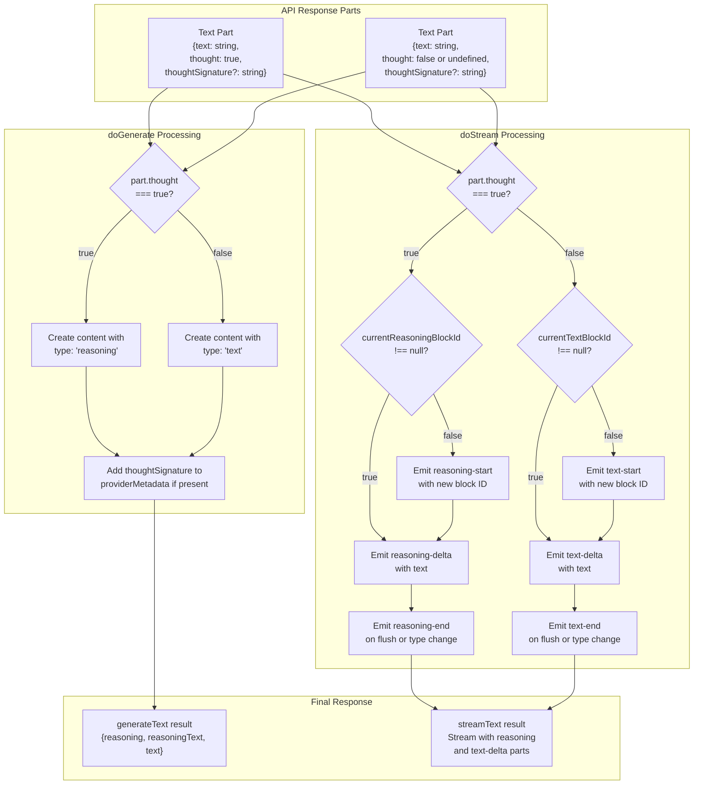

**Sources**: [packages/google/src/google-generative-ai-language-model.ts:246-282]() (doGenerate), [packages/google/src/google-generative-ai-language-model.ts:484-565]() (doStream)

### Block-Based Streaming for Reasoning

The streaming implementation uses block IDs to group consecutive reasoning or text parts:

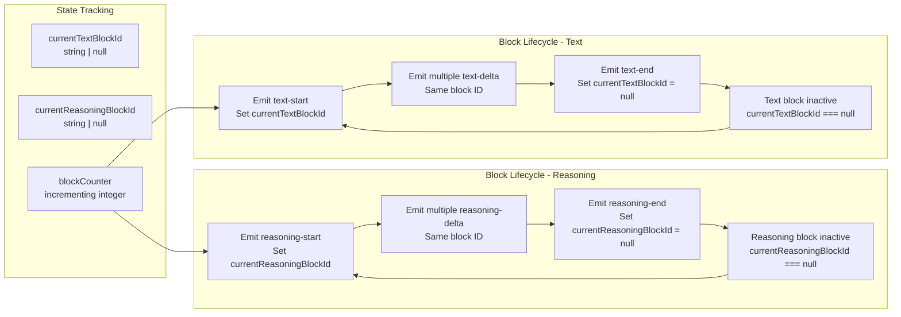

The streaming transform closes any open blocks in the `flush()` method before emitting the final `finish` event.

**Sources**: [packages/google/src/google-generative-ai-language-model.ts:383-387](), [packages/google/src/google-generative-ai-language-model.ts:489-565](), [packages/google/src/google-generative-ai-language-model.ts:645-658]()

---

## Provider-Defined Tools

The Google provider supports seven provider-defined tools, each with specific model requirements and capabilities. Tools are defined in the `packages/google/src/tool/` directory and managed through `prepareTools()`.

### Tool Architecture

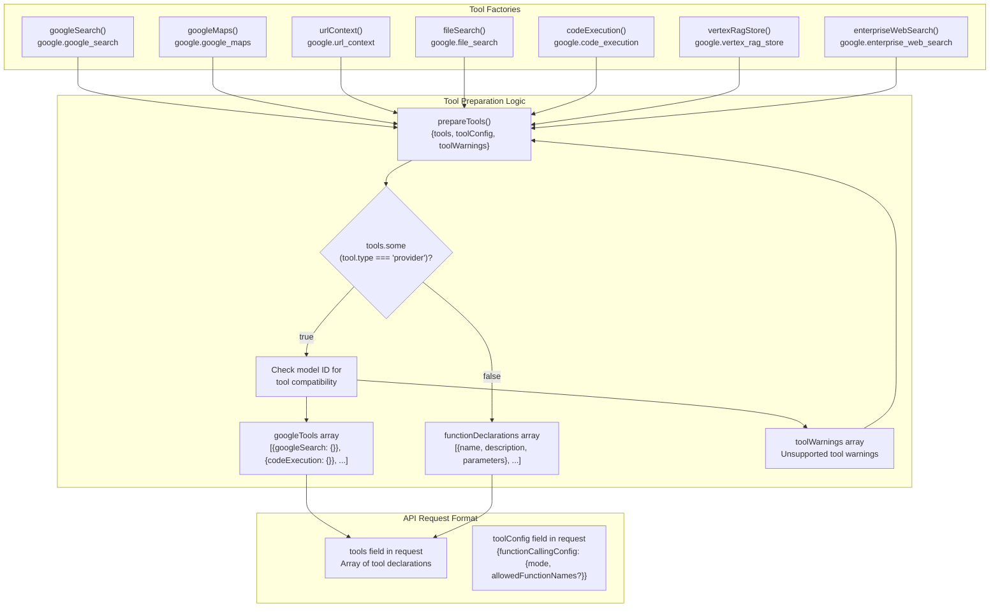

**Sources**: [packages/google/src/google-prepare-tools.ts:9-264](), [packages/google/src/google-tools.ts:1-71]()

### Tool Catalog with Model Requirements

| Tool ID | Tool Name | Supported Models | Purpose | API Format |
|---------|-----------|------------------|---------|------------|
| `google.google_search` | `google_search` | Gemini 2.0+, Gemini 3, or Gemini 1.5 Flash (non-8b) | Real-time web search grounding | `{googleSearch: {}}` or `{googleSearchRetrieval: {}}` |
| `google.google_maps` | `google_maps` | Gemini 2.0+, Gemini 3 | Location-based grounding with Maps data | `{googleMaps: {}}` |
| `google.url_context` | `url_context` | Gemini 2.0+, Gemini 3 | Direct URL content retrieval (up to 20 URLs) | `{urlContext: {}}` |
| `google.file_search` | `file_search` | Gemini 2.5, Gemini 3 | RAG from File Search stores | `{fileSearch: {fileSearchStoreNames, metadataFilter?, topK?}}` |
| `google.code_execution` | `code_execution` | Gemini 2.0+, Gemini 3 | Python code generation and execution | `{codeExecution: {}}` |
| `google.vertex_rag_store` | `vertex_rag_store` | Gemini 2.0+, Gemini 3 (Vertex only) | RAG from Vertex RAG Engine corpus | `{retrieval: {vertex_rag_store: {rag_resources, similarity_top_k?}}}` |
| `google.enterprise_web_search` | `enterprise_web_search` | Gemini 2.0+, Gemini 3 (Vertex only) | Compliance-focused web grounding | `{enterpriseWebSearch: {}}` |

**Sources**: [packages/google/src/google-prepare-tools.ts:74-189]()

### Tool Model Compatibility Logic

The `prepareTools()` function checks model ID patterns to determine tool support:

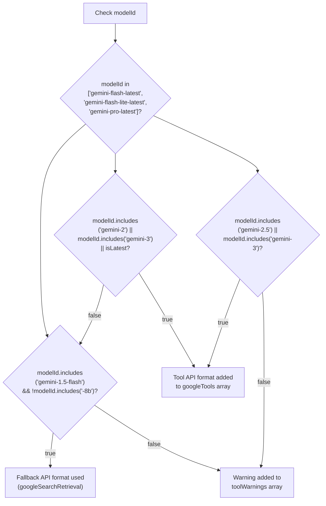

**Sources**: [packages/google/src/google-prepare-tools.ts:45-57](), [packages/google/src/google-prepare-tools.ts:80-181]()

### Code Execution Tool Implementation

The Code Execution tool enables Python code generation and execution. The API returns `executableCode` and `codeExecutionResult` parts:

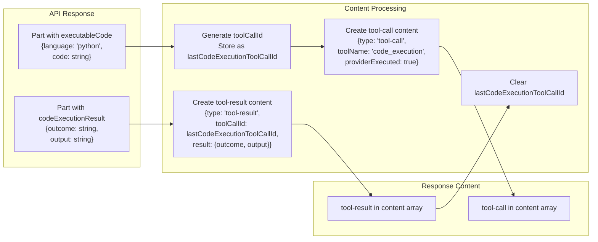

The `providerExecuted: true` flag indicates that the tool was executed server-side by the provider, not by the client application.

**Sources**: [packages/google/src/google-generative-ai-language-model.ts:243-270]() (doGenerate), [packages/google/src/google-generative-ai-language-model.ts:451-483]() (doStream)

### File Search Tool Configuration

The File Search tool accepts configuration parameters for filtering and ranking:

```mermaid
graph TB
    fileSearch_factory["fileSearch({<br/>fileSearchStoreNames,<br/>metadataFilter?,<br/>topK?<br/>})"]
    
    fileSearchStoreNames["fileSearchStoreNames<br/>string[]<br/>Fully-qualified store names<br/>'projects/X/locations/Y/fileSearchStores/Z'"]
    
    metadataFilter["metadataFilter<br/>string (optional)<br/>Filter expression<br/>'author = \"Robert Graves\"'"]
    
    topK["topK<br/>number (optional)<br/>Maximum chunks to retrieve"]
    
    api_format["API Format<br/>{fileSearch: {<br/>fileSearchStoreNames: [...],<br/>metadataFilter?: string,<br/>topK?: number<br/>}}"]
    
    fileSearch_factory --> fileSearchStoreNames
    fileSearch_factory --> metadataFilter
    fileSearch_factory --> topK
    
    fileSearchStoreNames --> api_format
    metadataFilter --> api_format
    topK --> api_format
```

**Sources**: [packages/google/src/google-prepare-tools.ts:138-147](), [content/providers/01-ai-sdk-providers/15-google-generative-ai.mdx:532-553]()

---

## Grounding Metadata and Source Extraction

Grounding tools (Google Search, Google Maps, URL Context, File Search, RAG Store) return sources and detailed metadata. The `extractSources()` function processes grounding metadata into standardized source objects.

### Grounding Metadata Schema

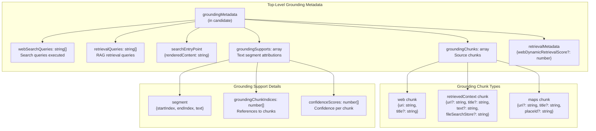

**Sources**: [packages/google/src/google-generative-ai-language-model.ts:809-863]()

### Source Extraction Logic

The `extractSources()` function converts grounding chunks into `LanguageModelV3Source` objects:

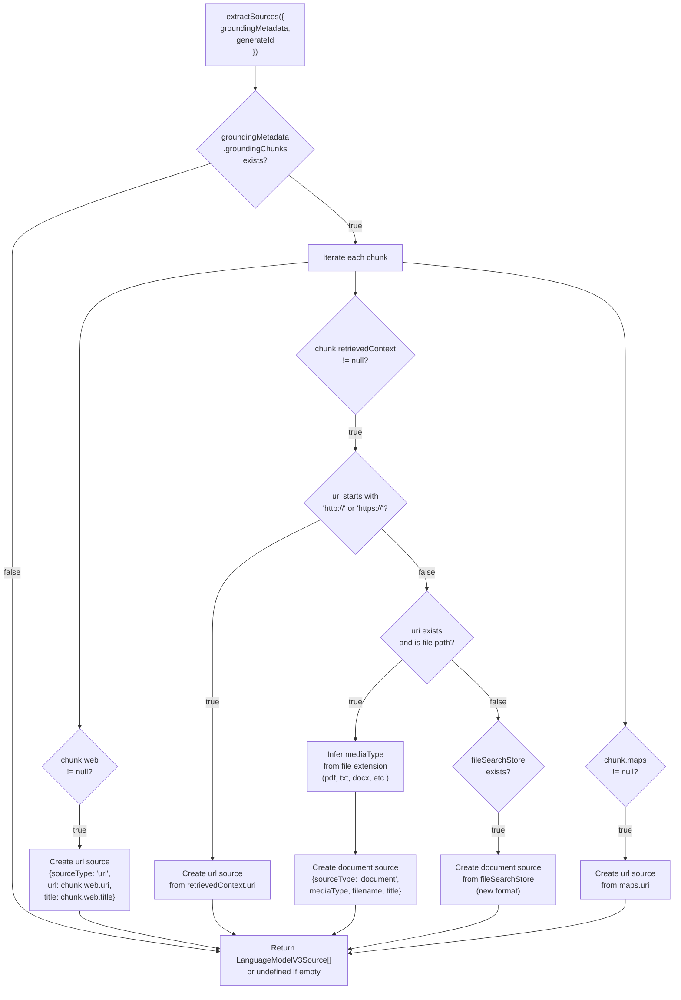

**Sources**: [packages/google/src/google-generative-ai-language-model.ts:710-807]()

### URL Context Metadata

The URL Context tool provides additional metadata about retrieved URLs through `urlContextMetadata`:

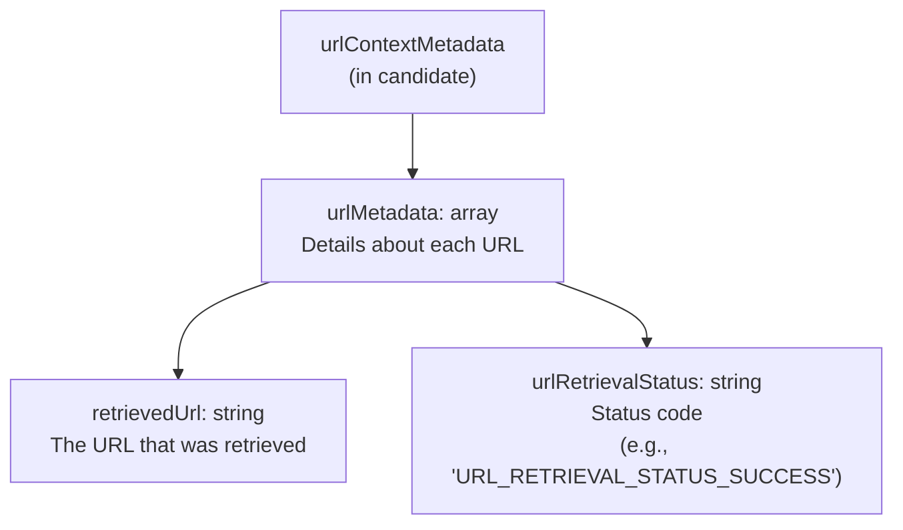

**Sources**: [packages/google/src/google-generative-ai-language-model.ts:929-937](), [content/providers/01-ai-sdk-providers/15-google-generative-ai.mdx:583-602]()

### Streaming Source Deduplication

In streaming mode, sources are deduplicated to prevent emitting the same URL source multiple times:

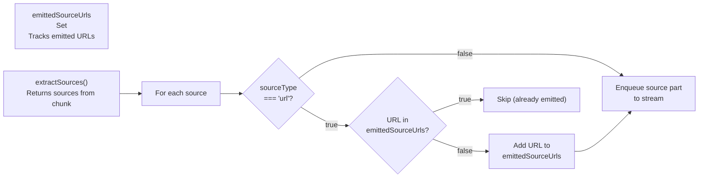

Document sources are not deduplicated because they may represent different documents with the same type.

**Sources**: [packages/google/src/google-generative-ai-language-model.ts:389](), [packages/google/src/google-generative-ai-language-model.ts:430-444]()

---

## Google AI vs Vertex AI Differences

While both providers use the same `GoogleGenerativeAILanguageModel` implementation, they differ in authentication, base URLs, and available tools.

### Provider Configuration Comparison

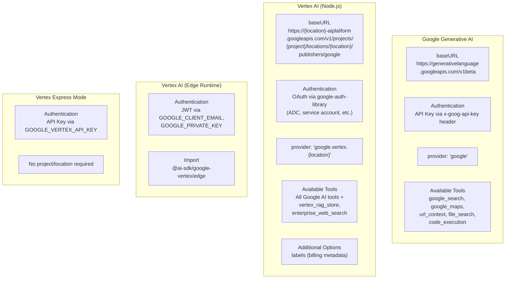

**Sources**: [content/providers/01-ai-sdk-providers/15-google-generative-ai.mdx:44-70](), [content/providers/01-ai-sdk-providers/16-google-vertex.mdx:46-147](), [content/providers/01-ai-sdk-providers/16-google-vertex.mdx:149-231](), [content/providers/01-ai-sdk-providers/16-google-vertex.mdx:232-250]()

### Tool Availability Matrix

| Tool | Google AI | Vertex AI | Notes |
|------|-----------|-----------|-------|
| `google_search` | ✓ | ✓ | Real-time web search |
| `google_maps` | ✓ | ✓ | Location-based grounding |
| `url_context` | ✓ | ✓ | Direct URL retrieval |
| `file_search` | ✓ | ✓ | File Search stores |
| `code_execution` | ✓ | ✓ | Python code execution |
| `vertex_rag_store` | ✗ | ✓ | Vertex RAG Engine only |
| `enterprise_web_search` | ✗ | ✓ | Compliance-focused search |

The `prepareTools()` function emits a warning if `vertex_rag_store` is used with a non-Vertex provider:

**Sources**: [packages/google/src/google-prepare-tools.ts:117-132]()

### Vertex AI Authentication and Express Mode

Vertex AI supports three distinct authentication paths depending on runtime:

| Method | Runtime | How Configured |
|--------|---------|---------------|
| Application Default Credentials | Node.js | `GOOGLE_APPLICATION_CREDENTIALS` env var pointing to a JSON key file, or ADC via `google-auth-library` |
| JWT | Edge (`/edge` sub-module) | `GOOGLE_CLIENT_EMAIL` + `GOOGLE_PRIVATE_KEY` env vars |
| API Key (Express Mode) | Node.js + Edge | `apiKey` option or `GOOGLE_VERTEX_API_KEY` env var |

**Express Mode** is automatically activated when an API key is provided. It changes the base URL to `https://aiplatform.googleapis.com/v1/publishers/google` (defined as `EXPRESS_MODE_BASE_URL` in `google-vertex-provider.ts`), bypassing the project/location-specific URL format used for standard Vertex AI. The `createExpressModeFetch()` function wraps the underlying fetch to inject the API key as an `x-goog-api-key` header on every request. No `project` or `location` configuration is required in Express Mode.

**Diagram: Vertex AI Express Mode Request Flow**

```mermaid
graph LR
    createVertex["createVertex({apiKey})<br/>packages/google-vertex/src/google-vertex-provider.ts"]
    
    detectExpressMode["apiKey provided?<br/>Activate Express Mode"]
    
    createExpressModeFetch["createExpressModeFetch(originalFetch, apiKey)<br/>Returns wrapped fetch function"]
    
    injectHeader["Wrapped fetch injects<br/>x-goog-api-key: apiKey<br/>into every request"]
    
    expressBaseURL["baseURL = EXPRESS_MODE_BASE_URL<br/>'https://aiplatform.googleapis.com/v1/publishers/google'"]
    
    vertexModel["vertex('gemini-2.5-flash')<br/>Uses Express Mode configuration"]
    
    apiCall["API Call to<br/>https://aiplatform.googleapis.com/v1/publishers/google/models/{id}:generateContent<br/>with x-goog-api-key header"]
    
    createVertex --> detectExpressMode
    detectExpressMode --> createExpressModeFetch
    detectExpressMode --> expressBaseURL
    createExpressModeFetch --> injectHeader
    expressBaseURL --> vertexModel
    injectHeader --> vertexModel
    vertexModel --> apiCall
```

**Sources**: [packages/google-vertex/src/google-vertex-provider.ts](), [content/providers/01-ai-sdk-providers/16-google-vertex.mdx:232-250]()

### Provider Option Resolution for Vertex

Vertex AI users can specify provider options under either `providerOptions.vertex` or `providerOptions.google`:

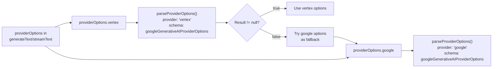

This ensures backward compatibility while allowing Vertex-specific naming.

**Sources**: [packages/google/src/google-generative-ai-language-model.ts:100-115]()

---

## Vertex AI Additional Model Types

The `@ai-sdk/google-vertex` package (`GoogleVertexProvider`) exposes model factories for four distinct model categories beyond language models. The Google AI package (`@ai-sdk/google`) provides only language model support.

**Diagram: GoogleVertexProvider Interface Structure**

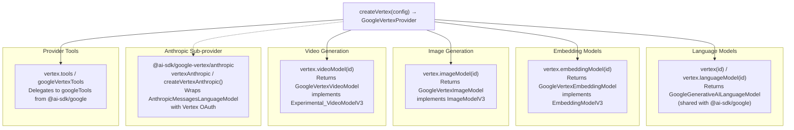

Sources: [packages/google-vertex/src/google-vertex-provider.ts](), [packages/google-vertex/src/google-vertex-tools.ts]()

---

### Embedding Models

`GoogleVertexEmbeddingModel` in [packages/google-vertex/src/google-vertex-embedding-model.ts]() implements `EmbeddingModelV3`. It is accessed via `vertex.embeddingModel(modelId)` (the deprecated alias `vertex.textEmbeddingModel(modelId)` also works).

**Hard limit**: `maxEmbeddingsPerCall = 2048` values per API call.

**Supported Model IDs** (`GoogleVertexEmbeddingModelId` from [packages/google-vertex/src/google-vertex-embedding-options.ts]()):

| Model ID | Notes |
|----------|-------|
| `text-embedding-004` | Standard English embeddings |
| `text-embedding-005` | Latest standard model |
| `text-multilingual-embedding-002` | Multilingual support |
| `textembedding-gecko@001` | Legacy gecko model |
| `textembedding-gecko@003` | Legacy gecko model |
| `textembedding-gecko-multilingual@001` | Legacy multilingual |

**Provider Options** (via `providerOptions.vertex`):

| Option | Type | Description |
|--------|------|-------------|
| `taskType` | `string` | Embedding purpose: `RETRIEVAL_DOCUMENT`, `RETRIEVAL_QUERY`, `SEMANTIC_SIMILARITY`, `CLASSIFICATION`, `CLUSTERING`, `QUESTION_ANSWERING`, `FACT_VERIFICATION` |
| `outputDimensionality` | `number` | Override output vector dimensions (model-dependent) |

Sources: [packages/google-vertex/src/google-vertex-embedding-model.ts](), [packages/google-vertex/src/google-vertex-embedding-options.ts]()

---

### Image Models

`GoogleVertexImageModel` in [packages/google-vertex/src/google-vertex-image-model.ts]() implements `ImageModelV3`. It is accessed via `vertex.imageModel(modelId)`.

Two sub-types are handled internally:

**Imagen Models** — `GoogleVertexImageModelId` from [packages/google-vertex/src/google-vertex-image-settings.ts]():
- `imagen-3.0-generate-001`
- `imagen-3.0-generate-002`
- `imagen-3.0-fast-generate-001`
- `imagen-4.0-generate-001` and preview variants (e.g., `imagen-4.0-generate-preview-06-06`, `imagen-4.0-ultra-generate-preview-06-06`)

Imagen models call the Vertex AI `/predict` endpoint with a structured image generation payload.

**Gemini Image Models** — For model IDs starting with `gemini-` (e.g., `gemini-2.5-flash-image`), `GoogleVertexImageModel` internally creates a `GoogleGenerativeAILanguageModel` instance and sends a generation request with `responseModalities: ['IMAGE', 'TEXT']`. The image bytes are extracted from the response content. This allows `generateImage()` to work with Gemini models that support native image output.

**Diagram: GoogleVertexImageModel Dispatch**

```mermaid
graph TD
    imageModel["vertex.imageModel(modelId)"]
    isGemini{"modelId starts<br/>with 'gemini-'?"}
    ImagenPath["Imagen API Path<br/>POST /models/{id}:predict<br/>Direct Imagen payload"]
    GeminiPath["Gemini Path<br/>GoogleGenerativeAILanguageModel<br/>responseModalities: IMAGE + TEXT"]
    extractImageBytes["Extract image bytes<br/>from response content parts"]
    ImageModelV3Result["ImageModelV3 result<br/>{ images: base64[] }"]

    imageModel --> isGemini
    isGemini -->|"false (Imagen)"| ImagenPath
    isGemini -->|"true (Gemini)"| GeminiPath
    ImagenPath --> ImageModelV3Result
    GeminiPath --> extractImageBytes
    extractImageBytes --> ImageModelV3Result
```

Sources: [packages/google-vertex/src/google-vertex-image-model.ts](), [packages/google-vertex/src/google-vertex-image-settings.ts]()

**Provider Options** (`GoogleVertexImageModelOptions`):

| Option | Description |
|--------|-------------|
| `aspectRatio` | Image ratio string (e.g., `"1:1"`, `"16:9"`, `"9:16"`) |
| `imageSize` | Pixel dimensions (e.g., `"1024x1024"`) — Imagen 4+ |
| `negativePrompt` | Text describing elements to exclude from the image |

---

### Video Models

`GoogleVertexVideoModel` (in `packages/google-vertex/src/google-vertex-video-model.ts`) implements `Experimental_VideoModelV3`. Accessed via `vertex.videoModel(modelId)`.

**Supported Model IDs** (`GoogleVertexVideoModelId`):
- `veo-2.0-generate-001`
- `veo-3.0-generate-preview`

Video generation uses a long-running operation (LRO) pattern: the initial POST submits the job, then the SDK polls the operation endpoint until the video is ready. This is experimental and the interface may change.

Sources: [packages/google-vertex/CHANGELOG.md:90-133](), [content/providers/01-ai-sdk-providers/16-google-vertex.mdx]()

---

### Vertex Anthropic Sub-Provider

The `@ai-sdk/google-vertex/anthropic` sub-module wraps `@ai-sdk/anthropic`'s `AnthropicMessagesLanguageModel` with Vertex AI OAuth authentication instead of an Anthropic API key. It is a separate export from the main `@ai-sdk/google-vertex` package:

```ts
import { vertexAnthropic } from '@ai-sdk/google-vertex/anthropic';
// or for Edge runtime:
import { vertexAnthropic } from '@ai-sdk/google-vertex/anthropic/edge';
```

`createVertexAnthropic()` is the factory function for customized instances. All Claude model capabilities — extended thinking, cache control (`cacheControl`), provider-defined tools (bash, text editor, computer use), MCP servers — work identically to the direct Anthropic provider. See page [3.4] for full documentation. The Vertex variant differs only in that `GOOGLE_APPLICATION_CREDENTIALS` (or the edge JWT env vars) provide authentication instead of `ANTHROPIC_API_KEY`.

Sources: [packages/google-vertex/package.json:53-58](), [content/providers/01-ai-sdk-providers/16-google-vertex.mdx]()

---

## Response Processing and Metadata

The Google provider includes rich metadata in responses, exposed through `providerMetadata` and structured response fields.

### Provider Metadata Structure

```mermaid
graph TB
    providerMetadata["providerMetadata<br/>(in response)"]
    
    google_or_vertex_key["Key: 'google' or 'vertex'<br/>Based on provider"]
    
    promptFeedback["promptFeedback<br/>{blockReason?, safetyRatings?}<br/>Input safety assessment"]
    
    groundingMetadata_field["groundingMetadata<br/>Detailed grounding information<br/>(see Grounding Metadata section)"]
    
    urlContextMetadata_field["urlContextMetadata<br/>URL retrieval status<br/>(for url_context tool)"]
    
    safetyRatings_field["safetyRatings<br/>[{category, probability,<br/>probabilityScore, severity,<br/>severityScore, blocked?}]<br/>Output safety assessment"]
    
    usageMetadata_field["usageMetadata<br/>{cachedContentTokenCount?,<br/>thoughtsTokenCount?,<br/>promptTokenCount,<br/>candidatesTokenCount,<br/>totalTokenCount,<br/>trafficType?}"]
    
    providerMetadata --> google_or_vertex_key
    google_or_vertex_key --> promptFeedback
    google_or_vertex_key --> groundingMetadata_field
    google_or_vertex_key --> urlContextMetadata_field
    google_or_vertex_key --> safetyRatings_field
    google_or_vertex_key --> usageMetadata_field
```

**Sources**: [packages/google/src/google-generative-ai-language-model.ts:333-341]() (doGenerate), [packages/google/src/google-generative-ai-language-model.ts:626-641]() (doStream)

### Usage Metadata Token Breakdown

The `usageMetadata` field provides detailed token counts:

| Field | Description | Availability |
|-------|-------------|--------------|
| `cachedContentTokenCount` | Tokens loaded from cache | Models with caching support |
| `thoughtsTokenCount` | Tokens used for thinking/reasoning | Gemini 2.5+, Gemini 3 with thinking |
| `promptTokenCount` | Input tokens (excluding cache hits) | All models |
| `candidatesTokenCount` | Output tokens | All models |
| `totalTokenCount` | Sum of all token types | All models |
| `trafficType` | Traffic classification (Vertex only) | Vertex AI models |

The `convertGoogleGenerativeAIUsage()` function maps these to the standardized usage format:

```mermaid
graph LR
    usageMetadata["usageMetadata<br/>from API response"]
    
    convertGoogleGenerativeAIUsage_func["convertGoogleGenerativeAIUsage()"]
    
    inputTokens["inputTokens<br/>{total, noCache, cacheRead,<br/>cacheWrite}"]
    
    outputTokens["outputTokens<br/>{total, text, reasoning}"]
    
    raw_field["raw<br/>Original usageMetadata"]
    
    usageMetadata --> convertGoogleGenerativeAIUsage_func
    
    convertGoogleGenerativeAIUsage_func --> inputTokens
    convertGoogleGenerativeAIUsage_func --> outputTokens
    convertGoogleGenerativeAIUsage_func --> raw_field
    
    inputTokens --> total["total = promptTokenCount"]
    inputTokens --> noCache["noCache = promptTokenCount<br/>- cachedContentTokenCount"]
    inputTokens --> cacheRead["cacheRead =<br/>cachedContentTokenCount"]
    
    outputTokens --> total_out["total = candidatesTokenCount"]
    outputTokens --> text_out["text = candidatesTokenCount<br/>- thoughtsTokenCount"]
    outputTokens --> reasoning_out["reasoning = thoughtsTokenCount"]
```

**Sources**: [packages/google/src/convert-google-generative-ai-usage.ts]()

### Safety Ratings Schema

Safety ratings assess content safety across multiple harm categories:

```mermaid
graph TB
    safetyRating["SafetyRating"]
    
    category["category: string<br/>HARM_CATEGORY_HATE_SPEECH,<br/>HARM_CATEGORY_DANGEROUS_CONTENT,<br/>HARM_CATEGORY_HARASSMENT,<br/>HARM_CATEGORY_SEXUALLY_EXPLICIT,<br/>HARM_CATEGORY_CIVIC_INTEGRITY"]
    
    probability["probability: string<br/>NEGLIGIBLE, LOW,<br/>MEDIUM, HIGH"]
    
    probabilityScore["probabilityScore: number<br/>0.0 to 1.0"]
    
    severity["severity: string<br/>HARM_SEVERITY_NEGLIGIBLE,<br/>HARM_SEVERITY_LOW,<br/>HARM_SEVERITY_MEDIUM,<br/>HARM_SEVERITY_HIGH"]
    
    severityScore["severityScore: number<br/>0.0 to 1.0"]
    
    blocked["blocked: boolean<br/>(optional)<br/>Whether content was blocked"]
    
    safetyRating --> category
    safetyRating --> probability
    safetyRating --> probabilityScore
    safetyRating --> severity
    safetyRating --> severityScore
    safetyRating --> blocked
```

Safety ratings appear in both `promptFeedback` (input assessment) and at the candidate level (output assessment).

**Sources**: [packages/google/src/google-generative-ai-language-model.ts:908-916]()

---

## Integration with Core SDK

The Google provider integrates with the AI SDK Core through the Provider V3 specification, enabling seamless use with `generateText`, `streamText`, `generateObject`, and `streamObject`.

### Core SDK Integration Flow

```mermaid
graph LR
    subgraph "Application Layer"
        generateText_call["generateText({<br/>model: google('gemini-2.5-flash'),<br/>prompt: string,<br/>tools?: {...},<br/>providerOptions?: {...}<br/>})"]
    end
    
    subgraph "AI SDK Core"
        validateModel["Validate model implements<br/>LanguageModelV3"]
        prepareRequest["Prepare LanguageModelV3CallOptions"]
        callDoGenerate["Call model.doGenerate()"]
        processResponse["Process result<br/>Extract text, reasoning, sources"]
    end
    
    subgraph "Google Provider"
        GoogleGenerativeAILanguageModel_class["GoogleGenerativeAILanguageModel"]
        doGenerate_method["doGenerate()<br/>Returns LanguageModelV3GenerateResult"]
        doStream_method["doStream()<br/>Returns LanguageModelV3StreamResult"]
    end
    
    subgraph "Google API"
        generateContent_endpoint[":generateContent endpoint"]
        streamGenerateContent_endpoint[":streamGenerateContent?alt=sse"]
    end
    
    generateText_call --> validateModel
    validateModel --> prepareRequest
    prepareRequest --> callDoGenerate
    
    callDoGenerate --> GoogleGenerativeAILanguageModel_class
    GoogleGenerativeAILanguageModel_class --> doGenerate_method
    GoogleGenerativeAILanguageModel_class --> doStream_method
    
    doGenerate_method --> generateContent_endpoint
    doStream_method --> streamGenerateContent_endpoint
    
    generateContent_endpoint --> doGenerate_method
    streamGenerateContent_endpoint --> doStream_method
    
    doGenerate_method --> processResponse
    doStream_method --> processResponse
```

**Sources**: [packages/google/src/google-generative-ai-language-model.ts:58-73]()

### Supported AI SDK Core Features

The Google provider fully supports the following AI SDK Core features:

| Feature | Support Level | Notes |
|---------|--------------|-------|
| Text Generation | Full | `generateText`, `streamText` |
| Tool Calling | Full | Function tools and provider-defined tools |
| Structured Output | Full | Native via `responseSchema` (when `structuredOutputs: true`) |
| Streaming | Full | Server-sent events with fine-grained deltas |
| Multi-modal Input | Full | Text, images, audio, video, PDF files |
| Reasoning Tokens | Full | Via `thinkingConfig` for Gemini 2.5+ and 3.0 |
| Sources | Full | From grounding tools via `extractSources()` |
| Provider Metadata | Full | Safety ratings, grounding metadata, usage details |
| Prompt Caching | Full | Implicit (2.5) and explicit (2.0+, 2.5) caching |
| Abort Signals | Full | Cancellation via `AbortSignal` |

**Sources**: [packages/google/src/google-generative-ai-language-model.ts]()

### Response Schema Validation

The provider uses Zod schemas for response validation with lazy evaluation to avoid circular dependencies:

```mermaid
graph TB
    responseSchema["responseSchema<br/>lazySchema(() => zodSchema(...))"]
    chunkSchema["chunkSchema<br/>lazySchema(() => zodSchema(...))"]
    
    getContentSchema["getContentSchema()<br/>Validates content.parts structure"]
    getGroundingMetadataSchema["getGroundingMetadataSchema()<br/>Validates groundingMetadata"]
    getUrlContextMetadataSchema["getUrlContextMetadataSchema()<br/>Validates urlContextMetadata"]
    getSafetyRatingSchema["getSafetyRatingSchema()<br/>Validates safetyRatings"]
    usageSchema["usageSchema<br/>Validates usageMetadata"]
    
    responseSchema --> getContentSchema
    responseSchema --> getGroundingMetadataSchema
    responseSchema --> getUrlContextMetadataSchema
    responseSchema --> getSafetyRatingSchema
    responseSchema --> usageSchema
    
    chunkSchema --> getContentSchema
    chunkSchema --> getGroundingMetadataSchema
    chunkSchema --> getUrlContextMetadataSchema
    chunkSchema --> getSafetyRatingSchema
    chunkSchema --> usageSchema
    
    createJsonResponseHandler["createJsonResponseHandler(responseSchema)<br/>Used in doGenerate()"]
    createEventSourceResponseHandler["createEventSourceResponseHandler(chunkSchema)<br/>Used in doStream()"]
    
    responseSchema --> createJsonResponseHandler
    chunkSchema --> createEventSourceResponseHandler
```

The schemas are kept minimal to focus on essential fields, reducing the risk of breakage when the API evolves.

**Sources**: [packages/google/src/google-generative-ai-language-model.ts:865-906]() (getContentSchema), [packages/google/src/google-generative-ai-language-model.ts:939-1009]() (responseSchema, chunkSchema)