# Provider Ecosystem

<details>
<summary>Relevant source files</summary>

The following files were used as context for generating this wiki page:

- [.changeset/pre.json](.changeset/pre.json)
- [examples/express/package.json](examples/express/package.json)
- [examples/fastify/package.json](examples/fastify/package.json)
- [examples/hono/package.json](examples/hono/package.json)
- [examples/nest/package.json](examples/nest/package.json)
- [examples/next-fastapi/package.json](examples/next-fastapi/package.json)
- [examples/next-google-vertex/package.json](examples/next-google-vertex/package.json)
- [examples/next-langchain/package.json](examples/next-langchain/package.json)
- [examples/next-openai-kasada-bot-protection/package.json](examples/next-openai-kasada-bot-protection/package.json)
- [examples/next-openai-pages/package.json](examples/next-openai-pages/package.json)
- [examples/next-openai-telemetry-sentry/package.json](examples/next-openai-telemetry-sentry/package.json)
- [examples/next-openai-telemetry/package.json](examples/next-openai-telemetry/package.json)
- [examples/next-openai-upstash-rate-limits/package.json](examples/next-openai-upstash-rate-limits/package.json)
- [examples/node-http-server/package.json](examples/node-http-server/package.json)
- [examples/nuxt-openai/package.json](examples/nuxt-openai/package.json)
- [examples/sveltekit-openai/package.json](examples/sveltekit-openai/package.json)
- [packages/amazon-bedrock/CHANGELOG.md](packages/amazon-bedrock/CHANGELOG.md)
- [packages/amazon-bedrock/package.json](packages/amazon-bedrock/package.json)
- [packages/anthropic/CHANGELOG.md](packages/anthropic/CHANGELOG.md)
- [packages/anthropic/package.json](packages/anthropic/package.json)
- [packages/azure/CHANGELOG.md](packages/azure/CHANGELOG.md)
- [packages/azure/package.json](packages/azure/package.json)
- [packages/google-vertex/CHANGELOG.md](packages/google-vertex/CHANGELOG.md)
- [packages/google-vertex/package.json](packages/google-vertex/package.json)
- [packages/google/CHANGELOG.md](packages/google/CHANGELOG.md)
- [packages/google/package.json](packages/google/package.json)
- [packages/mistral/CHANGELOG.md](packages/mistral/CHANGELOG.md)
- [packages/mistral/package.json](packages/mistral/package.json)
- [packages/openai/CHANGELOG.md](packages/openai/CHANGELOG.md)
- [packages/openai/package.json](packages/openai/package.json)
- [packages/provider-utils/CHANGELOG.md](packages/provider-utils/CHANGELOG.md)
- [packages/provider-utils/package.json](packages/provider-utils/package.json)
- [pnpm-lock.yaml](pnpm-lock.yaml)

</details>


The Provider Ecosystem encompasses the 25+ AI provider integration packages that implement the unified provider interface specification, enabling seamless switching between different AI services. This page covers the provider abstraction layer, package organization, major commercial providers, cloud platform adapters, open-source alternatives, and specialized model providers.

For detailed information about the provider interface specification and how providers implement it, see [Provider Architecture and V3 Specification](#3.1). For specific provider implementations and features, see sections [3.2](#3.2) through [3.9](#3.9).

## Provider Package Organization

The provider ecosystem is structured as a collection of independent npm packages under the `@ai-sdk/` scope, each implementing the provider interface specification from `@ai-sdk/provider`.

### Package Structure Overview

```mermaid
graph TB
    subgraph "Foundation Packages"
        PROVIDER["@ai-sdk/provider<br/>v3.0.0-beta.26<br/>LanguageModelV3<br/>EmbeddingModelV3<br/>ImageModelV3<br/>ProviderV3"]
        PROVIDER_UTILS["@ai-sdk/provider-utils<br/>v4.0.0-beta.50<br/>createEventSourceResponseHandler()<br/>postJsonToApi()<br/>convertZodToJSONSchema()"]
    end
    
    subgraph "Major Commercial Providers"
        OPENAI["@ai-sdk/openai<br/>v3.0.0-beta.99<br/>OpenAIChatLanguageModel<br/>OpenAIResponsesLanguageModel<br/>OpenAIEmbeddingModel"]
        ANTHROPIC["@ai-sdk/anthropic<br/>v3.0.0-beta.86<br/>AnthropicMessagesLanguageModel"]
        GOOGLE["@ai-sdk/google<br/>v3.0.0-beta.75<br/>GoogleGenerativeAILanguageModel<br/>GoogleGenerativeAIEmbeddingModel"]
        MISTRAL["@ai-sdk/mistral<br/>v3.0.0-beta.52<br/>MistralChatLanguageModel"]
        COHERE["@ai-sdk/cohere<br/>v3.0.0-beta.51<br/>CohereChatLanguageModel"]
    end
    
    subgraph "Cloud Platform Providers (Delegation)"
        AZURE["@ai-sdk/azure<br/>v3.0.0-beta.101<br/>Wraps OpenAI"]
        BEDROCK["@ai-sdk/amazon-bedrock<br/>v4.0.0-beta.96<br/>Wraps Anthropic"]
        VERTEX["@ai-sdk/google-vertex<br/>v4.0.0-beta.117<br/>Composes Google + Anthropic"]
    end
    
    subgraph "OpenAI-Compatible Providers"
        COMPAT["@ai-sdk/openai-compatible<br/>Base implementation"]
        XAI["@ai-sdk/xai<br/>v3.0.0-beta.58"]
        DEEPSEEK["@ai-sdk/deepseek<br/>v2.0.0-beta.53"]
        GROQ["@ai-sdk/groq<br/>v3.0.0-beta.53"]
        FIREWORKS["@ai-sdk/fireworks<br/>v2.0.0-beta.51"]
        TOGETHER["@ai-sdk/togetherai"]
        CEREBRAS["@ai-sdk/cerebras"]
    end
    
    subgraph "Specialized Model Providers"
        ELEVENLABS["@ai-sdk/elevenlabs<br/>SpeechModelV3"]
        DEEPGRAM["@ai-sdk/deepgram<br/>TranscriptionModelV3"]
        BFL["@ai-sdk/black-forest-labs<br/>ImageModelV3"]
        FAL["@ai-sdk/fal<br/>ImageModelV3"]
        LUMA["@ai-sdk/luma<br/>ImageModelV3"]
        REPLICATE["@ai-sdk/replicate<br/>ImageModelV3"]
    end
    
    PROVIDER --> OPENAI
    PROVIDER --> ANTHROPIC
    PROVIDER --> GOOGLE
    PROVIDER --> MISTRAL
    PROVIDER --> COHERE
    
    PROVIDER_UTILS --> OPENAI
    PROVIDER_UTILS --> ANTHROPIC
    PROVIDER_UTILS --> GOOGLE
    PROVIDER_UTILS --> MISTRAL
    PROVIDER_UTILS --> COHERE
    
    OPENAI --> AZURE
    ANTHROPIC --> BEDROCK
    GOOGLE --> VERTEX
    ANTHROPIC --> VERTEX
    
    PROVIDER --> COMPAT
    COMPAT --> XAI
    COMPAT --> DEEPSEEK
    COMPAT --> GROQ
    COMPAT --> FIREWORKS
    COMPAT --> TOGETHER
    COMPAT --> CEREBRAS
    
    PROVIDER --> ELEVENLABS
    PROVIDER --> DEEPGRAM
    PROVIDER --> BFL
    PROVIDER --> FAL
    PROVIDER --> LUMA
    PROVIDER --> REPLICATE
```

**Diagram: Provider Package Hierarchy and Dependencies**

Sources: [packages/openai/package.json:1-74](), [packages/anthropic/package.json:1-74](), [packages/google/package.json:1-74](), [packages/mistral/package.json:1-67](), [packages/azure/package.json:1-68](), [packages/amazon-bedrock/package.json:1-71](), [packages/google-vertex/package.json:1-88](), [examples/ai-core/package.json:5-56]()

### Provider Package Dependencies

All provider packages depend on `@ai-sdk/provider` for interface definitions and `@ai-sdk/provider-utils` for shared functionality:

| Package | Version | Dependencies | Purpose |
|---------|---------|--------------|---------|
| `@ai-sdk/provider` | 3.0.0-beta.26 | None | Interface specification |
| `@ai-sdk/provider-utils` | 4.0.0-beta.50 | `@ai-sdk/provider`, `eventsource-parser` | Streaming, schema conversion |
| `@ai-sdk/openai` | 3.0.0-beta.99 | `@ai-sdk/provider`, `@ai-sdk/provider-utils` | OpenAI implementation |
| `@ai-sdk/anthropic` | 3.0.0-beta.86 | `@ai-sdk/provider`, `@ai-sdk/provider-utils` | Anthropic implementation |
| `@ai-sdk/google` | 3.0.0-beta.75 | `@ai-sdk/provider`, `@ai-sdk/provider-utils` | Google implementation |
| `@ai-sdk/azure` | 3.0.0-beta.101 | `@ai-sdk/openai`, `@ai-sdk/provider`, `@ai-sdk/provider-utils` | Azure wrapper |
| `@ai-sdk/amazon-bedrock` | 4.0.0-beta.96 | `@ai-sdk/anthropic`, `@ai-sdk/provider`, `@ai-sdk/provider-utils`, `aws4fetch`, `@smithy/eventstream-codec` | Bedrock wrapper |
| `@ai-sdk/google-vertex` | 4.0.0-beta.117 | `@ai-sdk/google`, `@ai-sdk/anthropic`, `@ai-sdk/provider`, `@ai-sdk/provider-utils`, `google-auth-library` | Vertex multi-model |

Sources: [packages/provider-utils/package.json:1-93](), [packages/openai/package.json:42-45](), [packages/anthropic/package.json:42-44](), [packages/azure/package.json:35-38](), [packages/amazon-bedrock/package.json:35-41](), [packages/google-vertex/package.json:53-58]()

## Provider Abstraction Layer

The provider abstraction layer is defined by three primary interfaces in `@ai-sdk/provider`:

### Core Model Interfaces

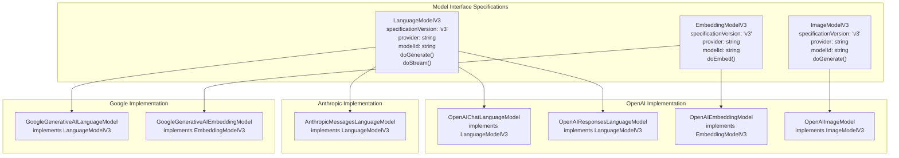

**Diagram: Provider Interface Implementation Classes**

Sources: [packages/openai/package.json:1-74](), [packages/anthropic/package.json:1-74](), [packages/google/package.json:1-74]()

### Shared Utilities from provider-utils

The `@ai-sdk/provider-utils` package provides common functionality used across all providers:

| Utility | Purpose | Used By |
|---------|---------|---------|
| `createEventSourceResponseHandler()` | Parse SSE streams | All streaming providers |
| `parseJSON()` | JSON parsing with error handling | All providers |
| `postJsonToApi()` | HTTP POST with JSON | All providers |
| `combineHeaders()` | Header normalization | All providers |
| `convertJSONSchemaToOpenAPISchema()` | Schema conversion | OpenAI, Mistral, Azure |
| `convertZodToJSONSchema()` | Zod to JSON Schema | All providers with tools |
| `InvalidResponseDataError` | Error handling | All providers |
| `AsyncIterableStream` | Stream utilities | All streaming providers |

Sources: [packages/provider-utils/package.json:28-40](), [packages/openai/CHANGELOG.md:310-312](), [packages/anthropic/CHANGELOG.md:244-245]()

## Major Commercial Providers

### OpenAI Provider Family

The OpenAI provider family includes direct OpenAI integration and Azure OpenAI wrapper:

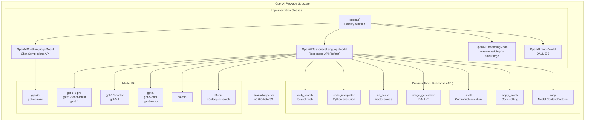

**Diagram: OpenAI Provider Structure and Model Support**

**Key Features:**
- **Responses API (Default since v3.0)**: Provider-executed tools via `OpenAIResponsesLanguageModel`
- **Chat Completions API**: Legacy API via `OpenAIChatLanguageModel`
- **Reasoning Models**: Support for `o3-mini`, `o4-mini`, `o3-deep-research` with extended thinking and `reasoning_effort` setting
- **GPT-5 Series**: Latest models including `gpt-5.2-pro`, `gpt-5.1-codex`, and base `gpt-5` models
- **Provider-Defined Tools**: 7 built-in tools executed by OpenAI (web_search, code_interpreter, file_search, image_generation, shell, apply_patch, mcp)
- **Multi-modal**: Image, audio, and file inputs supported
- **Prompt Caching**: Support for `promptCacheRetention: '24h'` on gpt-5.1 series

Sources: [packages/openai/package.json:1-74](), [packages/openai/CHANGELOG.md:1-99](), [packages/openai/CHANGELOG.md:130-132](), [packages/openai/CHANGELOG.md:175-176](), [packages/openai/CHANGELOG.md:323-325](), [content/docs/02-foundations/02-providers-and-models.mdx:117-126]()

### Azure OpenAI Provider

Azure OpenAI wraps the OpenAI provider with deployment-based URLs:

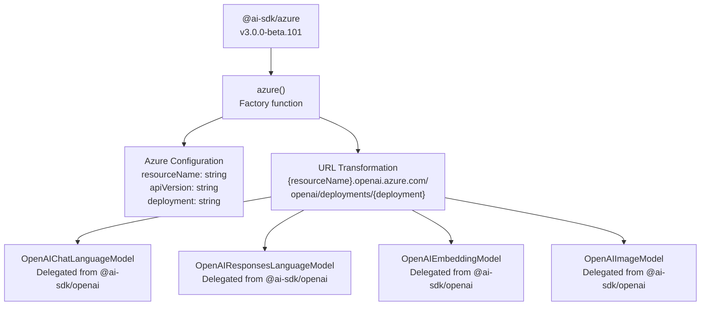

**Diagram: Azure OpenAI Provider Delegation Pattern**

**Key Characteristics:**
- **Delegation Pattern**: Wraps all OpenAI model classes with Azure-specific URL transformation
- **Deployment-Based URLs**: Transforms to `{resourceName}.openai.azure.com/openai/deployments/{deployment}`
- **API Versioning**: Requires `api-version` parameter (e.g., `2024-08-01-preview`, `2024-10-21`)
- **Responses API Support**: Full support for provider-defined tools (web_search enabled via `web-search-preview` API version)
- **Feature Parity**: Inherits all OpenAI features including reasoning models, embeddings, and image generation

Sources: [packages/azure/package.json:35-38](), [packages/azure/CHANGELOG.md:1-101](), [packages/azure/CHANGELOG.md:261-263](), [examples/next-openai/package.json:12-14]()

### Anthropic Provider

The Anthropic provider implements Claude models via the Messages API:

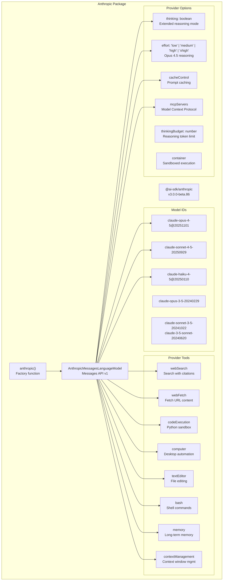

**Diagram: Anthropic Provider Structure**

**Key Features:**
- **Extended Thinking Mode**: Support for reasoning tokens via `thinking` option with configurable `thinkingBudget`
- **Opus 4.5 Reasoning**: New `effort` option ('low', 'medium', 'high', 'xhigh') for Opus 4.5 with up to 64K output tokens
- **Prompt Caching**: Cache control for reducing latency and costs via `cacheControl`
- **Provider-Defined Tools**: 8 Anthropic-specific tools (webSearch, webFetch, codeExecution, computer, textEditor, bash, memory, contextManagement)
- **Native Structured Outputs**: Anthropic-native JSON schema support via `schema` field
- **MCP Server Integration**: Connect to external Model Context Protocol servers
- **Multi-modal**: Support for images, PDFs, and documents
- **Temperature Clamping**: Automatic clamping to 0-1 range with warnings

Sources: [packages/anthropic/package.json:1-74](), [packages/anthropic/CHANGELOG.md:1-86](), [packages/anthropic/CHANGELOG.md:48-50](), [packages/anthropic/CHANGELOG.md:60-62](), [packages/anthropic/CHANGELOG.md:68-70](), [packages/anthropic/CHANGELOG.md:76-78](), [packages/anthropic/CHANGELOG.md:212-214](), [packages/anthropic/CHANGELOG.md:243-245]()

### Google AI Providers

Google provides two provider packages: Generative AI (direct) and Vertex AI (multi-model platform):

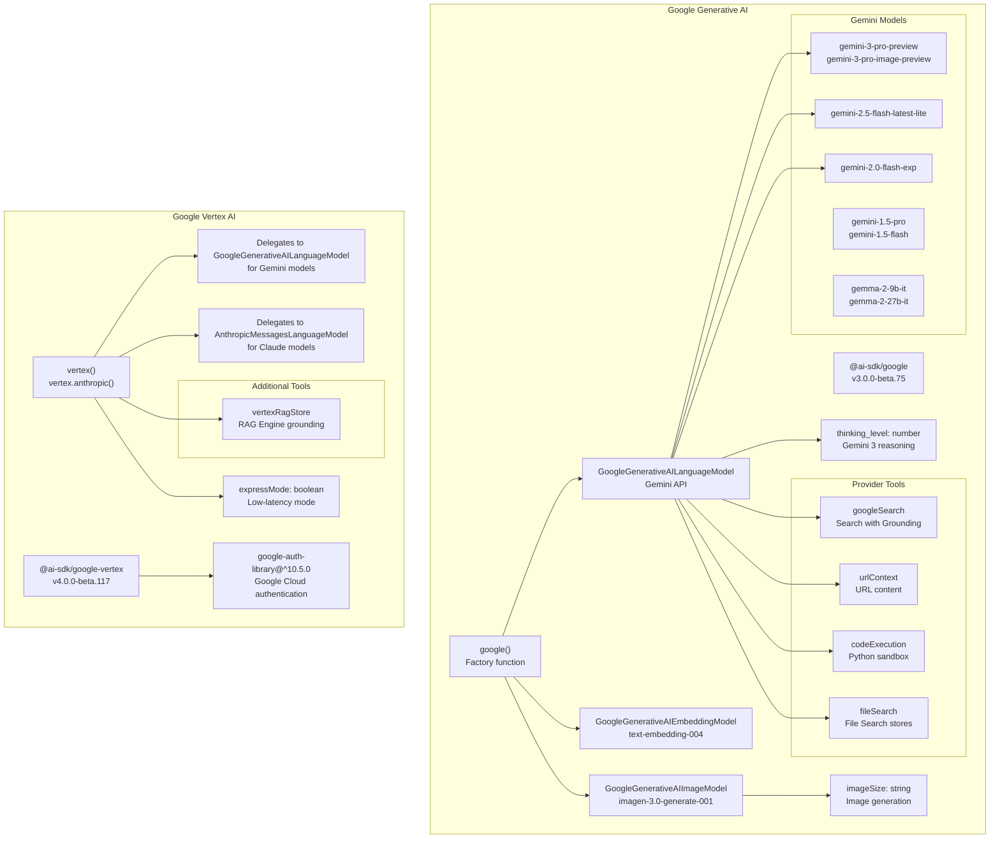

**Diagram: Google Provider Family Structure**

**Key Differences:**
- **Google Generative AI**: Direct API access via `google()`, simpler API key authentication
- **Google Vertex AI**: Multi-cloud platform via `vertex()` and `vertex.anthropic()`, requires Google Cloud authentication
- **Model Coverage**: Vertex supports both Gemini (via Google) and Claude (via Anthropic) models
- **RAG Integration**: Vertex provides `vertexRagStore` tool for RAG Engine grounding
- **Thinking Configuration**: Support for `thinking_level` option in Gemini 3 models for reasoning control
- **Express Mode**: Vertex-specific `expressMode` option for low-latency inference
- **Image Generation**: Support for Imagen 3.0 with configurable `imageSize`

Sources: [packages/google/package.json:1-74](), [packages/google-vertex/package.json:1-88](), [packages/google/CHANGELOG.md:1-75](), [packages/google/CHANGELOG.md:59-68](), [packages/google/CHANGELOG.md:179-182](), [packages/google/CHANGELOG.md:187-189](), [packages/google-vertex/CHANGELOG.md:1-117](), [packages/google-vertex/CHANGELOG.md:87-89](), [packages/google-vertex/CHANGELOG.md:178-181](), [content/docs/02-foundations/02-providers-and-models.mdx:1-237]()

### Mistral and Cohere Providers

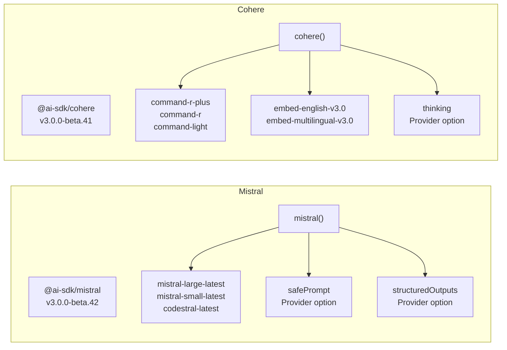

**Diagram: Mistral and Cohere Provider Structure**

Sources: [packages/mistral/package.json:1-67](), [examples/next-openai/package.json:21-22]()

## Cloud Platform Providers

### Composite Architecture Pattern

Cloud platform providers leverage existing provider implementations:

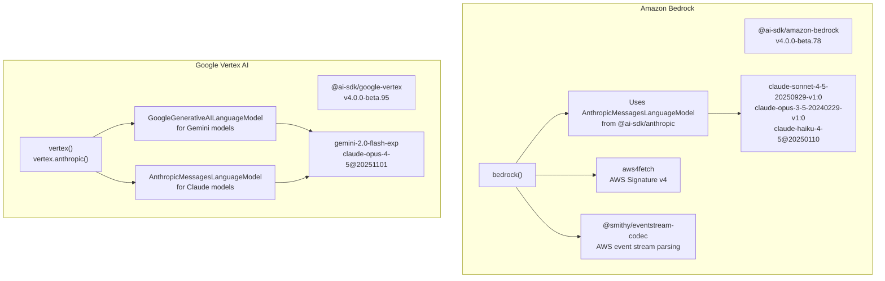

**Diagram: Composite Provider Architecture**

**Composite Provider Pattern:**
1. **Dependency Reuse**: Platform providers depend on direct provider packages (`@ai-sdk/anthropic`, `@ai-sdk/google`)
2. **Protocol Adaptation**: Transform platform-specific authentication and request formats
3. **Feature Preservation**: Maintain provider-specific features (thinking, cache control, MCP, structured outputs)
4. **Model Support**: Enable access to models through platform gateways with platform-specific model IDs

**Amazon Bedrock Specifics:**
- **Dependencies**: `@ai-sdk/anthropic@workspace:*`, `aws4fetch@^1.0.20`, `@smithy/eventstream-codec@^4.0.1`, `@smithy/util-utf8@^4.0.0`
- **Authentication**: AWS Signature v4 via `aws4fetch` library
- **Streaming**: AWS event stream format parsed via `@smithy/eventstream-codec`
- **Model Mapping**: Maps Bedrock model IDs (e.g., `claude-sonnet-4-5-20250929-v1:0`) to `AnthropicMessagesLanguageModel`
- **Feature Support**: Full support for thinking mode, structured outputs, and tool calling with Anthropic features
- **Temperature Clamping**: Automatic clamping to 0-1 range with warnings
- **Reasoning Support**: Nova 2 models support `maxReasoningEffort` field

**Google Vertex AI Specifics:**
- **Dependencies**: `@ai-sdk/google@workspace:*`, `@ai-sdk/anthropic@workspace:*`, `google-auth-library@^10.5.0`
- **Multi-Provider**: Supports both Gemini (via `GoogleGenerativeAILanguageModel`) and Claude (via `AnthropicMessagesLanguageModel`) models
- **Authentication**: Google Cloud authentication via `google-auth-library` v10.5.0
- **Export Structure**: Separate exports for `vertex()` (Gemini) and `vertex.anthropic()` (Claude)
- **Additional Tools**: Provides `vertexRagStore` tool for RAG Engine grounding
- **Express Mode**: Low-latency inference mode via `expressMode` option
- **Feature Parity**: Maintains all Google and Anthropic features through delegation

Sources: [packages/amazon-bedrock/package.json:35-41](), [packages/google-vertex/package.json:53-58](), [packages/google-vertex/package.json:30-51](), [packages/amazon-bedrock/CHANGELOG.md:1-96](), [packages/amazon-bedrock/CHANGELOG.md:58-62](), [packages/amazon-bedrock/CHANGELOG.md:131-135](), [packages/amazon-bedrock/CHANGELOG.md:289-309](), [packages/google-vertex/CHANGELOG.md:1-117](), [packages/google-vertex/CHANGELOG.md:87-89](), [packages/google-vertex/CHANGELOG.md:361-380]()

## Open Source and Alternative Providers

The ecosystem includes numerous providers for open-source models and specialized infrastructure:

### Alternative LLM Providers

| Provider | Package Version | Key Features |
|----------|----------------|--------------|
| **xAI** | `@ai-sdk/xai@3.0.0-beta.48` | Grok models |
| **DeepSeek** | `@ai-sdk/deepseek@2.0.0-beta.43` | DeepSeek V3 models |
| **Groq** | `@ai-sdk/groq@3.0.0-beta.42` | Fast inference hardware |
| **Cerebras** | `@ai-sdk/cerebras` | Ultra-fast inference |
| **Fireworks AI** | `@ai-sdk/fireworks@2.0.0-beta.41` | Function calling optimized |
| **Together AI** | `@ai-sdk/togetherai` | Open source model hosting |
| **Hugging Face** | `@ai-sdk/huggingface` | Inference API access |
| **Replicate** | `@ai-sdk/replicate` | Model deployment platform |
| **Perplexity** | `@ai-sdk/perplexity@3.0.0-beta.42` | Search-augmented generation |
| **Baseten** | `@ai-sdk/baseten` | Model deployment |
| **DeepInfra** | `@ai-sdk/deepinfra` | Model hosting |

Sources: [examples/ai-core/package.json:5-40](), [examples/next-openai/package.json:12-28]()

### OpenAI-Compatible Provider

The `@ai-sdk/openai-compatible` package provides a generic connector for any OpenAI-compatible API:

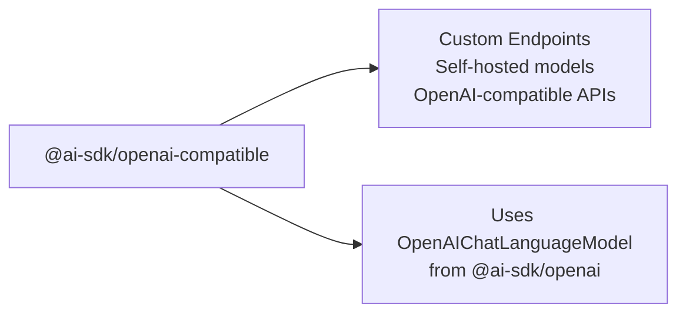

**Diagram: OpenAI-Compatible Provider for Custom Endpoints**

Sources: [examples/ai-core/package.json:31-32]()

## Specialized Model Providers

### Speech and Transcription Providers

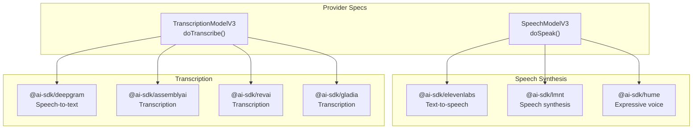

**Diagram: Speech and Transcription Provider Ecosystem**

Sources: [examples/ai-core/package.json:16-19](), [examples/ai-core/package.json:28-29]()

### Image Generation Providers

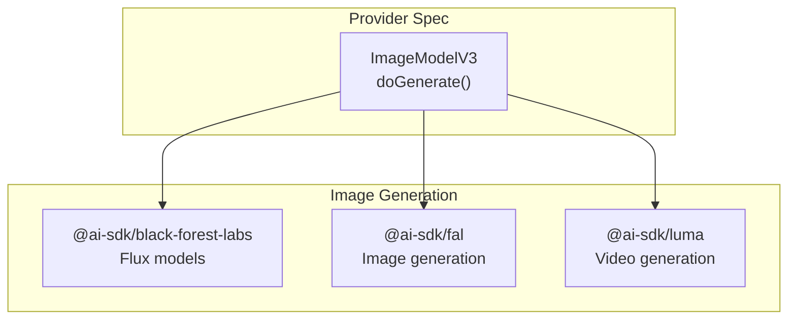

**Diagram: Image Generation Provider Ecosystem**

Sources: [examples/ai-core/package.json:6-7](), [examples/ai-core/package.json:18-19](), [examples/ai-core/package.json:25-26]()

## Gateway and Routing

### AI Gateway Provider

The `@ai-sdk/gateway` package provides infrastructure-level capabilities:

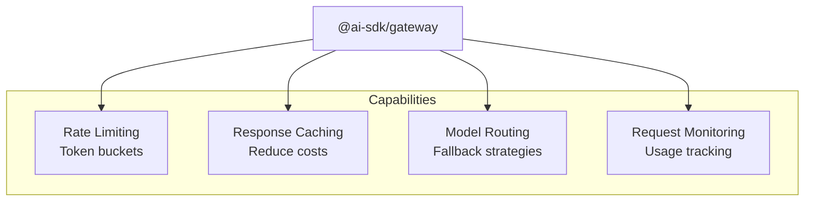

**Diagram: AI Gateway Provider Capabilities**

Sources: [examples/ai-core/package.json:20-21]()

## Framework Integration Adapters

### LangChain and LlamaIndex Bridges

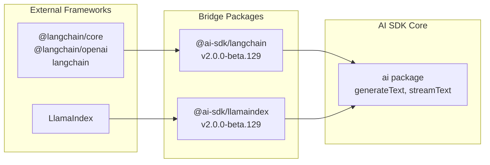

**Diagram: Framework Integration Bridge Architecture**

**Bridge Purposes:**
- **LangChain Bridge**: Enable using AI SDK providers with LangChain chains and agents
- **LlamaIndex Bridge**: Enable using AI SDK providers with LlamaIndex query engines
- **Synchronized Versioning**: Both bridges maintain version parity with core `ai` package (v2.0.0-beta.129)

Sources: [examples/next-langchain/package.json:12-14](), [pnpm-lock.yaml:47-48]()

## Example Usage Patterns

### Comprehensive Provider Testing

The `ai-core` example demonstrates integration with all providers:

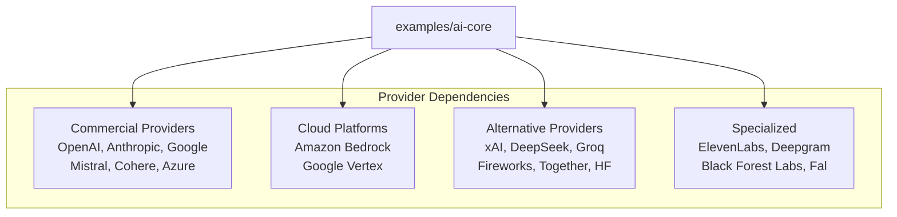

**Diagram: ai-core Example Provider Coverage**

The `ai-core` example imports 25+ provider packages to test comprehensive provider support:

- Language Models: OpenAI, Anthropic, Google, Mistral, Cohere, xAI, DeepSeek, Groq, Cerebras, Fireworks, Together AI, Hugging Face, Replicate, Perplexity, Baseten, DeepInfra, OpenAI-compatible
- Cloud Platforms: Azure OpenAI, Amazon Bedrock, Google Vertex AI
- Embedding Models: OpenAI, Cohere, Google
- Image Models: OpenAI (DALL-E), Black Forest Labs (Flux), Fal.ai, Luma AI
- Speech Models: ElevenLabs, Deepgram, AssemblyAI, Rev.ai, Gladia, Hume, LMNT
- Infrastructure: AI Gateway, MCP Client

Sources: [examples/ai-core/package.json:5-56]()

### Multi-Provider Examples

The `next-openai` example demonstrates using multiple providers in a single application:

```typescript
// Imports from package.json
"@ai-sdk/amazon-bedrock": "4.0.0-beta.78"
"@ai-sdk/anthropic": "3.0.0-beta.70"
"@ai-sdk/azure": "3.0.0-beta.80"
"@ai-sdk/cohere": "3.0.0-beta.41"
"@ai-sdk/deepseek": "2.0.0-beta.43"
"@ai-sdk/fireworks": "2.0.0-beta.41"
"@ai-sdk/google": "3.0.0-beta.62"
"@ai-sdk/google-vertex": "4.0.0-beta.95"
"@ai-sdk/groq": "3.0.0-beta.42"
"@ai-sdk/mistral": "3.0.0-beta.42"
"@ai-sdk/openai": "3.0.0-beta.78"
"@ai-sdk/perplexity": "3.0.0-beta.42"
"@ai-sdk/xai": "3.0.0-beta.48"
```

Sources: [examples/next-openai/package.json:11-49]()

## Version Management

### Beta Versioning Strategy

All provider packages follow synchronized beta versioning:

- **Core Specification**: `@ai-sdk/provider@3.0.0-beta.26`
- **Provider Utilities**: `@ai-sdk/provider-utils@4.0.0-beta.50`
- **Major Language Model Providers**: v3.0.0-beta.x (OpenAI, Anthropic, Google, Mistral, Cohere)
- **Cloud Platform Providers**: v3.0.0-beta.x (Azure), v4.0.0-beta.x (Bedrock, Vertex)
- **OpenAI-Compatible Providers**: v2.0.0-beta.x or v3.0.0-beta.x
- **Changesets**: 390+ changesets tracking feature development

The version numbers indicate:
- **Major version (3 or 4)**: Breaking changes to provider specification
- **Beta tag**: Pre-release status for AI SDK 6
- **Patch version**: Incremental updates within beta

**Version Synchronization**: Provider packages are loosely synchronized with the core `ai` package (v6.0.0-beta.154) but maintain independent versioning to allow for provider-specific updates.

Sources: [.changeset/pre.json:1-10](), [.changeset/pre.json:78-462](), [packages/openai/package.json:3](), [packages/anthropic/package.json:3](), [packages/google/package.json:3](), [packages/azure/package.json:3](), [packages/amazon-bedrock/package.json:3](), [packages/google-vertex/package.json:3]()

## Provider Selection Considerations

### Feature Matrix

| Feature | OpenAI | Anthropic | Google | Mistral | Cohere |
|---------|--------|-----------|--------|---------|--------|
| **Streaming** | ✓ | ✓ | ✓ | ✓ | ✓ |
| **Tool Calling** | ✓ | ✓ | ✓ | ✓ | ✓ |
| **Provider Tools** | ✓ (web_search, code_interpreter, etc.) | ✓ (webSearch, codeExecution, etc.) | ✓ (googleSearch, urlContext, etc.) | ✗ | ✗ |
| **Multi-modal** | ✓ (images, audio) | ✓ (images, PDFs) | ✓ (images, audio, video) | ✓ (images, PDFs) | ✗ |
| **Reasoning Models** | ✓ (o1, o3) | ✓ (thinking) | ✓ (thinking_level) | ✗ | ✗ |
| **Embeddings** | ✓ | ✗ | ✓ | ✓ | ✓ |
| **Image Generation** | ✓ (DALL-E) | ✗ | ✗ | ✗ | ✗ |
| **Prompt Caching** | ✗ | ✓ (cache control) | ✗ | ✗ | ✗ |
| **MCP Servers** | ✗ | ✓ | ✗ | ✗ | ✗ |

Sources: [packages/openai/CHANGELOG.md:114-115](), [packages/anthropic/CHANGELOG.md:114-115](), [packages/google/CHANGELOG.md:115-117]()