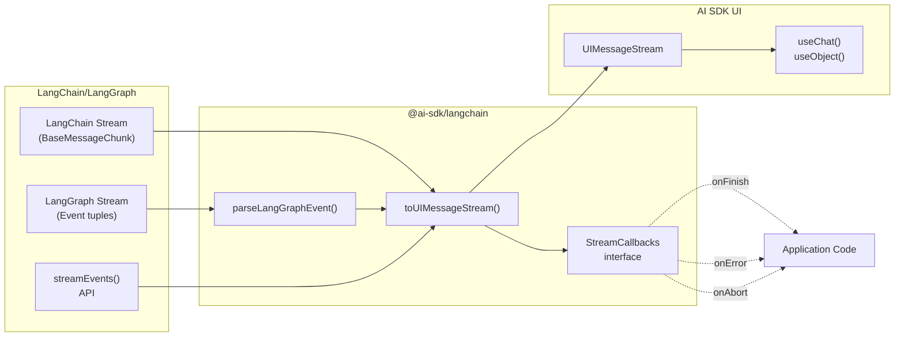
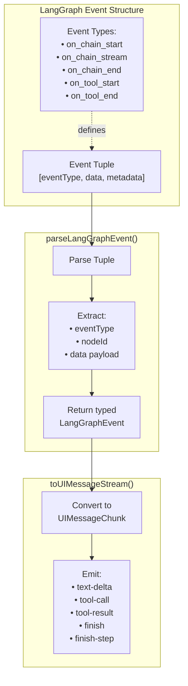
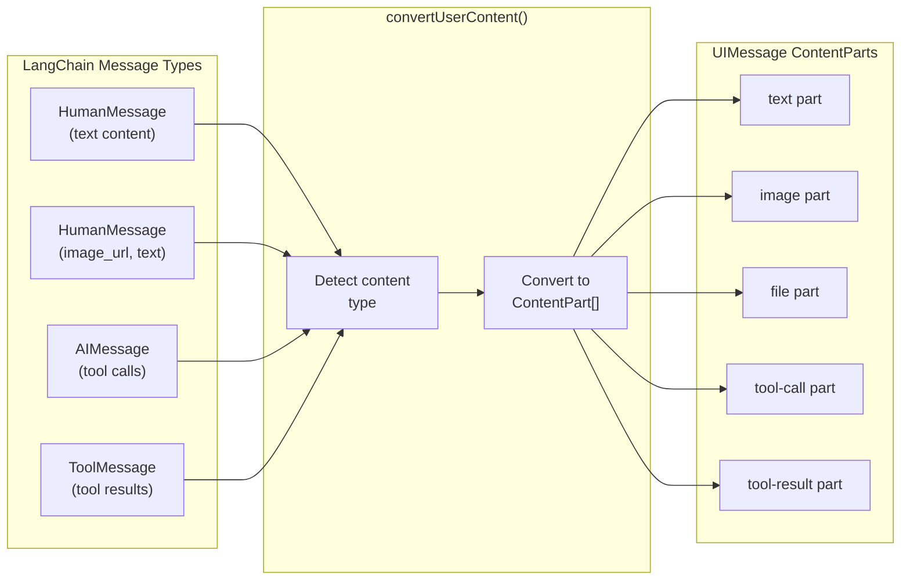
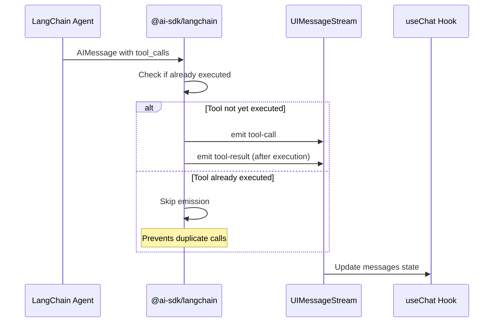
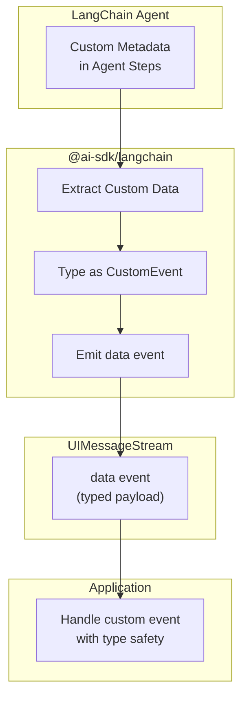
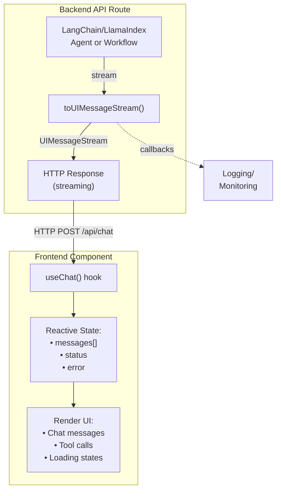

# LangChain and LlamaIndex Adapters

Relevant source files

The following files were used as context for generating this wiki page:

- [packages/langchain/CHANGELOG.md](packages/langchain/CHANGELOG.md)
- [packages/langchain/package.json](packages/langchain/package.json)
- [packages/llamaindex/CHANGELOG.md](packages/llamaindex/CHANGELOG.md)
- [packages/llamaindex/package.json](packages/llamaindex/package.json)

## Purpose and Scope

The `@ai-sdk/langchain` and `@ai-sdk/llamaindex` packages provide adapter layers that bridge the LangChain/LangGraph and LlamaIndex ecosystems with the AI SDK's UI framework layer. These adapters enable applications to consume streams from LangChain agents and LlamaIndex workflows while using the AI SDK's `useChat`, `useObject`, and other UI hooks. They convert framework-specific stream formats into the standardized `UIMessageStream` format that AI SDK UI frameworks expect.

For information about the core streaming architecture and `UIMessageStream` format, see page [2.4](#2.4). For UI framework integration patterns, see page [4.1](#4.1).

**Sources**: [packages/langchain/package.json:1-78](), [packages/llamaindex/package.json:1-66]()

---

## Package Overview

Both adapter packages follow a consistent structure and versioning scheme, currently in v7 beta pre-release:

| Package | Version | Peer Dependencies |
|---------|---------|-------------------|
| `@ai-sdk/langchain` | `3.0.0-beta.7` | `@langchain/core >=1.0.0`, `@langchain/langgraph >=0.2.0` (optional) |
| `@ai-sdk/llamaindex` | `3.0.0-beta.7` | None specified |

Both packages depend on the core `ai` package (workspace dependency) and provide CommonJS, ESM, and TypeScript declaration exports. The LangChain adapter specifically supports optional LangGraph integration through peer dependencies.

**Sources**: [packages/langchain/package.json:32-60](), [packages/llamaindex/package.json:32-50]()

---

## LangChain Adapter Architecture

### Core Conversion Function: `toUIMessageStream`

**Diagram**: LangChain adapter stream conversion architecture

The `toUIMessageStream` function is the primary bridge, accepting LangChain message streams and converting them to the AI SDK's `UIMessageStream` format. This enables seamless integration with React, Vue, Svelte, and other UI framework hooks.

**Sources**: [packages/langchain/CHANGELOG.md:729-730](), [packages/langchain/CHANGELOG.md:703-703]()

---

### StreamCallbacks Interface

The adapter provides a callback system for monitoring stream lifecycle events:

| Callback | Signature | Description |
|----------|-----------|-------------|
| `onFinish` | `(state: LangGraphState \| undefined) => void` | Called on successful completion with final LangGraph state (or `undefined` for non-LangGraph streams) |
| `onError` | `(error: Error) => void` | Called when stream encounters an error |
| `onAbort` | `() => void` | Called when stream is aborted by the client |

These callbacks enable applications to implement custom logging, state persistence, error handling, and cleanup logic without modifying the stream processing pipeline.

**Sources**: [packages/langchain/CHANGELOG.md:281-288]()

---

### LangGraph Integration

#### parseLangGraphEvent Helper

The `parseLangGraphEvent` function parses LangGraph event tuples into typed structures. LangGraph emits events as tuples with metadata, and this helper extracts the relevant information for conversion to `UIMessageStream` format.

**Diagram**: LangGraph event parsing and conversion flow

The adapter emits `finish` and `finish-step` events specifically for LangGraph streams, enabling UI components to react to multi-step agent execution phases.

**Sources**: [packages/langchain/CHANGELOG.md:281-288](), [packages/langchain/CHANGELOG.md:703-703]()

---

### Message Conversion and Multimodal Support

The adapter includes a `convertUserContent` function that transforms LangChain message formats into AI SDK content part structures. This function supports multimodal content including text, images, and file attachments.

**Diagram**: LangChain message to AI SDK content part conversion

The multimodal support enables LangChain agents that process images or documents to integrate seamlessly with AI SDK UI components that display rich content.

**Sources**: [packages/langchain/CHANGELOG.md:716-717]()

---

### Tool Execution Handling

The adapter coordinates tool execution between LangChain's tool system and the AI SDK's tool lifecycle. A key feature is preventing duplicate tool call emission:

**Diagram**: Tool execution deduplication in LangChain adapter

This deduplication prevents UI components from displaying duplicate tool calls when LangChain agents execute multiple reasoning steps with the same tools.

**Sources**: [packages/langchain/CHANGELOG.md:796-796]()

---

### Typed Custom Data Events

The adapter supports emitting custom data events with type safety, enabling applications to extend the stream protocol with domain-specific information:

**Diagram**: Typed custom data event flow

This feature enables advanced use cases like progress tracking, intermediate reasoning visualization, and custom state synchronization.

**Sources**: [packages/langchain/CHANGELOG.md:875-875]()

---

## LlamaIndex Adapter

The `@ai-sdk/llamaindex` package provides similar stream conversion capabilities for LlamaIndex workflows. While less information is available in the changelog, the package follows the same architectural pattern:

- Converts LlamaIndex stream formats to `UIMessageStream`
- Provides callback interfaces for lifecycle events
- Supports message ID consistency for proper state management
- Integrates with AI SDK UI frameworks through the same `useChat`/`useObject` hooks

The adapter enables LlamaIndex agents and RAG pipelines to work seamlessly with AI SDK's UI layer.

**Sources**: [packages/llamaindex/package.json:1-66](), [packages/llamaindex/CHANGELOG.md:1-10]()

---

## Integration Pattern

Both adapters follow a consistent integration pattern with AI SDK UI frameworks:

**Diagram**: End-to-end integration pattern

This pattern enables developers to use LangChain or LlamaIndex on the backend while maintaining the same frontend code and UI components across different agent implementations.

**Sources**: [packages/langchain/package.json:40-41](), [packages/llamaindex/package.json:40-41]()

---

## Version Synchronization and Dependencies

Both adapters track closely with the core AI SDK version:

| AI SDK Version | Adapter Version | Status |
|----------------|-----------------|--------|
| `7.0.0-beta.7` | `3.0.0-beta.7` | Current pre-release |
| `6.0.x` | `2.0.x` | Previous stable |
| `5.0.x` | `1.0.x` | Earlier stable |

The adapters maintain version parity through the changesets system, ensuring compatibility as the core SDK evolves. Both packages are marked with `"sideEffects": false` for optimal tree-shaking in bundlers.

**Sources**: [packages/langchain/package.json:3-5](), [packages/llamaindex/package.json:3-5](), [packages/langchain/CHANGELOG.md:3-8](), [packages/llamaindex/CHANGELOG.md:3-8]()

---

## Key Implementation Details

### Message ID Consistency

The LangChain adapter ensures message ID consistency across stream emissions to prevent UI state corruption. When converting LangChain messages to `UIMessage` format, the adapter maintains stable IDs throughout the conversation lifecycle.

**Sources**: [packages/langchain/CHANGELOG.md:690-690]()

### StreamEvents API Support

The adapter supports LangChain's `streamEvents()` API, which provides a lower-level streaming interface compared to standard message streaming. This enables integration with more complex LangChain constructs and custom runnables.

**Sources**: [packages/langchain/CHANGELOG.md:729-730]()

### Error Handling

The `onError` callback receives the full error object from the underlying stream, enabling applications to:
- Log errors to monitoring systems
- Display user-friendly error messages
- Implement retry logic
- Clean up resources

The `onAbort` callback specifically handles client-initiated stream cancellations, distinguishing them from server-side errors.

**Sources**: [packages/langchain/CHANGELOG.md:281-288]()

---

## Development and Testing

Both adapter packages include comprehensive testing infrastructure:

- **Node.js tests**: `vitest --config vitest.node.config.js`
- **Edge runtime tests**: `vitest --config vitest.edge.config.js`
- **Build**: `tsup --tsconfig tsconfig.build.json`
- **Type checking**: `tsc --build`

The packages are built with `tsup` and support CommonJS, ESM, and TypeScript declaration outputs, ensuring compatibility across different JavaScript environments and bundlers.

**Sources**: [packages/langchain/package.json:19-30](), [packages/llamaindex/package.json:19-30]()