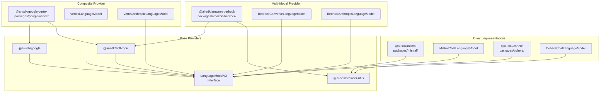
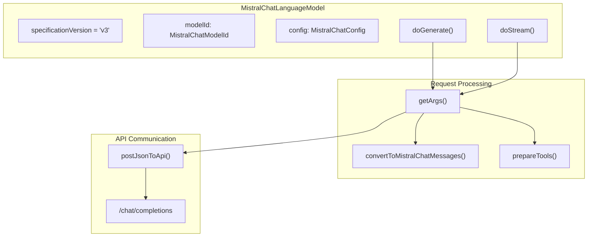
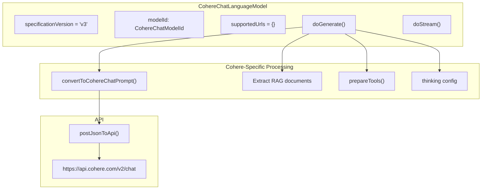
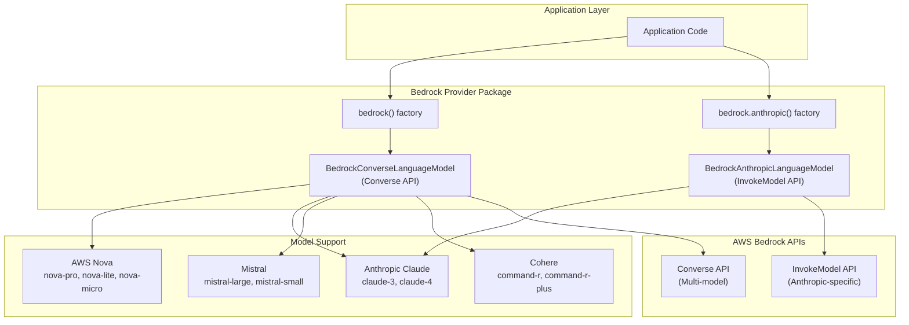
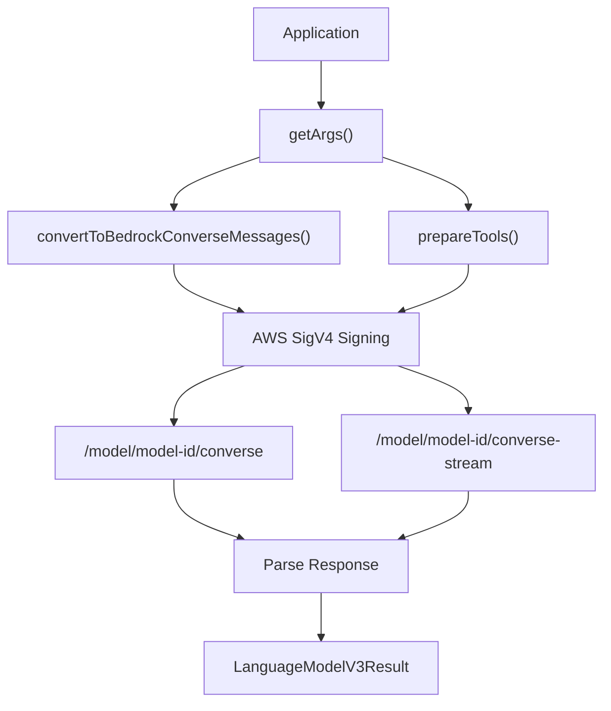
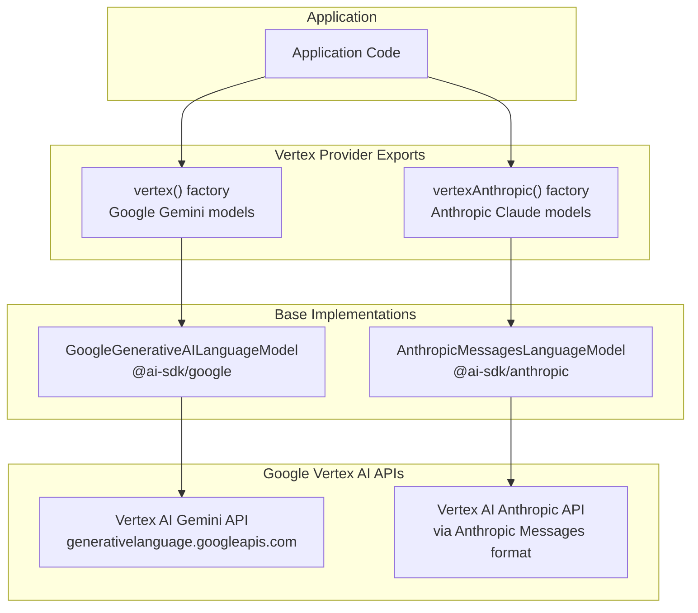
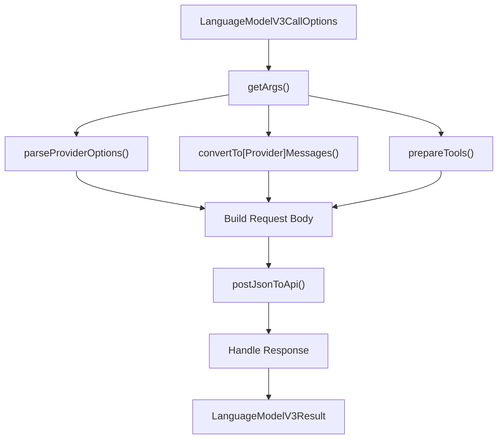

# Mistral, Amazon Bedrock, and Additional Providers

<details>
<summary>Relevant source files</summary>

The following files were used as context for generating this wiki page:

- [.changeset/pre.json](.changeset/pre.json)
- [content/providers/01-ai-sdk-providers/20-mistral.mdx](content/providers/01-ai-sdk-providers/20-mistral.mdx)
- [content/providers/01-ai-sdk-providers/25-cohere.mdx](content/providers/01-ai-sdk-providers/25-cohere.mdx)
- [examples/express/package.json](examples/express/package.json)
- [examples/fastify/package.json](examples/fastify/package.json)
- [examples/hono/package.json](examples/hono/package.json)
- [examples/nest/package.json](examples/nest/package.json)
- [examples/next-fastapi/package.json](examples/next-fastapi/package.json)
- [examples/next-google-vertex/package.json](examples/next-google-vertex/package.json)
- [examples/next-langchain/package.json](examples/next-langchain/package.json)
- [examples/next-openai-kasada-bot-protection/package.json](examples/next-openai-kasada-bot-protection/package.json)
- [examples/next-openai-pages/package.json](examples/next-openai-pages/package.json)
- [examples/next-openai-telemetry-sentry/package.json](examples/next-openai-telemetry-sentry/package.json)
- [examples/next-openai-telemetry/package.json](examples/next-openai-telemetry/package.json)
- [examples/next-openai-upstash-rate-limits/package.json](examples/next-openai-upstash-rate-limits/package.json)
- [examples/node-http-server/package.json](examples/node-http-server/package.json)
- [examples/nuxt-openai/package.json](examples/nuxt-openai/package.json)
- [examples/sveltekit-openai/package.json](examples/sveltekit-openai/package.json)
- [packages/amazon-bedrock/CHANGELOG.md](packages/amazon-bedrock/CHANGELOG.md)
- [packages/amazon-bedrock/package.json](packages/amazon-bedrock/package.json)
- [packages/anthropic/CHANGELOG.md](packages/anthropic/CHANGELOG.md)
- [packages/anthropic/package.json](packages/anthropic/package.json)
- [packages/cohere/src/**snapshots**/cohere-embedding-model.test.ts.snap](packages/cohere/src/__snapshots__/cohere-embedding-model.test.ts.snap)
- [packages/cohere/src/cohere-chat-language-model.test.ts](packages/cohere/src/cohere-chat-language-model.test.ts)
- [packages/cohere/src/cohere-chat-language-model.ts](packages/cohere/src/cohere-chat-language-model.ts)
- [packages/cohere/src/cohere-embedding-model.test.ts](packages/cohere/src/cohere-embedding-model.test.ts)
- [packages/cohere/src/cohere-embedding-model.ts](packages/cohere/src/cohere-embedding-model.ts)
- [packages/cohere/src/cohere-embedding-options.ts](packages/cohere/src/cohere-embedding-options.ts)
- [packages/cohere/src/cohere-provider.ts](packages/cohere/src/cohere-provider.ts)
- [packages/google-vertex/CHANGELOG.md](packages/google-vertex/CHANGELOG.md)
- [packages/google-vertex/package.json](packages/google-vertex/package.json)
- [packages/google/CHANGELOG.md](packages/google/CHANGELOG.md)
- [packages/google/package.json](packages/google/package.json)
- [packages/mistral/src/mistral-chat-language-model.test.ts](packages/mistral/src/mistral-chat-language-model.test.ts)
- [packages/mistral/src/mistral-chat-language-model.ts](packages/mistral/src/mistral-chat-language-model.ts)
- [packages/mistral/src/mistral-chat-options.ts](packages/mistral/src/mistral-chat-options.ts)
- [pnpm-lock.yaml](pnpm-lock.yaml)

</details>

## Overview

This document covers provider packages in the Vercel AI SDK that have unique implementations or compose existing provider functionality: Mistral AI, Amazon Bedrock, Cohere, and Google Vertex AI. These providers enable integration with their respective AI platforms through standardized interfaces defined by the V3 Provider Specification.

- **Mistral** (`@ai-sdk/mistral`): Direct implementation for Mistral AI models including reasoning capabilities and document OCR
- **Amazon Bedrock** (`@ai-sdk/amazon-bedrock`): Multi-model provider supporting Anthropic Claude, AWS Nova, Mistral, and Cohere models through AWS infrastructure
- **Cohere** (`@ai-sdk/cohere`): Direct implementation for Cohere models with RAG and reasoning support
- **Google Vertex** (`@ai-sdk/google-vertex`): Composes both Google Gemini and Anthropic Claude models through Google Cloud's Vertex AI service

For the OpenAI and Anthropic base implementations, see [OpenAI Provider - Chat Completions API](#3.3) and [Anthropic Provider](#3.4). For the provider architecture and V3 specification details, see [Provider Architecture and V3 Specification](#3.1).

---

## Provider Architecture Overview

These providers implement the `LanguageModelV3` interface using different strategies: direct implementation, composition of existing providers, or multi-model support.

**Provider Architecture Diagram**



**Sources:** [packages/mistral/package.json:1-79](), [packages/amazon-bedrock/package.json:1-89](), [packages/google-vertex/package.json:1-100]()

---

## Mistral Provider

### Architecture and Implementation

The Mistral provider is a direct implementation that communicates with the Mistral AI API at `https://api.mistral.ai/v1`. It implements `LanguageModelV3` through the `MistralChatLanguageModel` class.



**Sources:** [packages/mistral/src/mistral-chat-language-model.ts:42-54](), [packages/mistral/src/mistral-chat-language-model.ts:64-173]()

### Model Support

Mistral provides three model tiers with distinct capabilities:

#### Model IDs and Types

| Category      | Model IDs                                                                                                                                     | Purpose                                                 |
| ------------- | --------------------------------------------------------------------------------------------------------------------------------------------- | ------------------------------------------------------- |
| **Premier**   | `ministral-3b-latest`, `ministral-8b-latest`, `mistral-large-latest`, `mistral-medium-latest`, `mistral-small-latest`, `pixtral-large-latest` | Production-grade models with full feature support       |
| **Reasoning** | `magistral-small-2507`, `magistral-medium-2507`                                                                                               | Step-by-step thinking with reasoning content extraction |
| **Free**      | `pixtral-12b-2409`                                                                                                                            | Community access models                                 |
| **Legacy**    | `open-mistral-7b`, `open-mixtral-8x7b`, `open-mixtral-8x22b`                                                                                  | Older model versions                                    |

**Sources:** [packages/mistral/src/mistral-chat-options.ts:4-25]()

### Reasoning Models

Mistral reasoning models return structured thinking content that the SDK extracts automatically:

```typescript
const result = await generateText({
  model: mistral('magistral-small-2507'),
  prompt: 'What is 15 * 24?',
})

console.log('REASONING:', result.reasoningText)
// Output: "Let me calculate this step by step..."

console.log('ANSWER:', result.text)
// Output: "360"
```

The reasoning extraction occurs in `doGenerate()` where content parts with `type: 'thinking'` are converted to `type: 'reasoning'` in the V3 format:

```typescript
if (part.type === 'thinking') {
  const reasoningText = extractReasoningContent(part.thinking)
  if (reasoningText.length > 0) {
    content.push({ type: 'reasoning', text: reasoningText })
  }
}
```

**Sources:** [packages/mistral/src/mistral-chat-language-model.ts:206-209](), [content/providers/01-ai-sdk-providers/20-mistral.mdx:170-196]()

### Document OCR

Mistral models support PDF document processing with configurable limits:

```typescript
const result = await generateText({
  model: mistral('mistral-small-latest'),
  messages: [
    {
      role: 'user',
      content: [
        { type: 'text', text: 'Summarize this document' },
        {
          type: 'file',
          data: new URL('https://example.com/document.pdf'),
          mediaType: 'application/pdf',
        },
      ],
    },
  ],
  providerOptions: {
    mistral: {
      documentImageLimit: 8, // max images to extract
      documentPageLimit: 64, // max pages to process
    },
  },
})
```

The `supportedUrls` property defines PDF support for HTTPS URLs:

```typescript
readonly supportedUrls: Record<string, RegExp[]> = {
  'application/pdf': [/^https:\/\/.*$/],
};
```

**Sources:** [packages/mistral/src/mistral-chat-language-model.ts:60-62](), [content/providers/01-ai-sdk-providers/20-mistral.mdx:134-168]()

### Structured Outputs

Mistral supports structured JSON outputs through two mechanisms:

#### Native JSON Schema Support

When `structuredOutputs: true` (default) and a schema is provided:

```typescript
const result = await generateObject({
  model: mistral('mistral-large-latest'),
  schema: z.object({
    recipe: z.object({
      name: z.string(),
      ingredients: z.array(z.string()),
    }),
  }),
  prompt: 'Generate a recipe',
})
```

The provider sends the schema using Mistral's `json_schema` format:

```typescript
response_format: {
  type: 'json_schema',
  json_schema: {
    schema: responseFormat.schema,
    strict: strictJsonSchema,
    name: responseFormat.name ?? 'response',
    description: responseFormat.description,
  },
}
```

#### JSON Object Mode

When no schema is provided or `structuredOutputs: false`, the SDK injects JSON instructions into the prompt and uses `response_format: { type: 'json_object' }`.

**Sources:** [packages/mistral/src/mistral-chat-language-model.ts:104-143](), [content/providers/01-ai-sdk-providers/20-mistral.mdx:214-238]()

### Provider Options

```typescript
import { mistral, type MistralLanguageModelOptions } from '@ai-sdk/mistral'

await generateText({
  model: mistral('mistral-large-latest'),
  providerOptions: {
    mistral: {
      safePrompt: true, // inject safety prompt
      parallelToolCalls: false, // one tool per response
      strictJsonSchema: false, // strict schema validation
      structuredOutputs: true, // use json_schema format
      documentImageLimit: 8, // PDF image extraction limit
      documentPageLimit: 64, // PDF page processing limit
    } satisfies MistralLanguageModelOptions,
  },
})
```

**Sources:** [packages/mistral/src/mistral-chat-options.ts:27-59](), [content/providers/01-ai-sdk-providers/20-mistral.mdx:82-98]()

---

## Cohere Provider

### Architecture and Implementation

The Cohere provider implements direct integration with the Cohere V2 chat API through the `CohereChatLanguageModel` class.



**Sources:** [packages/cohere/src/cohere-chat-language-model.ts:38-56](), [packages/cohere/src/cohere-chat-language-model.ts:58-134]()

### Model Capabilities

| Model                         | Object Generation | Tool Usage | Tool Streaming | Reasoning |
| ----------------------------- | ----------------- | ---------- | -------------- | --------- |
| `command-a-03-2025`           | ✓                 | ✓          | ✓              | ✗         |
| `command-a-reasoning-08-2025` | ✓                 | ✓          | ✓              | ✓         |
| `command-r7b-12-2024`         | ✓                 | ✓          | ✓              | ✗         |
| `command-r-plus-04-2024`      | ✓                 | ✓          | ✓              | ✗         |
| `command-r-plus`              | ✓                 | ✓          | ✓              | ✗         |

**Sources:** [content/providers/01-ai-sdk-providers/25-cohere.mdx:106-112]()

### RAG with Documents

Cohere models support Retrieval-Augmented Generation by accepting documents directly in the chat API:

```typescript
const result = await generateText({
  model: cohere('command-r-plus'),
  messages: [
    {
      role: 'user',
      content: [
        { type: 'text', text: 'What is in the documents?' },
        {
          type: 'text',
          text: 'Document content here',
          experimental_providerMetadata: {
            cohere: {
              document: {
                title: 'My Document',
                url: 'https://example.com/doc',
              },
            },
          },
        },
      ],
    },
  ],
})
```

Documents are extracted from message content during prompt conversion:

```typescript
const {
  messages: chatPrompt,
  documents: cohereDocuments,
  warnings: promptWarnings,
} = convertToCohereChatPrompt(prompt)

// In the request:
return {
  args: {
    messages: chatPrompt,
    ...(cohereDocuments.length > 0 && { documents: cohereDocuments }),
  },
}
```

**Sources:** [packages/cohere/src/cohere-chat-language-model.ts:82-86](), [packages/cohere/src/cohere-chat-language-model.ts:122](), [content/providers/01-ai-sdk-providers/25-cohere.mdx:121-156]()

### Reasoning and Thinking

Cohere's reasoning models (`command-a-reasoning-08-2025`) support extended thinking with configurable token budgets:

```typescript
import { cohere, type CohereLanguageModelOptions } from '@ai-sdk/cohere'

const result = await generateText({
  model: cohere('command-a-reasoning-08-2025'),
  prompt: 'Solve this complex problem',
  providerOptions: {
    cohere: {
      thinking: {
        type: 'enabled', // or 'disabled'
        tokenBudget: 5000, // max tokens for thinking
      },
    } satisfies CohereLanguageModelOptions,
  },
})

console.log(result.reasoningText) // extracted thinking content
console.log(result.text) // final answer
```

The thinking content is extracted during response processing:

```typescript
for (const item of response.message.content ?? []) {
  if (item.type === 'thinking' && item.thinking.length > 0) {
    content.push({ type: 'reasoning', text: item.thinking })
  }
}
```

**Sources:** [packages/cohere/src/cohere-chat-language-model.ts:125-130](), [packages/cohere/src/cohere-chat-language-model.ts:165](), [content/providers/01-ai-sdk-providers/25-cohere.mdx:158-189]()

### Tool Support

Cohere implements standard tool calling through the `prepareTools()` function:

```typescript
const {
  tools: cohereTools,
  toolChoice: cohereToolChoice,
  toolWarnings,
} = prepareTools({ tools, toolChoice })

return {
  args: {
    tools: cohereTools,
    tool_choice: cohereToolChoice,
    // ...
  },
}
```

Tool calls are extracted from the response:

```typescript
for (const tool_call of response.message.tool_calls ?? []) {
  content.push({
    type: 'tool-call',
    toolCallId: tool_call.id,
    toolName: tool_call.function.name,
    input: tool_call.function.arguments,
  })
}
```

**Sources:** [packages/cohere/src/cohere-chat-language-model.ts:88-91](), [packages/cohere/src/cohere-chat-language-model.ts:168-175]()

---

## Amazon Bedrock Provider

### Package Structure and Architecture

Amazon Bedrock provides access to multiple foundation models from different providers through a unified AWS API. The `@ai-sdk/amazon-bedrock` package implements two distinct API integrations:

| Dependency                  | Purpose                                                  |
| --------------------------- | -------------------------------------------------------- |
| `@ai-sdk/anthropic`         | Base Anthropic provider implementation for Claude models |
| `@ai-sdk/provider`          | V3 specification interfaces                              |
| `@ai-sdk/provider-utils`    | Shared utilities for HTTP, streaming, schema conversion  |
| `@smithy/eventstream-codec` | AWS event stream decoding                                |
| `aws4fetch`                 | AWS Signature Version 4 request signing                  |

**Bedrock API Architecture**



**Sources:** [packages/amazon-bedrock/package.json:52-59](), [packages/amazon-bedrock/CHANGELOG.md:253]()

### Model Family Support

Amazon Bedrock provides access to multiple model families through the Converse API:

#### Anthropic Claude Models

```typescript
import { bedrock } from '@ai-sdk/amazon-bedrock'

// Via Converse API
const model1 = bedrock('anthropic.claude-3-5-sonnet-20241022-v2:0')

// Via native Anthropic InvokeModel API
const model2 = bedrock.anthropic('anthropic.claude-3-5-sonnet-20241022-v2:0')
```

The native Anthropic API path (`bedrock.anthropic()`) provides:

- Direct use of Anthropic's Message API format
- Support for all Anthropic-specific features (prompt caching, thinking mode, etc.)
- Tool calling with structured outputs
- Better compatibility with Anthropic feature updates

**Sources:** [packages/amazon-bedrock/CHANGELOG.md:253](), [packages/amazon-bedrock/CHANGELOG.md:472-497]()

#### AWS Nova Models

```typescript
const model = bedrock('us.amazon.nova-pro-v1:0')
// Also: nova-lite-v1:0, nova-micro-v1:0
```

Nova models support:

- Extended reasoning with `maxReasoningEffort` configuration
- Embedding models with task-specific parameters
- Native AWS optimizations

**Sources:** [packages/amazon-bedrock/CHANGELOG.md:751-752](), [packages/amazon-bedrock/CHANGELOG.md:186-187]()

#### Mistral Models

```typescript
const model = bedrock('mistral.mistral-large-2407-v1:0')
```

Note: Mistral models on Bedrock require tool call ID normalization to exactly 9 alphanumeric characters to meet Mistral's validation requirements.

**Sources:** [packages/amazon-bedrock/CHANGELOG.md:238-240]()

#### Cohere Models

```typescript
const model = bedrock('cohere.command-r-plus-v1:0')
```

Cohere models support:

- Command and Command-R model families
- RAG with document support
- Citations in responses

**Sources:** [packages/amazon-bedrock/CHANGELOG.md:469](), [packages/amazon-bedrock/CHANGELOG.md:192-193]()

### Configuration and Authentication

Bedrock provider uses AWS credentials for authentication:

```typescript
import { bedrock } from '@ai-sdk/amazon-bedrock'

const model = bedrock('anthropic.claude-3-5-sonnet-20241022-v2:0', {
  region: 'us-east-1', // AWS region
  // Credentials from environment or AWS SDK default credential chain
})
```

The provider uses `aws4fetch` to sign requests with AWS Signature Version 4, supporting:

- Environment variables (`AWS_ACCESS_KEY_ID`, `AWS_SECRET_ACCESS_KEY`)
- AWS credential files
- IAM roles (when running on AWS infrastructure)

**Sources:** [packages/amazon-bedrock/package.json:52-59]()

### Bedrock-Specific Features

#### Converse API Integration

The Converse API provides unified access to multiple model families:

**Converse Request Flow**



**Sources:** [packages/amazon-bedrock/CHANGELOG.md:425-431]()

#### Prompt Caching Support

Bedrock supports prompt caching with TTL configuration:

```typescript
const result = await generateText({
  model: bedrock('anthropic.claude-3-5-sonnet-20241022-v2:0'),
  messages: [
    {
      role: 'system',
      content: 'Large system prompt...',
      experimental_providerMetadata: {
        bedrock: {
          cacheControl: { type: 'ephemeral', ttl: 300 }, // 5 minute TTL
        },
      },
    },
    { role: 'user', content: 'Question?' },
  ],
})
```

Cache usage statistics are returned in the response metadata.

**Sources:** [packages/amazon-bedrock/CHANGELOG.md:94]()

#### Stop Sequences

Bedrock exposes stop sequences that triggered generation to halt:

```typescript
const result = await generateText({
  model: bedrock('anthropic.claude-3-5-sonnet-20241022-v2:0'),
  prompt: 'Generate a story',
})

console.log(result.providerMetadata?.bedrock?.stopSequence)
// Output: "The end" or null
```

**Sources:** [packages/amazon-bedrock/CHANGELOG.md:425-431](), [packages/amazon-bedrock/CHANGELOG.md:499]()

#### Citations Support

Bedrock models can return citations for grounded responses:

```typescript
const result = await generateText({
  model: bedrock('cohere.command-r-plus-v1:0'),
  prompt: 'What is quantum computing?',
})

// Citations available in provider metadata
const citations = result.providerMetadata?.bedrock?.citations
```

**Sources:** [packages/amazon-bedrock/CHANGELOG.md:469]()

### Embedding Models

Bedrock provides embedding model support for Nova and Cohere:

```typescript
import { bedrock } from '@ai-sdk/amazon-bedrock'

// AWS Nova embeddings
const novaEmbedding = bedrock.textEmbeddingModel('amazon.titan-embed-text-v2:0')

const embedding = await embed({
  model: novaEmbedding,
  value: 'Text to embed',
})

// Cohere embeddings with output dimension
const cohereEmbedding = bedrock.textEmbeddingModel('cohere.embed-english-v3', {
  outputDimension: 1024, // 256, 512, 1024, or 1536
})
```

Nova embedding models require `taskType` and `singleEmbeddingParams` in the request payload, which the provider handles automatically.

**Sources:** [packages/amazon-bedrock/CHANGELOG.md:186-187](), [packages/amazon-bedrock/CHANGELOG.md:113-114](), [packages/amazon-bedrock/CHANGELOG.md:192-193]()

### Reranking Models

Bedrock supports reranking models with shorthand names:

```typescript
import { bedrock } from '@ai-sdk/amazon-bedrock'

const reranker = bedrock.rerankingModel('cohere-rerank-v3')

const results = await rerank({
  model: reranker,
  query: 'What is machine learning?',
  documents: [
    'Machine learning is...',
    'Deep learning uses...',
    'AI systems can...',
  ],
})
```

**Sources:** [packages/amazon-bedrock/CHANGELOG.md:454](), [packages/amazon-bedrock/CHANGELOG.md:462]()

### Tool Calling and Structured Outputs

Bedrock supports combining tool calling with structured outputs for both Converse and Anthropic APIs:

```typescript
const result = await generateObject({
  model: bedrock('anthropic.claude-3-5-sonnet-20241022-v2:0'),
  tools: {
    weather: {
      description: 'Get weather',
      parameters: z.object({ city: z.string() }),
      execute: async ({ city }) => {
        // Tool execution
        return { temperature: 72 }
      },
    },
  },
  schema: z.object({
    summary: z.string(),
    temperature: z.number(),
  }),
  prompt: 'What is the weather in San Francisco?',
})
```

The provider automatically:

- Uses `tool_choice: { type: 'required' }` when structured output is requested
- Converts JSON tool responses to text content
- Maps finish reasons from `tool_use` to `stop` for structured outputs

**Sources:** [packages/amazon-bedrock/CHANGELOG.md:472-497]()

### Provider Options

```typescript
import {
  bedrock,
  type BedrockLanguageModelOptions,
} from '@ai-sdk/amazon-bedrock'

await generateText({
  model: bedrock('anthropic.claude-3-5-sonnet-20241022-v2:0'),
  providerOptions: {
    bedrock: {
      additionalModelRequestFields: {
        // Model-specific parameters
      },
      additionalModelResponseFieldPaths: ['/stop_sequence'],
    } satisfies BedrockLanguageModelOptions,
  },
})
```

**Sources:** [packages/amazon-bedrock/CHANGELOG.md:425-431]()

---

## Google Vertex Provider

### Package Structure and Composition

Google Vertex AI (`@ai-sdk/google-vertex`) composes both Google Gemini and Anthropic Claude models through a unified interface, leveraging the base implementations from `@ai-sdk/google` and `@ai-sdk/anthropic`.

| Dependency               | Purpose                                       |
| ------------------------ | --------------------------------------------- |
| `@ai-sdk/google`         | Base Google Gemini provider implementation    |
| `@ai-sdk/anthropic`      | Base Anthropic Claude provider implementation |
| `@ai-sdk/provider`       | V3 specification interfaces                   |
| `@ai-sdk/provider-utils` | Shared utilities                              |
| `google-auth-library`    | Google Cloud authentication                   |

**Vertex AI Model Access Paths**



**Sources:** [packages/google-vertex/package.json:64-70](), [packages/google-vertex/package.json:41-63]()

### Google Gemini Models via Vertex

```typescript
import { vertex } from '@ai-sdk/google-vertex'

const model = vertex('gemini-2.0-flash-exp')

const result = await generateText({
  model,
  prompt: 'Explain quantum computing',
})
```

Vertex Gemini models inherit all features from the base Google provider including:

- Google Search and File Search provider tools
- Enterprise web search
- Grounding with Google Maps
- Code execution
- Thinking mode configuration

**Sources:** [packages/google-vertex/CHANGELOG.md:64-65](), [packages/google-vertex/CHANGELOG.md:104-107](), [packages/google-vertex/CHANGELOG.md:153-156]()

### Anthropic Claude Models via Vertex

```typescript
import { vertexAnthropic } from '@ai-sdk/google-vertex/anthropic'

const model = vertexAnthropic('claude-3-5-sonnet-v2@20241022')

const result = await generateText({
  model,
  prompt: 'Write a story',
})
```

Vertex Anthropic models inherit all features from the base Anthropic provider including:

- Thinking mode and reasoning
- Prompt caching
- Tool calling with structured outputs
- Computer use and other Anthropic provider tools

The Vertex Anthropic implementation automatically sends the required beta headers only for structured outputs.

**Sources:** [packages/google-vertex/CHANGELOG.md:645-647](), [packages/google-vertex/CHANGELOG.md:1023-1042]()

### Authentication

Vertex AI uses Google Cloud authentication:

```typescript
import { vertex } from '@ai-sdk/google-vertex'

// Uses Application Default Credentials (ADC)
const model = vertex('gemini-2.0-flash-exp', {
  project: 'my-project-id',
  location: 'us-central1',
})
```

Authentication sources (in order of precedence):

1. `GOOGLE_APPLICATION_CREDENTIALS` environment variable pointing to a service account key file
2. Google Cloud SDK credentials (`gcloud auth application-default login`)
3. Compute Engine/Cloud Run service account (when running on Google Cloud)

**Sources:** [packages/google-vertex/package.json:64-70]()

### Express Mode

Vertex AI supports an express API mode for faster response times:

```typescript
const result = await generateText({
  model: vertex('gemini-2.0-flash-exp'),
  prompt: 'Quick response',
  providerOptions: {
    vertex: {
      useExpressMode: true,
    },
  },
})
```

Express mode sends API keys as headers instead of URL arguments for reduced latency.

**Sources:** [packages/google-vertex/CHANGELOG.md:750-751](), [packages/google-vertex/CHANGELOG.md:257-258]()

### Video Generation

Vertex AI provides video generation capabilities through Gemini models:

```typescript
import { vertex } from '@ai-sdk/google-vertex'

const videoModel = vertex.videoGenerationModel('imagen-3.0-generate-002')

const { video } = await experimental_generateVideo({
  model: videoModel,
  prompt: 'A serene sunset over mountains',
  providerOptions: {
    vertex: {
      aspectRatio: '16:9',
      negativePrompt: 'blurry, low quality',
    },
  },
})
```

**Sources:** [packages/google-vertex/CHANGELOG.md:65-66](), [packages/google-vertex/CHANGELOG.md:7-8]()

---

## Common Implementation Patterns

### V3 Specification Compliance

All providers in this document implement the `LanguageModelV3` interface with required methods:

```typescript
interface LanguageModelV3 {
  readonly specificationVersion: 'v3'
  readonly modelId: string
  readonly provider: string
  readonly supportedUrls: Record<string, RegExp[]>

  doGenerate(
    options: LanguageModelV3CallOptions
  ): Promise<LanguageModelV3GenerateResult>
  doStream(
    options: LanguageModelV3CallOptions
  ): Promise<LanguageModelV3StreamResult>
}
```

Each provider sets its `provider` field to a unique identifier:

- Mistral: `"mistral"`
- Amazon Bedrock: `"bedrock"` (Converse) or `"bedrock-anthropic"` (InvokeModel)
- Cohere: `"cohere"`
- Google Vertex: `"google-vertex"` (Gemini) or `"vertex-anthropic"` (Claude)

### Request Flow Pattern

Direct implementation providers (Mistral, Cohere) follow a similar request processing pattern:

**Request Processing Flow**



Composite providers (Bedrock, Vertex) delegate to their base implementations after authentication and endpoint configuration.

**Sources:** [packages/mistral/src/mistral-chat-language-model.ts:64-173](), [packages/cohere/src/cohere-chat-language-model.ts:58-134]()

### Shared Utilities from provider-utils

All providers leverage common utilities from `@ai-sdk/provider-utils`:

| Utility                              | Purpose                            | Usage                                |
| ------------------------------------ | ---------------------------------- | ------------------------------------ |
| `postJsonToApi()`                    | HTTP POST with error handling      | All API calls                        |
| `createJsonResponseHandler()`        | Parse JSON responses               | Non-streaming requests               |
| `createEventSourceResponseHandler()` | Parse SSE streams                  | Streaming requests (Mistral, Cohere) |
| `combineHeaders()`                   | Merge custom and default headers   | Request configuration                |
| `parseProviderOptions()`             | Validate provider-specific options | Options processing                   |

Amazon Bedrock additionally uses AWS-specific utilities:

- `@smithy/eventstream-codec`: Decode AWS event streams
- `aws4fetch`: Sign requests with AWS Signature Version 4

**Sources:** [packages/amazon-bedrock/package.json:52-59]()

### Content Type Handling

All providers process multiple content types in their responses:

| Content Type | SDK V3 Type                                          | Mistral             | Bedrock             | Cohere              | Vertex          |
| ------------ | ---------------------------------------------------- | ------------------- | ------------------- | ------------------- | --------------- |
| Text         | `{ type: 'text', text }`                             | ✓                   | ✓                   | ✓                   | ✓ (delegated)   |
| Reasoning    | `{ type: 'reasoning', text }`                        | ✓ (from `thinking`) | ✓ (varies by model) | ✓ (from `thinking`) | ✓ (delegated)   |
| Tool Call    | `{ type: 'tool-call', toolCallId, toolName, input }` | ✓                   | ✓                   | ✓                   | ✓ (delegated)   |
| File         | `{ type: 'file', data, mimeType }`                   | ✗                   | ✓ (via InvokeModel) | ✗                   | ✓ (Gemini only) |

**Sources:** [packages/mistral/src/mistral-chat-language-model.ts:197-238](), [packages/cohere/src/cohere-chat-language-model.ts:157-177](), [packages/amazon-bedrock/CHANGELOG.md:1023-1042]()

### Finish Reason Mapping

Each provider maps API-specific finish reasons to the unified V3 format:

```typescript
type LanguageModelV3FinishReason = {
  unified:
    | 'stop'
    | 'length'
    | 'content-filter'
    | 'tool-calls'
    | 'error'
    | 'other'
    | 'unknown'
  raw: string | undefined
}
```

Provider implementations use mapping functions to convert provider-specific finish reasons:

- Mistral: `mapMistralFinishReason()` (handles `stop`, `length`, `tool_calls`, `model_length`)
- Cohere: `mapCohereFinishReason()` (handles `COMPLETE`, `MAX_TOKENS`, `ERROR`, `TOOL_CALL`)
- Bedrock: `mapBedrockFinishReason()` (handles Converse API reasons including `stop_sequence`)

All mappings preserve the raw value for debugging and provider-specific handling.

**Sources:** [packages/mistral/src/mistral-chat-language-model.ts:242-245](), [packages/cohere/src/cohere-chat-language-model.ts:179-182](), [packages/amazon-bedrock/CHANGELOG.md:425-431]()

### Usage Tracking

All providers convert provider-specific usage formats to the V3 standard:

```typescript
type LanguageModelV3Usage = {
  promptTokens: number
  completionTokens: number
  totalTokens: number
}
```

Conversion functions (`convertMistralUsage()`, `convertCohereUsage()`) handle mapping from provider APIs like Mistral's `{ input_tokens, output_tokens }` or Cohere's `{ tokens: { input_tokens, output_tokens } }` to the unified format.

**Sources:** [packages/mistral/src/mistral-chat-language-model.ts:246](), [packages/cohere/src/cohere-chat-language-model.ts:183]()
