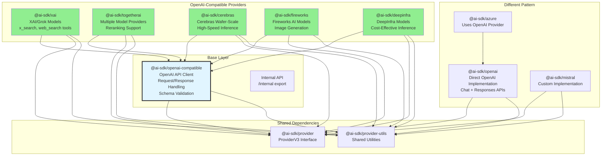
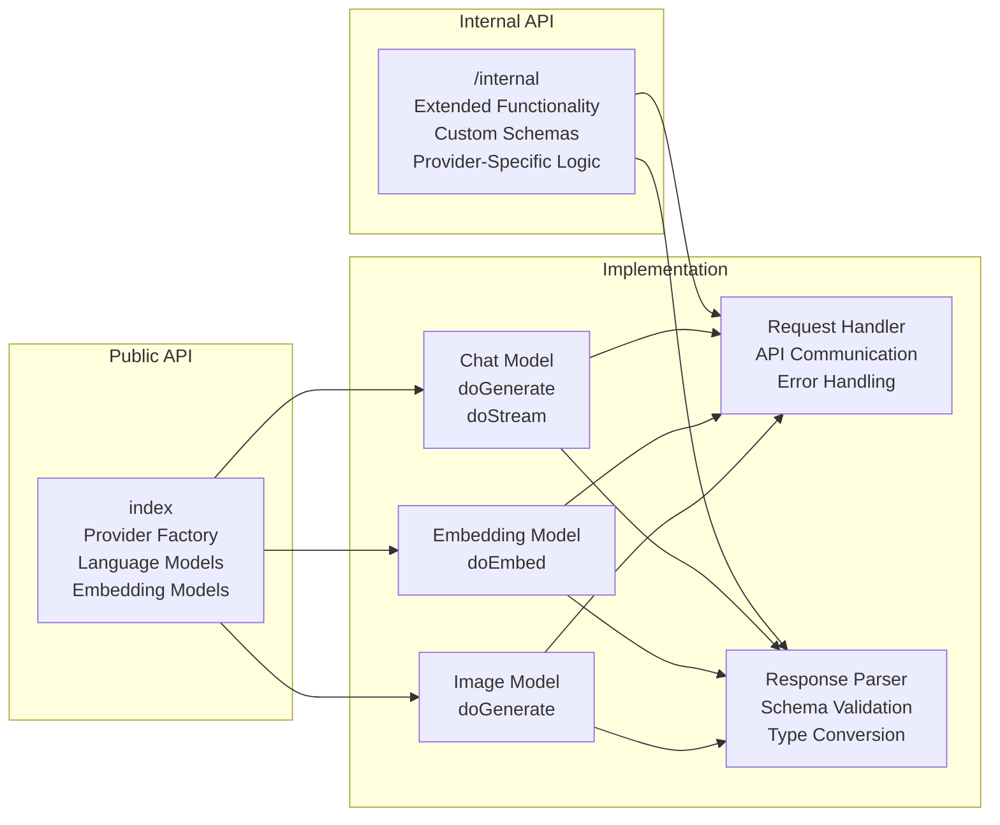
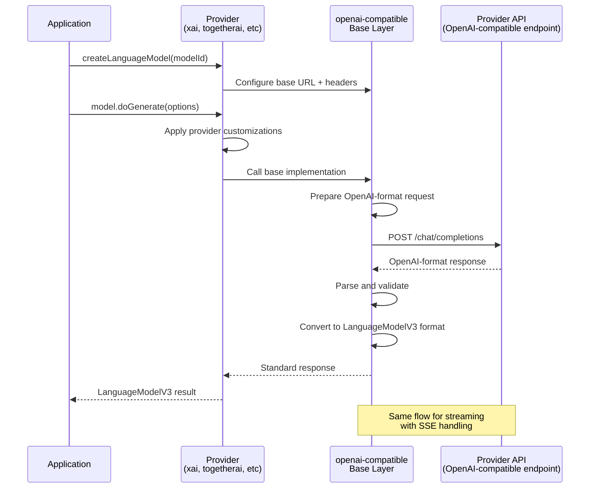
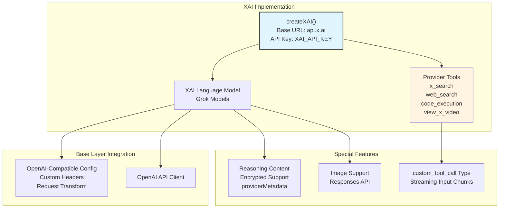
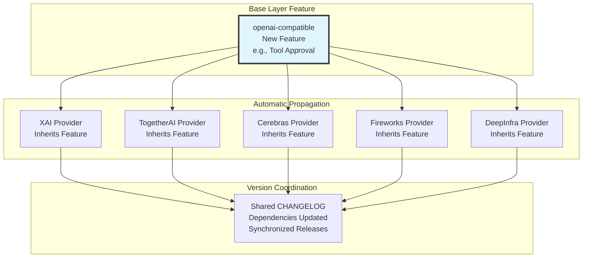
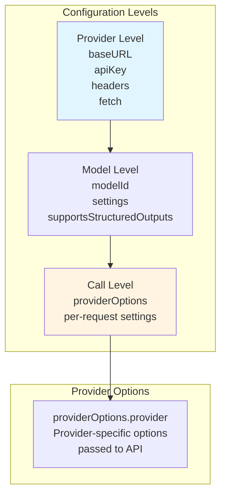
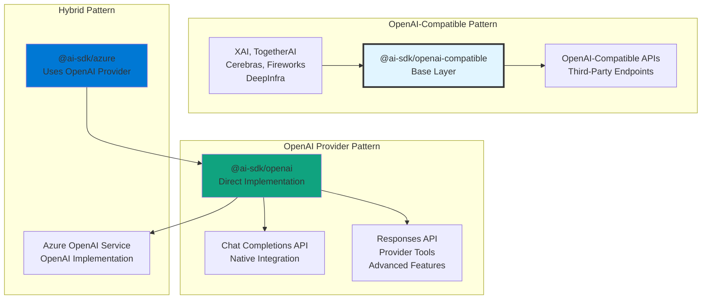

# OpenAI-Compatible Providers and Adapter Pattern

<details>
<summary>Relevant source files</summary>

The following files were used as context for generating this wiki page:

- [packages/azure/CHANGELOG.md](packages/azure/CHANGELOG.md)
- [packages/azure/package.json](packages/azure/package.json)
- [packages/cerebras/CHANGELOG.md](packages/cerebras/CHANGELOG.md)
- [packages/cerebras/package.json](packages/cerebras/package.json)
- [packages/deepinfra/CHANGELOG.md](packages/deepinfra/CHANGELOG.md)
- [packages/deepinfra/package.json](packages/deepinfra/package.json)
- [packages/deepseek/CHANGELOG.md](packages/deepseek/CHANGELOG.md)
- [packages/deepseek/package.json](packages/deepseek/package.json)
- [packages/fireworks/CHANGELOG.md](packages/fireworks/CHANGELOG.md)
- [packages/fireworks/package.json](packages/fireworks/package.json)
- [packages/mistral/CHANGELOG.md](packages/mistral/CHANGELOG.md)
- [packages/mistral/package.json](packages/mistral/package.json)
- [packages/openai-compatible/CHANGELOG.md](packages/openai-compatible/CHANGELOG.md)
- [packages/openai-compatible/package.json](packages/openai-compatible/package.json)
- [packages/openai/CHANGELOG.md](packages/openai/CHANGELOG.md)
- [packages/openai/package.json](packages/openai/package.json)
- [packages/provider-utils/CHANGELOG.md](packages/provider-utils/CHANGELOG.md)
- [packages/provider-utils/package.json](packages/provider-utils/package.json)
- [packages/togetherai/CHANGELOG.md](packages/togetherai/CHANGELOG.md)
- [packages/togetherai/package.json](packages/togetherai/package.json)
- [packages/xai/CHANGELOG.md](packages/xai/CHANGELOG.md)
- [packages/xai/package.json](packages/xai/package.json)

</details>


## Purpose and Scope

This document explains the OpenAI-compatible provider architecture in the AI SDK, which enables multiple AI service providers to share a common implementation by conforming to OpenAI's API format. The `@ai-sdk/openai-compatible` package serves as a base layer that providers like XAI, TogetherAI, Cerebras, Fireworks, and DeepInfra extend to implement their language models.

This page focuses on the adapter pattern and shared infrastructure. For information about the core OpenAI provider itself (which uses a different implementation), see [OpenAI Provider (Chat and Responses APIs)](#3.2). For general provider architecture concepts, see [Provider Architecture and V3 Specification](#3.1).

**Sources:** [packages/openai-compatible/package.json:1-74](), [packages/xai/package.json:1-68](), [packages/togetherai/package.json:1-68](), [packages/cerebras/package.json:1-70](), [packages/fireworks/package.json:1-68](), [packages/deepinfra/package.json:1-68]()

---

## Architecture Overview

The OpenAI-compatible provider system implements an adapter pattern where a shared base layer handles OpenAI API communication, and individual providers customize behavior through configuration and extension points.

### Provider Ecosystem Structure



**Key Characteristics:**
- **Base Layer:** `@ai-sdk/openai-compatible` implements OpenAI API protocol
- **Adapter Providers:** Five providers extend the base layer with minimal customization
- **Alternative Patterns:** OpenAI, Azure (via OpenAI), and Mistral use different architectures
- **Shared Infrastructure:** All providers use `@ai-sdk/provider` and `@ai-sdk/provider-utils`

**Sources:** [packages/openai-compatible/package.json:42-44](), [packages/xai/package.json:35-38](), [packages/togetherai/package.json:35-38](), [packages/cerebras/package.json:35-38](), [packages/fireworks/package.json:35-38](), [packages/deepinfra/package.json:35-38](), [packages/azure/package.json:35-38]()

---

## Base Layer: @ai-sdk/openai-compatible

The `@ai-sdk/openai-compatible` package provides core functionality for providers implementing OpenAI-compatible APIs.

### Package Structure



The package exports two APIs:
- **Main Export (`.`)**: Standard provider factory and model constructors
- **Internal Export (`./internal`)**: Extended functionality for provider-specific customizations

**Sources:** [packages/openai-compatible/package.json:28-40](), [packages/openai/package.json:28-40]()

### Feature Support

| Feature | Status | Notes |
|---------|--------|-------|
| Language Models (LanguageModelV3) | ✅ Full | Chat completions with streaming |
| Embedding Models (EmbeddingModelV3) | ✅ Full | Text embeddings |
| Image Models (ImageModelV3) | ✅ Full | Image generation and editing |
| Tool Calling | ✅ Full | Function and provider-defined tools |
| Structured Outputs | ✅ Full | JSON schema validation |
| Reasoning/Thinking | ✅ Full | Extended reasoning support |
| Streaming | ✅ Full | Server-Sent Events (SSE) |
| Multi-Modal Input | ✅ Full | Text, images, URLs |
| Tool Approval | ✅ Full | Execution gating |
| Provider Tools | Varies | Provider-specific implementation |
| Strict Mode | ✅ Full | Tool-specific strict validation |

**Sources:** [packages/openai-compatible/CHANGELOG.md:95-141]()

### API Communication Pattern



**Sources:** [packages/openai-compatible/CHANGELOG.md:1-141]()

---

## Provider Implementations

Each OpenAI-compatible provider extends the base layer with provider-specific configuration.

### XAI Provider (@ai-sdk/xai)

The XAI provider implements Grok models with provider-specific tools for X (Twitter) integration.

**Key Features:**
- **Models:** Grok-4, Grok-4-Fast, Grok-Code-Fast variants
- **Provider Tools:** `x_search`, `web_search`, `code_execution`, `view_x_video`
- **Special Handling:** Encrypted reasoning content, custom tool call types
- **Reasoning Support:** Enhanced reasoning modes with encrypted content



**Provider-Specific Configurations:**
- **API Endpoint:** `https://api.x.ai/v1`
- **Authentication:** `XAI_API_KEY` environment variable
- **Parallel Function Calling:** `parallel_function_calling` provider option
- **Response Format:** Support for object generation with `response_format`
- **Token Counting:** Adjusted for reasoning models to prevent negative text output tokens

**Sources:** [packages/xai/CHANGELOG.md:1-241](), [packages/xai/package.json:1-68]()

### TogetherAI Provider (@ai-sdk/togetherai)

TogetherAI aggregates multiple model providers with additional reranking support.

**Key Features:**
- **Multi-Provider:** Access to models from various providers
- **Reranking:** Dedicated reranking model support
- **Embedding Models:** Text embedding with shorthand names
- **Image Generation:** Image model support with editing capabilities

**Sources:** [packages/togetherai/CHANGELOG.md:107-150](), [packages/togetherai/package.json:1-68]()

### Cerebras Provider (@ai-sdk/cerebras)

Cerebras provides high-speed inference on Wafer-Scale Engines.

**Key Features:**
- **Models:** Qwen-3, GPT-OSS, Llama variants optimized for Cerebras hardware
- **Structured Outputs:** Full structured output support
- **High Performance:** Optimized for CS-3 systems

**Supported Models:**
- `gpt-oss-120b` (120B parameters)
- `qwen-3-235b-a22b-instruct-2507` (235B instruction-tuned)
- `qwen-3-235b-a22b-thinking-2507` (235B enhanced reasoning)
- `qwen-3-32b` (32B multilingual)
- `qwen-3-coder-480b` (480B code generation)
- `zai/glm-4.7` (GLM model support)

**Sources:** [packages/cerebras/CHANGELOG.md:100-162](), [packages/cerebras/package.json:1-70]()

### Fireworks Provider (@ai-sdk/fireworks)

Fireworks AI provides fast inference with image generation capabilities.

**Key Features:**
- **Language Models:** Various open-source and proprietary models
- **Image Models:** Image generation with `ImageModelV3`
- **Image Editing:** Support for image editing operations

**Sources:** [packages/fireworks/CHANGELOG.md:107-148](), [packages/fireworks/package.json:1-68]()

### DeepInfra Provider (@ai-sdk/deepinfra)

DeepInfra offers cost-effective inference for open-source models.

**Key Features:**
- **Cost-Effective:** Optimized for economical model access
- **Language Models:** Wide range of open-source models
- **Standard Features:** Full LanguageModelV3 support

**Sources:** [packages/deepinfra/CHANGELOG.md:107-148](), [packages/deepinfra/package.json:1-68]()

---

## Feature Propagation

Features implemented in the `@ai-sdk/openai-compatible` base layer automatically propagate to all dependent providers.

### Propagation Mechanism



### Recent Feature Propagations

| Feature | Base Version | Propagated To | Impact |
|---------|--------------|---------------|--------|
| Tool Approval (`e8109d3`) | v2.0.0-beta | All providers | Execution gating with `needsApproval` |
| Tool-Specific Strict Mode (`1bd7d32`) | v2.0.0-beta | All providers | Per-tool strict validation |
| Image Editing (`9061dc0`) | v2.0.0-beta | All providers | `ImageModelV3` editing operations |
| Text Verbosity (`b689220`) | v2.0.0-beta | All providers | Provider option for text verbosity |
| Loose Schema Validation (`d54c380`) | v2.0.5 | All providers | Improved non-standard API compatibility |
| Thought Signature (`cd7bb0e`) | v2.0.7 | All providers | Google models reasoning support |
| Strict JSON Schema (`bc02a3c`) | v2.0.9 | All providers | Enhanced schema validation |
| Transform Request Body (`78a133a`) | v2.0.12 | All providers | Custom request transformation |

**Sources:** [packages/openai-compatible/CHANGELOG.md:14-141](), [packages/xai/CHANGELOG.md:185-241](), [packages/togetherai/CHANGELOG.md:107-150](), [packages/cerebras/CHANGELOG.md:100-162](), [packages/fireworks/CHANGELOG.md:107-148](), [packages/deepinfra/CHANGELOG.md:107-148]()

---

## Configuration Patterns

### Provider Factory Pattern

All OpenAI-compatible providers follow a consistent factory pattern:

```typescript
// Provider instantiation pattern (conceptual)
const provider = createProvider({
  baseURL: 'https://api.provider.com/v1',
  apiKey: process.env.PROVIDER_API_KEY,
  headers: {
    // Custom headers
  }
});

const model = provider.languageModel('model-id', {
  // Model-specific settings
});
```

### Configuration Options Hierarchy



### Environment Variables

| Provider | API Key Env Var | Base URL Env Var | Default Base URL |
|----------|----------------|------------------|------------------|
| XAI | `XAI_API_KEY` | - | `https://api.x.ai/v1` |
| TogetherAI | `TOGETHER_API_KEY` | - | `https://api.together.xyz/v1` |
| Cerebras | `CEREBRAS_API_KEY` | - | `https://api.cerebras.ai/v1` |
| Fireworks | `FIREWORKS_API_KEY` | - | `https://api.fireworks.ai/inference/v1` |
| DeepInfra | `DEEPINFRA_API_KEY` | - | `https://api.deepinfra.com/v1/openai` |

**Sources:** [packages/xai/CHANGELOG.md:1-241](), [packages/togetherai/CHANGELOG.md:1-150](), [packages/cerebras/CHANGELOG.md:1-162]()

---

## Customization Points

### Provider-Specific Extensions

While the base layer provides core functionality, providers can customize behavior at specific extension points:

#### 1. Request Transformation

Providers can transform requests before sending to the API:

**Extension Point:** `transformRequestBody` function (added in v2.0.12)

**Use Case:** Modify request structure for provider-specific requirements

**Sources:** [packages/openai-compatible/CHANGELOG.md:14-16]()

#### 2. Response Schema Validation

Providers can use custom schemas for validation:

**Extension Point:** Response schema configuration

**Use Case:** Handle provider-specific response formats (loose vs strict objects)

**Example:** XAI uses custom schemas for `custom_tool_call` types

**Sources:** [packages/openai-compatible/CHANGELOG.md:59-62](), [packages/xai/CHANGELOG.md:149-153]()

#### 3. Provider Tools

Providers can define custom provider-executed tools:

**XAI Provider Tools:**
- `x_search`: Search X (Twitter) content
- `web_search`: General web search
- `code_execution`: Execute code server-side
- `view_x_video`: View X video content

**Tool Definition Pattern:**
```typescript
// Conceptual tool definition
providerTools: {
  x_search: {
    type: 'provider',
    name: 'x_search',
    schema: { /* Zod schema */ }
  }
}
```

**Sources:** [packages/xai/CHANGELOG.md:117-119]()

#### 4. Reasoning/Thinking Modes

Providers can customize reasoning behavior:

**XAI Implementation:**
- Encrypted reasoning content support
- Custom `providerMetadata` structure
- Reasoning-end before text-start in streaming

**Sources:** [packages/xai/CHANGELOG.md:87-101]()

#### 5. Token Usage Calculation

Providers can adjust token counting logic:

**XAI Example:** Corrects token counting for reasoning models to prevent negative `text_output_tokens`

**Sources:** [packages/xai/CHANGELOG.md:143-145]()

---

## Comparison with OpenAI Provider

### Architectural Differences



### Feature Comparison Table

| Aspect | @ai-sdk/openai | @ai-sdk/openai-compatible |
|--------|----------------|---------------------------|
| **Implementation** | Custom, OpenAI-specific | Generic, adaptable |
| **APIs Supported** | Chat Completions + Responses | Chat Completions (OpenAI format) |
| **Provider Tools** | OpenAI native (code_interpreter, file_search, web_search, image_generation, shell, apply_patch) | Provider-specific (varies by provider) |
| **Responses API** | ✅ Full support | ❌ Not applicable |
| **Image Generation** | DALL-E models | Provider-specific models |
| **Speech/Transcription** | Whisper, TTS | ❌ Not supported |
| **File Handling** | OpenAI Files API integration | Limited (varies by provider) |
| **Reasoning Modes** | GPT-5/o-series native reasoning | Provider-specific reasoning |
| **Internal Export** | Yes, for Azure reuse | Yes, for provider extensions |
| **Configuration** | OpenAI-specific options | Generic OpenAI-compatible options |

**Sources:** [packages/openai/CHANGELOG.md:1-200](), [packages/openai-compatible/CHANGELOG.md:1-141](), [packages/azure/CHANGELOG.md:1-163]()

### When to Use Each Pattern

**Use @ai-sdk/openai when:**
- Targeting OpenAI or Azure OpenAI specifically
- Need Responses API features (advanced provider tools, conversations API)
- Require OpenAI-specific models (GPT-5, DALL-E, Whisper, TTS)
- Need tight integration with OpenAI Files API

**Use @ai-sdk/openai-compatible when:**
- Building a provider for an OpenAI-compatible API
- Need to minimize implementation effort
- API follows standard OpenAI format
- Provider-specific customization is minimal

**Create custom implementation when:**
- API differs significantly from OpenAI format (e.g., Mistral)
- Need specialized features not in OpenAI format
- Performance optimizations require custom code

**Sources:** [packages/openai/package.json:1-74](), [packages/openai-compatible/package.json:1-74](), [packages/mistral/package.json:1-67]()

---

## Version Coordination

### Dependency Management

OpenAI-compatible providers use workspace protocol to depend on the base layer:

```json
// Pattern in provider package.json
"dependencies": {
  "@ai-sdk/openai-compatible": "workspace:*",
  "@ai-sdk/provider": "workspace:*",
  "@ai-sdk/provider-utils": "workspace:*"
}
```

This ensures all providers in the monorepo use the same version of the base layer during development.

### Release Coordination

When a new feature is added to `@ai-sdk/openai-compatible`:

1. **Base Layer Update:** Feature implemented in base package
2. **Version Bump:** Base layer version incremented
3. **Dependent Updates:** All providers automatically reference new version
4. **Synchronized Release:** Providers released together with base layer
5. **Changelog Propagation:** Feature appears in all provider changelogs

**Example Release Flow (Tool Approval Feature):**

| Package | Change | Version |
|---------|--------|---------|
| @ai-sdk/openai-compatible | Added tool approval (`e8109d3`) | 2.0.0-beta |
| @ai-sdk/xai | Updated dependency | 2.0.0-beta.8 |
| @ai-sdk/togetherai | Updated dependency | 2.0.0-beta |
| @ai-sdk/cerebras | Updated dependency | 2.0.0-beta |
| @ai-sdk/fireworks | Updated dependency | 2.0.0-beta |
| @ai-sdk/deepinfra | Updated dependency | 2.0.0-beta |

**Sources:** [packages/xai/package.json:35-38](), [packages/xai/CHANGELOG.md:185-241](), [packages/openai-compatible/CHANGELOG.md:125-128]()

---

## Implementation Guidelines

### Creating a New OpenAI-Compatible Provider

To create a new provider using the OpenAI-compatible base:

**Step 1: Package Setup**
```json
// package.json structure
{
  "name": "@ai-sdk/your-provider",
  "dependencies": {
    "@ai-sdk/openai-compatible": "workspace:*",
    "@ai-sdk/provider": "workspace:*",
    "@ai-sdk/provider-utils": "workspace:*"
  }
}
```

**Step 2: Provider Factory**
- Import base implementation from `@ai-sdk/openai-compatible`
- Configure base URL and authentication
- Add provider-specific headers if needed

**Step 3: Model Configuration**
- Define supported model IDs
- Configure model capabilities (structured outputs, tools, reasoning)
- Set default parameters

**Step 4: Provider-Specific Extensions**
- Define custom provider tools (if applicable)
- Implement request/response transformations (if needed)
- Add provider metadata handling

**Step 5: Testing**
- Test with standard OpenAI-compatible endpoints
- Verify feature compatibility
- Test provider-specific extensions

**Sources:** [packages/xai/package.json:1-68](), [packages/cerebras/package.json:1-70]()

### Best Practices

1. **Minimize Customization:** Use base implementation as-is when possible
2. **Document Differences:** Clearly document any deviations from OpenAI format
3. **Test Compatibility:** Ensure standard OpenAI clients work with your provider
4. **Handle Errors Gracefully:** Use loose schemas when provider returns non-standard responses
5. **Version Coordination:** Keep dependencies synchronized with base layer

**Sources:** [packages/openai-compatible/CHANGELOG.md:59-62]()