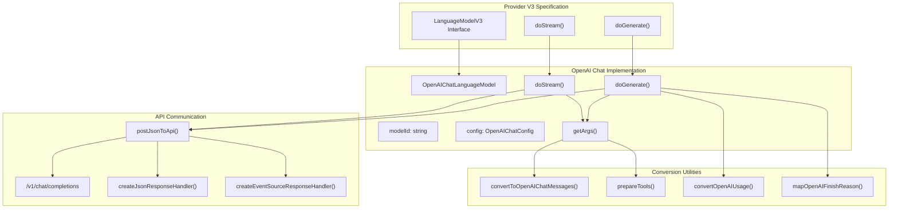
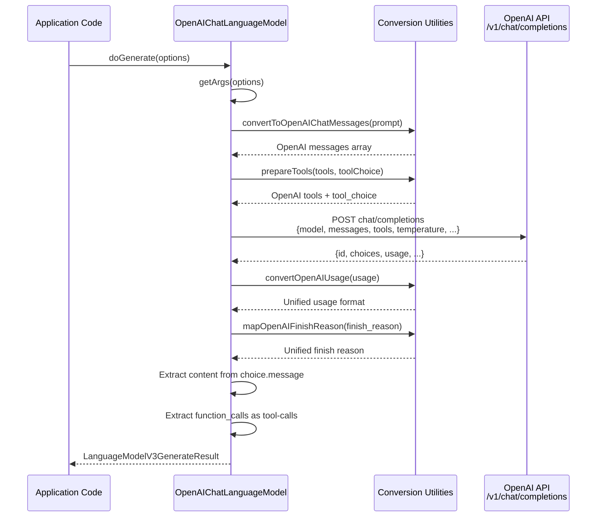
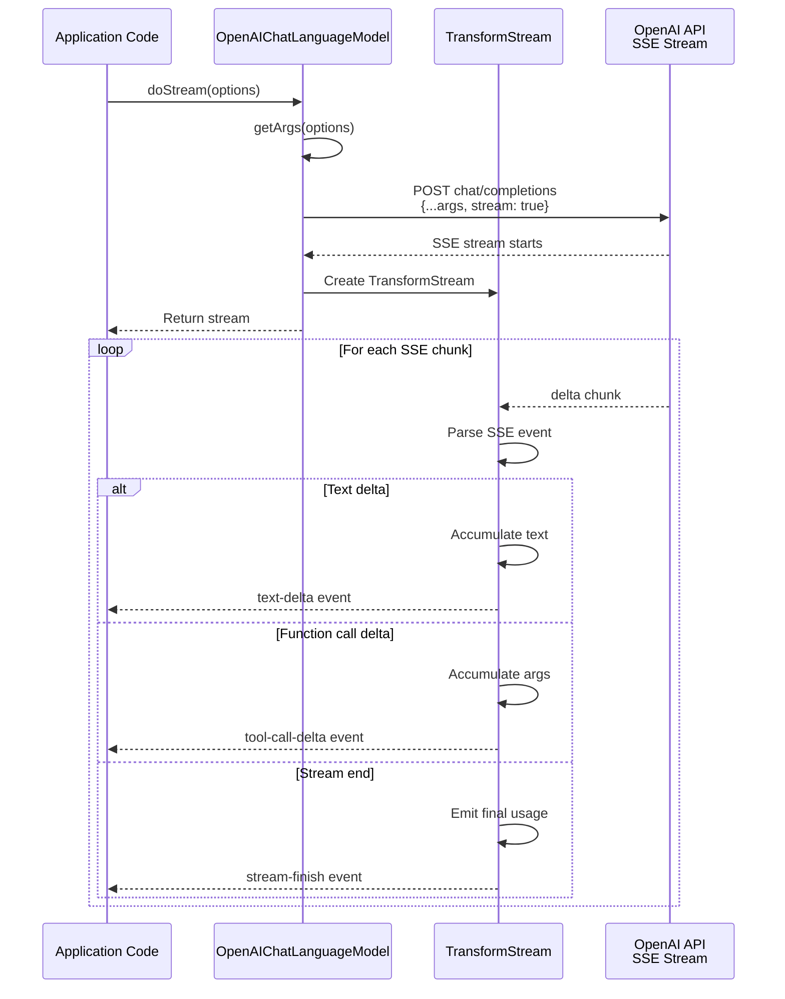
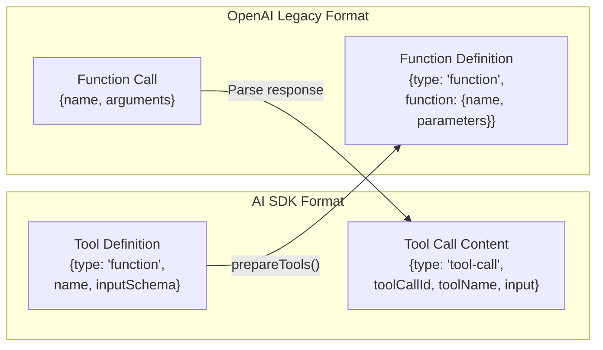
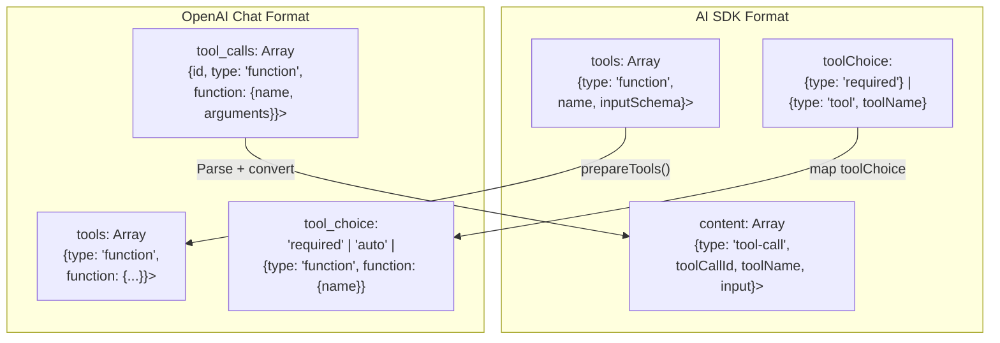
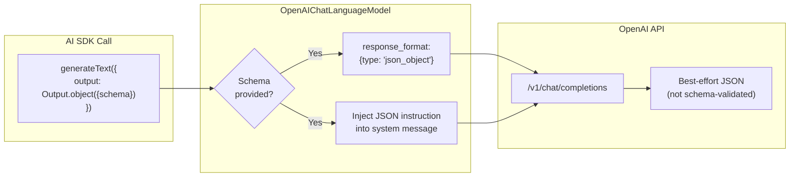
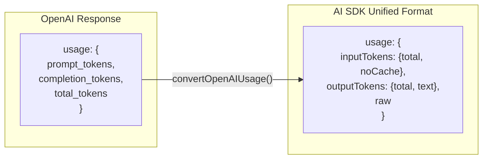
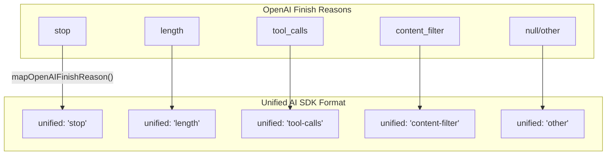
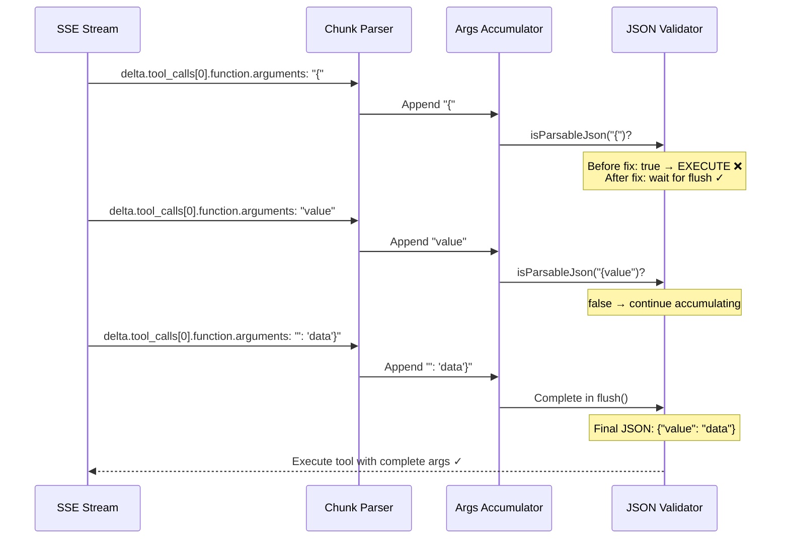

# OpenAI Provider - Chat Completions API

<details>
<summary>Relevant source files</summary>

The following files were used as context for generating this wiki page:

- [content/providers/01-ai-sdk-providers/20-mistral.mdx](content/providers/01-ai-sdk-providers/20-mistral.mdx)
- [content/providers/01-ai-sdk-providers/25-cohere.mdx](content/providers/01-ai-sdk-providers/25-cohere.mdx)
- [packages/azure/CHANGELOG.md](packages/azure/CHANGELOG.md)
- [packages/azure/package.json](packages/azure/package.json)
- [packages/cohere/src/**snapshots**/cohere-embedding-model.test.ts.snap](packages/cohere/src/__snapshots__/cohere-embedding-model.test.ts.snap)
- [packages/cohere/src/cohere-chat-language-model.test.ts](packages/cohere/src/cohere-chat-language-model.test.ts)
- [packages/cohere/src/cohere-chat-language-model.ts](packages/cohere/src/cohere-chat-language-model.ts)
- [packages/cohere/src/cohere-embedding-model.test.ts](packages/cohere/src/cohere-embedding-model.test.ts)
- [packages/cohere/src/cohere-embedding-model.ts](packages/cohere/src/cohere-embedding-model.ts)
- [packages/cohere/src/cohere-embedding-options.ts](packages/cohere/src/cohere-embedding-options.ts)
- [packages/cohere/src/cohere-provider.ts](packages/cohere/src/cohere-provider.ts)
- [packages/mistral/CHANGELOG.md](packages/mistral/CHANGELOG.md)
- [packages/mistral/package.json](packages/mistral/package.json)
- [packages/mistral/src/mistral-chat-language-model.test.ts](packages/mistral/src/mistral-chat-language-model.test.ts)
- [packages/mistral/src/mistral-chat-language-model.ts](packages/mistral/src/mistral-chat-language-model.ts)
- [packages/mistral/src/mistral-chat-options.ts](packages/mistral/src/mistral-chat-options.ts)
- [packages/openai/CHANGELOG.md](packages/openai/CHANGELOG.md)
- [packages/openai/package.json](packages/openai/package.json)
- [packages/provider-utils/CHANGELOG.md](packages/provider-utils/CHANGELOG.md)
- [packages/provider-utils/package.json](packages/provider-utils/package.json)

</details>

This document describes the **OpenAIChatLanguageModel** implementation in the `@ai-sdk/openai` package, which uses OpenAI's standard Chat Completions API endpoint (`/v1/chat/completions`). This is the traditional OpenAI API that has been available since the introduction of ChatGPT.

For information about the newer Responses API implementation with provider-defined tools and reasoning models, see [OpenAI Provider - Responses API](#3.2). For general OpenAI provider configuration and setup, both APIs share the same provider instance creation.

**Scope**: This page covers the `OpenAIChatLanguageModel` class, its request/response handling, function calling (OpenAI's term for tool usage), parallel tool calls, legacy JSON mode, and the differences from the Responses API implementation.

---

## Architecture Overview

The Chat Completions API implementation follows the Provider-V3 specification through the `OpenAIChatLanguageModel` class, which implements the `LanguageModelV3` interface.

### OpenAIChatLanguageModel Class Structure



**Diagram: OpenAIChatLanguageModel implements LanguageModelV3 and delegates to OpenAI's chat completions endpoint**

**Sources**: [packages/openai/package.json:1-85](), [packages/openai/CHANGELOG.md:1-100]()

---

## Request and Response Flow

### Non-Streaming Generation (doGenerate)

The `doGenerate` method converts the AI SDK prompt format to OpenAI's chat completions format, sends the request, and parses the response.



**Diagram: Non-streaming request/response flow for OpenAIChatLanguageModel**

The response contains a single `choices` array with the assistant's message, which may include:

- `content` (text)
- `function_call` (legacy single tool call)
- `tool_calls` (parallel tool calls)

**Sources**: [packages/openai/CHANGELOG.md:38-100](), [packages/mistral/src/mistral-chat-language-model.ts:175-255]()

---

### Streaming Generation (doStream)

Streaming uses Server-Sent Events (SSE) to receive incremental updates, enabling real-time UI updates as the model generates content.



**Diagram: Server-Sent Events streaming flow for incremental response generation**

Streaming chunks include:

- `delta.content` for text increments
- `delta.function_call` or `delta.tool_calls` for tool call increments
- Final chunk with `finish_reason` and `usage`

**Sources**: [packages/mistral/src/mistral-chat-language-model.ts:257-450](), [packages/openai/CHANGELOG.md:1-100]()

---

## Function Calling vs Tool Calling

OpenAI uses the term "function calling" for what the AI SDK calls "tool usage". The Chat Completions API supports two formats:

### Legacy Function Call Format



**Diagram: Legacy single function call format (deprecated)**

### Modern Tool Calls Format (Parallel)



**Diagram: Modern parallel tool calls format with multiple simultaneous function invocations**

The parallel tool calls format allows the model to invoke multiple tools in a single response, improving efficiency for complex multi-step operations.

**Sources**: [packages/openai/CHANGELOG.md:1-100](), [packages/mistral/src/mistral-prepare-tools.ts:1-150]()

---

## Structured Outputs and JSON Mode

### Legacy JSON Mode

The Chat Completions API supports a legacy JSON mode via `response_format: { type: 'json_object' }`, which instructs the model to output valid JSON without schema enforcement:

| Feature                | Chat Completions JSON Mode                        | Responses API Structured Output        |
| ---------------------- | ------------------------------------------------- | -------------------------------------- |
| **Endpoint Parameter** | `response_format.type = 'json_object'`            | `response_format.type = 'json_schema'` |
| **Schema Enforcement** | None (model best-effort)                          | Strict schema validation               |
| **Provider Support**   | Chat Completions only                             | Responses API only                     |
| **SDK Integration**    | Via `responseFormat.type = 'json'` without schema | Automatic when schema provided         |

**Table: Comparison of JSON output modes in OpenAI APIs**

When using `Output.json()` or `Output.object()` without strict mode, the Chat Completions API uses the legacy JSON mode:



**Diagram: Legacy JSON mode flow with instruction injection for best-effort JSON output**

The SDK injects additional instructions into the prompt to guide the model toward the desired schema, but the API does not enforce it.

**Sources**: [packages/openai/CHANGELOG.md:89-100](), [packages/mistral/src/mistral-chat-language-model.ts:109-114]()

---

## Request Body Structure

The `getArgs()` method constructs the request body sent to the chat completions endpoint:

| Parameter             | AI SDK Source       | OpenAI Parameter    | Notes                                         |
| --------------------- | ------------------- | ------------------- | --------------------------------------------- |
| **model**             | Constructor modelId | `model`             | e.g., "gpt-4o", "gpt-3.5-turbo"               |
| **messages**          | `prompt`            | `messages`          | Converted via `convertToOpenAIChatMessages()` |
| **max_tokens**        | `maxOutputTokens`   | `max_tokens`        | Maximum tokens to generate                    |
| **temperature**       | `temperature`       | `temperature`       | 0.0 to 2.0                                    |
| **top_p**             | `topP`              | `top_p`             | Nucleus sampling                              |
| **frequency_penalty** | `frequencyPenalty`  | `frequency_penalty` | -2.0 to 2.0                                   |
| **presence_penalty**  | `presencePenalty`   | `presence_penalty`  | -2.0 to 2.0                                   |
| **stop**              | `stopSequences`     | `stop`              | Up to 4 sequences                             |
| **seed**              | `seed`              | `seed`              | Deterministic sampling                        |
| **tools**             | `tools`             | `tools`             | Function definitions                          |
| **tool_choice**       | `toolChoice`        | `tool_choice`       | auto/required/none/specific                   |
| **response_format**   | `responseFormat`    | `response_format`   | JSON mode configuration                       |

**Table: Mapping of AI SDK call options to OpenAI Chat Completions API parameters**

Additional provider-specific options can be passed via `providerOptions.openai`:

```typescript
// From OpenAIChatLanguageModelOptions type
providerOptions: {
  openai: {
    user: 'user-identifier',           // User tracking
    logprobs: true,                     // Return log probabilities
    top_logprobs: 5,                    // Number of top tokens
    logit_bias: { '1234': -100 },      // Token bias adjustments
    parallel_tool_calls: false,         // Disable parallel tools
  }
}
```

**Sources**: [packages/openai/CHANGELOG.md:387-401](), [packages/mistral/src/mistral-chat-language-model.ts:64-173]()

---

## Response Metadata and Usage

### Usage Tracking

The Chat Completions API returns token usage in the response, which the SDK converts to a unified format:



**Diagram: Token usage conversion from OpenAI format to unified AI SDK format**

The unified format distinguishes between input and output tokens, with support for caching metadata in Responses API models.

### Response Metadata

The `response` object in the result contains:

| Field       | Description                                   |
| ----------- | --------------------------------------------- |
| `id`        | Unique completion ID from OpenAI              |
| `model`     | Actual model used (may differ from requested) |
| `timestamp` | Response creation timestamp                   |
| `headers`   | Raw HTTP response headers                     |
| `body`      | Raw response body for debugging               |

**Table: Response metadata fields available in LanguageModelV3GenerateResult**

**Sources**: [packages/mistral/src/convert-mistral-usage.ts:1-50](), [packages/cohere/src/convert-cohere-usage.ts:1-30]()

---

## Differences from Responses API

The Chat Completions API and Responses API serve different use cases:

| Feature                    | Chat Completions API      | Responses API                                               |
| -------------------------- | ------------------------- | ----------------------------------------------------------- |
| **Endpoint**               | `/v1/chat/completions`    | `/v1/responses`                                             |
| **Model Class**            | `OpenAIChatLanguageModel` | `OpenAIResponsesLanguageModel`                              |
| **Tool Terminology**       | Function calling          | Tool usage                                                  |
| **Provider-Defined Tools** | Not supported             | Supported (web_search, file_search, code_interpreter, etc.) |
| **Reasoning Models**       | Limited                   | Full support (o1, o3, gpt-5 series)                         |
| **Structured Outputs**     | Legacy JSON mode          | Strict schema validation                                    |
| **Store/ConversationID**   | Not available             | Available for conversation persistence                      |
| **Phase Metadata**         | Not available             | Available (commentary/final_answer)                         |
| **Multi-turn Reasoning**   | Manual implementation     | Automatic with encrypted_content                            |

**Table: Key differences between Chat Completions and Responses API implementations**

The Chat Completions API is suitable for:

- Standard chat applications
- Legacy codebases using function calling
- Models without reasoning capabilities (gpt-3.5-turbo, gpt-4, etc.)

The Responses API should be used for:

- Reasoning models (o1, o3, gpt-5 series)
- Provider-defined tools (web search, code execution)
- Advanced features like conversation storage

**Sources**: [packages/openai/CHANGELOG.md:1-500](), [packages/azure/CHANGELOG.md:1-100]()

---

## Error Handling and Finish Reasons

### Finish Reason Mapping

The Chat Completions API uses different finish reason strings than the unified AI SDK format:



**Diagram: Finish reason normalization from OpenAI to unified format**

The raw finish reason is always available via `finishReason.raw` for provider-specific handling.

### Error Responses

Chat Completions API errors are handled via `mistralFailedResponseHandler` (shared pattern across providers):

| HTTP Status | Error Type      | Common Cause                        |
| ----------- | --------------- | ----------------------------------- |
| 400         | Invalid Request | Malformed parameters, invalid model |
| 401         | Unauthorized    | Invalid API key                     |
| 403         | Forbidden       | Insufficient permissions            |
| 404         | Not Found       | Invalid model or endpoint           |
| 429         | Rate Limited    | Quota exceeded                      |
| 500         | Server Error    | OpenAI service issue                |

**Table: Common HTTP error statuses from OpenAI Chat Completions API**

**Sources**: [packages/mistral/src/map-mistral-finish-reason.ts:1-50](), [packages/openai/CHANGELOG.md:1-100]()

---

## Headers and Authentication

### Request Headers

The provider sends the following headers with each request:

| Header          | Value                      | Purpose              |
| --------------- | -------------------------- | -------------------- |
| `Authorization` | `Bearer ${apiKey}`         | API authentication   |
| `Content-Type`  | `application/json`         | JSON request body    |
| `User-Agent`    | `ai-sdk/openai/${VERSION}` | SDK version tracking |
| Custom headers  | From provider config       | Additional metadata  |

**Table: Standard and custom headers sent with Chat Completions requests**

Headers can be customized at provider creation or per-request:

```typescript
// Provider-level headers
const openai = createOpenAI({
  headers: { 'X-Custom-Header': 'value' },
})

// Request-level headers
await generateText({
  model: openai.chat('gpt-4o'),
  headers: { 'X-Request-ID': 'abc123' },
})
```

**Sources**: [packages/mistral/src/mistral-chat-language-model.test.ts:156-184](), [packages/openai/package.json:1-85]()

---

## Streaming Tool Calls Security

A recent security fix addresses premature tool call finalization during streaming:



**Diagram: Streaming tool call argument accumulation with security fix**

The fix ensures tool calls only execute after the stream is fully consumed, preventing execution with incomplete arguments if partial JSON happens to be valid.

**Sources**: [packages/openai/CHANGELOG.md:7-9]()
