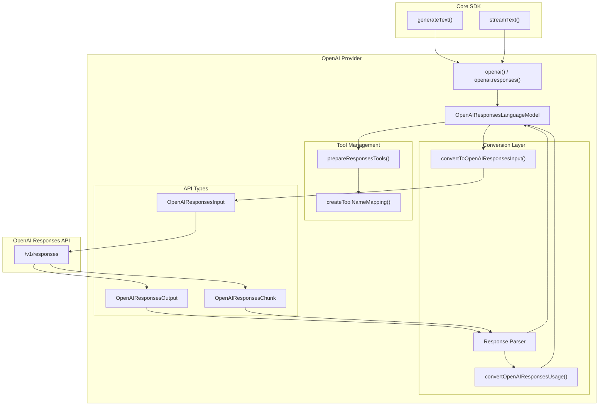
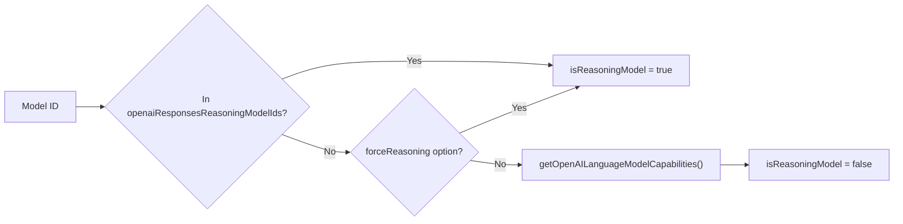
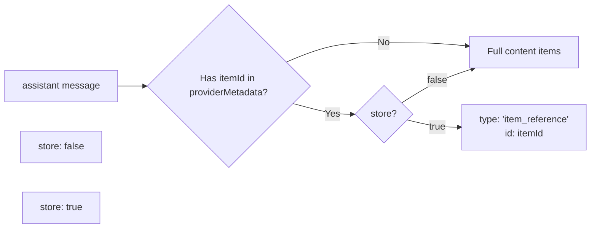
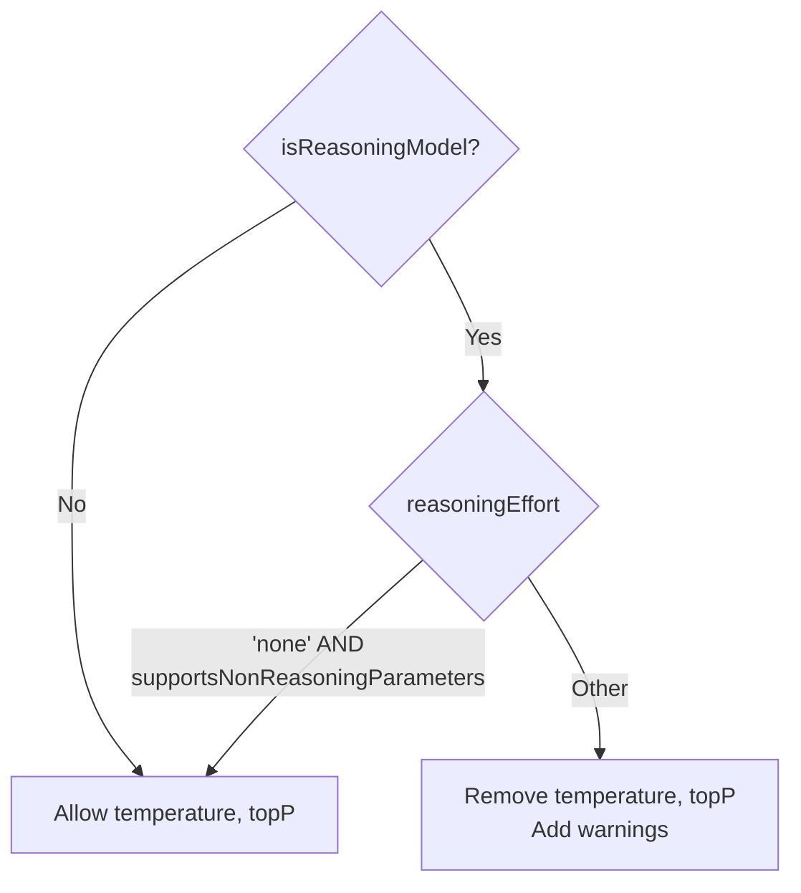
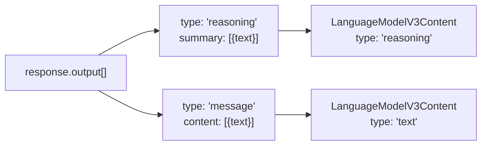
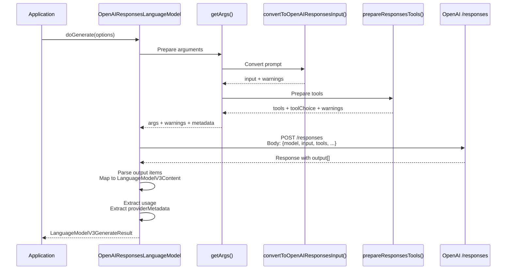
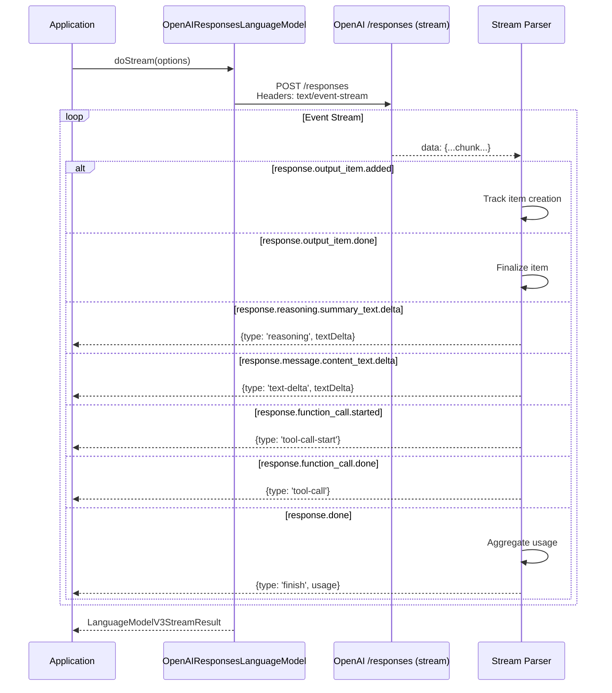
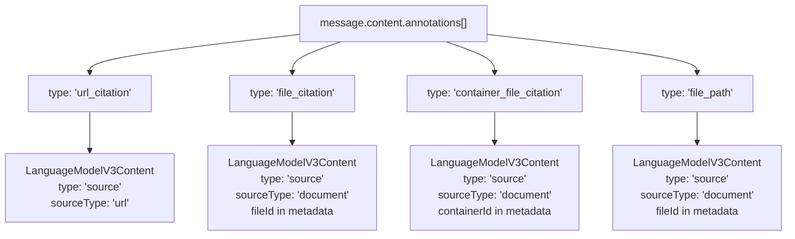

# OpenAI Provider - Responses API

<details>
<summary>Relevant source files</summary>

The following files were used as context for generating this wiki page:

- [content/providers/01-ai-sdk-providers/03-openai.mdx](content/providers/01-ai-sdk-providers/03-openai.mdx)
- [examples/ai-functions/src/stream-text/openai/phase.ts](examples/ai-functions/src/stream-text/openai/phase.ts)
- [packages/azure/CHANGELOG.md](packages/azure/CHANGELOG.md)
- [packages/azure/package.json](packages/azure/package.json)
- [packages/mistral/CHANGELOG.md](packages/mistral/CHANGELOG.md)
- [packages/mistral/package.json](packages/mistral/package.json)
- [packages/openai/CHANGELOG.md](packages/openai/CHANGELOG.md)
- [packages/openai/package.json](packages/openai/package.json)
- [packages/openai/src/openai-tools.ts](packages/openai/src/openai-tools.ts)
- [packages/openai/src/responses/**fixtures**/openai-phase.1.chunks.txt](packages/openai/src/responses/__fixtures__/openai-phase.1.chunks.txt)
- [packages/openai/src/responses/**fixtures**/openai-phase.1.json](packages/openai/src/responses/__fixtures__/openai-phase.1.json)
- [packages/openai/src/responses/**fixtures**/openai-web-search-tool.1.chunks.txt](packages/openai/src/responses/__fixtures__/openai-web-search-tool.1.chunks.txt)
- [packages/openai/src/responses/**fixtures**/openai-web-search-tool.1.json](packages/openai/src/responses/__fixtures__/openai-web-search-tool.1.json)
- [packages/openai/src/responses/**snapshots**/openai-responses-language-model.test.ts.snap](packages/openai/src/responses/__snapshots__/openai-responses-language-model.test.ts.snap)
- [packages/openai/src/responses/convert-to-openai-responses-input.test.ts](packages/openai/src/responses/convert-to-openai-responses-input.test.ts)
- [packages/openai/src/responses/convert-to-openai-responses-input.ts](packages/openai/src/responses/convert-to-openai-responses-input.ts)
- [packages/openai/src/responses/openai-responses-api.test.ts](packages/openai/src/responses/openai-responses-api.test.ts)
- [packages/openai/src/responses/openai-responses-api.ts](packages/openai/src/responses/openai-responses-api.ts)
- [packages/openai/src/responses/openai-responses-language-model.test.ts](packages/openai/src/responses/openai-responses-language-model.test.ts)
- [packages/openai/src/responses/openai-responses-language-model.ts](packages/openai/src/responses/openai-responses-language-model.ts)
- [packages/openai/src/responses/openai-responses-prepare-tools.test.ts](packages/openai/src/responses/openai-responses-prepare-tools.test.ts)
- [packages/openai/src/responses/openai-responses-prepare-tools.ts](packages/openai/src/responses/openai-responses-prepare-tools.ts)
- [packages/openai/src/responses/openai-responses-provider-metadata.ts](packages/openai/src/responses/openai-responses-provider-metadata.ts)
- [packages/openai/src/tool/file-search.ts](packages/openai/src/tool/file-search.ts)
- [packages/openai/src/tool/image-generation.ts](packages/openai/src/tool/image-generation.ts)
- [packages/openai/src/tool/web-search-preview.ts](packages/openai/src/tool/web-search-preview.ts)
- [packages/openai/src/tool/web-search.ts](packages/openai/src/tool/web-search.ts)
- [packages/provider-utils/CHANGELOG.md](packages/provider-utils/CHANGELOG.md)
- [packages/provider-utils/package.json](packages/provider-utils/package.json)

</details>

## Purpose and Scope

This document covers the OpenAI Responses API integration within the AI SDK's `@ai-sdk/openai` package. The Responses API is OpenAI's newer generation API that supports advanced models including GPT-5.x, o1, o3, and o4 series. It has been the default API for the OpenAI provider since AI SDK version 5.

The Responses API differs from the Chat Completions API (covered in [3.3](#3.3)) in its support for reasoning models, enhanced provider-defined tools, and conversation continuity features. It uses a structured input/output format with item-based message representation and includes built-in support for tools like web search, code interpretation, and file search that execute server-side.

**Sources:** [packages/openai/src/responses/openai-responses-language-model.ts:1-96](), [content/providers/01-ai-sdk-providers/03-openai.mdx:129-138]()

## Architecture Overview

The Responses API implementation follows the LanguageModelV3 specification and integrates with the core SDK through a dedicated model class and supporting conversion utilities.



**Sources:** [packages/openai/src/responses/openai-responses-language-model.ts:97-107](), [packages/openai/src/responses/convert-to-openai-responses-input.ts:39-64](), [packages/openai/src/responses/openai-responses-prepare-tools.ts:15-27]()

## Core Implementation: OpenAIResponsesLanguageModel

The `OpenAIResponsesLanguageModel` class implements the `LanguageModelV3` interface and serves as the primary entry point for Responses API interactions.

### Class Structure

| Property               | Type                       | Description                                   |
| ---------------------- | -------------------------- | --------------------------------------------- |
| `specificationVersion` | `'v3'`                     | Identifies this as a V3 provider              |
| `modelId`              | `OpenAIResponsesModelId`   | The specific model identifier                 |
| `provider`             | `string`                   | Provider name (typically "openai" or "azure") |
| `supportedUrls`        | `Record<string, RegExp[]>` | URL patterns for images and PDFs              |

**Key Methods:**

- `doGenerate()`: Executes non-streaming generation requests
- `doStream()`: Executes streaming generation requests
- `getArgs()`: Prepares request arguments with validation and warnings

**Sources:** [packages/openai/src/responses/openai-responses-language-model.ts:97-117](), [packages/openai/src/responses/openai-responses-language-model.ts:118-432]()

### Model ID Detection

The implementation maintains lists of model IDs to determine model capabilities:



Reasoning models include: `o1`, `o3`, `o4-mini`, `gpt-5`, `gpt-5-mini`, `gpt-5-nano`, `gpt-5.1`, `gpt-5.2` and their dated variants.

**Sources:** [packages/openai/src/responses/openai-responses-options.ts:13-82](), [packages/openai/src/responses/openai-responses-language-model.ts:134-175]()

## Input Conversion Pipeline

The `convertToOpenAIResponsesInput()` function transforms the SDK's unified message format into the Responses API's item-based structure.

```mermaid
graph TB
    subgraph "SDK Format"
        Prompt["LanguageModelV3Prompt"]
        SystemMsg["system messages"]
        UserMsg["user messages"]
        AssistantMsg["assistant messages"]
        ToolCall["tool-call parts"]
        ToolResult["tool-result parts"]
    end

    subgraph "Conversion Logic"
        SystemMode{"systemMessageMode"}
        FileIdCheck{"isFileId()?"}
        StoreCheck{"store = true?"}

        MessageConverter["Message Converter"]
        ToolConverter["Tool Result Converter"]
        ReferenceBuilder["Item Reference Builder"]
    end

    subgraph "Responses API Format"
        SystemItem["OpenAIResponsesSystemMessage"]
        DeveloperItem["role: 'developer'"]
        UserItem["OpenAIResponsesUserMessage"]
        AssistantItem["OpenAIResponsesAssistantMessage"]
        FunctionCall["OpenAIResponsesFunctionCall"]
        FunctionOutput["OpenAIResponsesFunctionCallOutput"]
        ItemRef["OpenAIResponsesItemReference"]
        ShellCall["OpenAIResponsesShellCall"]
        ShellOutput["OpenAIResponsesShellCallOutput"]
    end

    Prompt --> MessageConverter

    SystemMsg --> SystemMode
    SystemMode -->|"system"| SystemItem
    SystemMode -->|"developer"| DeveloperItem
    SystemMode -->|"remove"| MessageConverter

    UserMsg --> FileIdCheck
    FileIdCheck -->|"Yes"| UserItem
    FileIdCheck -->|"No (base64)"| UserItem

    AssistantMsg --> StoreCheck
    StoreCheck -->|"Yes + has itemId"| ItemRef
    StoreCheck -->|"No"| AssistantItem

    ToolCall --> ToolConverter
    ToolResult --> ToolConverter

    ToolConverter --> FunctionCall
    ToolConverter --> FunctionOutput
    ToolConverter --> ShellCall
    ToolConverter --> ShellOutput

    AssistantMsg --> ReferenceBuilder
    ReferenceBuilder --> ItemRef
```



### System Message Handling

The conversion supports three modes for system messages:

| Mode        | Target Role | Use Case                                     |
| ----------- | ----------- | -------------------------------------------- |
| `system`    | `system`    | Standard models                              |
| `developer` | `developer` | Reasoning models (default for o1, o3, gpt-5) |
| `remove`    | _(omitted)_ | Models that don't support system messages    |

**Sources:** [packages/openai/src/responses/convert-to-openai-responses-input.ts:70-95](), [packages/openai/src/responses/openai-responses-language-model.ts:203-208]()

### File ID Detection

The converter supports file IDs from OpenAI's Files API:

```typescript
// Detection based on configurable prefixes
function isFileId(data: string, prefixes?: readonly string[]): boolean {
  if (!prefixes) return false
  return prefixes.some((prefix) => data.startsWith(prefix))
}
```

Default prefixes: `['file-']` for OpenAI, `['file-', 'assistant-']` for Azure.

When detected, the converter uses `file_id` instead of encoding as base64.

**Sources:** [packages/openai/src/responses/convert-to-openai-responses-input.ts:33-37](), [packages/openai/src/responses/convert-to-openai-responses-input.ts:115-142]()

### Item References for Conversation Continuity

When `store: true` (default) and assistant messages contain `providerMetadata` with `itemId`, the converter generates item references instead of duplicating content:



This enables efficient conversation continuity with `previousResponseId` or `conversation` options.

**Sources:** [packages/openai/src/responses/convert-to-openai-responses-input.ts:278-384](), [packages/openai/src/responses/openai-responses-language-model.ts:181-183]()

## Tool Support

The Responses API supports both user-defined and provider-defined tools. Provider-defined tools execute server-side within OpenAI's infrastructure.

### Tool Categories

```mermaid
graph TB
    subgraph "User-Defined Tools"
        FunctionTool["type: 'function'<br/>Client-side execution"]
    end

    subgraph "Provider-Defined Tools"
        WebSearch["openai.tools.webSearch<br/>web_search"]
        WebSearchPreview["openai.tools.webSearchPreview<br/>web_search_preview"]
        FileSearch["openai.tools.fileSearch<br/>file_search"]
        CodeInterpreter["openai.tools.codeInterpreter<br/>code_interpreter"]
        ImageGen["openai.tools.imageGeneration<br/>image_generation"]
        LocalShell["openai.tools.localShell<br/>local_shell"]
        Shell["openai.tools.shell<br/>shell"]
        MCP["openai.tools.mcp<br/>mcp"]
        ApplyPatch["openai.tools.applyPatch<br/>apply_patch"]
    end

    subgraph "Tool Preparation"
        PrepareTools["prepareResponsesTools()"]
        ToolNameMapping["ToolNameMapping"]
        SchemaValidation["Schema Validation"]
    end

    PrepareTools --> FunctionTool
    PrepareTools --> WebSearch
    PrepareTools --> FileSearch
    PrepareTools --> CodeInterpreter
    PrepareTools --> ImageGen
    PrepareTools --> Shell
    PrepareTools --> ApplyPatch
    PrepareTools --> MCP

    PrepareTools --> ToolNameMapping
    PrepareTools --> SchemaValidation

    style WebSearch fill:#f9f9f9
    style FileSearch fill:#f9f9f9
    style CodeInterpreter fill:#f9f9f9
    style ImageGen fill:#f9f9f9
```



**Sources:** [packages/openai/src/responses/openai-responses-prepare-tools.ts:15-110](), [packages/openai/src/openai-tools.ts:1-12]()

### Tool Name Mapping

The SDK uses a consistent naming scheme to identify provider tools:

| SDK Tool ID                 | Provider Tool Name   | Description                            |
| --------------------------- | -------------------- | -------------------------------------- |
| `openai.web_search`         | `web_search`         | Web search with source citations       |
| `openai.web_search_preview` | `web_search_preview` | Preview version with enhanced features |
| `openai.file_search`        | `file_search`        | Vector store file search               |
| `openai.code_interpreter`   | `code_interpreter`   | Code execution in sandbox              |
| `openai.image_generation`   | `image_generation`   | DALL-E image generation                |
| `openai.local_shell`        | `local_shell`        | Local terminal commands                |
| `openai.shell`              | `shell`              | Remote shell execution                 |
| `openai.mcp`                | `mcp`                | Model Context Protocol tools           |
| `openai.apply_patch`        | `apply_patch`        | File patching operations               |

The mapping is created in `getArgs()`:

**Sources:** [packages/openai/src/responses/openai-responses-language-model.ts:184-197](), [packages/openai/src/tool/web-search.ts:8-57]()

### Web Search Tool

The web search tool enables models to search the internet:

```typescript
// Tool definition with configuration
openai.tools.webSearch({
  externalWebAccess: true,
  searchContextSize: 'high',
  userLocation: {
    type: 'approximate',
    city: 'San Francisco',
    region: 'California',
  },
  filters: {
    allowedDomains: ['example.com'],
    blockedDomains: ['spam.com'],
  },
})
```

When used, the SDK automatically adds `web_search_call.action.sources` to the `include` parameter to retrieve source URLs and metadata.

**Sources:** [packages/openai/src/tool/web-search.ts:8-89](), [packages/openai/src/responses/openai-responses-language-model.ts:250-261]()

### Code Interpreter Tool

Executes Python code in a sandboxed environment:

```typescript
openai.tools.codeInterpreter({
  maxExecutionTimeMs: 30000,
  containerId: 'custom-container-id',
})
```

The SDK automatically includes outputs when this tool is present:

**Sources:** [packages/openai/src/tool/code-interpreter.ts:4-35](), [packages/openai/src/responses/openai-responses-language-model.ts:264-266]()

### File Search Tool

Searches vector stores with optional filtering:

```typescript
openai.tools.fileSearch({
  vectorStoreIds: ['vs_abc123'],
  maxNumResults: 20,
  filters: {
    type: 'comparison',
    key: 'category',
    type: 'eq',
    value: 'technical',
  },
})
```

**Sources:** [packages/openai/src/tool/file-search.ts:25-120](), [packages/openai/src/responses/openai-responses-prepare-tools.ts:66-82]()

### Shell and Apply Patch Tools

These tools support file operations and code modifications:

- `local_shell`: Executes commands locally with approval workflow
- `shell`: Executes remote shell commands
- `apply_patch`: Creates, modifies, or deletes files with diff-based updates

**Sources:** [packages/openai/src/tool/local-shell.ts:1-40](), [packages/openai/src/tool/shell.ts:1-48](), [packages/openai/src/tool/apply-patch.ts:1-112]()

## Reasoning Models

Reasoning models (o1, o3, o4-mini, gpt-5 series) have special handling for extended thinking processes.

### Parameter Restrictions



Reasoning models don't support:

- `temperature` (except gpt-5.1/5.2 with `reasoningEffort: 'none'`)
- `topP` (except gpt-5.1/5.2 with `reasoningEffort: 'none'`)
- `seed`
- `presencePenalty`
- `frequencyPenalty`
- `stopSequences`

**Sources:** [packages/openai/src/responses/openai-responses-language-model.ts:336-379](), [packages/openai/src/responses/openai-responses-language-model.ts:135-142]()

### Reasoning Effort Configuration

```typescript
providerOptions: {
  openai: {
    reasoningEffort: 'medium', // 'none' | 'minimal' | 'low' | 'medium' | 'high' | 'xhigh'
    reasoningSummary: 'detailed' // 'auto' | 'detailed'
  }
}
```

| Effort Level | Availability           | Description                                 |
| ------------ | ---------------------- | ------------------------------------------- |
| `none`       | gpt-5.1, gpt-5.2 only  | Disables reasoning, allows temperature/topP |
| `minimal`    | All reasoning models   | Minimal thinking                            |
| `low`        | All reasoning models   | Light reasoning                             |
| `medium`     | All reasoning models   | Default balanced reasoning                  |
| `high`       | All reasoning models   | Extended reasoning                          |
| `xhigh`      | gpt-5.1-codex-max only | Maximum reasoning depth                     |

**Sources:** [packages/openai/src/responses/openai-responses-options.ts:120-124](), [packages/openai/src/responses/openai-responses-language-model.ts:322-331]()

### Reasoning Output Processing

Reasoning content appears as separate items in the response:



When `store: false`, the SDK automatically adds `reasoning.encrypted_content` to the `include` parameter to retrieve the encrypted reasoning content.

**Sources:** [packages/openai/src/responses/openai-responses-language-model.ts:488-508](), [packages/openai/src/responses/openai-responses-language-model.ts:271-273]()

## Provider Options

The `OpenAILanguageModelResponsesOptions` type defines all available provider-specific options.

### Core Options

| Option              | Type                     | Description                                         |
| ------------------- | ------------------------ | --------------------------------------------------- |
| `parallelToolCalls` | `boolean`                | Enable parallel tool execution (default: `true`)    |
| `store`             | `boolean`                | Store conversation for continuity (default: `true`) |
| `maxToolCalls`      | `number`                 | Maximum total provider tool calls                   |
| `metadata`          | `Record<string, string>` | Additional metadata to store                        |
| `user`              | `string`                 | End-user identifier for abuse monitoring            |

**Sources:** [packages/openai/src/responses/openai-responses-options.ts:23-85]()

### Conversation Continuity

```typescript
// Option 1: Previous Response ID
providerOptions: {
  openai: {
    previousResponseId: 'resp_abc123',
    instructions: 'Modified instructions for continuation'
  }
}

// Option 2: Conversation ID
providerOptions: {
  openai: {
    conversation: 'conv_xyz789'
  }
}
```

These options are mutually exclusive. Using `conversation` skips assistant messages with existing `itemId` values in the prompt.

**Sources:** [packages/openai/src/responses/openai-responses-options.ts:48-64](), [packages/openai/src/responses/openai-responses-language-model.ts:176-182]()

### Service Tiers

```typescript
providerOptions: {
  openai: {
    serviceTier: 'flex' // 'auto' | 'flex' | 'priority' | 'default'
  }
}
```

| Tier       | Availability                          | Behavior                       |
| ---------- | ------------------------------------- | ------------------------------ |
| `auto`     | All models                            | Default routing                |
| `flex`     | o3, o4-mini, gpt-5                    | 50% cheaper, increased latency |
| `priority` | gpt-4, gpt-5, gpt-5-mini, o3, o4-mini | Faster with Enterprise access  |
| `default`  | All models                            | Standard processing            |

**Sources:** [packages/openai/src/responses/openai-responses-options.ts:109-112](), [packages/openai/src/responses/openai-responses-language-model.ts:382-409]()

### Text Verbosity Control

```typescript
providerOptions: {
  openai: {
    textVerbosity: 'low' // 'low' | 'medium' | 'high'
  }
}
```

Controls response length without changing the prompt. Default is `'medium'`.

**Sources:** [packages/openai/src/responses/openai-responses-options.ts:113-117](), [packages/openai/src/responses/openai-responses-language-model.ts:296-299]()

### Prompt Caching

```typescript
providerOptions: {
  openai: {
    promptCacheKey: 'unique-cache-key',
    promptCacheRetention: '24h' // 'in_memory' | '24h'
  }
}
```

Extended caching (`24h`) is available for gpt-5.1 series models only.

**Sources:** [packages/openai/src/responses/openai-responses-options.ts:141-151]()

### Include Options

Automatically or manually control additional content in responses:

```typescript
providerOptions: {
  openai: {
    include: [
      'web_search_call.action.sources',
      'code_interpreter_call.outputs',
      'file_search_call.results',
      'message.output_text.logprobs',
      'reasoning.encrypted_content',
    ]
  }
}
```

Some includes are added automatically by the SDK:

- Logprobs when `logprobs` option is set
- Web search sources when web search tool is present
- Code interpreter outputs when code interpreter tool is present
- Reasoning encrypted content when `store: false` and model is reasoning

**Sources:** [packages/openai/src/responses/openai-responses-language-model.ts:222-273]()

## Request and Response Flow

### Non-Streaming Request Flow



**Sources:** [packages/openai/src/responses/openai-responses-language-model.ts:434-478](), [packages/openai/src/responses/openai-responses-language-model.ts:480-873]()

### Streaming Request Flow



**Sources:** [packages/openai/src/responses/openai-responses-language-model.ts:875-1383]()

### Response Content Mapping

The model maps OpenAI response items to SDK content types:

| OpenAI Item Type        | SDK Content Type                                      | Notes                                        |
| ----------------------- | ----------------------------------------------------- | -------------------------------------------- |
| `reasoning`             | `type: 'reasoning'`                                   | With `reasoningEncryptedContent` in metadata |
| `message`               | `type: 'text'`                                        | With annotations for citations               |
| `function_call`         | `type: 'tool-call'`                                   | User-defined tools                           |
| `web_search_call`       | `type: 'tool-call'` + `type: 'tool-result'`           | Provider-executed                            |
| `code_interpreter_call` | `type: 'tool-call'` + `type: 'tool-result'`           | Provider-executed                            |
| `file_search_call`      | `type: 'tool-call'` + `type: 'tool-result'`           | Provider-executed                            |
| `image_generation_call` | `type: 'tool-call'` + `type: 'tool-result'`           | Provider-executed                            |
| `local_shell_call`      | `type: 'tool-call'`                                   | Client-executed with approval                |
| `shell_call`            | `type: 'tool-call'`                                   | Client-executed                              |
| `apply_patch_call`      | `type: 'tool-call'`                                   | Client-executed                              |
| `mcp_call`              | `type: 'tool-call'` + `type: 'tool-result'`           | Provider-executed                            |
| `mcp_approval_request`  | `type: 'tool-call'` + `type: 'tool-approval-request'` | Requires user approval                       |

**Sources:** [packages/openai/src/responses/openai-responses-language-model.ts:486-873]()

### Annotation Handling

Text annotations in message content are converted to source documents:



**Sources:** [packages/openai/src/responses/openai-responses-language-model.ts:593-660]()

## Provider Metadata

The Responses API returns rich metadata at multiple levels.

### Response-Level Metadata

```typescript
type OpenaiResponsesProviderMetadata = {
  openai: {
    responseId: string | null | undefined
    logprobs?: Array<OpenAIResponsesLogprobs>
    serviceTier?: string
  }
}
```

The `responseId` can be used for conversation continuity via `previousResponseId`.

**Sources:** [packages/openai/src/responses/openai-responses-provider-metadata.ts:1-14]()

### Message-Level Metadata

```typescript
type ResponsesTextProviderMetadata = {
  itemId: string
  annotations?: Array<Annotation>
}
```

Text content includes the `itemId` for reference in future requests and any inline annotations.

**Sources:** [packages/openai/src/responses/openai-responses-provider-metadata.ts:16-37]()

### Reasoning-Level Metadata

```typescript
type ResponsesReasoningProviderMetadata = {
  itemId: string
  reasoningEncryptedContent: string | null
}
```

Reasoning parts include encrypted content when `store: false` and the include option is set.

**Sources:** [packages/openai/src/responses/openai-responses-provider-metadata.ts:39-49]()

### Source Document Metadata

```typescript
type ResponsesSourceDocumentProviderMetadata =
  | {
      type: 'file_citation'
      fileId: string
      index: number
    }
  | {
      type: 'container_file_citation'
      fileId: string
      containerId: string
    }
  | {
      type: 'file_path'
      fileId: string
      index: number
    }
```

Source documents include the file ID and location information for retrieval.

**Sources:** [packages/openai/src/responses/openai-responses-provider-metadata.ts:51-115]()

## Key Implementation Files

| File                                            | Primary Responsibility                                                     |
| ----------------------------------------------- | -------------------------------------------------------------------------- |
| [openai-responses-language-model.ts:97-1383]()  | Core `OpenAIResponsesLanguageModel` class, `doGenerate()` and `doStream()` |
| [openai-responses-api.ts:1-766]()               | Type definitions and Zod schemas for API structures                        |
| [openai-responses-options.ts:1-223]()           | Provider options schema and model ID lists                                 |
| [convert-to-openai-responses-input.ts:39-478]() | Prompt to API input conversion                                             |
| [openai-responses-prepare-tools.ts:15-110]()    | Tool preparation and validation                                            |
| [convert-openai-responses-usage.ts:1-29]()      | Token usage extraction and conversion                                      |
| [openai-responses-provider-metadata.ts:1-115]() | Provider metadata type definitions                                         |

**Sources:** All files cited in this section
