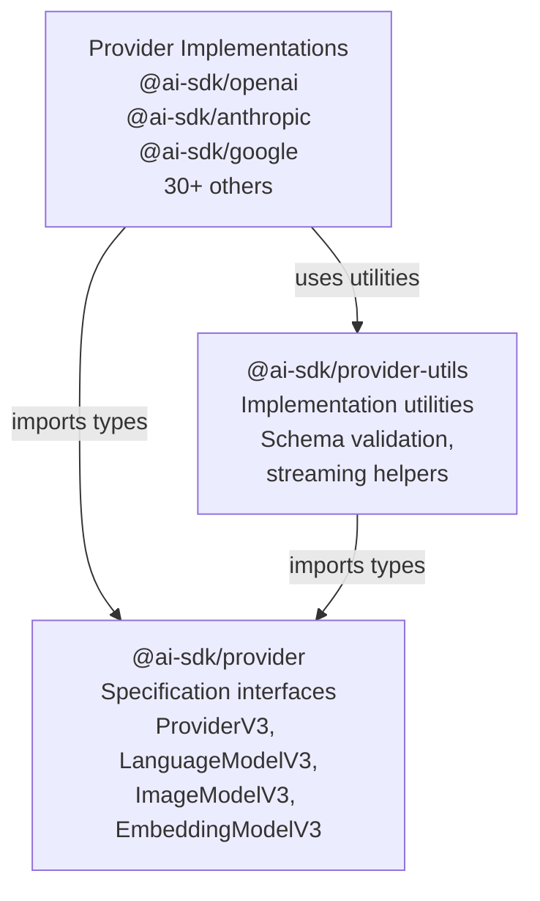
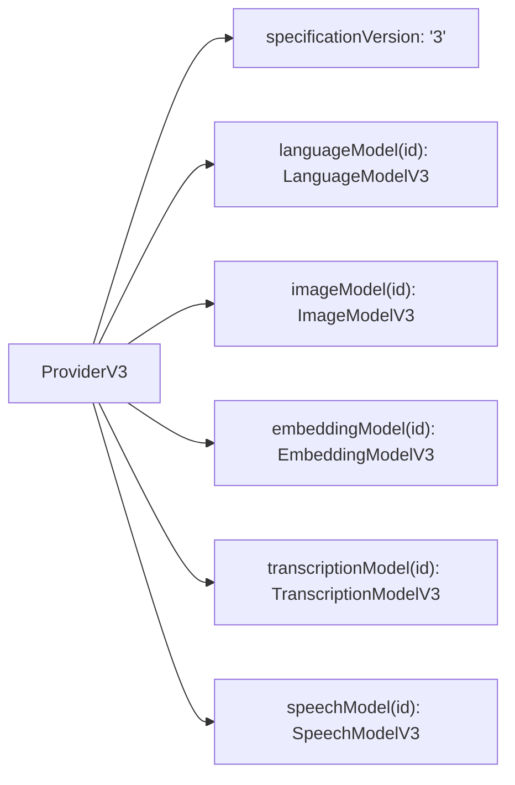
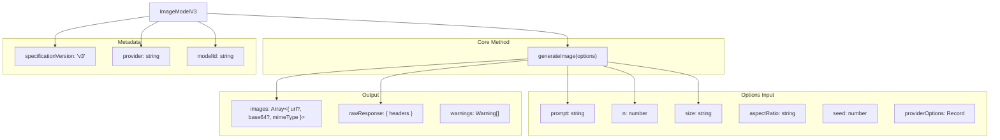
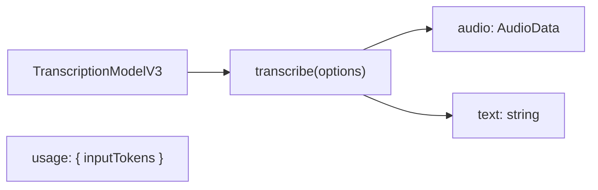
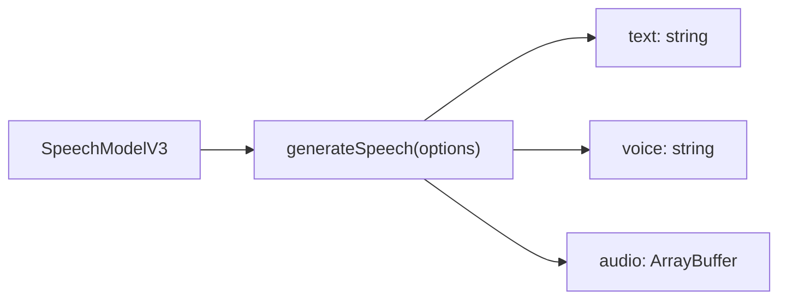
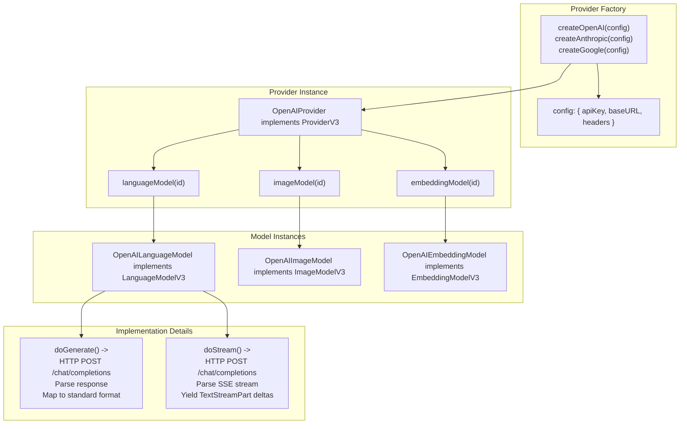
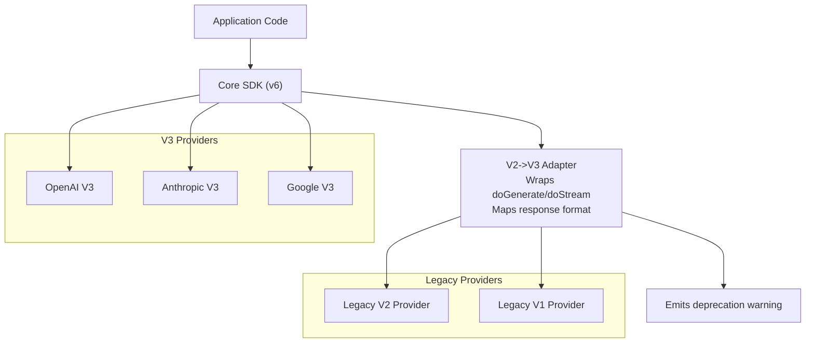

# Provider Architecture and V3 Specification

<details>
<summary>Relevant source files</summary>

The following files were used as context for generating this wiki page:

- [content/docs/02-foundations/02-providers-and-models.mdx](content/docs/02-foundations/02-providers-and-models.mdx)
- [content/providers/01-ai-sdk-providers/05-anthropic.mdx](content/providers/01-ai-sdk-providers/05-anthropic.mdx)
- [content/providers/01-ai-sdk-providers/index.mdx](content/providers/01-ai-sdk-providers/index.mdx)
- [examples/ai-functions/src/stream-text/anthropic/fine-grained-tool-streaming.ts](examples/ai-functions/src/stream-text/anthropic/fine-grained-tool-streaming.ts)
- [packages/anthropic/src/__snapshots__/anthropic-messages-language-model.test.ts.snap](packages/anthropic/src/__snapshots__/anthropic-messages-language-model.test.ts.snap)
- [packages/anthropic/src/anthropic-messages-api.ts](packages/anthropic/src/anthropic-messages-api.ts)
- [packages/anthropic/src/anthropic-messages-language-model.test.ts](packages/anthropic/src/anthropic-messages-language-model.test.ts)
- [packages/anthropic/src/anthropic-messages-language-model.ts](packages/anthropic/src/anthropic-messages-language-model.ts)
- [packages/anthropic/src/anthropic-messages-options.ts](packages/anthropic/src/anthropic-messages-options.ts)
- [packages/anthropic/src/anthropic-prepare-tools.test.ts](packages/anthropic/src/anthropic-prepare-tools.test.ts)
- [packages/anthropic/src/anthropic-prepare-tools.ts](packages/anthropic/src/anthropic-prepare-tools.ts)
- [packages/anthropic/src/anthropic-tools.ts](packages/anthropic/src/anthropic-tools.ts)
- [packages/anthropic/src/convert-anthropic-messages-usage.test.ts](packages/anthropic/src/convert-anthropic-messages-usage.test.ts)
- [packages/anthropic/src/convert-anthropic-messages-usage.ts](packages/anthropic/src/convert-anthropic-messages-usage.ts)
- [packages/anthropic/src/convert-to-anthropic-messages-prompt.test.ts](packages/anthropic/src/convert-to-anthropic-messages-prompt.test.ts)
- [packages/anthropic/src/convert-to-anthropic-messages-prompt.ts](packages/anthropic/src/convert-to-anthropic-messages-prompt.ts)
- [packages/azure/CHANGELOG.md](packages/azure/CHANGELOG.md)
- [packages/azure/package.json](packages/azure/package.json)
- [packages/mistral/CHANGELOG.md](packages/mistral/CHANGELOG.md)
- [packages/mistral/package.json](packages/mistral/package.json)
- [packages/openai/CHANGELOG.md](packages/openai/CHANGELOG.md)
- [packages/openai/package.json](packages/openai/package.json)
- [packages/provider-utils/CHANGELOG.md](packages/provider-utils/CHANGELOG.md)
- [packages/provider-utils/package.json](packages/provider-utils/package.json)

</details>


This page documents the Provider V3 specification, which defines the standard interfaces that all AI model providers implement in the Vercel AI SDK. This includes the `ProviderV3` root interface, `LanguageModelV3` for text generation, `ImageModelV3` for image generation, `EmbeddingModelV3` for embeddings, and related model interfaces. For information about specific provider implementations, see pages [3.2](#3.2) through [3.10](#3.10). For general provider ecosystem overview, see [3](#3).

## Purpose and Scope

The V3 specification establishes a unified contract between the AI SDK core and provider implementations. All providers must implement these interfaces to enable consistent usage patterns across OpenAI, Anthropic, Google, and 30+ other AI services. The specification version `'3'` represents the current generation, replacing earlier V1 and V2 specifications.

## Package Structure

The provider architecture consists of three primary packages:



**Sources:** [packages/openai/package.json:53-55](), [packages/anthropic/package.json:53-55](), [packages/google/package.json:53-55](), [packages/provider-utils referenced in all provider package.json files]()

## ProviderV3 Interface

The `ProviderV3` interface serves as the root contract for provider implementations. Each provider package exports a factory function that returns an object implementing this interface.



The `specificationVersion` field identifies the interface contract version. Providers implementing V3 must set this to `'3'`. This allows the core SDK to verify compatibility and handle version-specific behavior.

**Sources:** [packages/google-vertex/CHANGELOG.md:437-438](), [packages/ai/CHANGELOG.md:596-599]()

## LanguageModelV3 Interface

The `LanguageModelV3` interface defines the contract for text generation models. It is the most widely implemented interface in the provider ecosystem.

```mermaid
graph TB
    LMV3["LanguageModelV3"]
    
    subgraph "Core Methods"
        DG["doGenerate(options)"]
        DS["doStream(options)"]
    end
    
    subgraph "Metadata"
        SPEC["specificationVersion: 'v3'"]
        PROV["provider: string"]
        MID["modelId: string"]
        DEFAULT["defaultObjectGenerationMode"]
        SUPPORTS["supportsStructuredOutputs"]
    end
    
    subgraph "Options Input"
        MODE["mode: { type: 'regular' | 'object-json' | 'object-tool' }"]
        PROMPT["prompt: Prompt[]"]
        TOOLS["tools: Record<string, Tool>"]
        TOOL_CHOICE["toolChoice: ToolChoice"]
        MAX_TOKENS["maxTokens: number"]
        TEMP["temperature: number"]
        HEADERS["headers: Record<string, string>"]
    end
    
    subgraph "Generate Output"
        TEXT["text: string"]
        TOOL_CALLS["toolCalls: ToolCall[]"]
        FINISH["finishReason: 'stop' | 'length' | 'tool-calls' | 'error'"]
        USAGE["usage: TokenUsage"]
        RAW["rawCall: { rawPrompt, rawSettings }"]
        WARNINGS["warnings: Warning[]"]
        PROV_META["providerMetadata: Record<string, any>"]
    end
    
    subgraph "Stream Output"
        STREAM["AsyncIterable<TextStreamPart>"]
        TEXT_DELTA["type: 'text-delta'"]
        TOOL_DELTA["type: 'tool-call-delta'"]
        TOOL_CALL["type: 'tool-call'"]
        FINISH_STREAM["type: 'finish'"]
    end
    
    LMV3 --> DG
    LMV3 --> DS
    LMV3 --> SPEC
    LMV3 --> PROV
    LMV3 --> MID
    
    DG --> MODE
    DG --> PROMPT
    DG --> TOOLS
    DG --> TEXT
    DG --> TOOL_CALLS
    DG --> FINISH
    
    DS --> MODE
    DS --> PROMPT
    DS --> STREAM
    STREAM --> TEXT_DELTA
    STREAM --> TOOL_DELTA
```



### Core Method Contracts

**`doGenerate(options)`** - Synchronous generation that waits for the complete response:
- Accepts `mode` (regular, object-json, object-tool), `prompt`, `tools`, `maxTokens`, `temperature`, etc.
- Returns complete `text`, `toolCalls`, `finishReason`, `usage`, and `providerMetadata`
- Must populate `rawCall.rawPrompt` and `rawCall.rawSettings` for observability

**`doStream(options)`** - Streaming generation that yields incremental chunks:
- Accepts same options as `doGenerate`
- Returns `AsyncIterable<TextStreamPart>` yielding deltas
- Emits `text-delta`, `tool-call-delta`, `tool-call`, and `finish` events
- Final `finish` event includes complete `usage` and `finishReason`

**Sources:** [packages/anthropic/CHANGELOG.md:462-467](), [packages/google/CHANGELOG.md:304-309](), [packages/openai/CHANGELOG.md:467-472]()

### Generation Modes

The `mode` parameter controls output format:

| Mode Type | Purpose | Tool Support | Output Format |
|-----------|---------|--------------|---------------|
| `regular` | Standard text generation | Yes | Unstructured text |
| `object-json` | Structured JSON output | Depends on provider | JSON matching schema |
| `object-tool` | JSON via tool calling | Depends on provider | JSON via tool response |

**Sources:** [packages/ai/CHANGELOG.md:600-617]()

### Provider Metadata

Each provider can attach custom metadata via `providerMetadata`. Examples include:
- OpenAI: `reasoning` content, `logprobs`, `system_fingerprint`
- Anthropic: `stopSequence`, `cacheMetadata`
- Google: `groundingMetadata`, `thoughtSignature`

**Sources:** [packages/amazon-bedrock/CHANGELOG.md:425-434](), [packages/anthropic/CHANGELOG.md visible in finish reason mapping]()

## ImageModelV3 Interface

The `ImageModelV3` interface standardizes image generation across providers supporting DALL-E, Stable Diffusion, Imagen, and similar models.



### Image Output Formats

Providers return images in one or both formats:
- `url` - Direct URL to generated image (temporary or permanent)
- `base64` - Base64-encoded image data with `mimeType`

**Sources:** [packages/ai/CHANGELOG.md:708-709](), [packages/google-vertex/CHANGELOG.md:459]()

## EmbeddingModelV3 Interface

The `EmbeddingModelV3` interface defines contracts for embedding models. The V3 specification removed generics from earlier versions.

```mermaid
graph TB
    EMV3["EmbeddingModelV3"]
    
    subgraph "Core Methods"
        EMBED["embed(options)"]
        EMBED_MANY["embedMany(options)"]
    end
    
    subgraph "Metadata"
        SPEC["specificationVersion: 'v3'"]
        PROV["provider: string"]
        MID["modelId: string"]
        MAX_EMB["maxEmbeddingsPerCall: number"]
        SUPPORTS["supportsParallelCalls: boolean"]
    end
    
    subgraph "Embed Options"
        VALUE["value: string"]
        HEADERS["headers: Record<string, string>"]
        ABORT["abortSignal: AbortSignal"]
    end
    
    subgraph "EmbedMany Options"
        VALUES["values: string[]"]
    end
    
    subgraph "Embed Output"
        EMB["embedding: number[]"]
        USAGE["usage: { tokens: number }"]
        RAW_RES["rawResponse: { headers }"]
    end
    
    subgraph "EmbedMany Output"
        EMBS["embeddings: number[][]"]
        USAGE_MANY["usage: { tokens: number }"]
    end
    
    EMV3 --> EMBED
    EMV3 --> EMBED_MANY
    EMV3 --> SPEC
    EMV3 --> PROV
    EMV3 --> MID
    EMV3 --> MAX_EMB
    
    EMBED --> VALUE
    EMBED --> EMB
    EMBED --> USAGE
    
    EMBED_MANY --> VALUES
    EMBED_MANY --> EMBS
    EMBED_MANY --> USAGE_MANY
```



### Batch Processing

The `maxEmbeddingsPerCall` property indicates how many embeddings the provider can process in a single API call. The `embedMany` method handles batching automatically based on this limit.

**Migration Note:** Earlier V2 specifications used `doEmbed` and included generic type parameters. V3 simplified to `embed` and `embedMany` without generics.

**Sources:** [packages/google-vertex/CHANGELOG.md:437-451](), [packages/amazon-bedrock/CHANGELOG.md:433-445]()

## TranscriptionModelV3 and SpeechModelV3 Interfaces

### TranscriptionModelV3

The `TranscriptionModelV3` interface defines audio-to-text transcription:



### SpeechModelV3

The `SpeechModelV3` interface defines text-to-speech synthesis:



**Sources:** [packages/ai/CHANGELOG.md:677-679]()

## Provider Implementation Patterns

Provider implementations follow a consistent pattern across the ecosystem:



### Common Implementation Structure

Most providers share this file organization:

| File Pattern | Purpose |
|--------------|---------|
| `{provider}-provider.ts` | Factory function and `ProviderV3` implementation |
| `{provider}-language-model.ts` | `LanguageModelV3` implementation |
| `{provider}-image-model.ts` | `ImageModelV3` implementation (if supported) |
| `{provider}-embedding-model.ts` | `EmbeddingModelV3` implementation (if supported) |
| `{provider}-{api}-settings.ts` | API-specific request/response mappings |
| `convert-to-{provider}-*-prompt.ts` | Prompt conversion utilities |

**Sources:** [packages/openai/package.json](), [packages/anthropic/package.json](), [packages/google/package.json]()

### Provider Utilities

The `@ai-sdk/provider-utils` package provides shared implementation helpers:

```mermaid
graph TB
    subgraph "Schema Validation"
        ZOD["zodSchema()"]
        VALIBOT["valibotSchema()"]
        EFFECT["effectSchema()"]
        ARK["arkTypeSchema()"]
    end
    
    subgraph "Streaming Utilities"
        PARSE["parseJsonStream()"]
        CREATE["createJsonStreamResponseHandler()"]
        SSE["createEventSourceResponseHandler()"]
    end
    
    subgraph "Response Processing"
        COMBINE["combineHeaders()"]
        EXTRACT["extractResponseHeaders()"]
        POST["postJsonToApi()"]
    end
    
    subgraph "Error Handling"
        API_ERR["APICallError"]
        INVALID["InvalidResponseDataError"]
        SCHEMA["TypeValidationError"]
    end
    
    UTILS["@ai-sdk/provider-utils"]
    
    UTILS --> ZOD
    UTILS --> VALIBOT
    UTILS --> PARSE
    UTILS --> COMBINE
    UTILS --> API_ERR
```



**Sources:** [packages/provider-utils referenced extensively in all provider packages](), [examples/ai-functions/package.json:178-180]()

## Provider-Specific Extensions

While all providers implement the V3 specification, each can expose provider-specific features through typed configuration:

### OpenAI Extensions

OpenAI providers support additional fields via `providerOptions`:
- `openai.streamOptions` for enhanced streaming control
- `openai.reasoningEffort` for o1/o3 models
- `openai.parallelToolCalls` for concurrent tool execution

### Anthropic Extensions

Anthropic providers support:
- `anthropic.thinkingMode` for Claude thinking behavior
- `anthropic.cacheControl` for prompt caching
- Provider-defined tools: `computer_20251124`, `bash`, `textEditor`

### Google Extensions

Google providers support:
- `google.thinkingConfig` for Gemini thinking configuration
- `google.groundingMetadata` for search grounding
- Provider-defined tools: `googleSearch`, `codeExecution`, `fileSearch`

**Sources:** [packages/openai/CHANGELOG.md visible in provider metadata sections](), [packages/anthropic/CHANGELOG.md visible in provider-specific features](), [packages/google/CHANGELOG.md visible in grounding and thinking sections]()

## Migration from V1/V2 Specifications

The SDK maintains backward compatibility with V1/V2 provider implementations through adapter layers:



### V2 to V3 Changes

Major changes from V2 to V3:

| Aspect | V2 | V3 |
|--------|----|----|
| Embedding method | `doEmbed` | `embed`, `embedMany` |
| Embedding generics | `EmbeddingModelV2<T>` | `EmbeddingModelV3` (no generics) |
| Provider root | `LanguageModelV1` | `ProviderV3` with `specificationVersion` |
| Tool specification | Inline only | Supports provider-defined tools |
| Structured output | Via function calling | Native `object-json` mode |

### Deprecation Warnings

When V2 models are used with SDK v6, the system emits warnings:

```
Warning: You are using a V2 provider with AI SDK v6. Please upgrade to a V3 provider.
Provider: openai
Model: gpt-4
```

**Sources:** [packages/ai/CHANGELOG.md:667-702](), [packages/google-vertex/CHANGELOG.md:437-451]()

## Provider Versioning and User-Agent Headers

All V3 providers include version information in HTTP headers:

```
User-Agent: ai-sdk/{version} ({runtime}) provider/{providerName}/{providerVersion}
```

Example: `ai-sdk/6.0.81 (node/20.17.24) provider/openai/3.0.27`

This enables provider APIs to track SDK usage and version distribution.

**Sources:** [packages/amazon-bedrock/CHANGELOG.md:461-462](), [packages/google-vertex/CHANGELOG.md visible in provider version references]()

---

**Key Takeaways:**
- The V3 specification provides a unified interface layer separating the SDK core from provider implementations
- `LanguageModelV3` with `doGenerate`/`doStream` is the most critical interface
- All providers in `@ai-sdk/*` packages implement these standard interfaces
- Provider-specific features extend the base specification through typed `providerOptions`
- The `@ai-sdk/provider-utils` package provides shared implementation utilities
- Legacy V2 providers work through adapter layers with deprecation warnings