# Provider-Utils and Common Infrastructure

<details>
<summary>Relevant source files</summary>

The following files were used as context for generating this wiki page:

- [packages/azure/CHANGELOG.md](packages/azure/CHANGELOG.md)
- [packages/azure/package.json](packages/azure/package.json)
- [packages/mistral/CHANGELOG.md](packages/mistral/CHANGELOG.md)
- [packages/mistral/package.json](packages/mistral/package.json)
- [packages/openai/CHANGELOG.md](packages/openai/CHANGELOG.md)
- [packages/openai/package.json](packages/openai/package.json)
- [packages/provider-utils/CHANGELOG.md](packages/provider-utils/CHANGELOG.md)
- [packages/provider-utils/package.json](packages/provider-utils/package.json)

</details>

## Purpose and Scope

The `@ai-sdk/provider-utils` package provides shared infrastructure and utilities used across all AI provider implementations in the SDK. This package sits between the `@ai-sdk/provider` specification interface (see [Provider Architecture and V3 Specification](#3.1)) and concrete provider implementations (see [OpenAI Provider](#3.2), [Anthropic Provider](#3.4), etc.). It contains HTTP utilities, schema validation, stream processing, security features, and testing infrastructure that enable consistent, secure, and maintainable provider development.

**Sources:** [packages/provider-utils/package.json:1-81]()

---

## Architecture and Package Structure

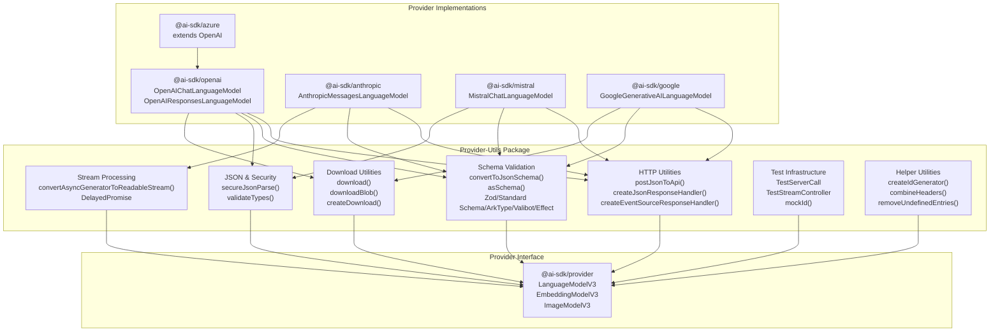

**Package Exports**

The package provides two main export paths:

| Export Path | Purpose                                         | Types/Module                                       |
| ----------- | ----------------------------------------------- | -------------------------------------------------- |
| `.` (main)  | Core utilities for provider implementations     | `./dist/index.d.ts` / `./dist/index.mjs`           |
| `./test`    | Testing infrastructure for provider development | `./dist/test/index.d.ts` / `./dist/test/index.mjs` |

**Dependencies**

- `@ai-sdk/provider`: Provider specification interfaces
- `@standard-schema/spec`: Standard Schema support for cross-library validation
- `eventsource-parser`: Server-Sent Events parsing for streaming responses
- `zod` (peer dependency): Schema validation library

**Sources:** [packages/provider-utils/package.json:1-81](), [packages/openai/package.json:53-56](), [packages/mistral/package.json:46-49]()

---

## HTTP Request and Response Utilities

### Request Construction

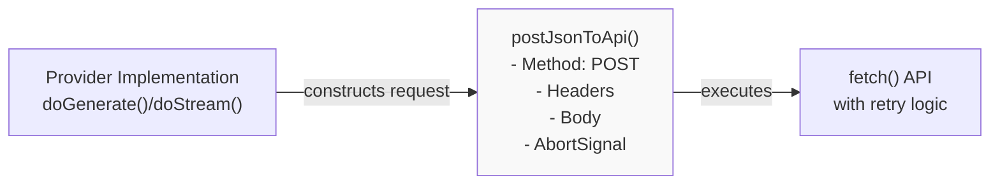

The `postJsonToApi()` function standardizes HTTP POST requests across all providers:

**Key Features:**

- Automatic JSON serialization of request bodies
- Header normalization and combination
- Custom `fetch` implementation support
- Abort signal propagation
- User-Agent header injection with provider version

**Usage Pattern:**
Providers call `postJsonToApi()` with URL, headers, body, and abort signal. The function returns a `ResponseHandler` that processes the response based on the expected format (JSON or event stream).

**Sources:** [packages/provider-utils/CHANGELOG.md:1531-1537](), [packages/provider-utils/CHANGELOG.md:1466-1468]()

### Response Handlers

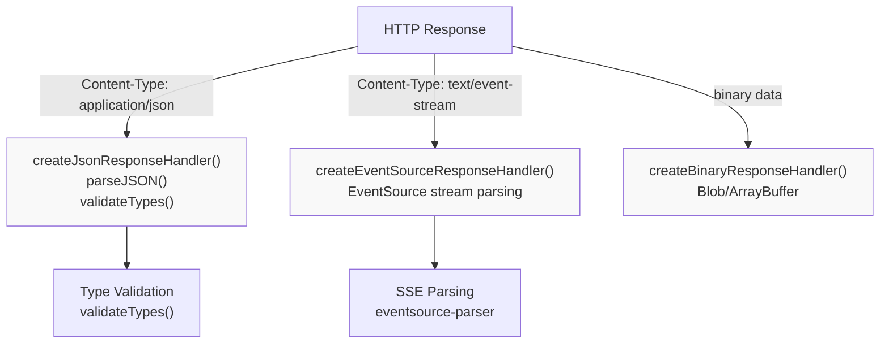

Three specialized response handlers process different content types:

**`createJsonResponseHandler()`**

- Parses JSON responses with `secureJsonParse()`
- Validates response structure with `validateTypes()`
- Extracts provider metadata
- Handles error responses with status codes

**`createEventSourceResponseHandler()`**

- Parses Server-Sent Events (SSE) streams
- Uses `eventsource-parser` library (v3.0.6+)
- Supports incremental chunk processing
- Handles CRLF line endings correctly

**`createBinaryResponseHandler()`**

- Processes binary responses (images, audio)
- Returns `Blob` or `ArrayBuffer`
- Used by image generation and transcription models

**Sources:** [packages/provider-utils/CHANGELOG.md:1175-1176](), [packages/provider-utils/CHANGELOG.md:631-632](), [packages/provider-utils/CHANGELOG.md:405-406]()

---

## Schema Validation and Conversion

### Multi-Library Schema Support

The provider-utils package supports five schema validation libraries through a unified `Schema` interface:

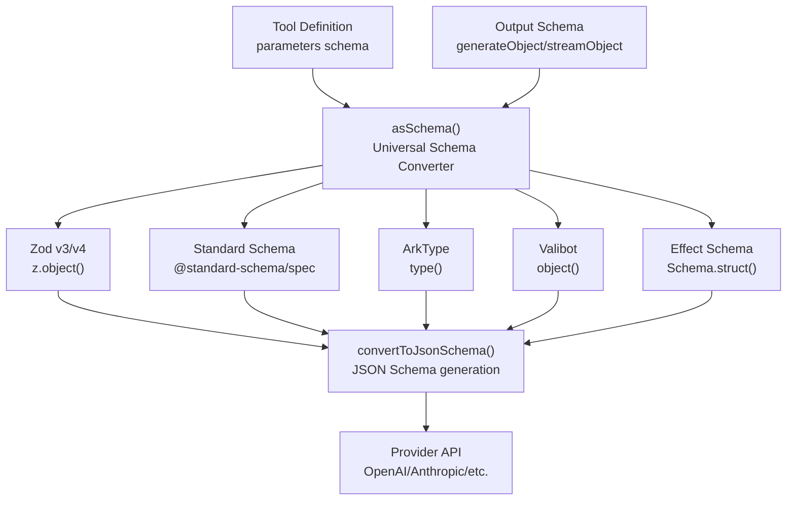

**Schema Conversion Flow**

1. **Input:** Any supported schema library (Zod, Standard Schema, ArkType, Valibot, Effect)
2. **`asSchema()`:** Normalizes to internal `Schema` interface
3. **`convertToJsonSchema()`:** Generates JSON Schema compatible with provider APIs
4. **Output:** JSON Schema sent to AI provider

**Zod v4 Support**

Provider-utils supports both Zod v3 and v4 schemas with lazy loading:

- Zod schemas loaded via `import * as z from 'zod/v4'`
- JSON Schema generation handles `z.refine()`, `z.optional().default()`, and transformers
- Async validators supported via `z.refine()` with async validation functions

**Standard Schema Compatibility**

The `@standard-schema/spec` dependency enables cross-library validation:

- Standardized validation interface across libraries
- Type inference preserved through schema conversions
- Provider-agnostic tool definitions

**Sources:** [packages/provider-utils/CHANGELOG.md:514-515](), [packages/provider-utils/CHANGELOG.md:508-510](), [packages/provider-utils/CHANGELOG.md:194-195](), [packages/provider-utils/CHANGELOG.md:688-700]()

### JSON Schema Generation

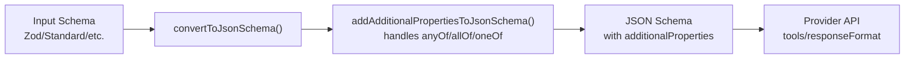

**Key Functions:**

- **`convertToJsonSchema()`**: Converts any supported schema to JSON Schema
- **`addAdditionalPropertiesToJsonSchema()`**: Handles complex schema structures (anyOf/allOf/oneOf) and adds `additionalProperties: false` for strict mode
- **Tool-specific strict mode**: Per-tool configuration of `additionalProperties`

**Security Feature:**

The JSON Schema generator includes `additionalProperties: false` by default for strict validation, preventing injection of unexpected fields.

**Sources:** [packages/provider-utils/CHANGELOG.md:133-137](), [packages/provider-utils/CHANGELOG.md:185-191]()

---

## JSON Parsing and Security Features

### Secure JSON Parsing

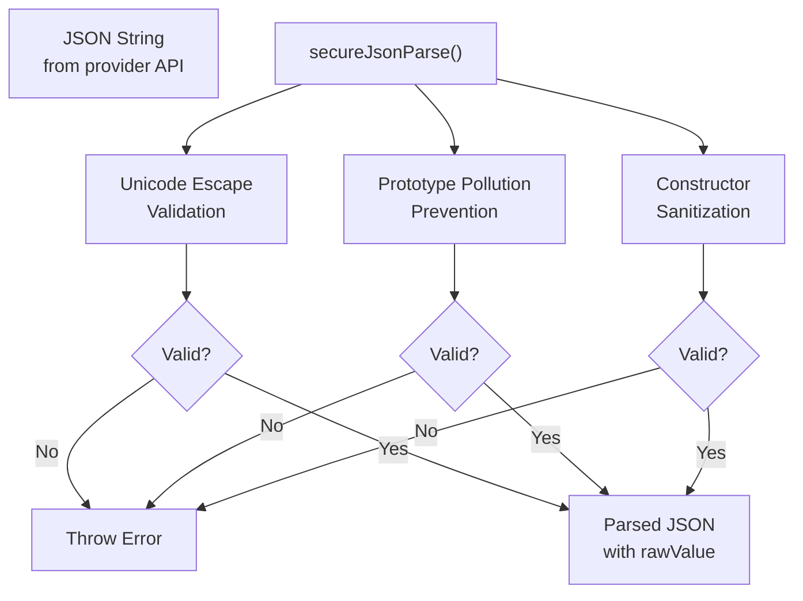

**Security Protections**

The `secureJsonParse()` function implements multiple layers of security:

1. **Unicode Escape Bypass Prevention**: Validates unicode escape sequences to prevent bypassing security checks
2. **Prototype Pollution Protection**: Sanitizes `__proto__`, `constructor`, and `prototype` properties
3. **Raw Value Preservation**: Returns both parsed object and original raw string for verification

**Implementation:**

The function incorporates code from the `secure-json-parse` library, customized for provider-utils needs. It prevents common JSON-based attacks while maintaining compatibility with provider APIs.

**Sources:** [packages/provider-utils/CHANGELOG.md:28-33](), [packages/provider-utils/CHANGELOG.md:1187-1189](), [packages/provider-utils/CHANGELOG.md:703-704]()

### Type Validation

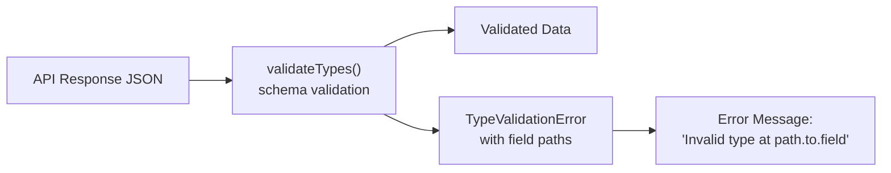

The `validateTypes()` function validates API responses against expected schemas:

**Features:**

- **Field Path Tracking**: Error messages include complete field paths (e.g., `"Invalid type at messages[0].content"`)
- **Entity Identifiers**: Error messages include entity context (e.g., `"for tool call XYZ"`)
- **Schema Integration**: Works with all supported schema libraries

**Error Message Improvements (v4.0.11)**

Enhanced error messages provide precise validation failure locations, making debugging easier for provider developers.

**Sources:** [packages/provider-utils/CHANGELOG.md:77-81]()

---

## Download Utilities with Security

### Download Architecture

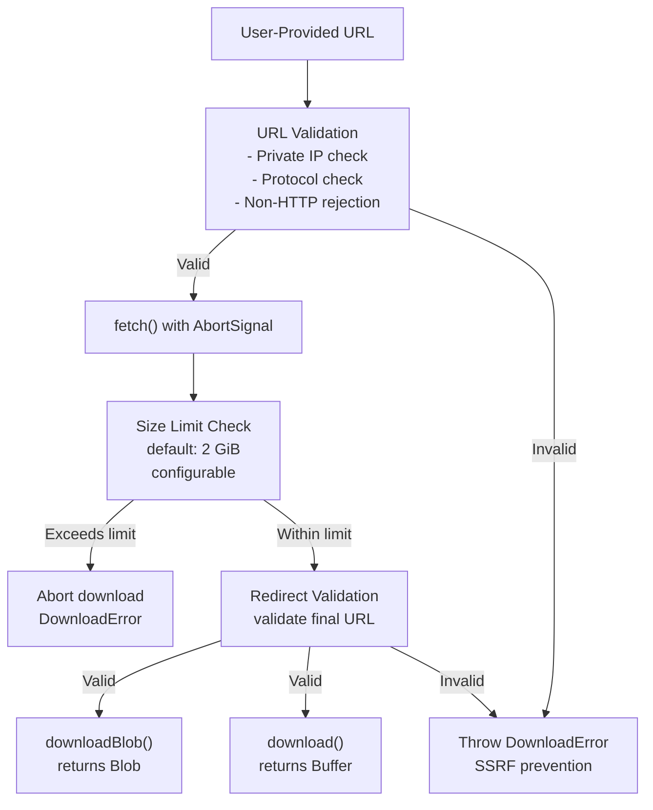

**Security Features**

Both `download()` and `downloadBlob()` implement comprehensive security protections:

1. **SSRF Prevention (v4.0.19, v5.0.0-beta.1)**
   - Pre-fetch URL validation rejects private/internal IP addresses
   - Localhost and loopback addresses blocked
   - Non-HTTP/HTTPS protocols rejected
   - Post-redirect URL validation prevents open redirect bypass

2. **Memory Protection (v4.0.15)**
   - Default 2 GiB size limit prevents unbounded memory consumption
   - Configurable via `createDownload({ maxBytes })` factory
   - Downloads exceeding limit are aborted with `DownloadError`
   - AbortSignal propagated to `fetch()` for proper cleanup

**Usage Pattern:**

```typescript
// Default 2 GiB limit
const data = await download({ url, abortSignal })

// Custom size limit
const customDownload = createDownload({ maxBytes: 100 * 1024 * 1024 }) // 100 MB
const data = await customDownload({ url, abortSignal })
```

**Integration Points:**

- `experimental_transcribe()`: Accepts custom `download` option
- `experimental_generateVideo()`: Accepts custom `download` option
- Image model implementations: Use `downloadBlob()` for image processing

**Sources:** [packages/provider-utils/CHANGELOG.md:22-27](), [packages/provider-utils/CHANGELOG.md:46-55](), [packages/provider-utils/CHANGELOG.md:531-535]()

### File Extension Handling

The download utilities strip file extensions from filenames to ensure compatibility across providers:

**Implementation (v4.0.17):**

- Removes `.pdf`, `.png`, `.jpg`, etc. extensions from downloaded filenames
- Prevents filename-based security issues
- Ensures consistent behavior across Bedrock, OpenAI, and other providers

**Sources:** [packages/provider-utils/CHANGELOG.md:34-40]()

---

## Stream Processing Utilities

### Async Generator to ReadableStream Conversion

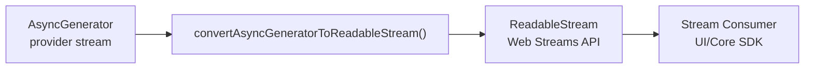

The `convertAsyncGeneratorToReadableStream()` function bridges async generators and Web Streams API:

**Features:**

- Converts provider async generators to Web Streams `ReadableStream`
- Proper cancellation handling via `ReadableStream.cancel()`
- Finalizes async iterators correctly
- Compatible with browser and Node.js environments

**Cancel/Abort Improvements (v4.0.0-beta.28):**

The function ensures `ReadableStream.cancel()` properly finalizes async iterators, preventing resource leaks and ensuring cleanup code executes.

**Sources:** [packages/provider-utils/CHANGELOG.md:416-419](), [packages/provider-utils/CHANGELOG.md:1524-1525]()

### DelayedPromise Utility

The `DelayedPromise` class enables controlled promise resolution:

```typescript
class DelayedPromise<T> {
  resolve(value: T): void
  reject(error: Error): void
  readonly promise: Promise<T>
}
```

**Use Cases:**

- Coordinating asynchronous operations across stream boundaries
- Implementing retry logic with controllable delays
- Tool execution coordination in multi-step agents

**Sources:** [packages/provider-utils/CHANGELOG.md:347-351]()

---

## Testing Infrastructure

### Unified Test Server

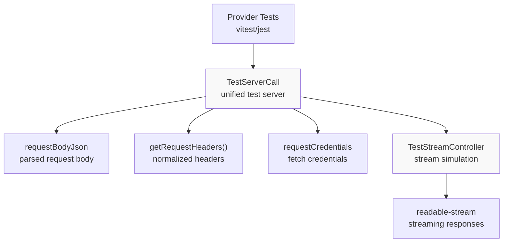

**TestServerCall Interface**

The `TestServerCall` class provides a complete test server implementation for provider development:

**Key Properties and Methods:**

| Member                | Type                     | Purpose                                                             |
| --------------------- | ------------------------ | ------------------------------------------------------------------- |
| `requestBodyJson`     | `object`                 | Parsed JSON request body (renamed from `requestBody` in v3.0.0)     |
| `getRequestHeaders()` | `Record<string, string>` | Normalized HTTP headers as key-value pairs                          |
| `requestCredentials`  | `RequestCredentials`     | Fetch API credentials mode (`'include'`, `'same-origin'`, `'omit'`) |

**TestStreamController**

Simulates streaming responses for testing provider stream implementations:

- **Chunk Emission**: `stream.chunk(data)` emits data chunks
- **Error Simulation**: `stream.error(error)` simulates stream errors
- **Stream Completion**: `stream.done()` completes the stream
- **Readable Stream**: Provides `readable-stream` compatible output

**Sources:** [packages/provider-utils/CHANGELOG.md:942-947](), [packages/provider-utils/CHANGELOG.md:1115-1117](), [packages/provider-utils/CHANGELOG.md:1047-1051](), [packages/provider-utils/CHANGELOG.md:1063-1068]()

### Test Helpers

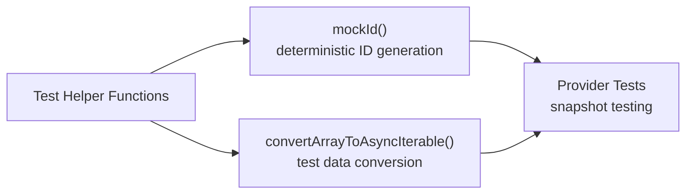

**Mock ID Generator**

The `mockId()` function provides deterministic ID generation for testing:

- Generates predictable IDs for snapshot tests
- Eliminates non-determinism in test runs
- Used extensively in provider test suites

**Array to Async Iterable Converter**

`convertArrayToAsyncIterable()` converts arrays to async iterables for testing stream processing:

```typescript
const stream = convertArrayToAsyncIterable([chunk1, chunk2, chunk3])
// Use in tests to simulate streaming responses
```

**Sources:** [packages/provider-utils/CHANGELOG.md:1140-1144](), [packages/provider-utils/CHANGELOG.md:1469-1474]()

---

## Helper Utilities

### ID Generation

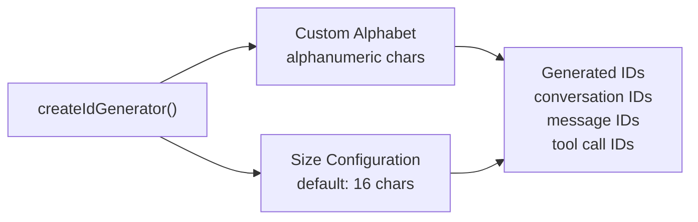

**ID Generator Factory**

The `createIdGenerator()` function creates secure ID generators:

**Implementation:**

- Uses custom alphabet implementation (copied from `nanoid` library)
- Default size increased from 7 to 16 characters (v2.0.0-canary.3)
- Cryptographically secure random generation
- Configurable alphabet and size

**Robustness Improvements (v1.0.22):**

Enhanced error handling and edge case coverage ensure reliable ID generation across environments.

**Sources:** [packages/provider-utils/CHANGELOG.md:1261-1268](), [packages/provider-utils/CHANGELOG.md:1302-1310](), [packages/provider-utils/CHANGELOG.md:1049-1050]()

### Header Utilities

**`combineHeaders()`**

Merges multiple header objects into a single normalized object:

```typescript
const headers = combineHeaders(
  { 'Content-Type': 'application/json' },
  { Authorization: 'Bearer token' },
  customHeaders
)
```

**`removeUndefinedEntries()`**

Removes undefined values from objects (useful for header construction):

```typescript
const cleanHeaders = removeUndefinedEntries({
  'X-Custom-Header': customValue, // included if defined
  'X-Optional': undefined, // removed
})
```

**Header Normalization**

All header normalization consolidated in provider-utils (v4.0.0-beta.22), removing duplicate implementations across providers and preserving custom headers.

**Sources:** [packages/provider-utils/CHANGELOG.md:1465-1468](), [packages/provider-utils/CHANGELOG.md:1147-1150](), [packages/provider-utils/CHANGELOG.md:455-460]()

### Provider Options Parsing

The `parseProviderOptions()` function extracts provider-specific options from the unified `providerOptions` object:

**Usage Pattern:**

```typescript
const openaiOptions = parseProviderOptions({
  providerOptions,
  provider: 'openai',
})
```

This utility enables consistent handling of provider-specific settings across all provider implementations.

**Sources:** [packages/provider-utils/CHANGELOG.md:1093-1097]()

### V8 Compatibility

**Readonly Execution Environment Support (v4.0.0-beta.32):**

Provider-utils includes compatibility fixes for V8 readonly execution environments (e.g., Cloudflare Workers with strict mode):

- Avoids assignments to readonly properties
- Uses alternative implementations where needed
- Ensures provider code runs in sandboxed environments

**Sources:** [packages/provider-utils/CHANGELOG.md:388-393]()

---

## Error Handling and Retry Logic

### Retry-able Error Detection

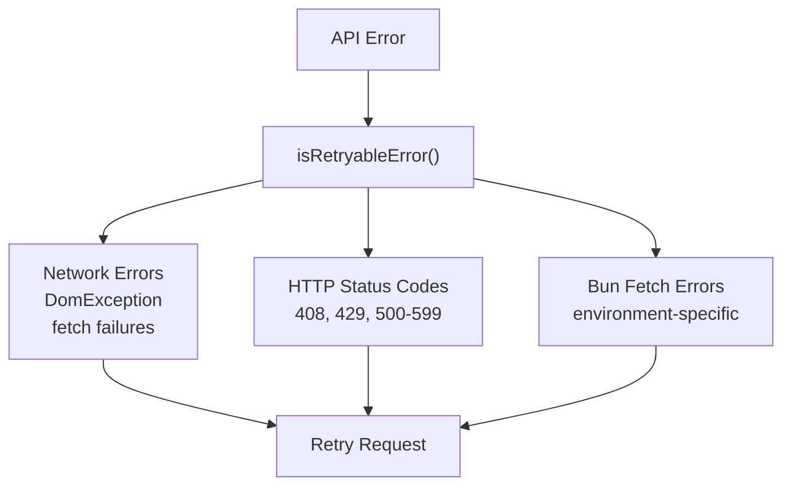

**Error Classification**

Provider-utils identifies retry-able errors across different runtime environments:

- **Network Errors**: `DomException`, fetch failures (generalized from browser-specific errors)
- **HTTP Status Codes**: 408 (Request Timeout), 429 (Too Many Requests), 500-599 (Server Errors)
- **Bun-Specific Errors**: Recognizes Bun's fetch error patterns

**Abort During Retry (v3.0.0-beta.10):**

The retry logic properly handles abort signals during wait periods, allowing immediate cancellation of pending retries.

**Sources:** [packages/provider-utils/CHANGELOG.md:84-89](), [packages/provider-utils/CHANGELOG.md:1453-1456](), [packages/provider-utils/CHANGELOG.md:714-717]()

### User-Agent Header

Provider-utils automatically injects User-Agent headers with version information:

**Format:**

```
User-Agent: ai/{version} @ai-sdk/provider-utils/{version} {runtime}
```

**Components:**

- AI SDK version
- Provider-utils version
- Runtime environment (Node.js/browser/edge)

This enables providers to track SDK usage and diagnose version-specific issues.

**Sources:** [packages/provider-utils/CHANGELOG.md:615-620]()

---

## Tool Execution Infrastructure

### Tool Output Content Support

Provider-utils provides flexible tool output content handling:

**Supported Content Types:**

- **Text**: String content from tool execution
- **Images**: Base64-encoded images or image URLs
- **Files**: File references with metadata
- **Multiple Parts**: Array of mixed content types

**`toModelOutput()` Function:**

Tools can define custom output transformation via the `toModelOutput()` method:

```typescript
interface ToolExecutionOptions {
  input: unknown // Tool input parameters
  toolCallId: string // Unique tool call identifier
}
```

**Async Support (v4.0.0-beta.49):**

The `toModelOutput()` function supports async transformations, enabling tools to perform I/O operations during output formatting.

**Sources:** [packages/provider-utils/CHANGELOG.md:473-479](), [packages/provider-utils/CHANGELOG.md:258-262](), [packages/provider-utils/CHANGELOG.md:264-269](), [packages/provider-utils/CHANGELOG.md:271-276]()

### Tool Approval Support

Provider-utils implements tool execution approval infrastructure:

**`needsApproval` Property:**

Tools can declare approval requirements:

```typescript
// Static approval requirement
const tool = {
  needsApproval: true,
  execute: async (input) => {
    /* ... */
  },
}

// Dynamic approval based on input
const tool = {
  needsApproval: (input) => input.amount > 1000,
  execute: async (input) => {
    /* ... */
  },
}
```

**Provider-Defined Tool Approval:**

Provider-defined tools (e.g., OpenAI's MCP tools, Anthropic's computer use) also support approval workflows through provider-utils infrastructure.

**Sources:** [packages/provider-utils/CHANGELOG.md:147-151](), [packages/provider-utils/CHANGELOG.md:545-548](), [packages/provider-utils/CHANGELOG.md:550-553]()

### Tool Input Examples

**Feature (v4.0.0-beta.43):**

Tools can provide example inputs for improved type inference and documentation:

```typescript
const tool = {
  parameters: zodSchema,
  inputExamples: [
    { example: 'value1', field: 'value2' },
    { example: 'value3', field: 'value4' },
  ],
}
```

**Type Inference Improvements:**

The `inputExamples` feature fixes type inference issues with Zod schemas using `.optional().default()` or `.refine()`.

**Sources:** [packages/provider-utils/CHANGELOG.md:309-315](), [packages/provider-utils/CHANGELOG.md:106-110]()

---

## Summary

The `@ai-sdk/provider-utils` package serves as the foundational infrastructure layer for all AI provider implementations in the SDK. It provides:

1. **HTTP Utilities**: Standardized request/response handling with retry logic
2. **Schema Validation**: Multi-library support (Zod, Standard Schema, ArkType, Valibot, Effect)
3. **Security Features**: SSRF protection, size limits, secure JSON parsing, unicode escape validation
4. **Stream Processing**: Async generator conversion, event source parsing
5. **Testing Infrastructure**: Unified test server, mock utilities, stream controllers
6. **Helper Functions**: ID generation, header manipulation, type validation

This shared infrastructure ensures consistent behavior, security, and maintainability across all provider implementations while reducing code duplication and enabling rapid development of new provider integrations.

**Sources:** [packages/provider-utils/package.json:1-81](), [packages/provider-utils/CHANGELOG.md:1-1580]()
