# Angular and Solid Integrations

Relevant source files

The following files were used as context for generating this wiki page:

- [packages/ai/CHANGELOG.md](packages/ai/CHANGELOG.md)
- [packages/ai/package.json](packages/ai/package.json)
- [packages/angular/CHANGELOG.md](packages/angular/CHANGELOG.md)
- [packages/angular/package.json](packages/angular/package.json)
- [packages/react/CHANGELOG.md](packages/react/CHANGELOG.md)
- [packages/react/package.json](packages/react/package.json)
- [packages/rsc/CHANGELOG.md](packages/rsc/CHANGELOG.md)
- [packages/rsc/package.json](packages/rsc/package.json)
- [packages/rsc/tests/e2e/next-server/CHANGELOG.md](packages/rsc/tests/e2e/next-server/CHANGELOG.md)
- [packages/svelte/CHANGELOG.md](packages/svelte/CHANGELOG.md)
- [packages/svelte/package.json](packages/svelte/package.json)
- [packages/vue/CHANGELOG.md](packages/vue/CHANGELOG.md)
- [packages/vue/package.json](packages/vue/package.json)

This page documents the Angular and Solid.js framework integrations for the AI SDK. These packages provide reactive UI components and services for building AI-powered chat interfaces using framework-specific patterns. Angular integration leverages Angular's signals and dependency injection system, while Solid integration uses Solid's reactive primitives.

For React integration patterns, see [React Integration](#4.2). For Vue and Svelte integrations, see [Vue and Svelte Integrations](#4.3). For the underlying framework-agnostic architecture, see [Framework-Agnostic Chat Architecture](#4.1).

---

## Package Overview

The Angular and Solid integrations exist as separate packages in the monorepo structure:

| Package | Version | Peer Dependencies | Purpose |
|---------|---------|-------------------|---------|
| `@ai-sdk/angular` | 3.0.0-beta.7 | `@angular/core >=16.0.0` | Angular services and components using signals and DI |
| `@ai-sdk/solid` | (Not in provided files) | TBD | Solid.js reactive primitives integration |

**Sources:** [packages/angular/package.json:1-60]()

---

## Angular Integration Architecture

### Package Structure

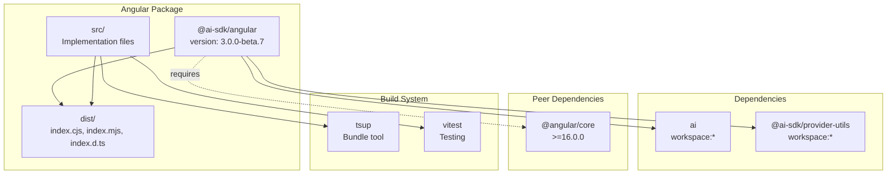

**Sources:** [packages/angular/package.json:1-60]()

---

### Angular-Specific Patterns

Angular integration differs from other framework integrations in several key ways:

| Feature | Angular Pattern | React/Vue Pattern |
|---------|----------------|-------------------|
| Reactivity | Signals (`signal()`, `computed()`) | Hooks/Refs (`useState`, `ref()`) |
| Dependency Management | Dependency Injection (`@Injectable`) | Import/Context |
| Lifecycle | Services (singleton/scoped) | Hooks lifecycle |
| State Management | RxJS + Signals | State hooks |
| Minimum Version | Angular 16.0.0+ (signals support) | React 18+ / Vue 3.3.4+ |

The requirement for `@angular/core >=16.0.0` indicates that the integration leverages Angular's signals API, introduced in Angular 16 as a first-class reactive primitive.

**Sources:** [packages/angular/package.json:54-56]()

---

### Build Configuration

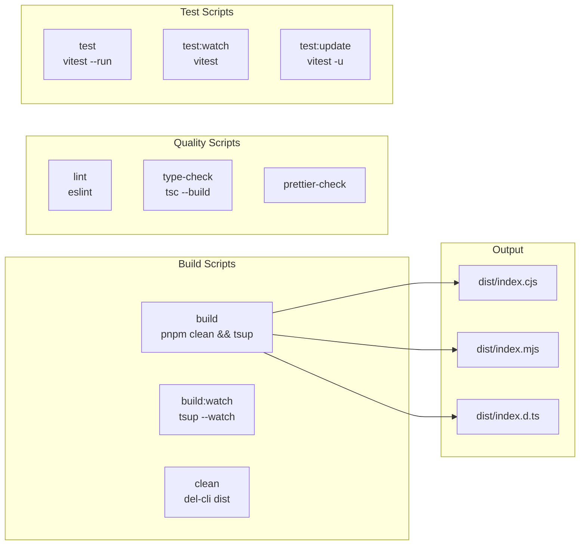

**Sources:** [packages/angular/package.json:9-18]()

---

## Expected Integration Patterns

Based on the Angular package structure and peer dependencies, the integration likely provides:

### Service-Based Architecture

Angular services would inject the core AI SDK functionality:

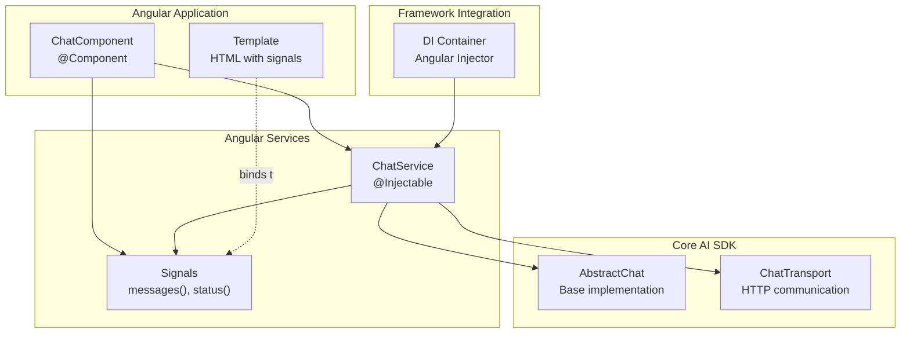

**Sources:** [packages/angular/package.json:38-41]()

---

### Signal-Based Reactivity

Angular 16+ signals would provide reactive state management:

| State Property | Signal Type | Purpose |
|----------------|-------------|---------|
| `messages()` | `Signal<UIMessage[]>` | Readonly message list |
| `input()` | `WritableSignal<string>` | User input binding |
| `status()` | `Signal<ChatStatus>` | Chat state (ready/submitted/streaming) |
| `error()` | `Signal<Error \| undefined>` | Error state |
| `isLoading()` | `Computed<boolean>` | Derived from status |

This pattern aligns with Angular's shift toward signals as the primary reactivity mechanism, replacing RxJS Observables for simpler use cases.

**Sources:** [packages/angular/package.json:54-56]()

---

## Package Exports and Module Resolution

### Export Configuration

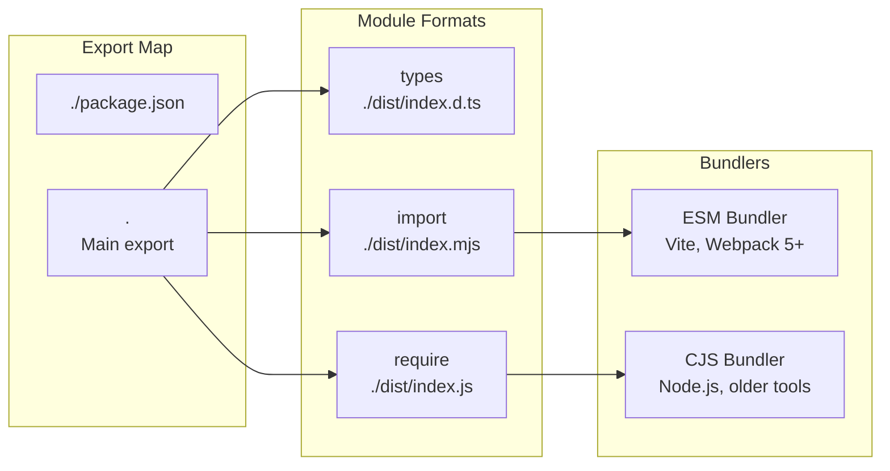

The package provides dual module format support (CJS and ESM) to ensure compatibility across different Angular project configurations and build tools.

**Sources:** [packages/angular/package.json:20-27]()

---

## Dependency Chain

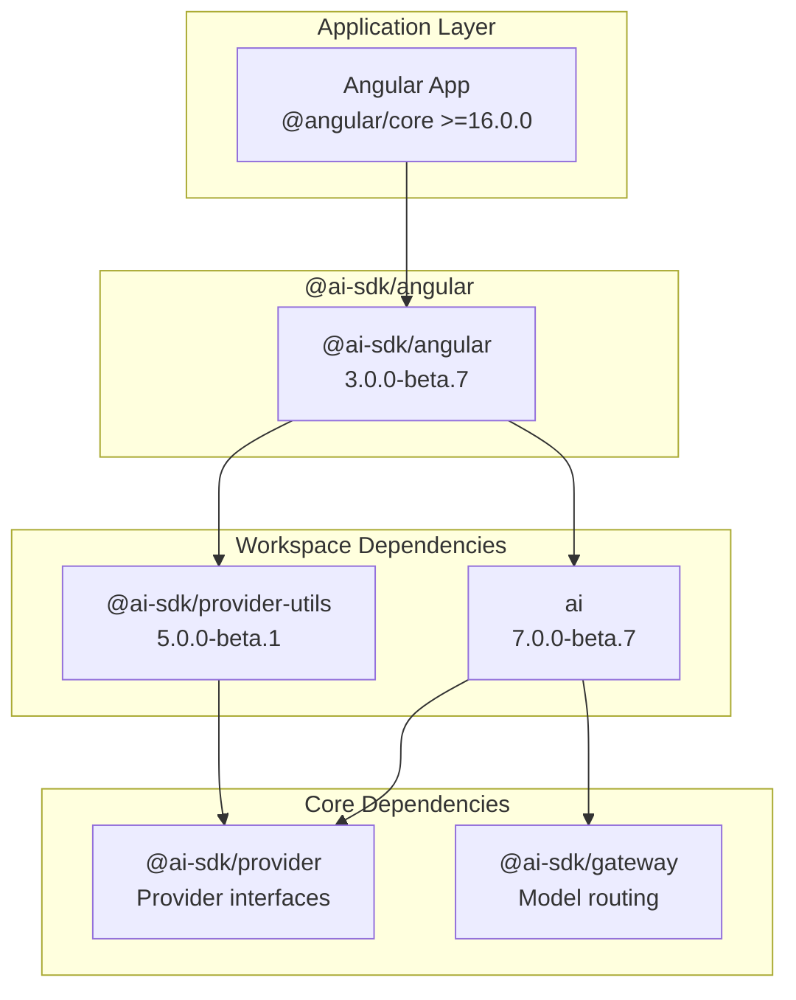

All workspace dependencies use `workspace:*` protocol, ensuring version alignment across the monorepo during development and replaced with actual versions during publishing.

**Sources:** [packages/angular/package.json:38-41](), [packages/ai/package.json:62-67]()

---

## Version Coordination

### Beta Release Synchronization

The Angular package follows the same beta versioning strategy as the core AI SDK:

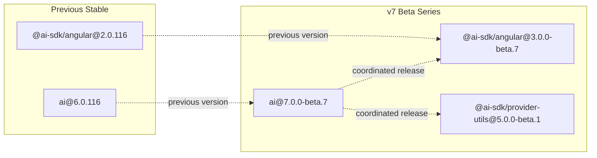

Version bumps are coordinated through Changesets (`.changeset/pre.json` indicates beta pre-release mode), ensuring all packages move together during major version transitions.

**Sources:** [packages/angular/package.json:3](), [packages/ai/package.json:3](), [packages/ai/CHANGELOG.md:1-7]()

---

## Testing and Quality Infrastructure

### Test Configuration

The Angular package uses Vitest for testing, configured with:

| Script | Command | Purpose |
|--------|---------|---------|
| `test` | `vitest --config vitest.config.ts --run` | Run tests once |
| `test:watch` | `vitest --config vitest.config.ts` | Watch mode for development |
| `test:update` | `vitest --config vitest.config.ts --run -u` | Update snapshots |

The use of `jsdom` as a dev dependency suggests browser environment testing for DOM interactions.

**Sources:** [packages/angular/package.json:16-18](), [packages/angular/package.json:48]()

---

## Solid Integration Status

Based on the provided files, the Solid integration package (`@ai-sdk/solid`) is not present in the monorepo structure shown. However, the table of contents indicates it should exist.

### Expected Solid Architecture

If implemented, the Solid integration would likely follow this pattern:

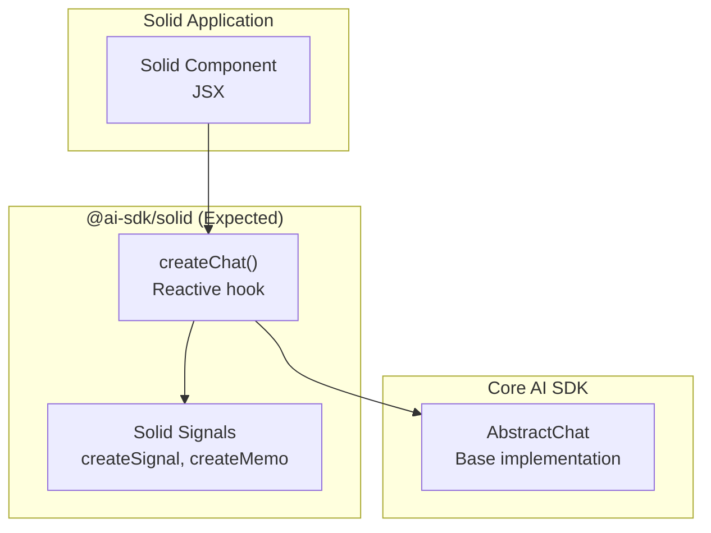

Solid's reactive primitives (`createSignal`, `createMemo`, `createEffect`) would provide fine-grained reactivity similar to Svelte 5's runes or Vue's composition API.

**Sources:** Based on pattern analysis from [packages/react/package.json](), [packages/vue/package.json](), [packages/svelte/package.json]()

---

## Comparison with Other Framework Integrations

### Package Size and Complexity

| Framework | Package Version | Key Dependencies | Reactivity Model |
|-----------|----------------|------------------|------------------|
| React | `@ai-sdk/react@4.0.0-beta.7` | `swr`, `throttleit` | Hooks + External state (SWR) |
| Vue | `@ai-sdk/vue@4.0.0-beta.7` | `swrv` | Composables + Reactive refs |
| Svelte | `@ai-sdk/svelte@5.0.0-beta.7` | None (uses $state runes) | Built-in reactivity |
| Angular | `@ai-sdk/angular@3.0.0-beta.7` | None | Signals (Angular 16+) |

Angular and Svelte integrations are unique in not requiring external state management libraries, relying entirely on framework-native reactivity systems.

**Sources:** [packages/angular/package.json:38-41](), [packages/react/package.json:39-43](), [packages/vue/package.json:39-42](), [packages/svelte/package.json:51-53]()

---

### Version Numbering Divergence

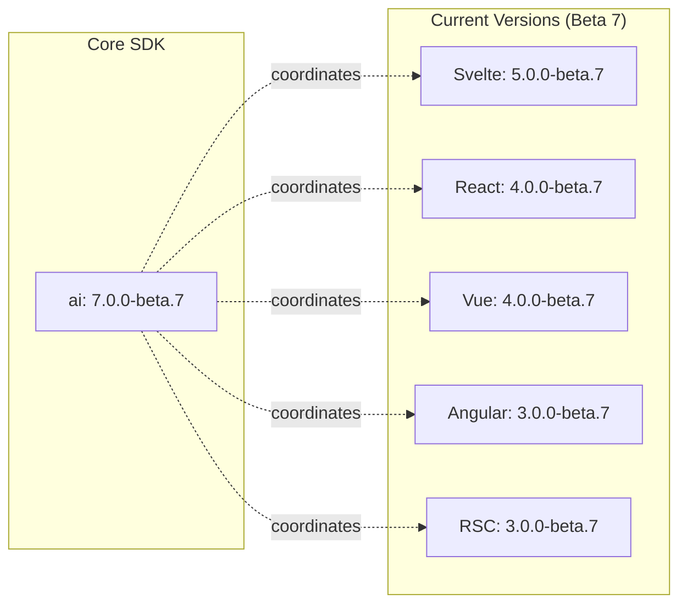

The major version numbers differ across framework packages:
- Svelte: v5 (aligns with Svelte 5 requirement)
- React/Vue: v4
- Angular/RSC: v3

This suggests different breaking change histories for each framework integration, though all track with the core `ai` package's v7 beta cycle.

**Sources:** [packages/svelte/package.json:3](), [packages/react/package.json:3](), [packages/vue/package.json:3](), [packages/angular/package.json:3](), [packages/rsc/package.json:3]()

---

## Development Workflow

### Local Development Setup

For developers working with the Angular integration:

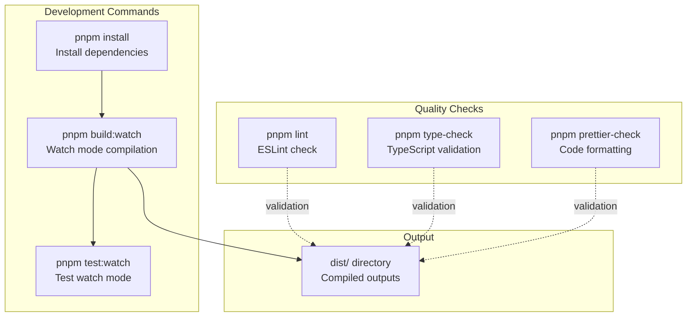

**Sources:** [packages/angular/package.json:9-18]()

---

## Publish Configuration

### NPM Package Settings

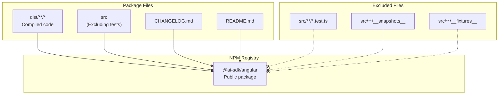

The package is configured for public access on NPM with `"publishConfig": { "access": "public" }`.

**Sources:** [packages/angular/package.json:28-37](), [packages/angular/package.json:57-59]()

---

## Integration with Core Architecture

Both Angular and Solid integrations consume the framework-agnostic `AbstractChat` class from the core AI SDK:

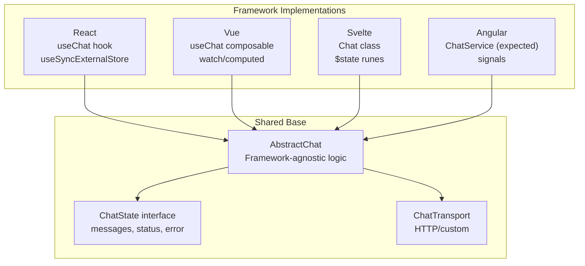

This shared architecture ensures consistent behavior across all framework integrations while allowing framework-specific reactive patterns.

**Sources:** Based on architectural patterns from provided package.json files and changelog references