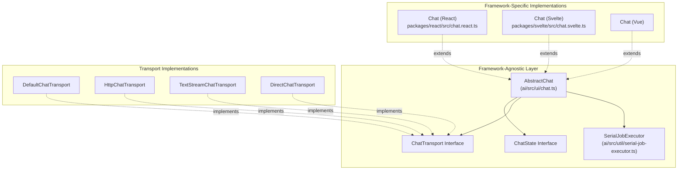
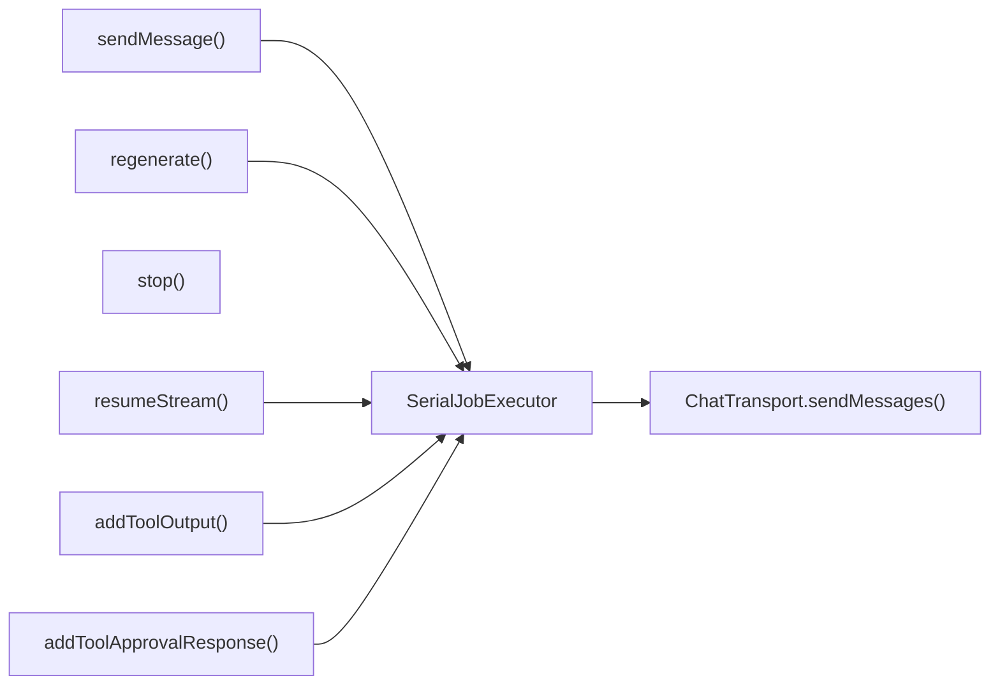
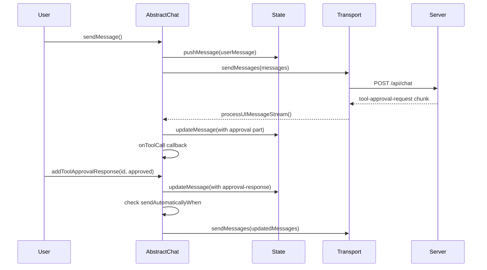
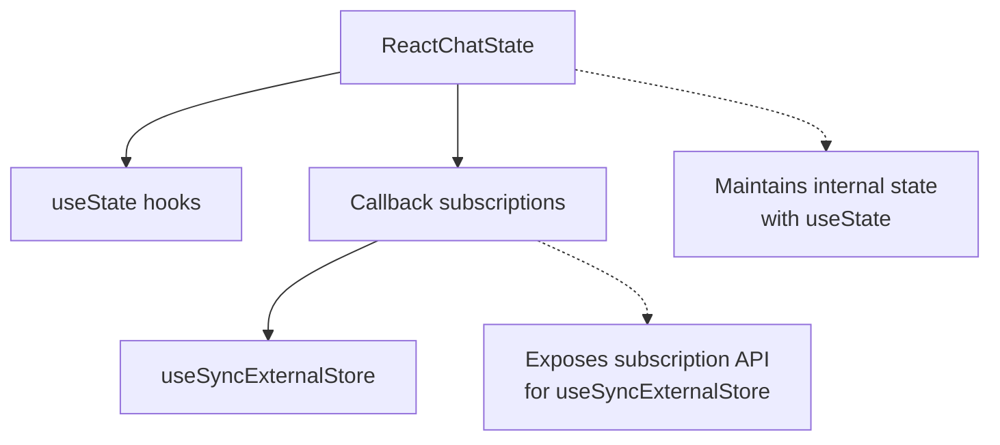
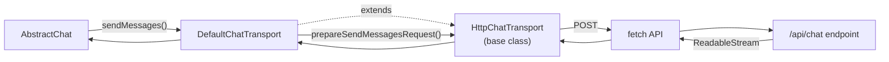
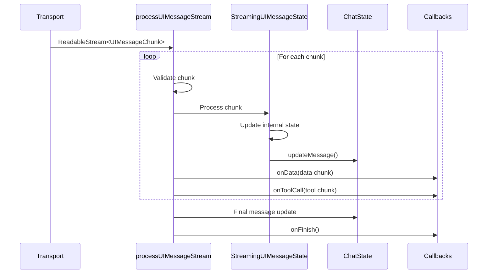
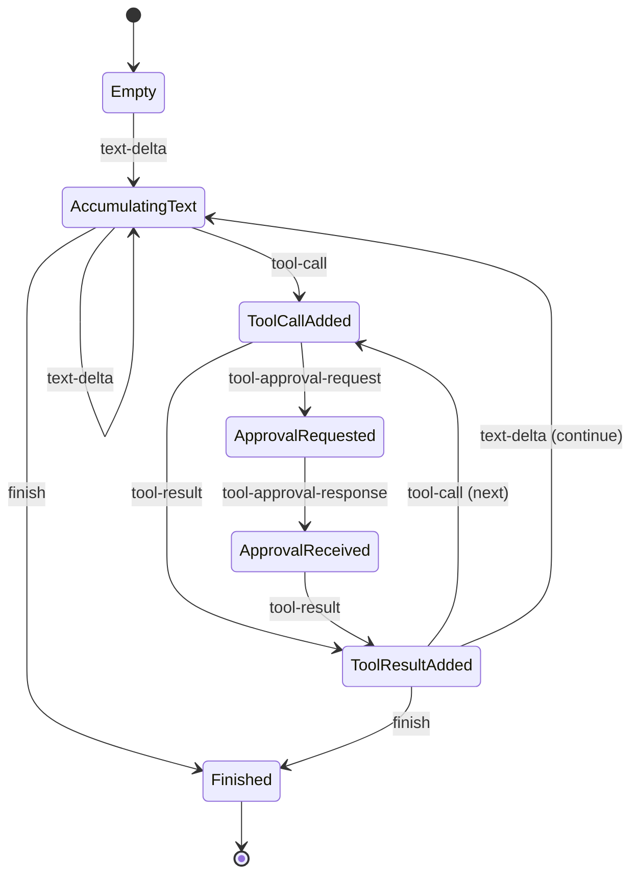
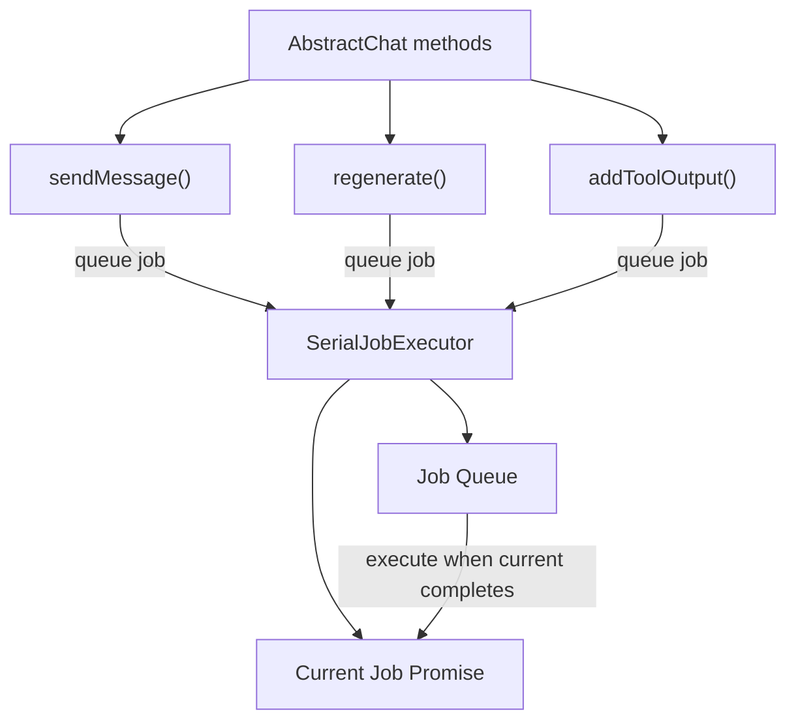
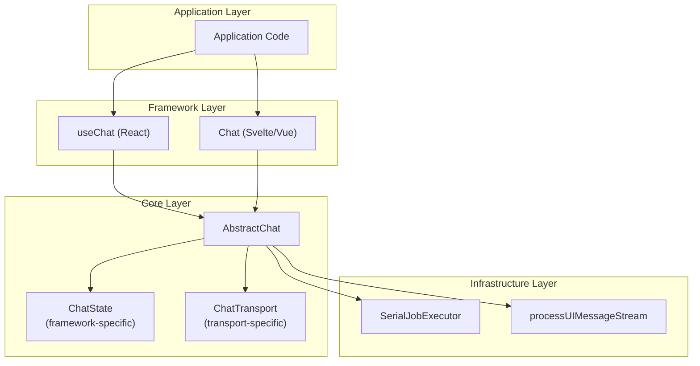

# Framework-Agnostic Chat Architecture

<details>
<summary>Relevant source files</summary>

The following files were used as context for generating this wiki page:

- [.changeset/curvy-doors-shake.md](.changeset/curvy-doors-shake.md)
- [content/docs/07-reference/02-ai-sdk-ui/01-use-chat.mdx](content/docs/07-reference/02-ai-sdk-ui/01-use-chat.mdx)
- [examples/ai-e2e-next/app/api/chat/tool-approval-options/route.ts](examples/ai-e2e-next/app/api/chat/tool-approval-options/route.ts)
- [examples/ai-e2e-next/app/chat/test-tool-approval-options/page.tsx](examples/ai-e2e-next/app/chat/test-tool-approval-options/page.tsx)
- [examples/ai-e2e-next/components/tool/dynamic-tool-with-approval-view.tsx](examples/ai-e2e-next/components/tool/dynamic-tool-with-approval-view.tsx)
- [packages/ai/CHANGELOG.md](packages/ai/CHANGELOG.md)
- [packages/ai/package.json](packages/ai/package.json)
- [packages/ai/src/ui/chat.test.ts](packages/ai/src/ui/chat.test.ts)
- [packages/ai/src/ui/chat.ts](packages/ai/src/ui/chat.ts)
- [packages/ai/src/ui/index.ts](packages/ai/src/ui/index.ts)
- [packages/react/CHANGELOG.md](packages/react/CHANGELOG.md)
- [packages/react/package.json](packages/react/package.json)
- [packages/react/src/use-chat.ts](packages/react/src/use-chat.ts)
- [packages/react/src/use-chat.ui.test.tsx](packages/react/src/use-chat.ui.test.tsx)
- [packages/rsc/CHANGELOG.md](packages/rsc/CHANGELOG.md)
- [packages/rsc/package.json](packages/rsc/package.json)
- [packages/rsc/tests/e2e/next-server/CHANGELOG.md](packages/rsc/tests/e2e/next-server/CHANGELOG.md)
- [packages/svelte/CHANGELOG.md](packages/svelte/CHANGELOG.md)
- [packages/svelte/package.json](packages/svelte/package.json)
- [packages/svelte/src/chat.svelte.test.ts](packages/svelte/src/chat.svelte.test.ts)
- [packages/svelte/src/chat.svelte.ts](packages/svelte/src/chat.svelte.ts)
- [packages/vue/CHANGELOG.md](packages/vue/CHANGELOG.md)
- [packages/vue/package.json](packages/vue/package.json)

</details>


## Purpose and Scope

This page documents the framework-agnostic core architecture that powers all UI framework integrations in the AI SDK. The `AbstractChat` class, `ChatState` interface, and `ChatTransport` abstraction form the foundation upon which framework-specific implementations (`@ai-sdk/react`, `@ai-sdk/vue`, `@ai-sdk/svelte`, `@ai-sdk/angular`, `@ai-sdk/solid`) are built. This architecture separates concerns: transport layer handles communication with the server, state management is delegated to framework-specific implementations, and core chat logic remains framework-independent.

For framework-specific implementations using this architecture, see [React Integration](#4.2), [Vue and Svelte Integrations](#4.3), [Angular and Solid Integrations](#4.4), and [React Server Components](#4.5).

---

## Core Architecture Overview



**Sources:** [packages/ai/src/ui/chat.ts:1-850](), [packages/react/src/chat.react.ts:1-63](), [packages/svelte/src/chat.svelte.ts:1-48]()

---

## AbstractChat Base Class

The `AbstractChat` class provides framework-agnostic chat functionality that is extended by framework-specific implementations. It manages message flow, tool execution, approval workflows, and streaming state without depending on any particular reactive framework.

### Class Structure

| Property | Type | Description |
|----------|------|-------------|
| `id` | `string` | Unique identifier for the chat instance |
| `messages` | `UI_MESSAGE[]` | Array of chat messages (getter/setter delegated to state) |
| `status` | `ChatStatus` | Current status: `'ready'`, `'submitted'`, `'streaming'` |
| `error` | `Error \| undefined` | Current error state |
| `transport` | `ChatTransport` | Transport implementation for server communication |
| `state` | `ChatState<UI_MESSAGE>` | Framework-specific state implementation |
| `executor` | `SerialJobExecutor` | Ensures sequential message processing |

**Sources:** [packages/ai/src/ui/chat.ts:223-315]()

### Core Methods



**Sources:** [packages/ai/src/ui/chat.ts:317-850]()

#### Message Sending Flow

The `sendMessage()` method orchestrates the complete message lifecycle:

1. **Validation**: Ensures chat is in `'ready'` state
2. **Message Creation**: Constructs `UIMessage` with user content and optional file attachments
3. **State Update**: Adds user message to state via `state.pushMessage()`
4. **Job Queueing**: Enqueues send operation in `SerialJobExecutor`
5. **Transport Invocation**: Calls `transport.sendMessages()` with current messages
6. **Stream Processing**: Processes response stream via `processUIMessageStream()`
7. **Callback Execution**: Invokes `onFinish`, `onToolCall`, `onData` callbacks
8. **Auto-send Logic**: Evaluates `sendAutomaticallyWhen` to determine automatic continuation

**Sources:** [packages/ai/src/ui/chat.ts:317-498]()

#### Tool Approval Workflow



**Sources:** [packages/ai/src/ui/chat.ts:733-811](), [packages/ai/src/ui/process-ui-message-stream.ts:1-500]()

---

## ChatState Interface

The `ChatState` interface defines how different frameworks implement reactive state management. `AbstractChat` delegates all state operations to this interface, enabling framework-specific reactivity patterns.

### Interface Definition

```typescript
interface ChatState<UI_MESSAGE extends UIMessage> {
  messages: UI_MESSAGE[];
  status: ChatStatus;
  error: Error | undefined;
  
  setMessages: (messages: UI_MESSAGE[]) => void;
  pushMessage: (message: UI_MESSAGE) => void;
  popMessage: () => UI_MESSAGE | undefined;
  updateMessage: (index: number, updater: (message: UI_MESSAGE) => UI_MESSAGE) => void;
}
```

**Sources:** [packages/ai/src/ui/chat.ts:120-133]()

### Framework-Specific Implementations

| Framework | Implementation | Reactivity Mechanism |
|-----------|---------------|---------------------|
| **React** | `ReactChatState` | `useState` hooks with subscription pattern |
| **Svelte** | `SvelteChatState` | `$state` runes (Svelte 5) |
| **Vue** | `VueChatState` | Vue 3 `ref` and `reactive` |
| **Angular** | `AngularChatState` | Signals (Angular 16+) |
| **Solid** | `SolidChatState` | Solid signals |

#### React Implementation Pattern



React's implementation uses `useState` internally and provides subscription methods (`~registerMessagesCallback`, `~registerStatusCallback`, `~registerErrorCallback`) that integrate with React's `useSyncExternalStore` hook. This enables efficient re-rendering only when subscribed state changes.

**Sources:** [packages/react/src/chat.react.ts:1-63](), [packages/react/src/use-chat.ts:111-135]()

#### Svelte Implementation Pattern

Svelte 5 uses `$state` runes for automatic reactivity. The `SvelteChatState` class marks properties as reactive, and any component accessing these properties automatically subscribes to changes.

```typescript
class SvelteChatState<UI_MESSAGE extends UIMessage> implements ChatState<UI_MESSAGE> {
  messages: UI_MESSAGE[];
  status = $state<ChatStatus>('ready');
  error = $state<Error | undefined>(undefined);
  
  constructor(messages: UI_MESSAGE[] = []) {
    this.messages = $state(messages);
  }
  // ...
}
```

**Sources:** [packages/svelte/src/chat.svelte.ts:23-48]()

---

## ChatTransport Abstraction

The `ChatTransport` interface decouples message sending from the underlying communication protocol. This enables different transport strategies (HTTP endpoints, direct function calls, text-only streaming) without modifying core chat logic.

### Transport Interface

```typescript
interface ChatTransport<UI_MESSAGE extends UIMessage> {
  sendMessages(params: {
    messages: UI_MESSAGE[];
    requestOptions?: ChatRequestOptions;
    signal?: AbortSignal;
  }): Promise<ReadableStream<UIMessageChunk>>;
  
  reconnectToStream?(params: {
    id: string;
    requestOptions?: ChatRequestOptions;
    signal?: AbortSignal;
  }): Promise<{ stream: ReadableStream<UIMessageChunk> } | { status: 204 }>;
}
```

**Sources:** [packages/ai/src/ui/chat-transport.ts:1-50]()

### Transport Implementations Comparison

| Transport | Use Case | Server Endpoint | Response Format |
|-----------|----------|----------------|-----------------|
| `DefaultChatTransport` | Standard HTTP chat API | `/api/chat` (configurable) | `UIMessageChunk` stream |
| `HttpChatTransport` | Custom HTTP logic | Custom preparation functions | `UIMessageChunk` stream |
| `TextStreamChatTransport` | Legacy text-only streaming | `/api/completion` (configurable) | Plain text stream |
| `DirectChatTransport` | Server-side direct calls | In-process function call | `UIMessageChunk` stream |

**Sources:** [packages/ai/src/ui/default-chat-transport.ts:1-100](), [packages/ai/src/ui/http-chat-transport.ts:1-200](), [packages/ai/src/ui/text-stream-chat-transport.ts:1-150](), [packages/ai/src/ui/direct-chat-transport.ts:1-100]()

### DefaultChatTransport Architecture



`DefaultChatTransport` extends `HttpChatTransport` and implements standard request preparation logic:
- Sends messages to `/api/chat` (or custom endpoint)
- Includes optional headers and body from `ChatRequestOptions`
- Supports stream resumption via `reconnectToStream()`

**Sources:** [packages/ai/src/ui/default-chat-transport.ts:1-74](), [packages/ai/src/ui/http-chat-transport.ts:1-193]()

### HttpChatTransport Request Preparation

The `HttpChatTransport` class provides hooks for customizing request construction:

```typescript
type PrepareSendMessagesRequest<UI_MESSAGE extends UIMessage> = (params: {
  messages: UI_MESSAGE[];
  requestOptions?: ChatRequestOptions;
}) => {
  url: string;
  method?: string;
  headers?: Record<string, string> | Headers;
  body?: string;
};
```

This enables applications to:
- Transform messages before sending
- Add authentication tokens dynamically
- Include custom request metadata
- Route to different endpoints based on context

**Sources:** [packages/ai/src/ui/http-chat-transport.ts:22-68]()

---

## Message Processing Pipeline

The message processing pipeline handles streaming responses from the server and updates the UI incrementally. The `processUIMessageStream()` function is central to this pipeline.

### Stream Processing Flow



**Sources:** [packages/ai/src/ui/process-ui-message-stream.ts:1-500]()

### UIMessageChunk Types

The streaming protocol uses typed chunks to represent different content types:

| Chunk Type | Description | Example Content |
|------------|-------------|-----------------|
| `text-delta` | Incremental text content | `{ type: 'text-delta', textDelta: 'Hello' }` |
| `tool-call` | Tool invocation request | `{ type: 'tool-call', toolCallId: '...', toolName: 'weather', input: {...} }` |
| `tool-result` | Tool execution result | `{ type: 'tool-result', toolCallId: '...', result: {...} }` |
| `tool-approval-request` | Approval needed for tool | `{ type: 'tool-approval-request', id: '...', toolName: 'search' }` |
| `data` | Custom application data | `{ type: 'data', data: {...} }` |
| `reasoning-delta` | Model reasoning trace | `{ type: 'reasoning-delta', reasoningDelta: '...' }` |
| `finish` | Stream completion | `{ type: 'finish', finishReason: 'stop' }` |
| `error` | Error occurred | `{ type: 'error', error: '...' }` |

**Sources:** [packages/ai/src/ui-message-stream/ui-message-chunks.ts:1-300]()

### StreamingUIMessageState Management

`StreamingUIMessageState` maintains the incremental construction of a `UIMessage` as chunks arrive:



The state object accumulates parts into a `UIMessage.parts` array, merging consecutive text deltas and managing tool call lifecycle states.

**Sources:** [packages/ai/src/ui/process-ui-message-stream.ts:61-250]()

---

## State Synchronization with SerialJobExecutor

The `SerialJobExecutor` ensures that chat operations execute sequentially, preventing race conditions when multiple operations (send, regenerate, tool output) are triggered rapidly.

### SerialJobExecutor Architecture



**Sources:** [packages/ai/src/util/serial-job-executor.ts:1-100](), [packages/ai/src/ui/chat.ts:317-498]()

### Job Queuing Pattern

Each chat operation is wrapped in a job and queued:

```typescript
private async queueJob(job: () => Promise<void>): Promise<void> {
  return this.executor.queue(async () => {
    try {
      this.state.status = 'submitted';
      await job();
    } catch (error) {
      this.state.error = error;
      this.onError?.({ error, messages: this.messages });
    } finally {
      this.state.status = 'ready';
    }
  });
}
```

This pattern guarantees:
- Only one operation runs at a time
- Operations execute in FIFO order
- Status transitions are atomic
- Errors don't block subsequent operations

**Sources:** [packages/ai/src/ui/chat.ts:317-355]()

---

## Configuration and Initialization

The `ChatInit` interface defines all configuration options accepted by `AbstractChat` and its framework-specific subclasses.

### ChatInit Configuration Options

| Option | Type | Default | Description |
|--------|------|---------|-------------|
| `id` | `string` | Auto-generated | Chat instance identifier |
| `messages` | `UI_MESSAGE[]` | `[]` | Initial messages |
| `transport` | `ChatTransport` | `DefaultChatTransport` | Message transport implementation |
| `generateId` | `IdGenerator` | `generateId()` | Function to generate message IDs |
| `onToolCall` | `ChatOnToolCallCallback` | `undefined` | Callback when tool is invoked |
| `onData` | `ChatOnDataCallback` | `undefined` | Callback for custom data chunks |
| `onFinish` | `ChatOnFinishCallback` | `undefined` | Callback when message completes |
| `onError` | `ChatOnErrorCallback` | `undefined` | Callback on errors |
| `sendAutomaticallyWhen` | `(params) => boolean \| Promise<boolean>` | `undefined` | Auto-send condition |
| `state` | `ChatState<UI_MESSAGE>` | Required | Framework-specific state implementation |

**Sources:** [packages/ai/src/ui/chat.ts:135-221]()

### Callback Signatures

#### ChatOnToolCallCallback

```typescript
type ChatOnToolCallCallback<UI_MESSAGE extends UIMessage> = (params: {
  toolCall: InferUIMessageToolCall<UI_MESSAGE>;
  messages: UI_MESSAGE[];
}) => void | Promise<void>;
```

Invoked when a tool call part is added to the assistant message. Enables applications to display custom UI for tool executions.

**Sources:** [packages/ai/src/ui/chat.ts:147-152]()

#### ChatOnFinishCallback

```typescript
type ChatOnFinishCallback<UI_MESSAGE extends UIMessage> = (params: {
  message: UI_MESSAGE;
  messages: UI_MESSAGE[];
  isAbort: boolean;
  isDisconnect: boolean;
  isError: boolean;
  finishReason?: FinishReason;
}) => void | Promise<void>;
```

Called when message generation completes, whether by natural completion, abort, disconnect, or error.

**Sources:** [packages/ai/src/ui/chat.ts:154-165]()

#### sendAutomaticallyWhen Pattern

The `sendAutomaticallyWhen` callback enables automatic message continuation based on message state:

```typescript
// Auto-send when all tool calls have results
sendAutomaticallyWhen: lastAssistantMessageIsCompleteWithToolCalls

// Auto-send when all approval requests are responded to
sendAutomaticallyWhen: lastAssistantMessageIsCompleteWithApprovalResponses
```

These utility functions inspect the last assistant message's parts to determine if prerequisites for continuation are met.

**Sources:** [packages/ai/src/ui/last-assistant-message-is-complete-with-tool-calls.ts:1-50](), [packages/ai/src/ui/last-assistant-message-is-complete-with-approval-responses.ts:1-50]()

---

## ChatRequestOptions

`ChatRequestOptions` allows passing additional data with each request:

```typescript
type ChatRequestOptions = {
  headers?: Record<string, string> | Headers;
  body?: object;
  metadata?: unknown;
};
```

These options are:
1. Passed to transport's `sendMessages()` method
2. Merged with transport-specific configuration
3. Available in server-side route handlers
4. Used for authentication, custom parameters, or feature flags

**Sources:** [packages/ai/src/ui/chat.ts:51-63](), [examples/ai-e2e-next/app/chat/test-tool-approval-options/page.tsx:13-18]()

### Usage Example

```typescript
const requestOptions: ChatRequestOptions = {
  body: { systemInstruction: customInstruction },
};

addToolApprovalResponse({
  id: approvalId,
  approved: true,
  options: requestOptions, // Optional: used if sendAutomaticallyWhen returns true
});
```

**Sources:** [examples/ai-e2e-next/app/chat/test-tool-approval-options/page.tsx:16-25](), [.changeset/curvy-doors-shake.md:1-6]()

---

## Summary: Architecture Benefits

The framework-agnostic architecture provides:

1. **Separation of Concerns**: Transport, state management, and business logic are decoupled
2. **Framework Flexibility**: New framework integrations require only implementing `ChatState`
3. **Testability**: Core logic can be tested independently of framework reactivity
4. **Extensibility**: Custom transports enable novel communication patterns
5. **Type Safety**: Generics preserve type information across all layers



**Sources:** [packages/ai/src/ui/chat.ts:1-850](), [packages/ai/src/ui/index.ts:1-62]()