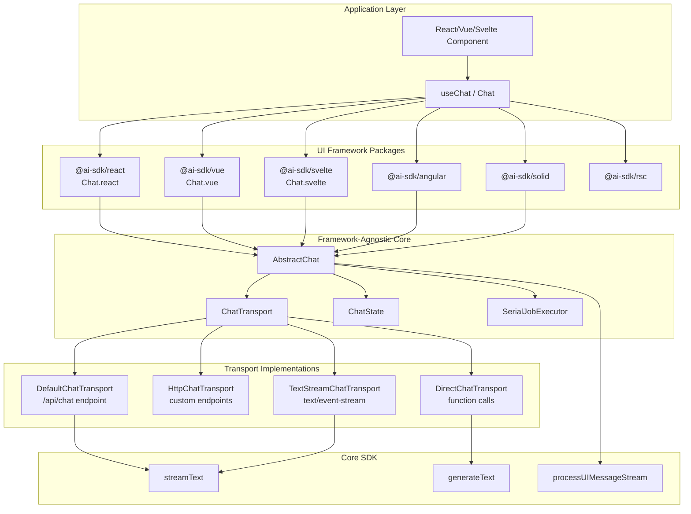
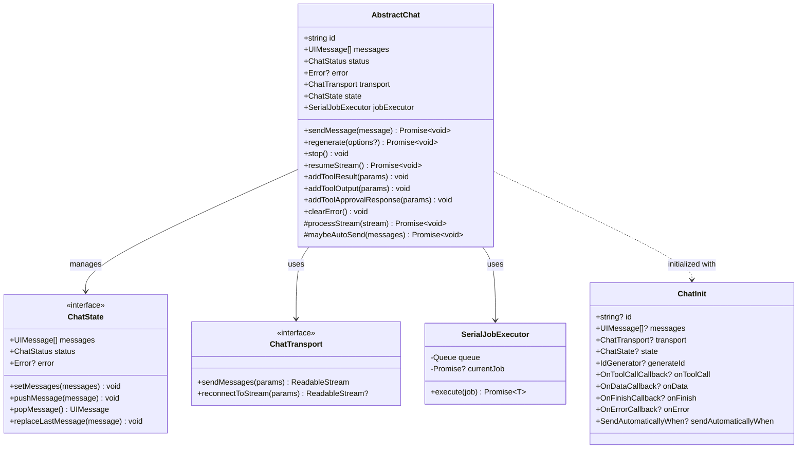
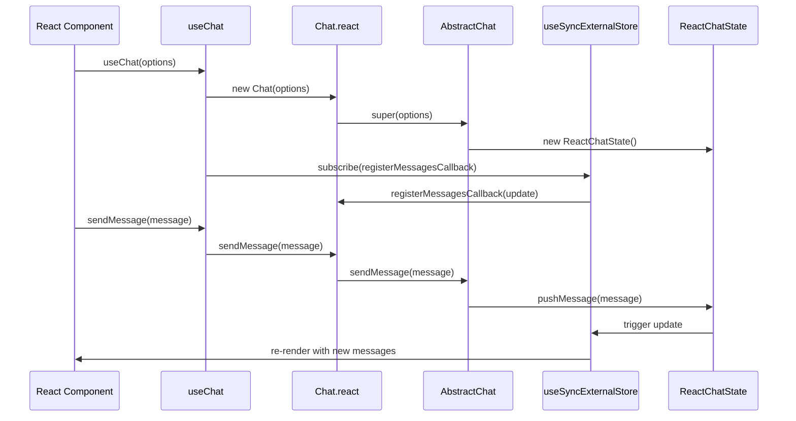
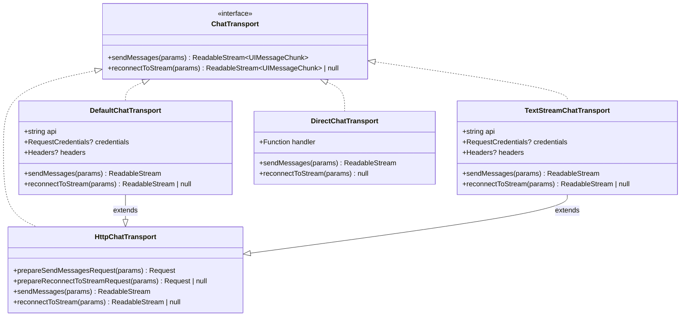
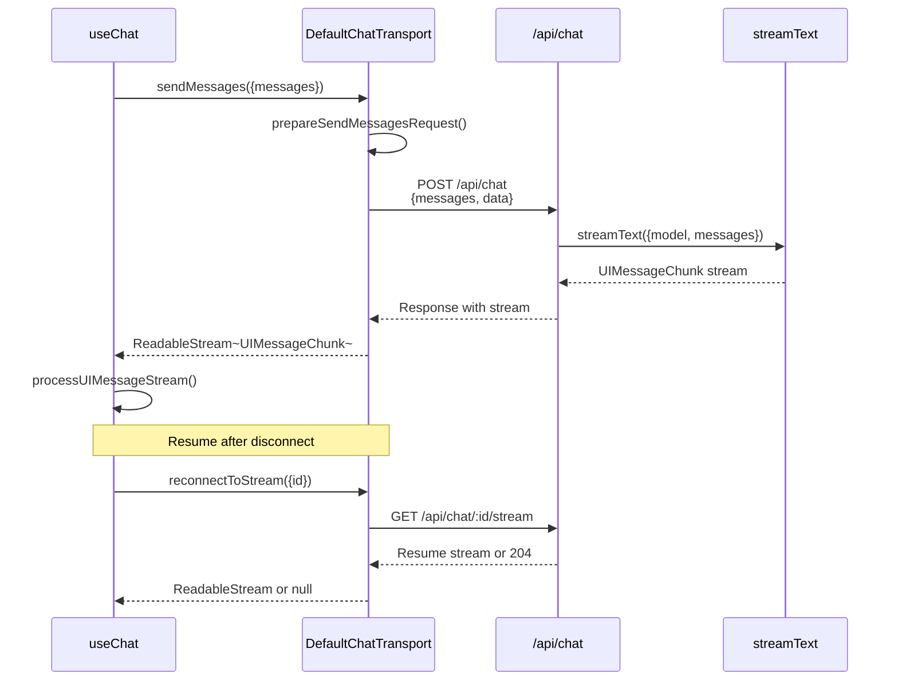
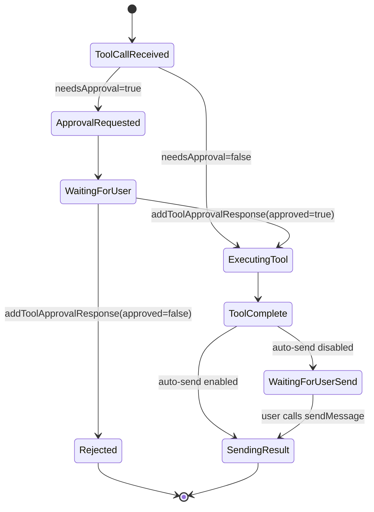

# UI Framework Integrations

<details>
<summary>Relevant source files</summary>

The following files were used as context for generating this wiki page:

- [.changeset/curvy-doors-shake.md](.changeset/curvy-doors-shake.md)
- [content/docs/07-reference/02-ai-sdk-ui/01-use-chat.mdx](content/docs/07-reference/02-ai-sdk-ui/01-use-chat.mdx)
- [examples/ai-e2e-next/app/api/chat/tool-approval-options/route.ts](examples/ai-e2e-next/app/api/chat/tool-approval-options/route.ts)
- [examples/ai-e2e-next/app/chat/test-tool-approval-options/page.tsx](examples/ai-e2e-next/app/chat/test-tool-approval-options/page.tsx)
- [examples/ai-e2e-next/components/tool/dynamic-tool-with-approval-view.tsx](examples/ai-e2e-next/components/tool/dynamic-tool-with-approval-view.tsx)
- [packages/ai/CHANGELOG.md](packages/ai/CHANGELOG.md)
- [packages/ai/package.json](packages/ai/package.json)
- [packages/ai/src/ui/chat.test.ts](packages/ai/src/ui/chat.test.ts)
- [packages/ai/src/ui/chat.ts](packages/ai/src/ui/chat.ts)
- [packages/ai/src/ui/index.ts](packages/ai/src/ui/index.ts)
- [packages/react/CHANGELOG.md](packages/react/CHANGELOG.md)
- [packages/react/package.json](packages/react/package.json)
- [packages/react/src/use-chat.ts](packages/react/src/use-chat.ts)
- [packages/react/src/use-chat.ui.test.tsx](packages/react/src/use-chat.ui.test.tsx)
- [packages/rsc/CHANGELOG.md](packages/rsc/CHANGELOG.md)
- [packages/rsc/package.json](packages/rsc/package.json)
- [packages/rsc/tests/e2e/next-server/CHANGELOG.md](packages/rsc/tests/e2e/next-server/CHANGELOG.md)
- [packages/svelte/CHANGELOG.md](packages/svelte/CHANGELOG.md)
- [packages/svelte/package.json](packages/svelte/package.json)
- [packages/svelte/src/chat.svelte.test.ts](packages/svelte/src/chat.svelte.test.ts)
- [packages/svelte/src/chat.svelte.ts](packages/svelte/src/chat.svelte.ts)
- [packages/vue/CHANGELOG.md](packages/vue/CHANGELOG.md)
- [packages/vue/package.json](packages/vue/package.json)

</details>

This document describes the UI Framework Layer of the AI SDK, which provides reactive chat interfaces for React, Vue, Svelte, Angular, Solid, and React Server Components. These packages build on the Core SDK ([page 2](#2)) to deliver framework-specific hooks, composables, and components for building conversational AI applications.

For information about the Core SDK functionality (generateText, streamText, tool calling), see [Core SDK Functionality](#2). For provider-specific implementations, see [Provider Ecosystem](#3).

---

## Architecture Overview

The UI Framework Layer implements a **transport-based architecture** that separates business logic (chat state management) from communication concerns (HTTP, server actions, direct function calls). All framework integrations share a common `AbstractChat` base class defined in [packages/ai/src/ui/chat.ts]() and provide framework-specific reactive wrappers.

### UI Framework Layer in SDK Architecture



**Sources:** [packages/ai/src/ui/chat.ts](), [packages/ai/src/ui/index.ts](), [packages/react/src/use-chat.ts](), [packages/svelte/src/chat.svelte.ts]()

---

## AbstractChat Foundation

The `AbstractChat` class ([packages/ai/src/ui/chat.ts:431-882]()) provides the core chat logic shared by all framework integrations. It implements message management, streaming coordination, tool execution, and automatic sending logic.

### AbstractChat Class Structure



**Sources:** [packages/ai/src/ui/chat.ts:431-882](), [packages/ai/src/ui/chat.ts:66-122](), [packages/ai/src/ui/chat-transport.ts]()

### Key Responsibilities

| Responsibility        | Implementation                                                         | Location                                        |
| --------------------- | ---------------------------------------------------------------------- | ----------------------------------------------- |
| Message Management    | Maintains ordered message list, adds user/assistant messages           | [packages/ai/src/ui/chat.ts:562-623]()          |
| Stream Processing     | Processes UIMessageChunk events, updates messages incrementally        | [packages/ai/src/ui/chat.ts:694-823]()          |
| Tool Execution        | Handles tool calls, approval requests, and result submission           | [packages/ai/src/ui/chat.ts:625-692]()          |
| Automatic Sending     | Evaluates `sendAutomaticallyWhen` condition after updates              | [packages/ai/src/ui/chat.ts:825-879]()          |
| Job Serialization     | Ensures stream processing happens sequentially via `SerialJobExecutor` | [packages/ai/src/util/serial-job-executor.ts]() |
| State Synchronization | Delegates to framework-specific `ChatState` implementation             | [packages/ai/src/ui/chat.ts:431-460]()          |

**Sources:** [packages/ai/src/ui/chat.ts:431-882](), [packages/ai/src/util/serial-job-executor.ts]()

---

## Framework-Specific Implementations

Each framework package provides a reactive wrapper around `AbstractChat` that integrates with the framework's reactivity system.

### React Integration (@ai-sdk/react)

React uses the `useChat` hook ([packages/react/src/use-chat.ts:58-163]()) which wraps a `Chat` instance ([packages/react/src/chat.react.ts]()) and exposes reactive state via `useSyncExternalStore`.



#### Key Features

- **Callback Refs Pattern**: Uses `callbacksRef` to avoid stale closures ([packages/react/src/use-chat.ts:64-96]())
- **Throttled Updates**: Supports `experimental_throttle` via `throttleit` package ([packages/react/package.json:43]())
- **Subscription Management**: Re-subscribes when chat ID changes ([packages/react/src/use-chat.ts:111-117]())
- **Triple External Store**: Separately subscribes to messages, status, and error ([packages/react/src/use-chat.ts:119-135]())

**Sources:** [packages/react/src/use-chat.ts:58-163](), [packages/react/src/chat.react.ts](), [packages/react/package.json]()

### Vue Integration (@ai-sdk/vue)

Vue provides a `useChat` composable that returns reactive refs managed by `swrv`:

```typescript
// Simplified structure from packages/vue/src/use-chat.ts
export function useChat<UI_MESSAGE extends UIMessage>(
  options?: UseChatOptions<UI_MESSAGE>
): UseChatHelpers<UI_MESSAGE> {
  const chat = ref(new Chat(options));
  const messages = ref(chat.value.messages);
  const status = ref(chat.value.status);
  const error = ref(chat.value.error);

  // Subscribe to chat updates
  chat.value['~registerMessagesCallback'](() => {
    messages.value = chat.value.messages;
  });

  return { messages, status, error, sendMessage, ... };
}
```

**Dependencies**: `swrv` for SWR-like caching ([packages/vue/package.json:42]())

**Sources:** [packages/vue/package.json](), [content/docs/07-reference/02-ai-sdk-ui/01-use-chat.mdx:28-32]()

### Svelte Integration (@ai-sdk/svelte)

Svelte 5 uses `$state` runes for fine-grained reactivity ([packages/svelte/src/chat.svelte.ts:1-44]()):

```typescript
class SvelteChatState<
  UI_MESSAGE extends UIMessage,
> implements ChatState<UI_MESSAGE> {
  messages: UI_MESSAGE[]
  status = $state<ChatStatus>('ready')
  error = $state<Error | undefined>(undefined)

  constructor(messages: UI_MESSAGE[] = []) {
    this.messages = $state(messages)
  }

  setMessages = (messages: UI_MESSAGE[]) => {
    this.messages = messages
  }

  pushMessage = (message: UI_MESSAGE) => {
    this.messages.push(message)
  }
  // ... other methods
}
```

The `Chat` class extends `AbstractChat` and provides the `SvelteChatState` implementation:

**Sources:** [packages/svelte/src/chat.svelte.ts:1-44](), [packages/svelte/package.json:49]()

### Angular Integration (@ai-sdk/angular)

Angular integration uses signals and dependency injection. Peer dependency: `@angular/core >=16.0.0`.

**Sources:** [TOC entry 4.4]()

### Solid Integration (@ai-sdk/solid)

Solid integration uses reactive primitives similar to the Svelte pattern.

**Sources:** [TOC entry 4.4]()

### React Server Components (@ai-sdk/rsc)

The `@ai-sdk/rsc` package enables server-side streaming to React Server Components using Next.js App Router. It provides `createStreamableUI` and integration with `streamText` output.

**Key Dependency**: `jsondiffpatch` for diffing state updates ([packages/rsc/package.json:51]())

**Sources:** [packages/rsc/package.json](), [TOC entry 4.5]()

---

## Transport Layer Architecture

The transport layer abstracts communication between the UI and backend, supporting HTTP endpoints, server actions, and direct function calls.

### ChatTransport Interface



### Transport Implementations

| Transport                 | Endpoint    | Protocol            | Use Case                                                                                   |
| ------------------------- | ----------- | ------------------- | ------------------------------------------------------------------------------------------ |
| `DefaultChatTransport`    | `/api/chat` | UIMessageChunk JSON | Default HTTP transport ([packages/ai/src/ui/default-chat-transport.ts]())                  |
| `HttpChatTransport`       | Custom      | UIMessageChunk JSON | Custom request/response handling ([packages/ai/src/ui/http-chat-transport.ts]())           |
| `TextStreamChatTransport` | Custom      | `text/event-stream` | Legacy SSE support ([packages/ai/src/ui/text-stream-chat-transport.ts]())                  |
| `DirectChatTransport`     | N/A         | In-process          | Direct function calls, server components ([packages/ai/src/ui/direct-chat-transport.ts]()) |

### DefaultChatTransport Flow



**Sources:** [packages/ai/src/ui/default-chat-transport.ts](), [packages/ai/src/ui/http-chat-transport.ts](), [content/docs/07-reference/02-ai-sdk-ui/01-use-chat.mdx:57-106]()

---

## State Management Patterns

Each framework implements `ChatState` interface ([packages/ai/src/ui/chat.ts:189-233]()) using framework-specific reactivity primitives.

### ChatState Interface

```typescript
export interface ChatState<UI_MESSAGE extends UIMessage> {
  messages: UI_MESSAGE[]
  status: ChatStatus
  error: Error | undefined

  setMessages(messages: UI_MESSAGE[]): void
  pushMessage(message: UI_MESSAGE): void
  popMessage(): UI_MESSAGE | undefined
  replaceLastMessage(message: UI_MESSAGE): void
}
```

### Framework Comparison

| Framework | Reactivity             | Implementation                                                       | Subscription                                      |
| --------- | ---------------------- | -------------------------------------------------------------------- | ------------------------------------------------- |
| React     | `useSyncExternalStore` | Manual callbacks + refs ([packages/react/src/chat.react.ts]())       | `registerMessagesCallback` with optional throttle |
| Vue       | `ref`                  | Vue refs ([packages/vue/src/use-chat.ts]())                          | Direct ref updates                                |
| Svelte 5  | `$state` runes         | Svelte 5 fine-grained ([packages/svelte/src/chat.svelte.ts:23-44]()) | Automatic                                         |
| Angular   | Signals                | Angular signals                                                      | Automatic                                         |
| Solid     | Reactive primitives    | Solid stores                                                         | Automatic                                         |

### SerialJobExecutor for Consistency

The `SerialJobExecutor` ([packages/ai/src/util/serial-job-executor.ts]()) ensures that stream processing jobs execute sequentially, preventing race conditions:

```typescript
export class SerialJobExecutor {
  private queue: Array<() => Promise<unknown>> = []
  private currentJob: Promise<unknown> | undefined

  async execute<T>(job: () => Promise<T>): Promise<T> {
    return new Promise((resolve, reject) => {
      this.queue.push(async () => {
        try {
          resolve(await job())
        } catch (error) {
          reject(error)
        }
      })
      this.processQueue()
    })
  }
  // ... queue processing logic
}
```

**Sources:** [packages/ai/src/util/serial-job-executor.ts](), [packages/ai/src/ui/chat.ts:431-460]()

---

## Common Features

### Tool Calling and Approval

All frameworks support tool calling with optional approval workflows via `needsApproval` ([packages/ai/src/ui/chat.ts:625-692]()):



#### API Methods

- `addToolApprovalResponse({id, approved, reason, options?})` - Respond to approval request ([packages/ai/src/ui/chat.ts:664-692]())
- `addToolOutput({tool, toolCallId, output, errorText?, options?})` - Submit tool result ([packages/ai/src/ui/chat.ts:625-663]())
- `addToolResult({toolCallId, result, options?})` - Legacy API (deprecated)

**Example from tests:**

[examples/ai-e2e-next/components/tool/dynamic-tool-with-approval-view.tsx:1-56]()

**Sources:** [packages/ai/src/ui/chat.ts:625-692](), [examples/ai-e2e-next/components/tool/dynamic-tool-with-approval-view.tsx](), [.changeset/curvy-doors-shake.md]()

### File Attachments

Convert browser `FileList` to `FileUIPart[]` via `convertFileListToFileUIParts` ([packages/ai/src/ui/convert-file-list-to-file-ui-parts.ts]()):

```typescript
const files: FileList = fileInput.files
const fileParts = await convertFileListToFileUIParts(files)

sendMessage({
  parts: [{ type: 'text', text: 'Describe this image' }, ...fileParts],
})
```

**Sources:** [packages/ai/src/ui/convert-file-list-to-file-ui-parts.ts](), [packages/ai/src/ui/index.ts:19]()

### Automatic Sending

The `sendAutomaticallyWhen` callback determines when to auto-send after state changes ([packages/ai/src/ui/chat.ts:825-879]()):

**Built-in Predicates:**

| Function                                              | Condition                                     | Use Case                         |
| ----------------------------------------------------- | --------------------------------------------- | -------------------------------- |
| `lastAssistantMessageIsCompleteWithToolCalls`         | Last message has tool calls in terminal state | Automatic tool result submission |
| `lastAssistantMessageIsCompleteWithApprovalResponses` | Last message has approved tools               | Automatic post-approval sending  |

**Example:**

```typescript
const { sendMessage } = useChat({
  sendAutomaticallyWhen: lastAssistantMessageIsCompleteWithToolCalls,
})
```

**Sources:** [packages/ai/src/ui/last-assistant-message-is-complete-with-tool-calls.ts](), [packages/ai/src/ui/last-assistant-message-is-complete-with-approval-responses.ts](), [examples/ai-e2e-next/app/chat/test-tool-approval-options/page.tsx:24]()

### Stream Resumption

Reconnect to interrupted streams using `resumeStream()` ([packages/ai/src/ui/chat.ts:580-623]()):

```typescript
const { resumeStream, status } = useChat({ resume: true })

useEffect(() => {
  if (resume && status === 'ready') {
    resumeStream() // Automatically resume on mount
  }
}, [resume, status])
```

The transport's `reconnectToStream` method ([packages/ai/src/ui/chat-transport.ts:44-57]()) requests the backend to resume the stream. Backend returns 204 if no active stream exists.

**Sources:** [packages/ai/src/ui/chat.ts:580-623](), [packages/ai/src/ui/chat-transport.ts:44-57](), [packages/react/src/use-chat.ts:149-153]()

### Callback System

| Callback     | Signature                                          | When Called                    |
| ------------ | -------------------------------------------------- | ------------------------------ |
| `onToolCall` | `(toolCall) => void \| Promise<void>`              | After receiving tool-call part |
| `onData`     | `(dataPart) => void`                               | After receiving data part      |
| `onFinish`   | `({message, messages, finishReason, ...}) => void` | After message completion       |
| `onError`    | `(error) => void`                                  | On stream or processing error  |

**Sources:** [packages/ai/src/ui/chat.ts:66-122](), [packages/react/src/use-chat.ts:64-85](), [content/docs/07-reference/02-ai-sdk-ui/01-use-chat.mdx:127-198]()

---

## Testing Infrastructure

All framework packages share a common testing pattern using `@ai-sdk/test-server`:

```typescript
const server = createTestServer({
  '/api/chat': {},
  '/api/chat/123/stream': {},
})

it('should stream messages', async () => {
  server.urls['/api/chat'].response = {
    type: 'stream-chunks',
    chunks: [
      formatChunk({ type: 'text-delta', delta: 'Hello' }),
      formatChunk({ type: 'finish', finishReason: 'stop' }),
    ],
  }

  const chat = new Chat({ generateId: mockId() })
  await chat.sendMessage({ parts: [{ type: 'text', text: 'Hi' }] })

  expect(chat.messages).toHaveLength(2)
  expect(chat.messages[1].parts[0].text).toBe('Hello')
})
```

**Sources:** [packages/react/src/use-chat.ui.test.tsx](), [packages/svelte/src/chat.svelte.test.ts](), [packages/ai/src/ui/chat.test.ts]()

---

## Package Dependencies

### React Package

```json
{
  "dependencies": {
    "ai": "workspace:*",
    "@ai-sdk/provider-utils": "workspace:*",
    "swr": "^2.2.5",
    "throttleit": "2.1.0"
  },
  "peerDependencies": {
    "react": "^18 || ~19.0.1 || ~19.1.2 || ^19.2.1"
  }
}
```

**Sources:** [packages/react/package.json:39-64]()

### Vue Package

```json
{
  "dependencies": {
    "ai": "workspace:*",
    "@ai-sdk/provider-utils": "workspace:*",
    "swrv": "^1.0.4"
  },
  "peerDependencies": {
    "vue": "^3.3.4"
  }
}
```

**Sources:** [packages/vue/package.json:39-62]()

### Svelte Package

```json
{
  "dependencies": {
    "ai": "workspace:*",
    "@ai-sdk/provider-utils": "workspace:*"
  },
  "peerDependencies": {
    "svelte": "^5.31.0"
  }
}
```

**Sources:** [packages/svelte/package.json:48-60]()

### RSC Package

```json
{
  "dependencies": {
    "ai": "workspace:*",
    "@ai-sdk/provider": "workspace:*",
    "@ai-sdk/provider-utils": "workspace:*",
    "jsondiffpatch": "0.7.3"
  },
  "peerDependencies": {
    "react": "^18 || ~19.0.1 || ~19.1.2 || ^19.2.1"
  }
}
```

**Sources:** [packages/rsc/package.json:47-76]()

---

## Version Coordination

The UI framework packages follow coordinated versioning with the core `ai` package:

| Package          | Current Version | Core Dependency   |
| ---------------- | --------------- | ----------------- |
| `ai`             | `7.0.0-beta.7`  | N/A               |
| `@ai-sdk/react`  | `4.0.0-beta.7`  | `ai@7.0.0-beta.7` |
| `@ai-sdk/vue`    | `4.0.0-beta.7`  | `ai@7.0.0-beta.7` |
| `@ai-sdk/svelte` | `5.0.0-beta.7`  | `ai@7.0.0-beta.7` |
| `@ai-sdk/rsc`    | `3.0.0-beta.7`  | `ai@7.0.0-beta.7` |

Svelte has a higher major version (5.x) to align with Svelte 5's breaking changes.

**Sources:** [packages/ai/package.json:3](), [packages/react/package.json:3](), [packages/vue/package.json:3](), [packages/svelte/package.json:3](), [packages/rsc/package.json:3]()
