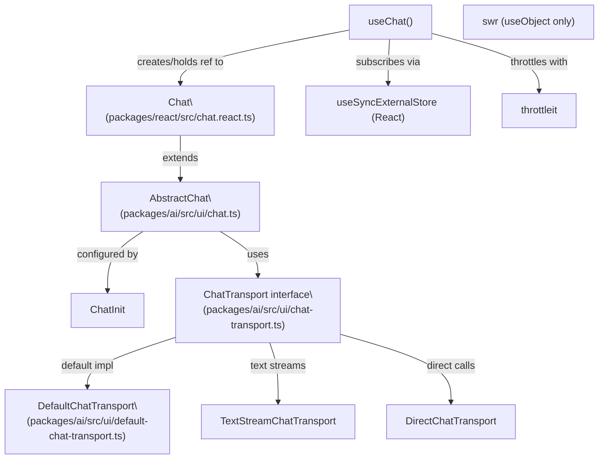
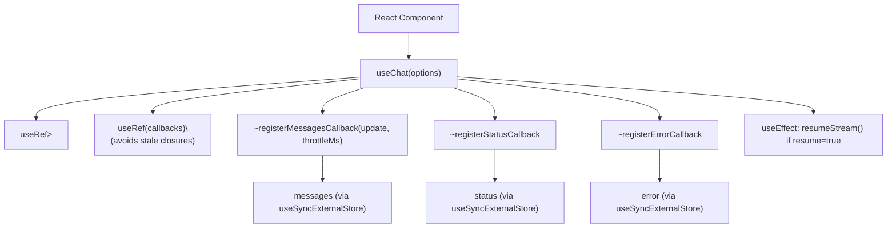
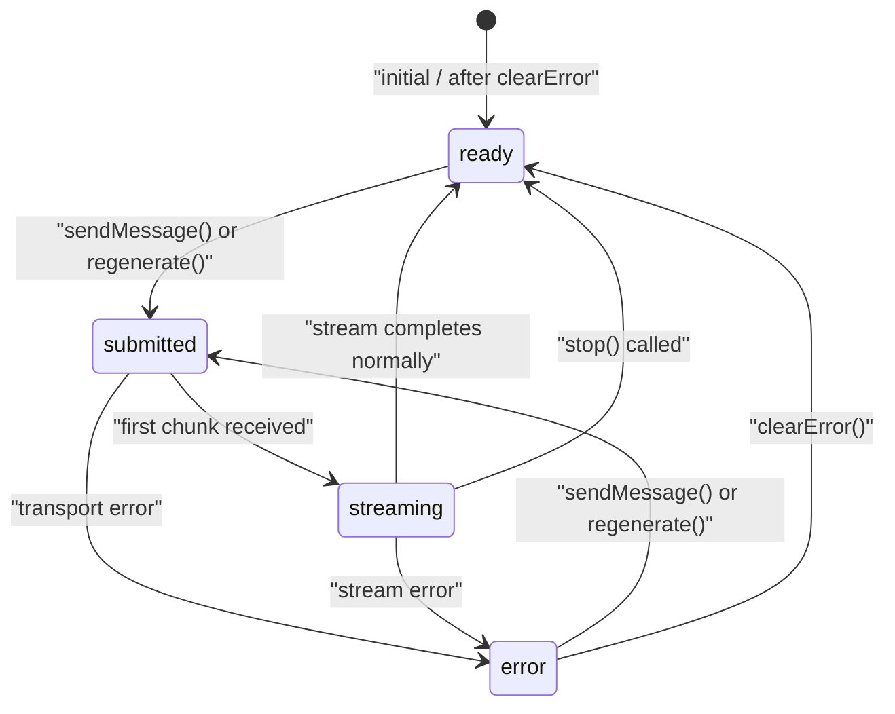
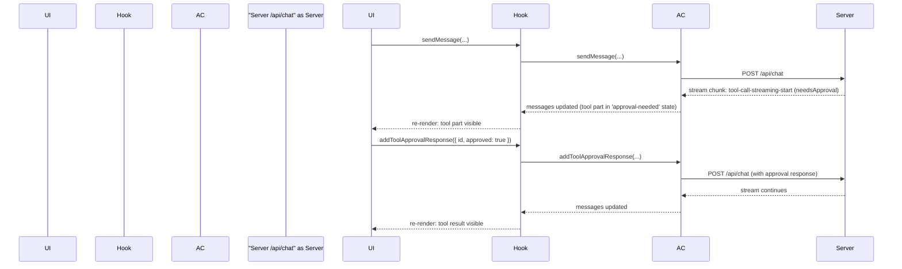

# React Integration (@ai-sdk/react)

<details>
<summary>Relevant source files</summary>

The following files were used as context for generating this wiki page:

- [.changeset/curvy-doors-shake.md](.changeset/curvy-doors-shake.md)
- [content/docs/07-reference/02-ai-sdk-ui/01-use-chat.mdx](content/docs/07-reference/02-ai-sdk-ui/01-use-chat.mdx)
- [examples/ai-e2e-next/app/api/chat/tool-approval-options/route.ts](examples/ai-e2e-next/app/api/chat/tool-approval-options/route.ts)
- [examples/ai-e2e-next/app/chat/test-tool-approval-options/page.tsx](examples/ai-e2e-next/app/chat/test-tool-approval-options/page.tsx)
- [examples/ai-e2e-next/components/tool/dynamic-tool-with-approval-view.tsx](examples/ai-e2e-next/components/tool/dynamic-tool-with-approval-view.tsx)
- [packages/ai/CHANGELOG.md](packages/ai/CHANGELOG.md)
- [packages/ai/package.json](packages/ai/package.json)
- [packages/ai/src/ui/chat.test.ts](packages/ai/src/ui/chat.test.ts)
- [packages/ai/src/ui/chat.ts](packages/ai/src/ui/chat.ts)
- [packages/ai/src/ui/index.ts](packages/ai/src/ui/index.ts)
- [packages/react/CHANGELOG.md](packages/react/CHANGELOG.md)
- [packages/react/package.json](packages/react/package.json)
- [packages/react/src/use-chat.ts](packages/react/src/use-chat.ts)
- [packages/react/src/use-chat.ui.test.tsx](packages/react/src/use-chat.ui.test.tsx)
- [packages/rsc/CHANGELOG.md](packages/rsc/CHANGELOG.md)
- [packages/rsc/package.json](packages/rsc/package.json)
- [packages/rsc/tests/e2e/next-server/CHANGELOG.md](packages/rsc/tests/e2e/next-server/CHANGELOG.md)
- [packages/svelte/CHANGELOG.md](packages/svelte/CHANGELOG.md)
- [packages/svelte/package.json](packages/svelte/package.json)
- [packages/svelte/src/chat.svelte.test.ts](packages/svelte/src/chat.svelte.test.ts)
- [packages/svelte/src/chat.svelte.ts](packages/svelte/src/chat.svelte.ts)
- [packages/vue/CHANGELOG.md](packages/vue/CHANGELOG.md)
- [packages/vue/package.json](packages/vue/package.json)

</details>

This page documents the `@ai-sdk/react` package: the `useChat` hook, the `Chat` class it wraps, all configuration options, returned helpers, the tool approval flow, stream resumption, and the throttle mechanism.

For the underlying framework-agnostic `AbstractChat` class and the `ChatTransport` interface that all UI integrations share, see [Framework-Agnostic Chat Architecture](#4.1). For Vue and Svelte equivalents, see [Vue and Svelte Integrations](#4.3). For the React Server Components package (`@ai-sdk/rsc`), see [React Server Components](#4.5).

---

## Package Overview

`@ai-sdk/react` is located at `packages/react/` and published as `@ai-sdk/react`. It wraps the shared `AbstractChat` class from the `ai` package with React-idiomatic subscription via `useSyncExternalStore`.

| Property           | Value                                                  |
| ------------------ | ------------------------------------------------------ |
| Package name       | `@ai-sdk/react`                                        |
| Current version    | `3.0.x`                                                |
| Peer dependency    | `react` `^18 \|\| ~19.0.1 \|\| ~19.1.2 \|\| ^19.2.1`   |
| Runtime dependency | `ai` (workspace), `swr` `^2.2.5`, `throttleit` `2.1.0` |
| Node requirement   | `>=18`                                                 |

Sources: [packages/react/package.json:1-84]()

---

## Architecture

**Diagram: Package and Class Dependencies**



Sources: [packages/react/src/use-chat.ts:1-170](), [packages/react/package.json:39-44](), [packages/ai/src/ui/chat.ts:1-50]()

**Diagram: useChat Hook Internals**



Sources: [packages/react/src/use-chat.ts:63-170]()

The `useChat` hook stores the `Chat` instance in a `useRef`. On every render it refreshes a `callbacksRef` so that `onToolCall`, `onData`, `onFinish`, and `onError` callbacks always use the latest closure values without recreating the `Chat` object. The actual reactivity is driven by `useSyncExternalStore`, which subscribes to the `~registerMessagesCallback`, `~registerStatusCallback`, and `~registerErrorCallback` methods on `AbstractChat`.

---

## `useChat` Hook

Exported from `packages/react/src/use-chat.ts`.

```
import { useChat } from '@ai-sdk/react';
```

### Signature

```
function useChat<UI_MESSAGE extends UIMessage = UIMessage>(
  options?: UseChatOptions<UI_MESSAGE>
): UseChatHelpers<UI_MESSAGE>
```

### `UseChatOptions`

`UseChatOptions` is either `{ chat: Chat<UI_MESSAGE> } & extras` (pass an existing `Chat` instance) or `ChatInit<UI_MESSAGE> & extras` (let `useChat` create and own the instance).

The `extras` that only exist on `UseChatOptions` (not on `ChatInit`):

| Option                  | Type      | Default     | Description                                                                              |
| ----------------------- | --------- | ----------- | ---------------------------------------------------------------------------------------- |
| `experimental_throttle` | `number`  | `undefined` | Milliseconds to throttle message/data re-renders. `undefined` disables throttling.       |
| `resume`                | `boolean` | `false`     | If `true`, calls `resumeStream()` on mount to reconnect to an active server-side stream. |

All other options come directly from `ChatInit<UI_MESSAGE>`:

| Option                  | Type                                               | Default                               | Description                                                                                                 |
| ----------------------- | -------------------------------------------------- | ------------------------------------- | ----------------------------------------------------------------------------------------------------------- |
| `id`                    | `string`                                           | auto-generated                        | Chat session identifier. Changing this recreates the `Chat` instance.                                       |
| `messages`              | `UI_MESSAGE[]`                                     | `[]`                                  | Initial messages to populate the chat.                                                                      |
| `transport`             | `ChatTransport`                                    | `DefaultChatTransport` at `/api/chat` | Transport layer used for sending messages and receiving streams.                                            |
| `generateId`            | `() => string`                                     | built-in                              | ID generator for new messages.                                                                              |
| `messageMetadataSchema` | `FlexibleSchema`                                   | none                                  | Schema used to validate `metadata` on incoming assistant messages.                                          |
| `dataPartSchemas`       | `UIDataTypesToSchemas<...>`                        | none                                  | Schemas for typed data parts arriving in the stream.                                                        |
| `onToolCall`            | `(options: { toolCall }) => void \| Promise<void>` | none                                  | Called when a tool call is received in an assistant message.                                                |
| `onFinish`              | `(options) => void \| Promise<void>`               | none                                  | Called when a generation stream completes.                                                                  |
| `onData`                | `(data: JSONValue[]) => void`                      | none                                  | Called when data parts arrive.                                                                              |
| `onError`               | `(error: Error) => void`                           | none                                  | Called when a transport or stream error occurs.                                                             |
| `sendAutomaticallyWhen` | `(options) => boolean \| Promise<boolean>`         | none                                  | If provided, the chat submits automatically when the condition is met (e.g., after a tool result is added). |

Sources: [packages/react/src/use-chat.ts:42-56](), [packages/ai/src/ui/chat.ts:86-250](), [content/docs/07-reference/02-ai-sdk-ui/01-use-chat.mdx:44-300]()

---

### Transport Configuration

The `transport` option accepts any object implementing `ChatTransport`. Three built-in transports are provided:

**`DefaultChatTransport`** — sends `UIMessage` chunks over HTTP POST using the structured chunk protocol.

| Option                            | Type                                              | Description                                                   |
| --------------------------------- | ------------------------------------------------- | ------------------------------------------------------------- |
| `api`                             | `string`                                          | Endpoint URL. Default: `/api/chat`.                           |
| `credentials`                     | `RequestCredentials`                              | Fetch credentials mode.                                       |
| `headers`                         | `Record<string,string> \| Headers \| (() => ...)` | Static or dynamic headers for every request.                  |
| `body`                            | `object`                                          | Extra JSON properties merged into every request body.         |
| `fetch`                           | `typeof fetch`                                    | Custom fetch function.                                        |
| `onResponse`                      | `(response: Response) => void`                    | Called before stream consumption begins.                      |
| `prepareRequestBody`              | `(options) => BodyInit`                           | Override the full request body serialization.                 |
| `prepareRequestHeaders`           | `(options) => Headers`                            | Override headers per-request.                                 |
| `prepareReconnectToStreamRequest` | `(options) => Request \| null`                    | Called when `resume: true` reconnects; return `null` to skip. |
| `reconnectLastStreamedMessageId`  | `string`                                          | Pass the last streamed message ID for reconnection.           |

**`TextStreamChatTransport`** — same options as `DefaultChatTransport` but consumes a plain text stream instead of JSON-encoded chunks.

**`DirectChatTransport`** — calls a local function directly without HTTP, useful for testing or serverless edge cases.

Sources: [content/docs/07-reference/02-ai-sdk-ui/01-use-chat.mdx:60-200](), [packages/ai/src/ui/index.ts:1-50]()

---

### `UseChatHelpers` Return Values

`useChat` returns `UseChatHelpers<UI_MESSAGE>`, which is a mix of read-only reactive state and action methods.

| Property / Method         | Type                                                                           | Description                                                           |
| ------------------------- | ------------------------------------------------------------------------------ | --------------------------------------------------------------------- |
| `id`                      | `string`                                                                       | The chat's unique identifier.                                         |
| `messages`                | `UI_MESSAGE[]`                                                                 | Current message array. Updates reactively via `useSyncExternalStore`. |
| `status`                  | `ChatStatus`                                                                   | Current chat lifecycle status (see below).                            |
| `error`                   | `Error \| undefined`                                                           | Last transport or stream error.                                       |
| `sendMessage`             | `(message: CreateUIMessage<UI_MESSAGE>, options?: ChatRequestOptions) => void` | Appends a user message and triggers a generation request.             |
| `regenerate`              | `(options?: ChatRequestOptions) => void`                                       | Removes the last assistant message and re-submits.                    |
| `stop`                    | `() => void`                                                                   | Aborts the active stream.                                             |
| `resumeStream`            | `() => void`                                                                   | Attempts to reconnect to an active server-side stream.                |
| `setMessages`             | `(msgs: UI_MESSAGE[] \| ((msgs: UI_MESSAGE[]) => UI_MESSAGE[])) => void`       | Directly replaces the local message array.                            |
| `addToolOutput`           | `({ toolCallId, output }) => void`                                             | Supplies a tool result to the chat (formerly `addToolResult`).        |
| `addToolApprovalResponse` | `({ id, approved, reason? }) => void`                                          | Approves or denies a pending tool call.                               |
| `clearError`              | `() => void`                                                                   | Clears the current error state.                                       |

Sources: [packages/react/src/use-chat.ts:12-41](), [packages/ai/src/ui/chat.ts:86-170]()

---

### `ChatStatus` State Machine

**Diagram: ChatStatus Transitions**



| Status      | Description                                        |
| ----------- | -------------------------------------------------- |
| `ready`     | No active request; the UI is idle.                 |
| `submitted` | Request has been sent; waiting for the first byte. |
| `streaming` | Actively receiving and processing stream chunks.   |
| `error`     | An error occurred; `error` property is populated.  |

Sources: [packages/ai/src/ui/chat.ts:86-90]()

---

## Tool Approval Flow

When a tool on the server is declared with `needsApproval: true`, the assistant message stream includes a tool part in a pending approval state. The UI must call `addToolApprovalResponse` to proceed.

**Diagram: Tool Approval Sequence**



Sources: [packages/react/src/use-chat.ts:28-40](), [packages/ai/src/ui/chat.ts:68-84](), [packages/react/src/use-chat.ui.test.tsx:1-100]()

The `onToolCall` callback is invoked for tools that execute client-side. It receives `{ toolCall }` where `toolCall` is typed by the `TOOLS` generic on `UIMessage`. The callback should return the tool's output so the chat can append a result part automatically.

---

## Stream Resumption

When `resume: true` is passed to `useChat`, a `useEffect` runs on mount that calls `chatRef.current.resumeStream()`. This sends a reconnect request using `prepareReconnectToStreamRequest` (if configured on the transport) or the default reconnect logic, and re-attaches to any stream the server is still producing for this chat ID.

A fix in `ai@6.0.90` (released as `@ai-sdk/react@3.0.92`) ensures the `status` remains `ready` when the server returns HTTP 204 (no active stream), avoiding a flash of `submitted` state on page load.

```
// Example: reconnect on mount
const { messages, status } = useChat({
  id: 'my-chat-id',
  resume: true,
  transport: new DefaultChatTransport({
    api: '/api/chat',
    prepareReconnectToStreamRequest: ({ id, lastStreamedMessageId }) => {
      return new Request(`/api/chat/${id}/stream`, { method: 'GET' });
    },
  }),
});
```

Sources: [packages/react/src/use-chat.ts:149-153](), [packages/react/CHANGELOG.md:60-66]()

---

## Throttling with `experimental_throttle`

When set, `experimental_throttle` passes the wait time in milliseconds to `~registerMessagesCallback`. The `throttleit` library (pinned at `2.1.0`) is used internally to debounce/throttle message store update callbacks, preventing excessive React re-renders during high-frequency streaming.

The default is `undefined`, which disables throttling and delivers every update immediately.

Sources: [packages/react/src/use-chat.ts:111-117](), [packages/react/package.json:43]()

---

## Stale Closure Handling

`useChat` uses a `callbacksRef` pattern to avoid stale React closures on `onToolCall`, `onData`, `onFinish`, `onError`, and `sendAutomaticallyWhen`. On each render the ref is updated, and the `Chat` instance is given proxy functions that forward to `callbacksRef.current`:

```typescript
// packages/react/src/use-chat.ts:88-96
const optionsWithCallbacks = {
  ...options,
  onToolCall: (arg) => callbacksRef.current.onToolCall?.(arg),
  onFinish: (arg) => callbacksRef.current.onFinish?.(arg),
  // ...
}
```

This means the `Chat` object only needs to be created once (or when `id` changes), while callbacks always see the latest props. A regression test for this was added in `@ai-sdk/react@3.0.24`.

Sources: [packages/react/src/use-chat.ts:63-109](), [packages/react/CHANGELOG.md:527-535]()

---

## The `Chat` Class

`packages/react/src/chat.react.ts` exports a `Chat<UI_MESSAGE>` class that extends `AbstractChat<UI_MESSAGE>` (from `packages/ai/src/ui/chat.ts`). It accepts the same `ChatInit<UI_MESSAGE>` options as `useChat` and can be instantiated independently and passed to `useChat` via the `chat` option:

```typescript
// Create once (e.g. in a store or context)
const chatInstance = new Chat({
  id: 'session-123',
  transport: new DefaultChatTransport({ api: '/api/chat' }),
})

// Share across components
function MyComponent() {
  const { messages, sendMessage } = useChat({ chat: chatInstance })
}
```

When a `chat` instance is provided, `useChat` does not create its own. When the `chat` prop changes (different object reference) or the `id` option changes, a new `Chat` instance is created and the subscriptions are re-established.

Sources: [packages/react/src/use-chat.ts:98-117](), [packages/ai/src/ui/chat.ts:1-50]()

---

## `CreateUIMessage` and `UIMessage` Types

`useChat` is generic over `UI_MESSAGE extends UIMessage`. The default `UIMessage` interface (from `packages/ai/src/ui/ui-messages.ts`) is:

| Field      | Type                                | Description                                                      |
| ---------- | ----------------------------------- | ---------------------------------------------------------------- |
| `id`       | `string`                            | Unique message ID.                                               |
| `role`     | `'system' \| 'user' \| 'assistant'` | Message role.                                                    |
| `parts`    | `UIMessagePart[]`                   | Typed content parts (text, tool, reasoning, file, data, source). |
| `metadata` | `METADATA`                          | Optional typed metadata, validated by `messageMetadataSchema`.   |

`CreateUIMessage<UI_MESSAGE>` is `UIMessage` with `id` and `role` made optional — this is the type accepted by `sendMessage`.

`ChatRequestOptions` (the second argument to `sendMessage` and `regenerate`) can carry per-request `headers`, `body`, and `metadata`.

Sources: [packages/ai/src/ui/ui-messages.ts:42-80](), [packages/ai/src/ui/chat.ts:33-63](), [packages/react/src/use-chat.ts:10-11]()

---

## `useObject` Hook

`@ai-sdk/react` also exports a `useObject` hook (backed by `swr`) for consuming structured object streams that do not require a conversational message format. It accepts `api`, `schema`, `headers` (including async functions since `@ai-sdk/react@3.0.28`), `onFinish`, and `onError`. This hook is separate from `useChat` and is not covered in depth here; see the API reference documentation for full details.

Sources: [packages/react/CHANGELOG.md:496-504]()
