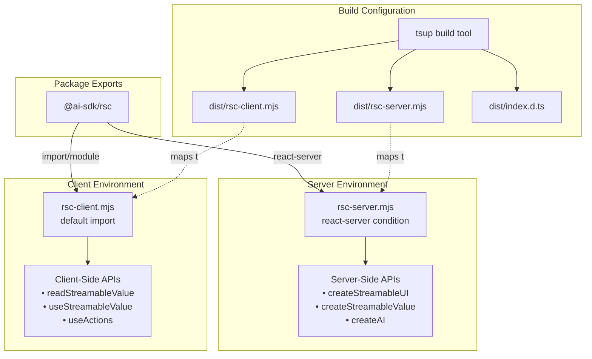
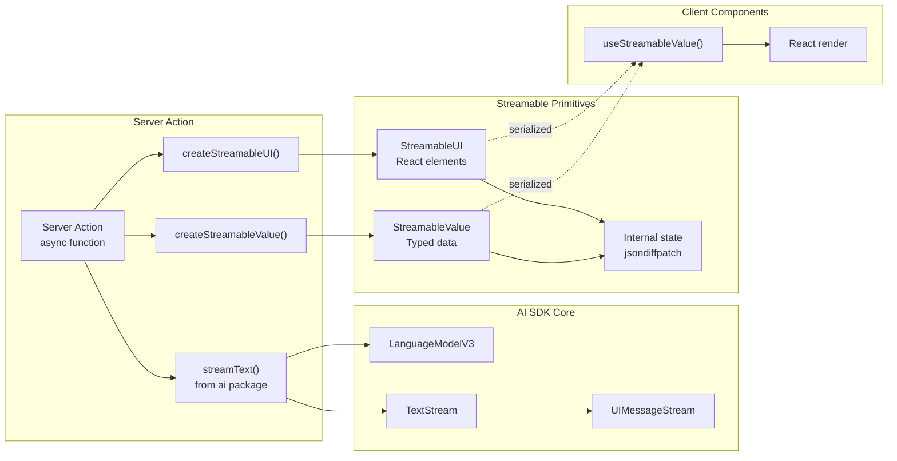
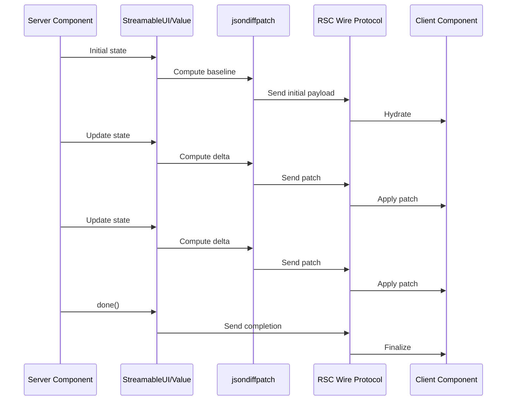
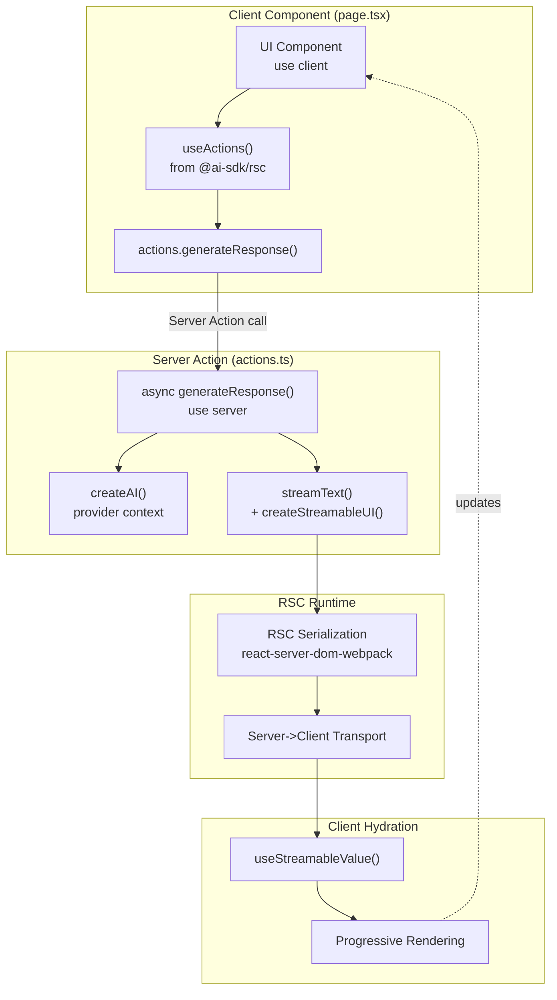
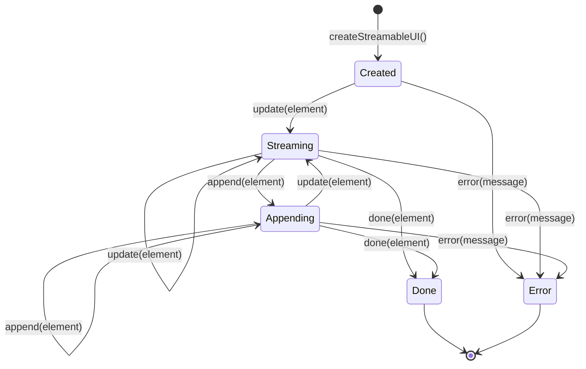
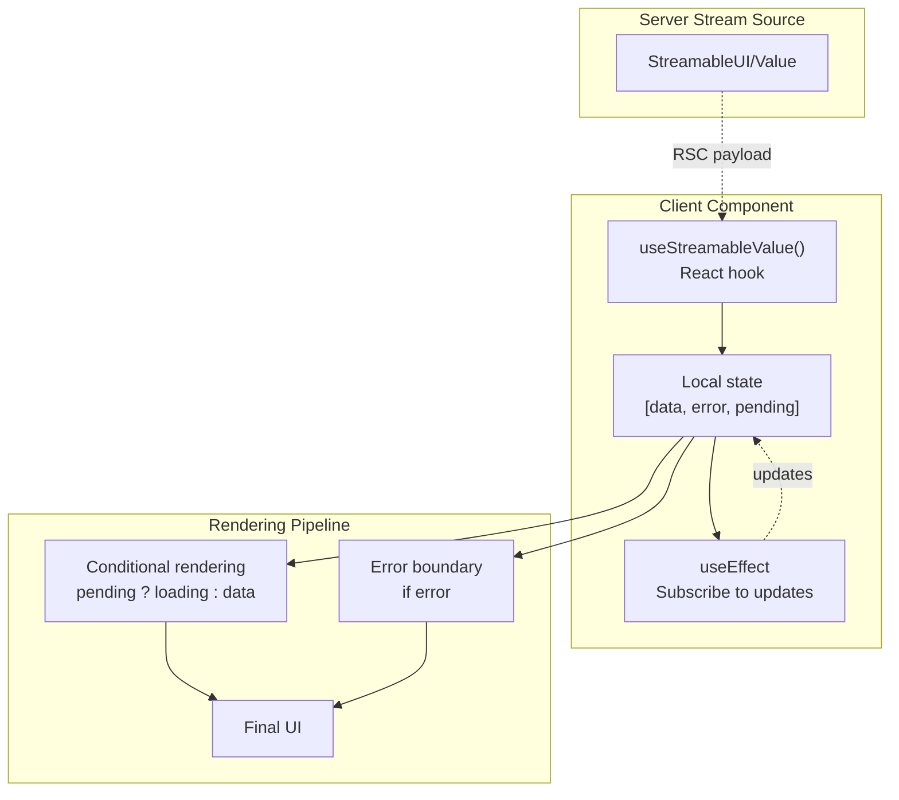
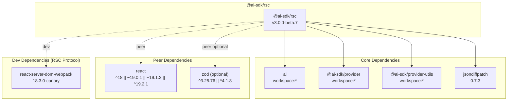
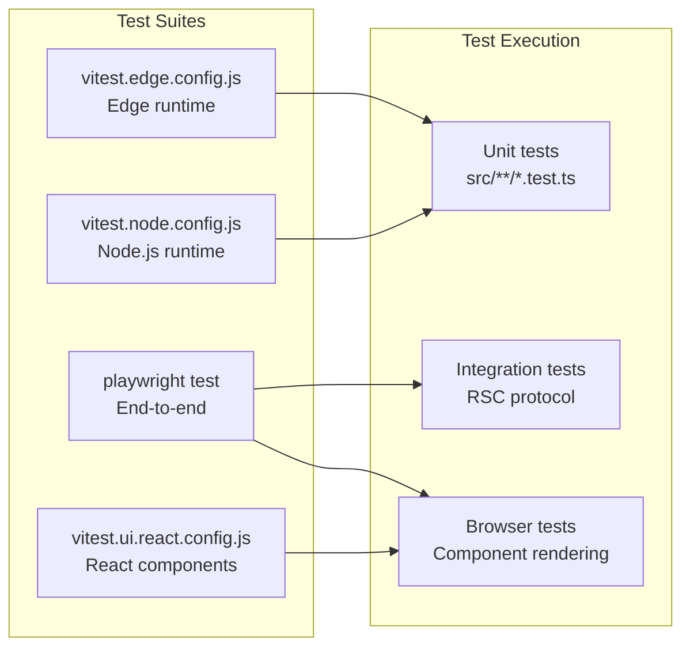
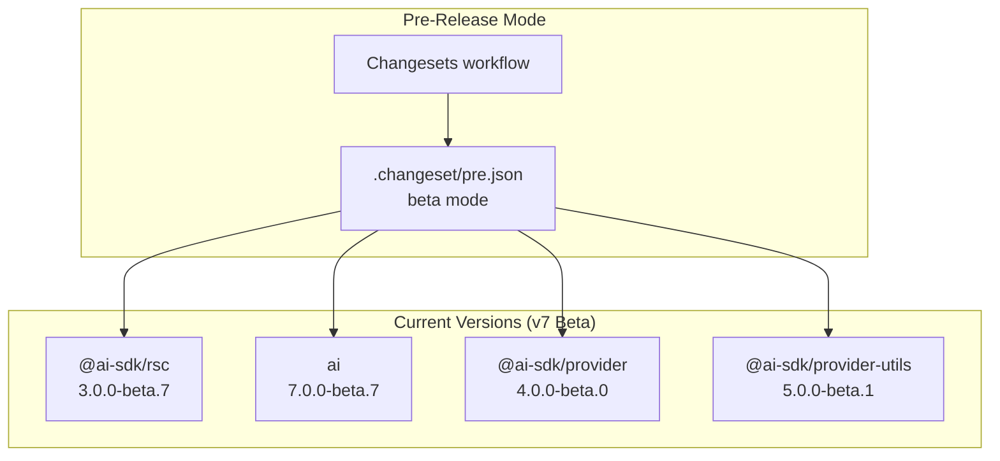
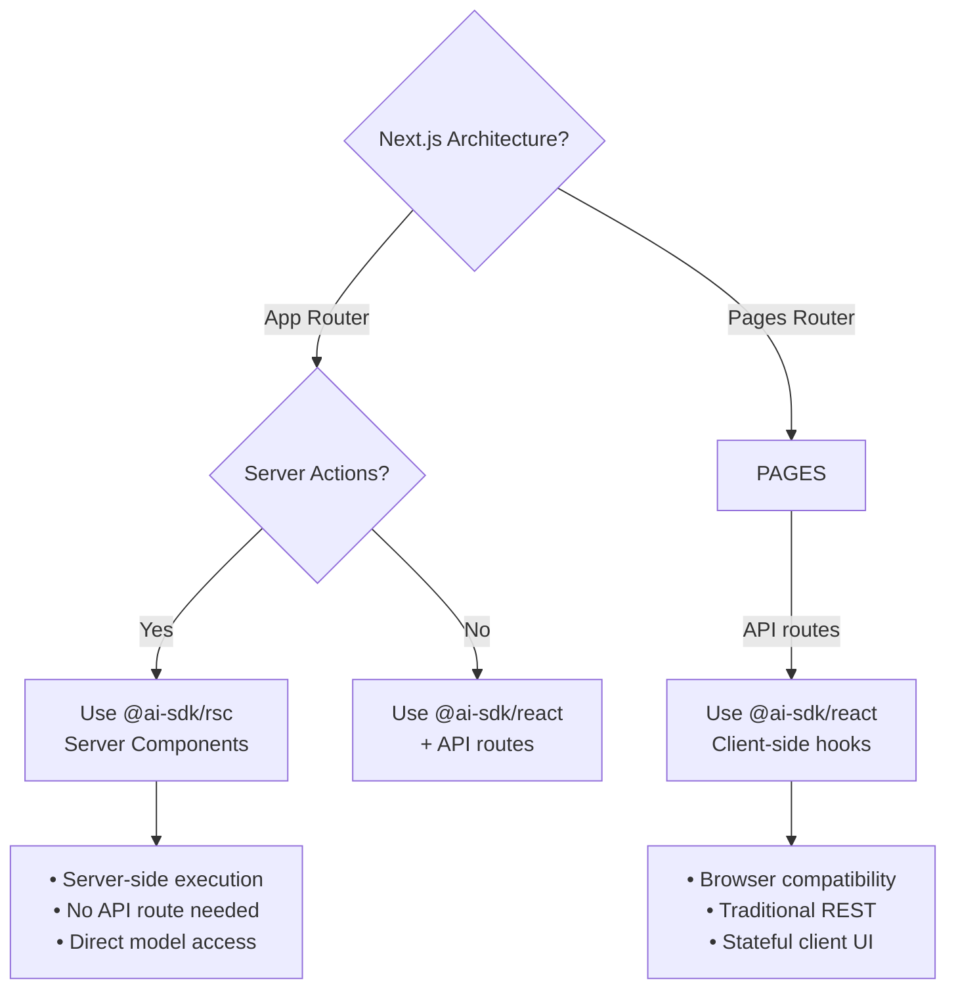

# React Server Components (@ai-sdk/rsc)

<details>
<summary>Relevant source files</summary>

The following files were used as context for generating this wiki page:

- [packages/ai/CHANGELOG.md](packages/ai/CHANGELOG.md)
- [packages/ai/package.json](packages/ai/package.json)
- [packages/react/CHANGELOG.md](packages/react/CHANGELOG.md)
- [packages/react/package.json](packages/react/package.json)
- [packages/rsc/CHANGELOG.md](packages/rsc/CHANGELOG.md)
- [packages/rsc/package.json](packages/rsc/package.json)
- [packages/rsc/tests/e2e/next-server/CHANGELOG.md](packages/rsc/tests/e2e/next-server/CHANGELOG.md)
- [packages/svelte/CHANGELOG.md](packages/svelte/CHANGELOG.md)
- [packages/svelte/package.json](packages/svelte/package.json)
- [packages/vue/CHANGELOG.md](packages/vue/CHANGELOG.md)
- [packages/vue/package.json](packages/vue/package.json)

</details>

## Purpose and Scope

The `@ai-sdk/rsc` package provides React Server Components (RSC) integration for the AI SDK, enabling server-side streaming of AI-generated content directly to React Server Components in Next.js applications. This package differs from `@ai-sdk/react` (see [4.2](#4.2)) by executing AI generation on the server rather than through API routes, allowing seamless integration with Next.js App Router's server component architecture.

This document covers the dual-build architecture, server-side streaming APIs, streamable UI patterns, and integration mechanisms specific to RSC environments. For client-side React hooks and browser-based streaming, refer to [4.2](#4.2).

**Sources:** [packages/rsc/package.json:1-102]()

---

## Package Architecture

### Dual Build System

The `@ai-sdk/rsc` package employs a conditional exports strategy to provide separate implementations for server and client environments:



**Sources:** [packages/rsc/package.json:27-34]()

| Export Condition  | File                  | Environment       | APIs Provided                  |
| ----------------- | --------------------- | ----------------- | ------------------------------ |
| `react-server`    | `dist/rsc-server.mjs` | Server Components | Streaming creation, AI actions |
| `import`/`module` | `dist/rsc-client.mjs` | Client Components | Stream consumption, hooks      |
| `types`           | `dist/index.d.ts`     | Both              | TypeScript definitions         |

**Sources:** [packages/rsc/package.json:27-34]()

---

## Server-Side Streaming Architecture

### Core Server Components

The server-side build provides APIs for creating streamable content that can be consumed by React Server Components:



**Sources:** [packages/rsc/package.json:47-52](), [packages/ai/package.json:1-117]()

### State Synchronization with jsondiffpatch

The package uses `jsondiffpatch` version `0.7.3` to efficiently synchronize state between server and client:



The incremental patching mechanism reduces bandwidth by transmitting only state changes rather than full snapshots on each update.

**Sources:** [packages/rsc/package.json:51](), [packages/rsc/CHANGELOG.md:879]()

---

## Integration with Next.js App Router

### Server Actions and RSC Flow



**Sources:** [packages/rsc/package.json:63](), [packages/rsc/package.json:74-75]()

### createAI Provider Pattern

The `createAI()` function establishes a provider context for server actions, enabling stateful AI interactions across component boundaries:

| Feature           | Description                        | Use Case                    |
| ----------------- | ---------------------------------- | --------------------------- |
| Action Context    | Wraps server actions with AI state | Multi-turn conversations    |
| State Persistence | Maintains conversation history     | Chat continuity             |
| Streaming Support | Enables progressive updates        | Real-time AI responses      |
| Type Safety       | TypeScript generics for state      | Strongly-typed interactions |

**Sources:** [packages/rsc/package.json:96-101]()

---

## Streamable UI Pattern

### createStreamableUI() Lifecycle



**StreamableUI Methods:**

| Method     | Signature                    | Behavior               |
| ---------- | ---------------------------- | ---------------------- |
| `update()` | `update(element: ReactNode)` | Replaces current UI    |
| `append()` | `append(element: ReactNode)` | Adds to existing UI    |
| `done()`   | `done(element?: ReactNode)`  | Finalizes stream       |
| `error()`  | `error(message: string)`     | Emits error state      |
| `value`    | `Promise<ReactNode>`         | Resolves when complete |

**Sources:** Inferred from package architecture and RSC streaming patterns

---

## Client-Side Consumption

### Hook-Based Stream Reading

The client-side build provides hooks for consuming server-streamed content:



**Return Value Structure:**

```typescript
// useStreamableValue() returns tuple:
[
  data: T | undefined,      // Current value
  error: Error | undefined, // Error if failed
  pending: boolean          // Stream incomplete
]
```

**Sources:** Inferred from client-side API patterns

---

## Dependency Architecture

### Package Dependencies



**Dependency Rationale:**

| Package                    | Version   | Purpose                            |
| -------------------------- | --------- | ---------------------------------- |
| `ai`                       | workspace | Core text generation, streaming    |
| `@ai-sdk/provider`         | workspace | Model interfaces (LanguageModelV3) |
| `@ai-sdk/provider-utils`   | workspace | Shared utilities, validation       |
| `jsondiffpatch`            | 0.7.3     | Incremental state synchronization  |
| `react`                    | 18/19     | RSC runtime, peer dependency       |
| `react-server-dom-webpack` | canary    | Dev/test RSC protocol              |

**Sources:** [packages/rsc/package.json:47-76]()

---

## Build and Testing Infrastructure

### Multi-Environment Testing

The package employs comprehensive testing across multiple runtime environments:



**Test Scripts:**

| Script          | Configuration               | Environment        |
| --------------- | --------------------------- | ------------------ |
| `test:node`     | `vitest.node.config.js`     | Node.js runtime    |
| `test:edge`     | `vitest.edge.config.js`     | Edge runtime       |
| `test:ui:react` | `vitest.ui.react.config.js` | React/jsdom        |
| `test:e2e`      | `playwright.config.ts`      | Browser automation |

**Sources:** [packages/rsc/package.json:16-25]()

---

## Version Coordination

### Beta Release Synchronization

The package follows coordinated versioning with the core AI SDK:



The package is currently in **v7 pre-release mode** (major version 3.0.0-beta.7), coordinated via changesets to ensure breaking changes across `ai`, `@ai-sdk/provider`, and `@ai-sdk/provider-utils` remain synchronized.

**Version Mapping:**

| Package                  | Stable (v6) | Beta (v7)    | Change Scope       |
| ------------------------ | ----------- | ------------ | ------------------ |
| `ai`                     | 6.0.x       | 7.0.0-beta.x | Core API changes   |
| `@ai-sdk/rsc`            | 2.0.x       | 3.0.0-beta.x | RSC API updates    |
| `@ai-sdk/provider`       | 3.0.x       | 4.0.0-beta.x | Provider interface |
| `@ai-sdk/provider-utils` | 4.0.x       | 5.0.0-beta.x | Utility functions  |

**Sources:** [packages/rsc/package.json:3](), [packages/rsc/CHANGELOG.md:3-62]()

---

## Comparison with @ai-sdk/react

### Architectural Differences

| Aspect                | @ai-sdk/rsc                      | @ai-sdk/react            |
| --------------------- | -------------------------------- | ------------------------ |
| **Execution Context** | Server Components                | Client-side hooks        |
| **Network Model**     | RSC serialization                | HTTP API routes          |
| **State Management**  | Server-side streaming            | Client-side state (SWR)  |
| **Build Outputs**     | Dual (server/client)             | Single (client)          |
| **Primary APIs**      | `createStreamableUI`, `createAI` | `useChat`, `useObject`   |
| **Transport**         | RSC wire protocol                | `ChatTransport` (HTTP)   |
| **Rendering**         | Progressive server updates       | Client-side incremental  |
| **Use Case**          | App Router, server actions       | Pages Router, API routes |

**Sources:** [packages/rsc/package.json:1-102](), [packages/react/package.json:1-84]()

### When to Use Each Package



**Sources:** [packages/rsc/package.json:96-101](), [packages/react/package.json:80-83]()
