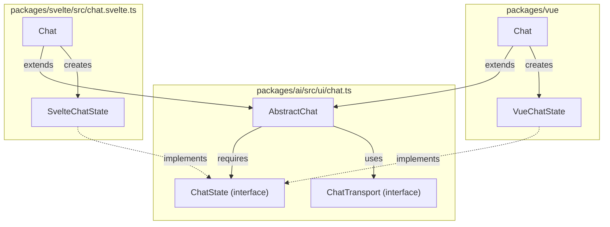
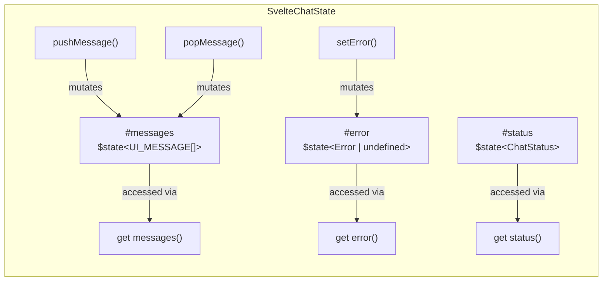
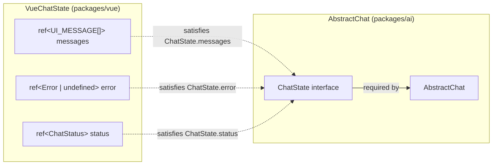
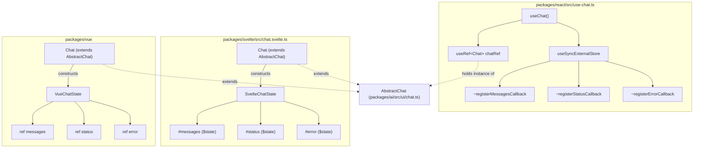
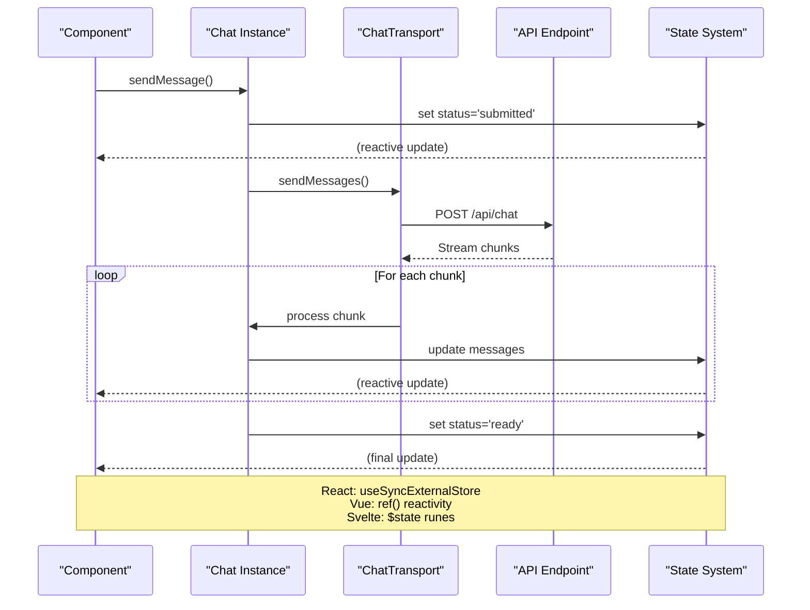

# Vue and Svelte Integrations

<details>
<summary>Relevant source files</summary>

The following files were used as context for generating this wiki page:

- [.changeset/curvy-doors-shake.md](.changeset/curvy-doors-shake.md)
- [content/docs/07-reference/02-ai-sdk-ui/01-use-chat.mdx](content/docs/07-reference/02-ai-sdk-ui/01-use-chat.mdx)
- [examples/ai-e2e-next/app/api/chat/tool-approval-options/route.ts](examples/ai-e2e-next/app/api/chat/tool-approval-options/route.ts)
- [examples/ai-e2e-next/app/chat/test-tool-approval-options/page.tsx](examples/ai-e2e-next/app/chat/test-tool-approval-options/page.tsx)
- [examples/ai-e2e-next/components/tool/dynamic-tool-with-approval-view.tsx](examples/ai-e2e-next/components/tool/dynamic-tool-with-approval-view.tsx)
- [packages/ai/CHANGELOG.md](packages/ai/CHANGELOG.md)
- [packages/ai/package.json](packages/ai/package.json)
- [packages/ai/src/ui/chat.test.ts](packages/ai/src/ui/chat.test.ts)
- [packages/ai/src/ui/chat.ts](packages/ai/src/ui/chat.ts)
- [packages/ai/src/ui/index.ts](packages/ai/src/ui/index.ts)
- [packages/react/CHANGELOG.md](packages/react/CHANGELOG.md)
- [packages/react/package.json](packages/react/package.json)
- [packages/react/src/use-chat.ts](packages/react/src/use-chat.ts)
- [packages/react/src/use-chat.ui.test.tsx](packages/react/src/use-chat.ui.test.tsx)
- [packages/rsc/CHANGELOG.md](packages/rsc/CHANGELOG.md)
- [packages/rsc/package.json](packages/rsc/package.json)
- [packages/rsc/tests/e2e/next-server/CHANGELOG.md](packages/rsc/tests/e2e/next-server/CHANGELOG.md)
- [packages/svelte/CHANGELOG.md](packages/svelte/CHANGELOG.md)
- [packages/svelte/package.json](packages/svelte/package.json)
- [packages/svelte/src/chat.svelte.test.ts](packages/svelte/src/chat.svelte.test.ts)
- [packages/svelte/src/chat.svelte.ts](packages/svelte/src/chat.svelte.ts)
- [packages/vue/CHANGELOG.md](packages/vue/CHANGELOG.md)
- [packages/vue/package.json](packages/vue/package.json)

</details>

This document covers the Vue (`@ai-sdk/vue`) and Svelte (`@ai-sdk/svelte`) integration packages, which provide framework-specific wrappers around the common Chat architecture. Both packages adapt the framework-agnostic `AbstractChat` class to their respective reactivity systems—Vue's composables and Svelte 5's runes.

For details on the underlying Chat architecture, see [Chat Interface Architecture (useChat)](#4.1). For React integration patterns, see [React Integration (@ai-sdk/react)](#4.2).

## Package Structure

Both packages follow a similar organizational pattern:

| Package          | Version | Peer Dependencies | Key Dependencies                       |
| ---------------- | ------- | ----------------- | -------------------------------------- |
| `@ai-sdk/vue`    | 3.0.99  | Vue ^3.3.4        | `ai`, `@ai-sdk/provider-utils`, `swrv` |
| `@ai-sdk/svelte` | 4.0.99  | Svelte ^5.31.0    | `ai`, `@ai-sdk/provider-utils`         |

Both packages expose a `Chat` class as their primary API. Unlike `@ai-sdk/react` which exports a `useChat` hook, Vue and Svelte consumers instantiate `Chat` directly and access its reactive properties through their framework's native reactivity system.

Sources: [packages/vue/package.json:1-76](), [packages/svelte/package.json:1-89](), [content/docs/07-reference/02-ai-sdk-ui/01-use-chat.mdx:20-41]()

## Architecture Overview

Both Vue and Svelte integrations build on the common `AbstractChat` class defined in the core `ai` package. They provide framework-specific `ChatState` implementations that integrate with their respective reactivity systems.

**Class hierarchy — Vue and Svelte `Chat` classes relative to `AbstractChat`**



Sources: [packages/svelte/src/chat.svelte.ts:1-21](), [packages/ai/src/ui/chat.ts:93-104]()

## Svelte Integration

### Chat Class Implementation

The Svelte integration uses Svelte 5's runes system (`$state`) to implement reactive state management. The `Chat` class extends `AbstractChat` and provides a `SvelteChatState` implementation:



The implementation uses Svelte's `$state` rune for reactive private fields:

[packages/svelte/src/chat.svelte.ts:10-48]()

Key characteristics:

- **Private reactive state**: Fields like `#messages`, `#error`, and `#status` use `$state()` for reactivity
- **Getter methods**: Public getters expose the private state values
- **Direct mutations**: Methods like `pushMessage()` directly mutate array state using `.push()`, `.pop()`, etc.
- **Framework-native reactivity**: No external subscription mechanism needed—Svelte's compiler handles reactivity

Sources: [packages/svelte/src/chat.svelte.ts:1-48]()

### Usage Pattern

In Svelte 5 components, developers instantiate `Chat` directly. Because `SvelteChatState` uses `$state` runes, any property access on `chat.messages`, `chat.status`, or `chat.error` inside a Svelte template or `$derived` block is automatically reactive with no additional subscription calls required.

Refer to [packages/svelte/src/chat.svelte.test.ts]() for full test-driven usage examples, including `sendMessage`, `stop`, `regenerate`, `addToolOutput`, and `addToolApprovalResponse`.

Sources: [packages/svelte/src/chat.svelte.ts:12-21](), [packages/svelte/src/chat.svelte.test.ts:1-50]()

### Svelte 5 Runes System

The Svelte integration requires Svelte ^5.31.0 and leverages the runes system introduced in Svelte 5:

| Rune         | Purpose                | Usage in Chat                                    |
| ------------ | ---------------------- | ------------------------------------------------ |
| `$state()`   | Declare reactive state | Private fields: `#messages`, `#error`, `#status` |
| `$derived()` | Computed values        | Not used directly (handled by getters)           |
| `$effect()`  | Side effects           | Not needed in Chat class itself                  |

Sources: [packages/svelte/package.json:46-48](), [packages/svelte/src/chat.svelte.ts:23-47]()

## Vue Integration

### Class Pattern

Like the Svelte package, `@ai-sdk/vue` exports a `Chat` class (not a `useChat` composable). The `Chat` class extends `AbstractChat` and provides a Vue-native `ChatState` implementation backed by Vue 3's Composition API reactivity primitives.

**Import path (as documented in the API reference):**

```
import { Chat } from '@ai-sdk/vue'
```

**State management — Vue reactivity primitives used in `VueChatState`**



The package depends on `swrv` — the Vue equivalent of SWR — for data fetching lifecycle management, analogous to the `swr` dependency in `@ai-sdk/react`.

Sources: [packages/vue/package.json:33-43](), [content/docs/07-reference/02-ai-sdk-ui/01-use-chat.mdx:27-31]()

### Usage Pattern

In Vue 3 components, consumers instantiate `Chat` and access its properties. Because the internal state is backed by Vue `ref()` objects, property reads on `chat.messages`, `chat.status`, and `chat.error` inside `<template>` or `watchEffect` blocks are automatically reactive.

The `Chat` constructor accepts a `ChatInit` object with the same options as the other framework integrations: `id`, `transport`, `messages`, `onFinish`, `onError`, `onToolCall`, `sendAutomaticallyWhen`, etc.

Sources: [packages/vue/package.json:1-76](), [packages/ai/src/ui/chat.ts:140-300]()

## Reactivity Comparison

The following table compares how each framework handles reactivity for the `Chat` state:

| Aspect                 | React (`@ai-sdk/react`)                                      | Vue (`@ai-sdk/vue`)                 | Svelte (`@ai-sdk/svelte`)           |
| ---------------------- | ------------------------------------------------------------ | ----------------------------------- | ----------------------------------- |
| **Public API**         | `useChat()` hook                                             | `Chat` class instance               | `Chat` class instance               |
| **State Primitive**    | `useSyncExternalStore`                                       | `ref()` / Vue Composition API       | `$state()` runes (Svelte 5)         |
| **Subscription Model** | Manual subscribe/unsubscribe via `~registerMessagesCallback` | Automatic via Vue proxy             | Automatic via Svelte compiler       |
| **Update Mechanism**   | Callback-based with optional throttling                      | Vue reactivity system               | Direct mutation with runes          |
| **State Container**    | External `Chat` instance held in `useRef`                    | `Chat` instance created by consumer | `Chat` instance created by consumer |
| **Throttling**         | Built-in via `throttleit` (`experimental_throttle`)          | N/A (framework handles scheduling)  | N/A (framework handles scheduling)  |
| **Extra dependency**   | `swr`, `throttleit`                                          | `swrv`                              | none                                |

Sources: [packages/react/src/use-chat.ts:43-56](), [packages/react/src/use-chat.ts:111-135](), [packages/svelte/src/chat.svelte.ts:1-48](), [packages/vue/package.json:33-43](), [packages/react/package.json:33-36]()

## State Management Architecture

**How each framework integration connects its reactive primitives to `AbstractChat`**



Sources: [packages/react/src/use-chat.ts:58-137](), [packages/svelte/src/chat.svelte.ts:10-48](), [packages/ai/src/ui/chat.ts:93-104]()

## Message Flow

Both frameworks handle the message streaming flow similarly but differ in how they propagate updates to the UI:



Sources: [packages/ai/src/ui/chat.ts:100-600]()

## Transport and Message Processing

Both integrations use the same underlying transport mechanism from the core `ai` package:

| Transport Type | Class                     | Purpose                                |
| -------------- | ------------------------- | -------------------------------------- |
| Default        | `DefaultChatTransport`    | Standard JSON-based streaming          |
| Text Stream    | `TextStreamChatTransport` | Simple text streaming                  |
| HTTP           | `HttpChatTransport`       | Base HTTP transport with customization |

The `processUIMessageStream` function handles chunk processing identically across all frameworks:

[packages/ai/src/ui/process-ui-message-stream.ts:1-300]()

Sources: [packages/ai/src/ui/default-chat-transport.ts:1-30](), [packages/ai/src/ui/text-stream-chat-transport.ts:1-20]()

## Testing Patterns

Both packages follow similar testing approaches using `@ai-sdk/test-server` and framework-specific testing libraries:

### Svelte Tests

- Uses `@testing-library/svelte` v5.2.4
- Tests with `vitest` v3.0.0
- Direct Chat class instantiation in tests

[packages/svelte/src/chat.svelte.test.ts:1-1450]()

### Vue Tests

- Uses `@testing-library/vue` v8.1.0
- Tests with `vitest` v2.1.4
- Component-based testing with useChat composable

[packages/vue/src/chat.vue.ui.test.tsx:1-1150]()

Sources: [packages/svelte/package.json:54-74](), [packages/vue/package.json:38-53]()

## Feature Parity

Both Vue and Svelte integrations support the same core features:

| Feature              | Supported | Notes                                      |
| -------------------- | --------- | ------------------------------------------ |
| Message streaming    | ✓         | Via `processUIMessageStream`               |
| Tool calling         | ✓         | Static and dynamic tools                   |
| File attachments     | ✓         | Via `convertFileListToFileUIParts`         |
| Error handling       | ✓         | Reactive error state                       |
| Status tracking      | ✓         | 'submitted', 'streaming', 'ready', 'error' |
| Message regeneration | ✓         | `regenerate()` method                      |
| Stream resumption    | ✓         | `resumeStream()` method                    |
| Tool approval        | ✓         | `addToolApprovalResponse()` method         |
| Custom transports    | ✓         | Any `ChatTransport` implementation         |

Sources: [packages/ai/src/ui/chat.ts:1-600](), [packages/ai/src/ui/index.ts:1-50]()

## Implementation Differences Summary

| Aspect                | Vue                     | Svelte                     |
| --------------------- | ----------------------- | -------------------------- |
| **Package Version**   | 3.0.3                   | 4.0.3                      |
| **Framework Version** | Vue 3.3.4+              | Svelte 5.31.0+             |
| **API Style**         | Composable function     | Class instance             |
| **State Management**  | Vue 3 Composition API   | Svelte 5 runes             |
| **Data Fetching**     | swrv library            | Native (no external lib)   |
| **Bundle Approach**   | Dual (ESM + CJS)        | ESM only                   |
| **Test Library**      | @testing-library/vue v8 | @testing-library/svelte v5 |

Sources: [packages/vue/package.json:1-76](), [packages/svelte/package.json:1-89]()
