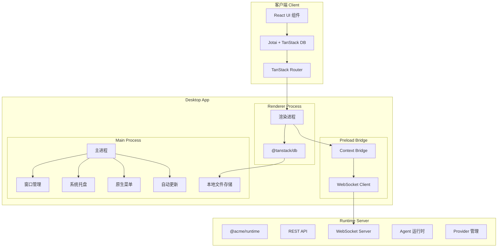
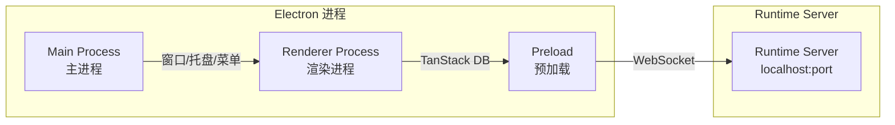
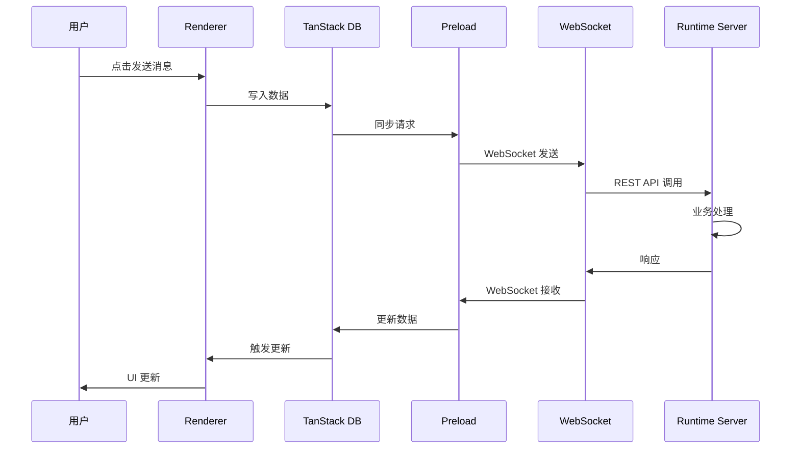
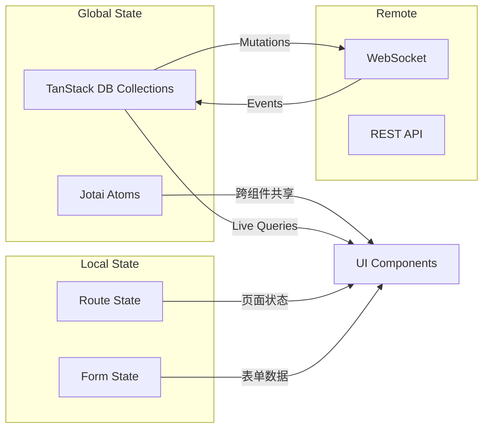
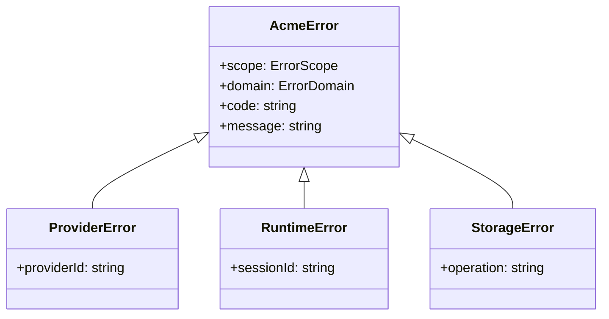

# RFC 0002: 系统架构设计

## 概述

定义 Acme 桌面应用的系统架构，包括整体架构图、技术栈选型和模块划分。

| 属性     | 值         |
| -------- | ---------- |
| RFC ID   | 0002       |
| 状态     | 草稿       |
| 作者     | BlackCater |
| 创建日期 | 2026-03-11 |
| 最终更新 | 2026-03-11 |

## 背景

本文档定义 Acme 桌面应用的系统架构，旨在为开发团队提供清晰的架构指导，确保代码组织的一致性和可维护性。

## 核心概念澄清

- **Vault**: 即 Workspace，一个 Vault 类似 Obsidian 的概念，代表一个独立的工作空间
- **Thread**: 即会话 Session，名字来源于 Codex 的概念
- **@acme/runtime**: Server Runtime 包，提供 WebSocket 和 REST API 服务，与 Web 端通信
- **@acme/acp**: 支持 Agent Client Protocol 的包

## 整体架构

### 架构图



### 进程模型



桌面应用采用 Electron 三进程模型，渲染进程通过 WebSocket 与内嵌的 Runtime Server 通信：

1. **主进程 (Main Process)**: 管理窗口、系统托盘、菜单
2. **预加载 (Preload)**: 提供 WebSocket 连接和本地文件访问
3. **渲染进程 (Renderer)**: 运行 React UI，通过 TanStack DB 与 Runtime Server 通信

### 通信架构



## 技术栈

### 核心技术

| 层级        | 技术            | 版本  | 用途                        |
| ----------- | --------------- | ----- | --------------------------- |
| 桌面框架    | Electron        | 40.x  | 跨平台桌面应用框架          |
| 构建工具    | electron-vite   | 5.x   | Vite 驱动的 Electron 构建   |
| 前端框架    | React           | 19.x  | UI 渲染                     |
| 路由        | TanStack Router | 1.x   | 类型安全路由                |
| 状态管理    | Jotai           | 2.x   | 原子化状态管理              |
| 数据获取    | TanStack DB     | 0.5.x | Reactive client-first store |
| UI 组件     | @acme/ui        | -     | 自定义 UI 组件库            |
| 终端        | node-pty        | 1.x   | PTY 虚拟终端                |
| HTTP 客户端 | fetch / ky      | -     | API 调用                    |

### @tanstack/db 简介

TanStack DB 是一个 Reactive Client-First Store，特性：
- 基于 TanStack Query 构建
- 支持 Live Queries 自动更新
- 支持 Optimistic Mutations 乐观更新
- 可与任何后端 API 配合使用

```typescript
// 使用示例
import { createCollection, useLiveQuery } from '@tanstack/react-db'

const threadCollection = createCollection({
  queryKey: ['threads'],
  queryFn: async () => {
    const response = await fetch('/api/threads')
    return response.json()
  },
})

function ThreadList() {
  const { data: threads } = useLiveQuery((q) =>
    q.from({ thread: threadCollection })
  )
}
```

### 开发工具

| 工具            | 用途                        |
| --------------- | --------------------------- |
| Bun             | JavaScript 运行时和包管理器 |
| Turborepo       | Monorepo 构建编排           |
| TypeScript      | 类型安全                    |
| ESLint + oxlint | 代码检查                    |

### 依赖包管理策略

```
devDependencies:
  - electron (运行时提供)
  - @anthropic-ai/claude-agent-sdk (必须 external)

dependencies:
  - 所有其他依赖打包进 bundle
```

## 模块划分

### 目录结构

```
acme/
├── apps/
│   ├── desktop/              # 桌面应用
│   │   └── src/
│   │       ├── main/        # 主进程
│   │       │   ├── index.ts
│   │       │   ├── window/
│   │       │   ├── tray/
│   │       │   ├── menu/
│   │       │   ├── updater/
│   │       │   └── runtime/  # 内嵌 Runtime Server
│   │       ├── preload/     # 预加载
│   │       │   ├── index.ts
│   │       │   └── ws.ts    # WebSocket 客户端
│   │       └── renderer/   # 渲染进程
│   │           └── src/
│   │               ├── App.tsx
│   │               ├── routes/
│   │               ├── components/
│   │               ├── hooks/
│   │               └── collections/  # TanStack DB collections
│   ├── runtime/             # Runtime Server (独立应用)
│   │   └── src/
│   ├── api-server/          # API 服务器
│   ├── cli/                # CLI 工具
│   └── ...
├── packages/
│   ├── core/               # 核心类型和接口
│   │   └── src/
│   │       ├── vault/       # Vault (Workspace) 定义
│   │       ├── thread/      # Thread 定义
│   │       ├── provider/    # Provider 定义
│   │       ├── mcp/
│   │       └── error/
│   ├── agent/              # Agent 实现 (在 runtime 中使用)
│   ├── runtime/            # Runtime Server 核心
│   ├── acp/                # Agent Client Protocol 支持
│   ├── shared/             # 共享工具
│   │   └── src/
│   │       └── di/         # 依赖注入
│   └── ui/                 # UI 组件库
```

### 包职责

| 包名                | 职责                                       |
| ------------------- | ------------------------------------------ |
| `@acme/core`        | 定义核心类型、接口、错误类型               |
| `@acme/agent`       | Agent 核心逻辑实现 (被 runtime 使用)       |
| `@acme/runtime`     | Runtime Server 实现 (WebSocket + REST API) |
| `@acme/acp`         | Agent Client Protocol 支持                 |
| `@acme/shared`      | 共享工具、DI 容器                          |
| `@acme/ui`          | UI 组件库                                  |
| `@acme-app/desktop` | 桌面应用入口                               |

## Runtime Server 通信

### WebSocket API

```typescript
// 连接建立
const ws = new WebSocket('ws://localhost:3847/ws')

// 消息格式
interface WSMessage {
  type: 'request' | 'response' | 'event'
  id: string
  method: string
  params?: unknown
  result?: unknown
  error?: WSError
}

// 方法命名空间
const API = {
  vault: {
    list: 'vault.list',
    create: 'vault.create',
    update: 'vault.update',
    delete: 'vault.delete',
  },
  thread: {
    list: 'thread.list',
    create: 'thread.create',
    send: 'thread.send',
  },
  provider: {
    list: 'provider.list',
    test: 'provider.test',
  },
}
```

### REST API

```typescript
// REST 端点
const REST_API = {
  // Vaults
  'GET    /api/vaults': 'vault.list',
  'POST   /api/vaults': 'vault.create',
  'GET    /api/vaults/:id': 'vault.get',
  'PATCH  /api/vaults/:id': 'vault.update',
  'DELETE /api/vaults/:id': 'vault.delete',

  // Threads
  'GET    /api/vaults/:vaultId/threads': 'thread.list',
  'POST   /api/vaults/:vaultId/threads': 'thread.create',
  'GET    /api/threads/:id': 'thread.get',
  'DELETE /api/threads/:id': 'thread.delete',

  // Messages
  'POST   /api/threads/:threadId/messages': 'message.send',
  'GET    /api/threads/:threadId/messages': 'message.list',
}
```

## 状态管理

### TanStack DB Collection

```typescript
// collections/thread-collection.ts
import { createCollection } from '@tanstack/react-db'

export const threadCollection = createCollection({
  queryKey: ['threads'],
  queryFn: async ({ vaultId }) => {
    const response = await fetch(`/api/vaults/${vaultId}/threads`)
    return response.json()
  },
  getKey: (thread) => thread.id,
  onUpdate: async ({ transaction }) => {
    const { original, modified } = transaction.mutations[0]
    await fetch(`/api/threads/${original.id}`, {
      method: 'PATCH',
      body: JSON.stringify(modified),
    })
  },
})

// 使用
function ThreadList({ vaultId }: { vaultId: string }) {
  const { data: threads } = useLiveQuery((q) =>
    q.from({ thread: threadCollection })
      .where(({ thread }) => eq(thread.vaultId, vaultId))
  )
}
```

### Jotai 原子设计

```typescript
// atoms/vault-atoms.ts
export const vaultsAtom = atom<Vault[]>([])
export const currentVaultIdAtom = atom<string | null>(null)
export const currentVaultAtom = atom((get) => {
  const id = get(currentVaultIdAtom)
  return get(vaultsAtom).find((v) => v.id === id) || null
})

// atoms/thread-atoms.ts
export const threadsAtom = atom<Thread[]>([])
export const currentThreadIdAtom = atom<string | null>(null)
export const messagesAtom = atom<Message[]>([])
export const streamingAtom = atom<boolean>(false)
```

### 状态流



## 本地存储

### 存储策略

所有配置和数据优先使用本地文件存储在 `~/.acme` 目录下：

```
~/.acme/
├── config/                              # 全局配置
│   ├── settings.json                   # 应用设置
│   ├── providers.json                  # 全局 Provider 配置 (加密)
│   ├── mcp-servers.json               # 全局 MCP Server 配置
│   ├── skills.json                    # 全局 Skill 配置
│   └── keybindings.json               # 快捷键配置
├── data/
│   └── vaults/
│       └── {vaultId}/                  # Vault 数据
│           ├── config.json             # Vault 元数据
│           ├── providers.json          # Vault 专属 Provider 配置
│           ├── mcp-servers.json        # Vault 专属 MCP Server 配置
│           ├── skills.json             # Vault 专属 Skill 配置
│           ├── threads.json            # Threads 索引
│           └── threads/
│               └── {threadId}/
│                   └── messages.jsonl  # 消息内容
├── cache/
│   └── models/                        # 模型缓存
└── logs/                              # 日志文件
```

### 配置层级

- **全局配置**: 存储在 `config/` 目录，适用于所有 Vault
- **Vault 专属配置**: 存储在 `data/vaults/{vaultId}/` 目录，仅适用于特定 Vault
- **配置合并**: Thread 使用配置时，系统自动合并全局和 Vault 专属配置（Vault 配置优先）

后续可能引入 SQLite 增强搜索能力。

## 错误处理

### 错误类型层次



详细错误类型定义见 `@acme/core/error`。

## 安全性

### Context Isolation

Preload 脚本使用 `contextBridge.exposeInMainWorld` 暴露有限的 API：

```typescript
// preload/index.ts
contextBridge.exposeInMainWorld('acme', {
  // WebSocket 连接
  connect: () => WebSocket,

  // 本地文件访问 (受限于 ~/.acme)
  readFile: (path: string) => string,
  writeFile: (path: string, data: string) => void,

  // 系统操作
  getPath: (name: string) => string,
  showOpenDialog: (options: OpenDialogOptions) => string[],
})
```

### 敏感数据处理

- API Keys 使用 Electron `safeStorage` 加密存储
- 不在渲染进程暴露完整文件系统
- WebSocket 连接仅限 localhost

## 验收标准

- [ ] 目录结构符合模块划分规范
- [ ] 渲染进程通过 WebSocket 与 Runtime 通信
- [ ] 状态管理使用 Jotai + TanStack DB
- [ ] 错误处理遵循统一规范
- [ ] Context Isolation 已启用
- [ ] API Keys 加密存储已实现
- [ ] 本地文件存储已实现

## 相关 RFC

- [RFC 0001: 产品愿景与 MVP 定义](./0001-product-vision.md)
- [RFC 0003: 数据模型设计](./0003-data-models.md)
- [RFC 0008: 本地存储设计](./0008-local-storage.md)
