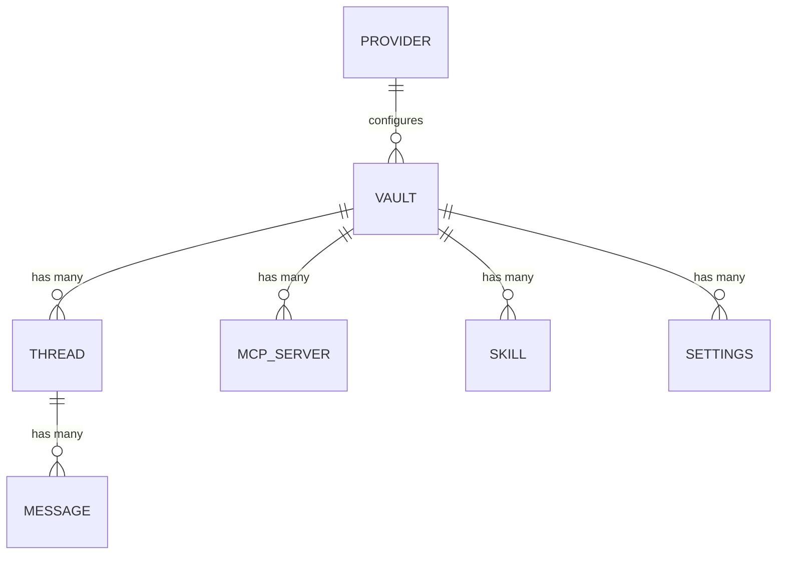
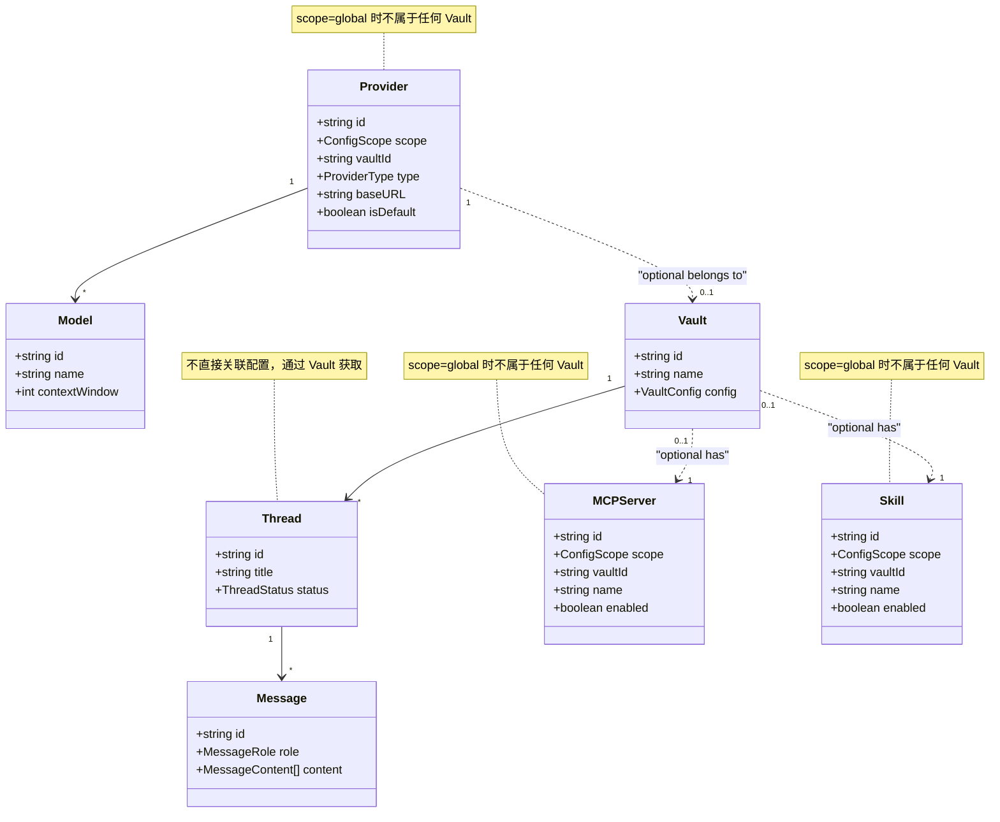

# RFC 0003: 数据模型设计

## 概述

定义 Acme 桌面应用的核心数据模型，包括 Provider、Thread (Session)、Vault、Message 等模型的结构和关系。

| 属性     | 值         |
| -------- | ---------- |
| RFC ID   | 0003       |
| 状态     | 草稿       |
| 作者     | BlackCater |
| 创建日期 | 2026-03-11 |
| 最终更新 | 2026-03-11 |

## 背景

本文档定义 Acme 应用的核心数据模型，为本地文件存储和 API 设计提供类型基础。

## 核心概念

- **Vault**: 即 Workspace，类似 Obsidian 的概念，代表一个独立的工作空间
- **Thread**: 即 Session，名字来源于 Codex 的概念，代表一个会话

## 数据模型概览



## Provider 模型

### 定义

```typescript
// packages/core/src/provider/index.ts

export enum ProviderType {
  ANTHROPIC = 'anthropic',
  OPENAI = 'openai',
  GOOGLE = 'google',
  DEEPSEEK = 'deepseek',
  MINIMAX = 'minimax',
  KIMI = 'kimi',
  ZHIPU = 'zhipu',
  CUSTOM = 'custom',
}

export interface Provider {
  id: string;
  name: string;
  type: ProviderType;
  baseURL: string;
  apiKey: string; // 加密存储
  models: Model[];
  capabilities: ProviderCapabilities;
  isDefault: boolean;
  createdAt: Date;
  updatedAt: Date;
}

export interface ProviderCapabilities {
  chat: boolean;
  streaming: boolean;
  vision: boolean;
  reasoning: boolean;
  functionCalling: boolean;
}

export interface Model {
  id: string;
  name: string;
  providerId: string;
  contextWindow: number;
  maxOutputTokens?: number;
  supportsVision?: boolean;
  supportsReasoning?: boolean;
  isLatest?: boolean;
}
```

## Vault 模型

### 概念澄清

**Vault = Workspace**

Vault 是 Acme 中的核心工作空间概念，类似 Obsidian 的 vault。一个 Vault 包含：
- 独立的 Thread 列表
- 独立的 MCP Server 配置
- 独立的 Skill 配置
- 独立的工作目录 (cwd)

### 定义

```typescript
// packages/core/src/vault/index.ts

export interface Vault {
  id: string;
  name: string;
  description?: string;
  config: VaultConfig;
  createdAt: Date;
  updatedAt: Date;
}

export interface VaultConfig {
  cwd: string;                    // 工作目录
  env?: Record<string, string>;   // 环境变量
  defaultProviderId?: string;     // 默认 Provider
  defaultModelId?: string;        // 默认 Model
}

export interface VaultSettings {
  mcpServers?: MCPServerConfig[];
  skills?: SkillConfig[];
}
```

### 存储结构

```
~/.acme/data/{vaultId}/
├── config.json        # Vault 元数据
├── threads.json      # Threads 索引
├── threads/
│   └── {threadId}/
│       └── messages.jsonl  # 消息内容
└── settings.json     # Vault 设置
```

## Thread 模型

### 概念澄清

**Thread = Session**

Thread 是会话的概念，名字来源于 Codex。每个 Thread 属于一个 Vault，包含多轮对话的消息历史。

### 定义

```typescript
// packages/core/src/thread/index.ts

export enum ThreadStatus {
  ACTIVE = 'active',
  ARCHIVED = 'archived',
  DELETED = 'deleted',
}

export interface Thread {
  id: string;
  title: string;
  vaultId: string;
  providerId: string;
  modelId: string;
  status: ThreadStatus;
  metadata: ThreadMetadata;
  createdAt: Date;
  updatedAt: Date;
  lastMessageAt?: Date;
}

export interface ThreadMetadata {
  pinned: boolean;
  favorite: boolean;
  tags?: string[];
  contextLength?: number;
}
```

## Message 模型

### 定义

```typescript
// packages/core/src/llm/message.ts

export enum MessageRole {
  SYSTEM = 'system',
  USER = 'user',
  ASSISTANT = 'assistant',
  TOOL = 'tool',
}

export interface Message {
  id: string;
  threadId: string;
  role: MessageRole;
  content: MessageContent[];
  toolCalls?: ToolCall[];
  toolCallId?: string;
  usage?: TokenUsage;
  createdAt: Date;
}

export type MessageContent =
  | TextContent
  | ImageContent
  | ToolUseContent
  | ToolResultContent;

export interface TextContent {
  type: 'text';
  text: string;
}

export interface ImageContent {
  type: 'image';
  source: {
    type: 'base64' | 'url';
    media_type: string;
    data: string;
  };
}

export interface ToolUseContent {
  type: 'tool_use';
  id: string;
  name: string;
  input: Record<string, unknown>;
}

export interface ToolResultContent {
  type: 'tool_result';
  tool_use_id: string;
  content: string;
  is_error?: boolean;
}

export interface ToolCall {
  id: string;
  type: 'function';
  function: {
    name: string;
    arguments: string;
  };
}

export interface TokenUsage {
  inputTokens: number;
  outputTokens: number;
  totalTokens: number;
}
```

## MCP Server 模型

### 配置层级

MCP Server 支持两种配置层级：
- **全局配置**: 适用于所有 Vault，由应用级别管理
- **Vault 专属配置**: 仅适用于特定 Vault

### 定义

```typescript
// packages/core/src/mcp/index.ts

export enum ConfigScope {
  GLOBAL = 'global',
  VAULT = 'vault',
}

export interface MCPServer {
  id: string;
  scope: ConfigScope;           // 全局或 Vault 专属
  vaultId?: string;             // 当 scope 为 vault 时必填
  name: string;
  command: string;
  args: string[];
  env?: Record<string, string>;
  enabled: boolean;
  createdAt: Date;
  updatedAt: Date;
}
```

## Skill 模型

### 配置层级

Skill 支持两种配置层级：
- **全局配置**: 适用于所有 Vault，由应用级别管理
- **Vault 专属配置**: 仅适用于特定 Vault

### 定义

```typescript
// packages/core/src/skill/index.ts

export enum ConfigScope {
  GLOBAL = 'global',
  VAULT = 'vault',
}

export interface Skill {
  id: string;
  scope: ConfigScope;           // 全局或 Vault 专属
  vaultId?: string;             // 当 scope 为 vault 时必填
  name: string;
  description: string;
  prompt: string;
  variables?: SkillVariable[];
  enabled: boolean;
  createdAt: Date;
  updatedAt: Date;
}

export interface SkillVariable {
  name: string;
  type: 'string' | 'number' | 'boolean';
  description?: string;
  required: boolean;
  default?: unknown;
}
```

## Settings 模型

### 定义

```typescript
// 存储在 ~/.acme/config/settings.json

export interface AppSettings {
  theme: 'light' | 'dark' | 'system';
  language: string;
  fontSize: number;
  fontFamily: string;
  autoUpdate: boolean;
  minimizeToTray: boolean;
  closeToTray: boolean;
  launchAtStartup: boolean;
  keyboardShortcuts: KeyboardShortcuts;
}

export interface KeyboardShortcuts {
  newThread: string;
  toggleSidebar: string;
  toggleTerminal: string;
  settings: string;
  quickSwitch: string;
}
```

## 存储结构

### 完整目录结构

```
~/.acme/
├── config/
│   ├── settings.json       # 应用设置
│   ├── providers.json     # 全局 Provider 配置 (加密)
│   ├── mcp-servers.json  # 全局 MCP Server 配置
│   ├── skills.json       # 全局 Skill 配置
│   └── keybindings.json  # 快捷键
├── data/
│   └── vaults/
│       └── {vaultId}/
│           ├── config.json    # Vault 元数据
│           ├── settings.json  # Vault 设置
│           ├── providers.json # Vault 专属 Provider 配置
│           ├── mcp-servers.json  # Vault 专属 MCP Server 配置
│           ├── skills.json    # Vault 专属 Skill 配置
│           ├── threads.json   # Threads 索引
│           └── threads/
│               └── {threadId}/
│                   └── messages.jsonl  # 消息 (JSONL 格式)
├── cache/
│   └── models/          # 模型缓存
└── logs/                # 日志
```

### 配置合并规则

Thread 使用配置时，系统会自动合并全局配置和 Vault 专属配置：

1. **优先级**: Vault 专属配置 > 全局配置
2. **合并逻辑**: 同类型配置会覆盖，不同类型配置会合并
3. **Thread 无感知**: Thread 只需要知道要使用哪些工具，不需要关心配置来源

```typescript
// 配置合并示例
function getEffectiveConfig<T>(vaultId: string, configType: string): T[] {
  const global = loadGlobalConfig<T>(configType)
  const vault = loadVaultConfig<T>(configType, vaultId)

  // 按 ID 去重，Vault 配置优先
  const map = new Map([...global, ...vault].map(c => [c.id, c]))
  return Array.from(map.values())
}
```

### JSONL 消息存储

每个 Thread 的消息使用 JSONL 格式存储，便于追加和流式写入：

```jsonl
{"id":"msg1","role":"user","content":"Hello","createdAt":"2026-03-11T10:00:00Z"}
{"id":"msg2","role":"assistant","content":"Hi!","createdAt":"2026-03-11T10:00:01Z"}
{"id":"msg3","role":"user","content":"How are you?","createdAt":"2026-03-11T10:00:02Z"}
```

## 关系图



## 后续扩展

### SQLite 增强

后续可能引入 SQLite 增强能力，如：
- 全文搜索
- 复杂查询
- 索引优化

```
~/.acme/data/acme.db  (可选)
├── vaults
├── threads
├── messages
└── full_text_search
```

## 验收标准

- [ ] Provider 模型完整定义（含 ConfigScope）
- [ ] Vault 模型完整定义
- [ ] Thread 模型完整定义
- [ ] Message 模型完整定义
- [ ] MCP Server 模型完整定义（含 ConfigScope）
- [ ] Skill 模型完整定义（含 ConfigScope）
- [ ] 本地文件存储结构已定义（全局 + Vault 专属）
- [ ] 配置合并规则已定义
- [ ] 后续 SQLite 扩展方案已规划

## 相关 RFC

- [RFC 0002: 系统架构设计](./0002-system-architecture.md)
- [RFC 0004: 多 Provider 抽象层](./0004-multi-provider-abstraction.md)
- [RFC 0006: 会话与消息管理](./0006-session-message-management.md)
- [RFC 0008: 本地存储设计](./0008-local-storage.md)
