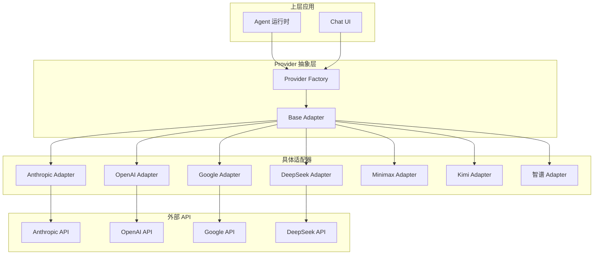

# RFC 0004: 多 Provider 抽象层

## 概述

定义统一的多 Provider 抽象层，支持 Anthropic、OpenAI、Google、DeepSeek、Minimax、Kimi、智谱等主流 AI 模型提供商。

| 属性 | 值 |
|------|-----|
| RFC ID | 0004 |
| 状态 | 草稿 |
| 作者 | BlackCater |
| 创建日期 | 2026-03-11 |
| 最终更新 | 2026-03-11 |

## 背景

Acme 旨在成为一个统一的 AI 桌面客户端，需要支持多种 AI 模型提供商。每种 Provider 有不同的 API 端点、认证方式和功能特性，需要通过统一的抽象层来屏蔽这些差异。

## 架构设计

### 整体架构



## 核心接口

### ProviderAdapter 接口

```typescript
// packages/core/src/provider/index.ts

export interface ProviderAdapter {
  /**
   * 发送聊天消息
   */
  sendMessage(
    params: SendMessageParams
  ): Promise<AsyncIterable<ChatChunk>>;

  /**
   * 获取可用模型列表
   */
  listModels(): Promise<Model[]>;

  /**
   * 测试连接
   */
  testConnection(): Promise<boolean>;

  /**
   * 获取提供商信息
   */
  getInfo(): ProviderInfo;
}

export interface SendMessageParams {
  model: string;
  messages: Message[];
  tools?: Tool[];
  temperature?: number;
  maxTokens?: number;
  stream?: boolean;
}

export interface ChatChunk {
  type: 'content' | 'tool-call' | 'done' | 'error';
  content?: string;
  toolCall?: {
    id: string;
    name: string;
    input: Record<string, unknown>;
  };
  usage?: TokenUsage;
  error?: string;
}

export interface ProviderInfo {
  id: string;
  name: string;
  type: ProviderType;
  baseURL: string;
  capabilities: ProviderCapabilities;
}
```

### 工厂方法

```typescript
// packages/core/src/provider/factory.ts

export class ProviderFactory {
  static createAdapter(config: ProviderConfig): ProviderAdapter {
    switch (config.type) {
      case ProviderType.ANTHROPIC:
        return new AnthropicAdapter(config);
      case ProviderType.OPENAI:
      case ProviderType.DEEPSEEK:
      case ProviderType.CUSTOM:
        return new OpenAIAdapter(config);
      case ProviderType.GOOGLE:
        return new GoogleAdapter(config);
      case ProviderType.MINIMAX:
        return new MinimaxAdapter(config);
      case ProviderType.KIMI:
        return new KimiAdapter(config);
      case ProviderType.ZHIPU:
        return new ZhipuAdapter(config);
      default:
        throw new Error(`Unsupported provider type: ${config.type}`);
    }
  }
}
```

## 各 Provider 适配器

### Anthropic 适配器

```typescript
// packages/ai/src/providers/anthropic-adapter.ts

export class AnthropicAdapter implements ProviderAdapter {
  private readonly client: Anthropic;

  constructor(private readonly config: ProviderConfig) {
    this.client = new Anthropic({
      apiKey: config.apiKey,
      baseURL: config.baseURL,
    });
  }

  async sendMessage(
    params: SendMessageParams
  ): Promise<AsyncIterable<ChatChunk>> {
    const stream = await this.client.messages.stream({
      model: params.model,
      messages: this.convertMessages(params.messages),
      tools: params.tools as any,
      temperature: params.temperature,
      max_tokens: params.maxTokens || 4096,
    });

    return (async function* () {
      for await (const chunk of stream) {
        if (chunk.type === 'content_block_delta') {
          if (chunk.delta.type === 'text_delta') {
            yield { type: 'content', content: chunk.delta.text };
          } else if (chunk.delta.type === 'input_json_delta') {
            // Tool call
          }
        } else if (chunk.type === 'message_delta') {
          yield { type: 'done', usage: this.convertUsage(chunk.usage) };
        }
      }
    })();
  }

  private convertMessages(messages: Message[]): AnthropicMessage[] {
    return messages.map((msg) => ({
      role: msg.role,
      content: msg.content.map((c) => {
        if (c.type === 'text') return c;
        if (c.type === 'image') {
          return {
            type: 'image',
            source: {
              type: 'base64',
              media_type: c.source.media_type,
              data: c.source.data,
            },
          };
        }
      }),
    }));
  }
}
```

### OpenAI 兼容适配器

```typescript
// packages/ai/src/providers/openai-adapter.ts

export class OpenAIAdapter implements ProviderAdapter {
  private readonly client: OpenAI;

  constructor(private readonly config: ProviderConfig) {
    this.client = new OpenAI({
      apiKey: config.apiKey,
      baseURL: config.baseURL,
    });
  }

  async sendMessage(
    params: SendMessageParams
  ): Promise<AsyncIterable<ChatChunk>> {
    const stream = await this.client.chat.completions.create({
      model: params.model,
      messages: params.messages as any,
      tools: params.tools as any,
      temperature: params.temperature,
      max_tokens: params.maxTokens,
      stream: true,
    });

    return (async function* () {
      for await (const chunk of stream) {
        const choice = chunk.choices[0];
        if (choice?.delta?.content) {
          yield { type: 'content', content: choice.delta.content };
        }
        if (choice?.delta?.tool_calls) {
          for (const tc of choice.delta.tool_calls) {
            yield {
              type: 'tool-call',
              toolCall: {
                id: tc.id || '',
                name: tc.function?.name || '',
                input: tc.function?.arguments ? JSON.parse(tc.function.arguments) : {},
              },
            };
          }
        }
        if (choice?.finish_reason) {
          yield { type: 'done', usage: chunk.usage };
        }
      }
    })();
  }
}
```

### Google 适配器

```typescript
// packages/ai/src/providers/google-adapter.ts

export class GoogleAdapter implements ProviderAdapter {
  // 使用 Google Generative Language API
  // 支持 Gemini Pro/Flash
}
```

## API Key 加密存储

### 加密策略

```typescript
// packages/shared/src/crypto/encryption.ts

import { safeStorage } from 'electron';

export class CredentialManager {
  static encrypt(plainText: string): string {
    if (safeStorage.isEncryptionAvailable()) {
      const encrypted = safeStorage.encryptString(plainText);
      return encrypted.toString('base64');
    }
    // Fallback: 使用机器特定密钥加密
    return this.fallbackEncrypt(plainText);
  }

  static decrypt(encryptedText: string): string {
    if (safeStorage.isEncryptionAvailable()) {
      const buffer = Buffer.from(encryptedText, 'base64');
      return safeStorage.decryptString(buffer);
    }
    return this.fallbackDecrypt(encryptedText);
  }
}
```

## Provider 配置管理

### 配置界面

```typescript
// packages/core/src/provider/config.ts

export interface ProviderFormSchema {
  name: z.string().min(1),
  type: z.nativeEnum(ProviderType),
  baseURL: z.string().url().optional(),
  apiKey: z.string().min(1),
  models: z.array(z.string()).optional(),
}

export const providerSchemas: Record<ProviderType, ProviderFormSchema> = {
  [ProviderType.ANTHROPIC]: {
    name: z.string().min(1),
    type: z.literal(ProviderType.ANTHROPIC),
    baseURL: z.string().url().default('https://api.anthropic.com'),
    apiKey: z.string().min(1),
  },
  [ProviderType.OPENAI]: {
    name: z.string().min(1),
    type: z.literal(ProviderType.OPENAI),
    baseURL: z.string().url().default('https://api.openai.com/v1'),
    apiKey: z.string().min(1),
  },
  // ...
};
```

## 支持的 Provider 列表

### MVP 支持

| Provider | 类型 | API 格式 | 支持模型 |
|----------|------|----------|----------|
| Anthropic | anthropic | Anthropic API | Claude 3.5/3 |
| OpenAI | openai | OpenAI API | GPT-4o/4/3.5 |
| Google | google | Google AI API | Gemini 1.5 |
| DeepSeek | deepseek | OpenAI 兼容 | DeepSeek Coder |
| Custom | custom | OpenAI 兼容 | 自定义端点 |

### 后续支持

| Provider | 类型 | 预计版本 |
|----------|------|----------|
| Minimax | minimax | v0.2.0 |
| Kimi | kimi | v0.2.0 |
| 智谱 | zhipu | v0.2.0 |

## 错误处理

### Provider 错误码

```typescript
// packages/core/src/error/provider.ts

export enum ProviderErrorCode {
  INVALID_API_KEY = 'INVALID_API_KEY',
  RATE_LIMIT = 'RATE_LIMIT',
  MODEL_NOT_FOUND = 'MODEL_NOT_FOUND',
  INSUFFICIENT_CREDITS = 'INSUFFICIENT_CREDITS',
  NETWORK_ERROR = 'NETWORK_ERROR',
  SERVER_ERROR = 'SERVER_ERROR',
}

export class ProviderError extends AcmeError {
  constructor(
    code: ProviderErrorCode,
    message: string,
    public readonly providerId: string,
    public readonly retryable: boolean = false
  ) {
    super(ErrorScope.PROVIDER, ErrorDomain.AI, code, message);
  }
}
```

## 验收标准

- [ ] ProviderAdapter 接口已定义
- [ ] Anthropic 适配器已实现
- [ ] OpenAI 兼容适配器已实现
- [ ] Google 适配器已实现
- [ ] DeepSeek 适配器已实现
- [ ] API Key 加密存储已实现
- [ ] 连接测试功能已实现
- [ ] 错误处理规范已定义

## 相关 RFC

- [RFC 0003: 数据模型设计](./0003-data-models.md)
- [RFC 0006: 会话与消息管理](./0006-session-message-management.md)
