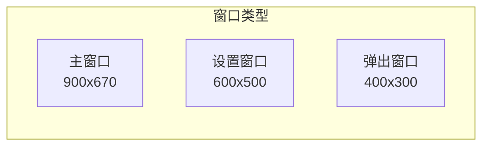
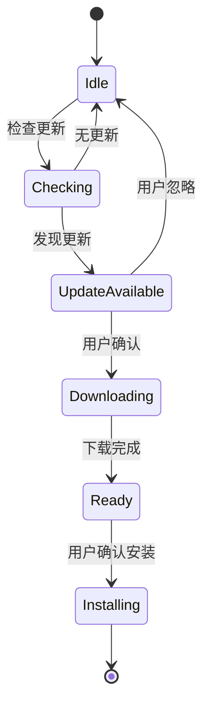

# RFC 0005: 桌面应用核心功能

## 概述

定义 Acme 桌面应用的核心功能，包括窗口管理、系统托盘、快捷键、通知和自动更新。

| 属性 | 值 |
|------|-----|
| RFC ID | 0005 |
| 状态 | 草稿 |
| 作者 | BlackCater |
| 创建日期 | 2026-03-11 |
| 最终更新 | 2026-03-11 |

## 背景

桌面应用需要提供原生桌面体验，包括窗口管理、系统托盘、快捷键等功能。本文档定义这些核心功能的实现方案。

## 窗口管理

### 窗口类型



### 主窗口配置

```typescript
// apps/desktop/src/main/window/main-window.ts

export interface WindowConfig {
  width: number;
  height: number;
  minWidth: number;
  minHeight: number;
  frame: boolean;
  titleBarStyle: 'hidden' | 'hiddenInset';
  title: string;
}

export const mainWindowConfig: WindowConfig = {
  width: 900,
  height: 670,
  minWidth: 600,
  minHeight: 400,
  frame: true,
  titleBarStyle: 'hiddenInset',
  title: 'Acme',
};
```

### 窗口管理器

```typescript
// apps/desktop/src/main/window/window-manager.ts

export class WindowManager {
  private mainWindow: BrowserWindow | null = null;
  private settingsWindow: BrowserWindow | null = null;

  createMainWindow(): BrowserWindow {
    this.mainWindow = new BrowserWindow({
      ...mainWindowConfig,
      webPreferences: {
        preload: join(__dirname, '../preload/index.js'),
        sandbox: false,
      },
    });

    // 窗口事件处理
    this.mainWindow.on('close', (e) => {
      if (this.shouldMinimizeToTray()) {
        e.preventDefault();
        this.mainWindow?.hide();
      }
    });

    return this.mainWindow;
  }

  createSettingsWindow(): BrowserWindow {
    if (this.settingsWindow) {
      this.settingsWindow.focus();
      return this.settingsWindow;
    }

    this.settingsWindow = new BrowserWindow({
      width: 600,
      height: 500,
      parent: this.mainWindow || undefined,
      modal: true,
      frame: true,
      resizable: false,
    });

    this.settingsWindow.on('closed', () => {
      this.settingsWindow = null;
    });

    return this.settingsWindow;
  }

  private shouldMinimizeToTray(): boolean {
    return this.settings.get('minimizeToTray', false);
  }
}
```

## 系统托盘

### 托盘图标

```typescript
// apps/desktop/src/main/tray/tray-manager.ts

import { Tray, Menu, nativeImage, app } from 'electron';

export class TrayManager {
  private tray: Tray | null = null;

  create(): void {
    const iconPath = join(__dirname, '../../resources/icon.png');
    const icon = nativeImage.createFromPath(iconPath);

    this.tray = new Tray(icon.resize({ width: 16, height: 16 }));
    this.tray.setToolTip('Acme');

    this.updateContextMenu();

    // 点击托盘图标显示/隐藏主窗口
    this.tray.on('click', () => {
      this.toggleMainWindow();
    });
  }

  updateContextMenu(): void {
    const contextMenu = Menu.buildFromTemplate([
      {
        label: '打开 Acme',
        click: () => this.showMainWindow(),
      },
      {
        label: '新建对话',
        click: () => this.createNewThread(),
      },
      { type: 'separator' },
      {
        label: '设置',
        click: () => this.openSettings(),
      },
      { type: 'separator' },
      {
        label: '退出',
        click: () => {
          app.quit();
        },
      },
    ]);

    this.tray?.setContextMenu(contextMenu);
  }
}
```

### 托盘菜单结构

| 菜单项 | 快捷键 | 功能 |
|--------|--------|------|
| 打开 Acme | - | 显示主窗口 |
| 新建对话 | Cmd+N | 创建新会话 |
| 设置 | Cmd+, | 打开设置 |
| 退出 | Cmd+Q | 退出应用 |

## 快捷键

### 全局快捷键

```typescript
// apps/desktop/src/main/shortcuts/shortcut-manager.ts

export interface Shortcut {
  key: string;
  modifiers: ('cmd' | 'ctrl' | 'alt' | 'shift')[];
  action: () => void;
}

export const globalShortcuts: Shortcut[] = [
  { key: 'n', modifiers: ['cmd'], action: () => createNewThread() },
  { key: ',', modifiers: ['cmd'], action: () => openSettings() },
  { key: 'k', modifiers: ['cmd'], action: () => openQuickSwitch() },
  { key: 'b', modifiers: ['cmd', 'shift'], action: () => toggleSidebar() },
  { key: '`', modifiers: ['ctrl'], action: () => toggleTerminal() },
];
```

### 快捷键映射表

| 功能 | macOS | Windows/Linux |
|------|-------|---------------|
| 新建对话 | Cmd+N | Ctrl+N |
| 打开设置 | Cmd+, | Ctrl+, |
| 快速切换 | Cmd+K | Ctrl+K |
| 切换侧边栏 | Cmd+Shift+B | Ctrl+Shift+B |
| 切换终端 | Ctrl+` | Ctrl+` |
| 查找 | Cmd+F | Ctrl+F |

### 注册快捷键

```typescript
// apps/desktop/src/main/shortcuts/register.ts

import { globalShortcut } from 'electron';

export function registerGlobalShortcuts(): void {
  for (const shortcut of globalShortcuts) {
    const accelerator = [
      ...shortcut.modifiers.map((m) => (m === 'cmd' ? 'CommandOrControl' : m)),
      shortcut.key,
    ].join('+');

    const success = globalShortcut.register(accelerator, shortcut.action);

    if (!success) {
      console.warn(`Failed to register shortcut: ${accelerator}`);
    }
  }
}
```

## 通知

### 通知管理器

```typescript
// apps/desktop/src/main/notification/notification-manager.ts

import { Notification } from 'electron';

export interface NotificationOptions {
  title: string;
  body: string;
  silent?: boolean;
  icon?: string;
  onClick?: () => void;
}

export class NotificationManager {
  show(options: NotificationOptions): void {
    if (!Notification.isSupported()) {
      console.warn('Notifications not supported');
      return;
    }

    const notification = new Notification({
      title: options.title,
      body: options.body,
      silent: options.silent ?? false,
      icon: options.icon,
    });

    if (options.onClick) {
      notification.on('click', options.onClick);
    }

    notification.show();
  }

  showAgentDone(title: string): void {
    this.show({
      title: 'Agent 任务完成',
      body: `"${title}" 已完成`,
    });
  }

  showError(error: string): void {
    this.show({
      title: '错误',
      body: error,
    });
  }
}
```

### 通知类型

| 类型 | 触发条件 | 示例 |
|------|----------|------|
| Agent 完成 | Agent 任务执行完成 | "代码审查完成" |
| 新消息 | 收到新消息 | "新对话消息" |
| 错误 | 发生错误 | "连接失败" |

## 自动更新

### 更新管理器

```typescript
// apps/desktop/src/main/updater/updater-manager.ts

import { autoUpdater } from 'electron-updater';
import log from 'electron-log';

export class UpdaterManager {
  constructor() {
    autoUpdater.logger = log;
    autoUpdater.autoDownload = false;
  }

  async initialize(): Promise<void> {
    autoUpdater.on('checking-for-update', () => {
      log.info('Checking for update...');
    });

    autoUpdater.on('update-available', (info) => {
      log.info('Update available:', info.version);
      this.notifyUpdateAvailable(info);
    });

    autoUpdater.on('update-not-available', () => {
      log.info('No update available');
    });

    autoUpdater.on('download-progress', (progress) => {
      this.updateDownloadProgress(progress);
    });

    autoUpdater.on('update-downloaded', (info) => {
      log.info('Update downloaded:', info.version);
      this.notifyUpdateReady(info);
    });

    autoUpdater.on('error', (error) => {
      log.error('Update error:', error);
    });
  }

  async checkForUpdates(): Promise<void> {
    try {
      await autoUpdater.checkForUpdates();
    } catch (error) {
      log.error('Failed to check for updates:', error);
    }
  }

  async downloadUpdate(): Promise<void> {
    try {
      await autoUpdater.downloadUpdate();
    } catch (error) {
      log.error('Failed to download update:', error);
    }
  }

  quitAndInstall(): void {
    autoUpdater.quitAndInstall();
  }
}
```

### 更新流程



## 菜单系统

### 应用菜单

```typescript
// apps/desktop/src/main/menu/app-menu.ts

export function createAppMenu(): Menu {
  const isMac = process.platform === 'darwin';

  const template: MenuItemConstructorOptions[] = [
    // macOS 应用菜单
    ...(isMac
      ? [
          {
            label: app.name,
            submenu: [
              { role: 'about' as const },
              { type: 'separator' as const },
              {
                label: '设置',
                accelerator: 'Cmd+,',
                click: () => openSettings(),
              },
              { type: 'separator' as const },
              { role: 'services' as const },
              { type: 'separator' as const },
              { role: 'hide' as const },
              { role: 'hideOthers' as const },
              { role: 'unhide' as const },
              { type: 'separator' as const },
              { role: 'quit' as const },
            ],
          },
        ]
      : []),

    // 文件菜单
    {
      label: '文件',
      submenu: [
        {
          label: '新建对话',
          accelerator: 'CmdOrCtrl+N',
          click: () => createNewThread(),
        },
        { type: 'separator' },
        isMac ? { role: 'close' } : { role: 'quit' },
      ],
    },

    // 编辑菜单
    {
      label: '编辑',
      submenu: [
        { role: 'undo' },
        { role: 'redo' },
        { type: 'separator' },
        { role: 'cut' },
        { role: 'copy' },
        { role: 'paste' },
        { role: 'selectAll' },
      ],
    },

    // 视图菜单
    {
      label: '视图',
      submenu: [
        { role: 'reload' },
        { role: 'forceReload' },
        { role: 'toggleDevTools' },
        { type: 'separator' },
        { role: 'resetZoom' },
        { role: 'zoomIn' },
        { role: 'zoomOut' },
        { type: 'separator' },
        { role: 'togglefullscreen' },
      ],
    },

    // 窗口菜单
    {
      label: '窗口',
      submenu: [
        { role: 'minimize' },
        { role: 'zoom' },
        ...(isMac
          ? [
              { type: 'separator' as const },
              { role: 'front' as const },
              { type: 'separator' as const },
              { role: 'window' as const },
            ]
          : [{ role: 'close' as const }]),
      ],
    },

    // 帮助菜单
    {
      role: 'help',
      submenu: [
        {
          label: '关于 Acme',
          click: () => showAbout(),
        },
      ],
    },
  ];

  return Menu.buildFromTemplate(template);
}
```

## 验收标准

- [ ] 主窗口创建和管理已实现
- [ ] 设置窗口创建已实现
- [ ] 系统托盘图标和菜单已实现
- [ ] 全局快捷键已注册
- [ ] 本地通知已实现
- [ ] 自动更新已配置
- [ ] 应用菜单已创建

## 相关 RFC

- [RFC 0002: 系统架构设计](./0002-system-architecture.md)
- [RFC 0009: UI/UX 设计系统](./0009-ui-ux-design.md)
