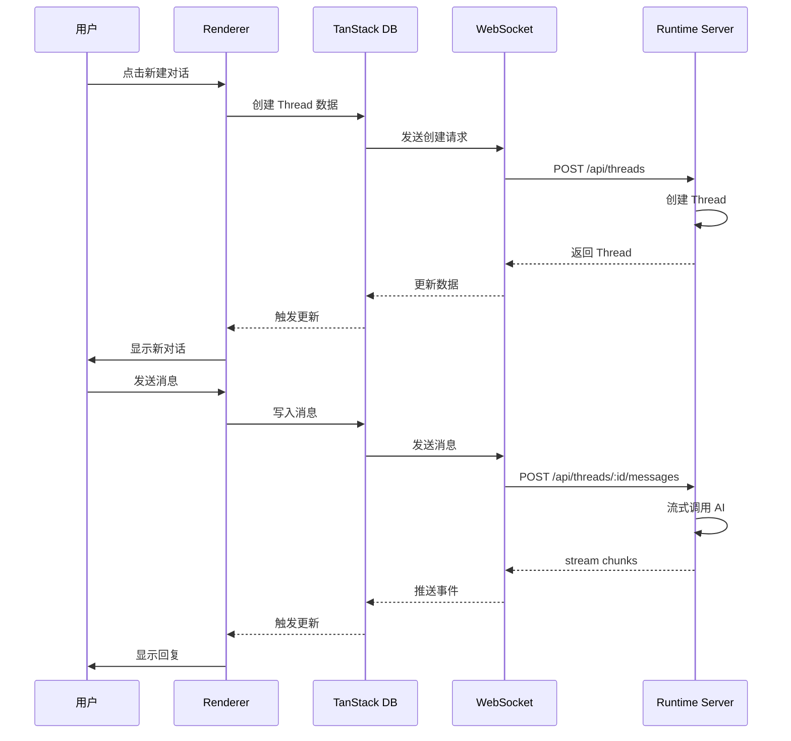
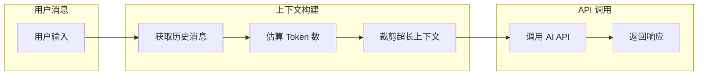

# RFC 0006: Thread 与消息管理

## 概述

定义 Acme 的 Thread（会话）和消息管理机制，包括 Thread 的创建、切换、删除和消息的发送、存储。

| 属性 | 值 |
|------|-----|
| RFC ID | 0006 |
| 状态 | 草稿 |
| 作者 | BlackCater |
| 创建日期 | 2026-03-11 |
| 最终更新 | 2026-03-11 |

## 背景

Thread 是 Acme 的核心概念，每个 Thread 代表一个独立的对话会话（类似 Codex 的 Session）。用户可以在不同的 Thread 之间切换，每个 Thread 有自己的消息历史和上下文。

**核心概念澄清**：
- **Thread** = Session，会话
- **Vault** = Workspace，工作空间

## 架构说明

### 通信流程

渲染进程通过 TanStack DB 与 Runtime Server 通信，Runtime Server 处理业务逻辑后返回数据。



## Thread 管理

### TanStack DB Collection

```typescript
// renderer/collections/thread-collection.ts

import { createCollection } from '@tanstack/react-db'

export const threadCollection = createCollection({
  queryKey: ['threads'],
  queryFn: async ({ vaultId }: { vaultId: string }) => {
    const response = await fetch(`/api/vaults/${vaultId}/threads`)
    return response.json()
  },
  getKey: (thread) => thread.id,
  onUpdate: async ({ transaction }) => {
    const { original, modified } = transaction.mutations[0]
    await fetch(`/api/threads/${original.id}`, {
      method: 'PATCH',
      body: JSON.stringify(modified),
    })
  },
})
```

### Thread 服务 (Runtime Server)

```typescript
// apps/runtime/src/services/thread-service.ts

export class ThreadService {
  constructor(
    private readonly fileStorage: FileStorage,
    private readonly providerService: ProviderService
  ) {}

  async create(vaultId: string, params: CreateThreadParams): Promise<Thread> {
    const thread: Thread = {
      id: crypto.randomUUID(),
      title: params.title || '新对话',
      vaultId,
      providerId: params.providerId,
      modelId: params.modelId,
      status: ThreadStatus.ACTIVE,
      metadata: {
        pinned: false,
        favorite: false,
      },
      createdAt: new Date(),
      updatedAt: new Date(),
    };

    // 存储到文件系统
    await this.fileStorage.writeThread(vaultId, thread);
    return thread;
  }

  async list(vaultId: string): Promise<Thread[]> {
    return this.fileStorage.listThreads(vaultId);
  }

  async get(id: string): Promise<Thread | null> {
    return this.fileStorage.getThread(id);
  }

  async update(id: string, updates: Partial<Thread>): Promise<Thread> {
    const thread = await this.get(id);
    if (!thread) {
      throw new Error('Thread not found');
    }

    const updated = {
      ...thread,
      ...updates,
      updatedAt: new Date(),
    };

    await this.fileStorage.writeThread(updated.vaultId, updated);
    return updated;
  }

  async delete(id: string): Promise<void> {
    const thread = await this.get(id);
    if (!thread) return;

    await this.update(id, { status: ThreadStatus.DELETED });
  }

  async archive(id: string): Promise<void> {
    await this.update(id, { status: ThreadStatus.ARCHIVED });
  }
}
```

## 消息管理

### 消息服务 (Runtime Server)

```typescript
// apps/runtime/src/services/message-service.ts

export class MessageService {
  async send(
    threadId: string,
    content: MessageContent[],
    options?: SendMessageOptions
  ): Promise<AsyncIterable<ChatChunk>> {
    const thread = await this.threadService.get(threadId);
    if (!thread) {
      throw new Error('Thread not found');
    }

    const provider = await this.providerService.get(thread.providerId);
    if (!provider) {
      throw new Error('Provider not found');
    }

    // 获取历史消息构建上下文
    const history = await this.list(threadId);

    // 构建消息列表
    const messages: Message[] = [
      ...history.map((m) => ({
        role: m.role,
        content: m.content,
      })),
      {
        role: MessageRole.USER,
        content,
      },
    ];

    // 调用 Provider
    const adapter = ProviderFactory.createAdapter(provider);
    const stream = await adapter.sendMessage({
      model: thread.modelId,
      messages,
      temperature: options?.temperature,
      maxTokens: options?.maxTokens,
    });

    return stream;
  }

  async list(threadId: string): Promise<Message[]> {
    const messages = await this.fileStorage.readMessages(threadId);
    return messages;
  }

  async create(
    threadId: string,
    role: MessageRole,
    content: MessageContent[]
  ): Promise<Message> {
    const message: Message = {
      id: crypto.randomUUID(),
      threadId,
      role,
      content,
      createdAt: new Date(),
    };

    // 追加写入 JSONL 文件
    await this.fileStorage.appendMessage(threadId, message);

    // 更新 Thread 的最后消息时间
    await this.threadService.update(threadId, {
      lastMessageAt: new Date(),
    });

    return message;
  }
}
```

### 消息流处理

```typescript
// apps/runtime/src/services/message-stream.ts

export async function* handleMessageStream(
  threadId: string,
  stream: AsyncIterable<ChatChunk>,
  messageService: MessageService
): AsyncGenerator<ChatChunk> {
  let assistantContent = '';
  let messageId: string | null = null;

  for await (const chunk of stream) {
    if (chunk.type === 'content' && chunk.content) {
      assistantContent += chunk.content;

      // 首次内容，插入消息
      if (!messageId) {
        const message = await messageService.create(
          threadId,
          MessageRole.ASSISTANT,
          [{ type: 'text', text: chunk.content }]
        );
        messageId = message.id;
      } else {
        // 后续内容，追加写入
        await messageService.appendContent(messageId, chunk.content);
      }
    }

    if (chunk.type === 'tool-call') {
      // 处理工具调用
      await messageService.addToolCall(threadId, messageId!, chunk.toolCall);
    }

    yield chunk;
  }

  // 流结束，更新 usage
  if (messageId && stream.usage) {
    await messageService.updateUsage(messageId, stream.usage);
  }
}
```

## 上下文管理

### 配置合并

Thread 在运行时需要的配置（MCP Servers、Skills、Provider）来自全局配置和 Vault 专属配置的合并：

```typescript
// apps/runtime/src/services/config-merge.ts

export class ConfigMerger {
  // 获取 Thread 可用的有效配置
  async getEffectiveConfig<T>(
    vaultId: string,
    configType: 'mcp-servers' | 'skills' | 'providers'
  ): Promise<T[]> {
    const global = await this.loadGlobalConfig<T>(configType)
    const vault = await this.loadVaultConfig<T>(configType, vaultId)

    // 按 ID 去重，Vault 配置优先覆盖全局配置
    const map = new Map([...global, ...vault].map(c => [c.id, c]))
    return Array.from(map.values())
  }

  // 获取 Thread 可用的 Provider
  async getEffectiveProvider(vaultId: string, providerId?: string) {
    const providers = await this.getEffectiveConfig<Provider>(vaultId, 'providers')

    // 如果指定了 providerId，使用指定的；否则使用默认
    if (providerId) {
      return providers.find(p => p.id === providerId)
    }

    // 找默认 Provider
    return providers.find(p => p.isDefault) || providers[0]
  }

  // 获取 Thread 可用的 MCP Servers
  async getEffectiveMCPServers(vaultId: string) {
    return this.getEffectiveConfig<MCPServer>(vaultId, 'mcp-servers')
      .then(servers => servers.filter(s => s.enabled))
  }

  // 获取 Thread 可用的 Skills
  async getEffectiveSkills(vaultId: string) {
    return this.getEffectiveConfig<Skill>(vaultId, 'skills')
      .then(skills => skills.filter(s => s.enabled))
  }
}
```

**配置合并规则**：
- Vault 专属配置 > 全局配置（相同 ID 时覆盖）
- Thread 不需要关心配置来自哪里
- 配置合并由 Runtime Server 在运行时完成

### 上下文窗口

```typescript
// apps/runtime/src/services/context-manager.ts

export class ContextManager {
  private readonly maxContextLength = 128000;

  async buildContext(
    threadId: string,
    maxTokens?: number
  ): Promise<Message[]> {
    const messages = await this.messageService.list(threadId);
    const thread = await this.threadService.get(threadId);
    const provider = await this.providerService.get(thread?.providerId);

    const model = provider?.models.find((m) => m.id === thread?.modelId);
    const contextWindow = model?.contextWindow || this.maxContextLength;
    const effectiveMaxTokens = maxTokens || Math.floor(contextWindow * 0.9);

    return this.pruneMessages(messages, effectiveMaxTokens);
  }

  private pruneMessages(
    messages: Message[],
    maxTokens: number
  ): Message[] {
    const result: Message[] = [];
    let totalTokens = 0;

    // 从最新消息开始，逆向添加
    for (let i = messages.length - 1; i >= 0; i--) {
      const message = messages[i];
      const messageTokens = this.estimateTokens(message);

      if (totalTokens + messageTokens > maxTokens) {
        break;
      }

      result.unshift(message);
      totalTokens += messageTokens;
    }

    return result;
  }

  private estimateTokens(message: Message): number {
    // 简单估算：约 4 字符 = 1 token
    const contentLength = message.content
      .map((c) => (c.type === 'text' ? c.text : ''))
      .join('').length;

    return Math.ceil(contentLength / 4);
  }
}
```

### 上下文长度管理



## REST API 接口

### Thread 接口

```typescript
// Runtime Server API

export const threadRoutes = {
  // 获取 Vault 下的所有 Thread
  'GET /api/vaults/:vaultId/threads': {
    handler: listThreads,
    schema: {
      params: z.object({ vaultId: z.string() }),
      response: z.array(threadSchema),
    },
  },

  // 创建 Thread
  'POST /api/vaults/:vaultId/threads': {
    handler: createThread,
    schema: {
      params: z.object({ vaultId: z.string() }),
      body: createThreadInputSchema,
      response: threadSchema,
    },
  },

  // 获取单个 Thread
  'GET /api/threads/:id': {
    handler: getThread,
    schema: {
      params: z.object({ id: z.string() }),
      response: threadSchema.nullable(),
    },
  },

  // 更新 Thread
  'PATCH /api/threads/:id': {
    handler: updateThread,
    schema: {
      params: z.object({ id: z.string() }),
      body: updateThreadSchema,
      response: threadSchema,
    },
  },

  // 删除 Thread
  'DELETE /api/threads/:id': {
    handler: deleteThread,
    schema: {
      params: z.object({ id: z.string() }),
      response: z.boolean(),
    },
  },
};
```

### Message 接口

```typescript
export const messageRoutes = {
  // 发送消息 (流式)
  'POST /api/threads/:threadId/messages': {
    handler: sendMessage,
    schema: {
      params: z.object({ threadId: z.string() }),
      body: sendMessageSchema,
      response: z.string(), // message id
    },
  },

  // 获取消息列表
  'GET /api/threads/:threadId/messages': {
    handler: listMessages,
    schema: {
      params: z.object({ threadId: z.string() }),
      query: z.object({
        limit: z.number().optional(),
        before: z.string().optional(),
      }),
      response: z.array(messageSchema),
    },
  },
};
```

## 状态管理

### TanStack DB 使用

```typescript
// renderer/hooks/useThreads.ts

import { useLiveQuery } from '@tanstack/react-db'
import { threadCollection } from '../collections/thread-collection'
import { eq } from '@tanstack/db'

export function useThreads(vaultId: string) {
  const { data: threads, status, isLoading } = useLiveQuery((q) =>
    q.from({ thread: threadCollection })
      .where(({ thread }) => eq(thread.vaultId, vaultId))
      .where(({ thread }) => eq(thread.status, 'active'))
      .orderBy(({ thread }) => thread.updatedAt, 'desc')
  , [vaultId])

  return { threads, status, isLoading }
}

export function useCurrentThread(threadId: string | null) {
  const { data: thread } = useLiveQuery((q) => {
    if (!threadId) return undefined
    return q.from({ thread: threadCollection }).where(({ thread }) => eq(thread.id, threadId))
  }, [threadId])

  return thread
}
```

### Jotai Atoms

```typescript
// renderer/atoms/vault-atoms.ts

export const currentVaultIdAtom = atom<string | null>(null)

// renderer/atoms/thread-atoms.ts

export const threadsAtom = atom<Thread[]>([])
export const currentThreadIdAtom = atom<string | null>(null)
export const currentThreadAtom = atom((get) => {
  const id = get(currentThreadIdAtom)
  const threads = get(threadsAtom)
  return threads.find((t) => t.id === id) || null
})

export const messagesAtom = atom<Message[]>([])
export const streamingAtom = atom<boolean>(false)
export const streamingContentAtom = atom<string>('')
```

## 本地存储

### JSONL 消息存储

```
~/.acme/data/vaults/{vaultId}/threads/{threadId}/messages.jsonl
```

```jsonl
{"id":"msg1","role":"user","content":[{"type":"text","text":"Hello"}],"createdAt":"2026-03-11T10:00:00Z"}
{"id":"msg2","role":"assistant","content":[{"type":"text","text":"Hi!"}],"createdAt":"2026-03-11T10:00:01Z","usage":{"inputTokens":10,"outputTokens":5,"totalTokens":15}}
```

## 验收标准

- [ ] Thread CRUD 操作已实现
- [ ] 消息发送和接收已实现
- [ ] 流式响应已支持
- [ ] 上下文管理已实现
- [ ] 消息持久化已实现
- [ ] TanStack DB 集成已配置

## 相关 RFC

- [RFC 0002: 系统架构设计](./0002-system-architecture.md)
- [RFC 0003: 数据模型设计](./0003-data-models.md)
- [RFC 0004: 多 Provider 抽象层](./0004-multi-provider-abstraction.md)
- [RFC 0008: 本地存储设计](./0008-local-storage.md)
