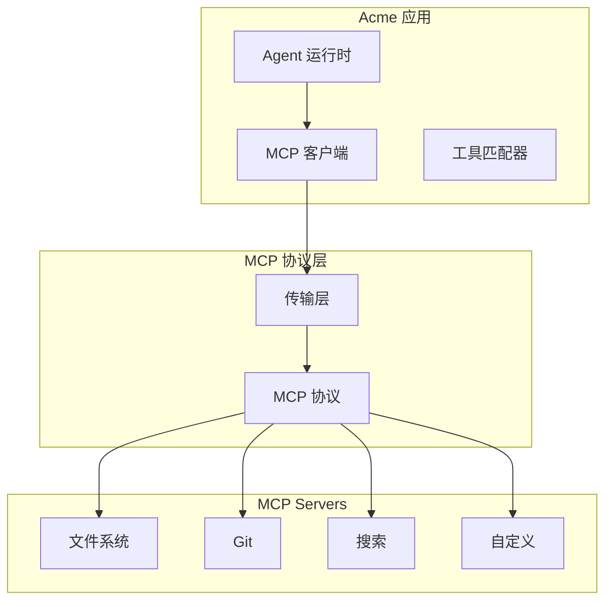
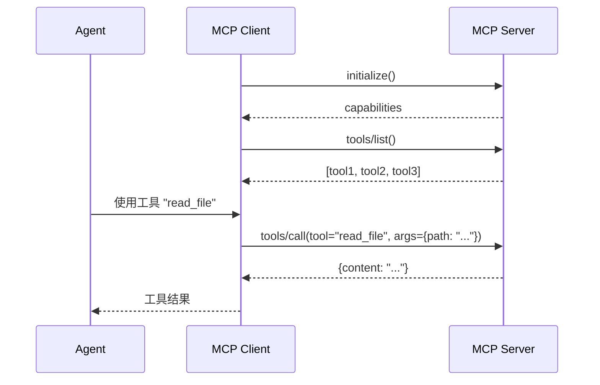
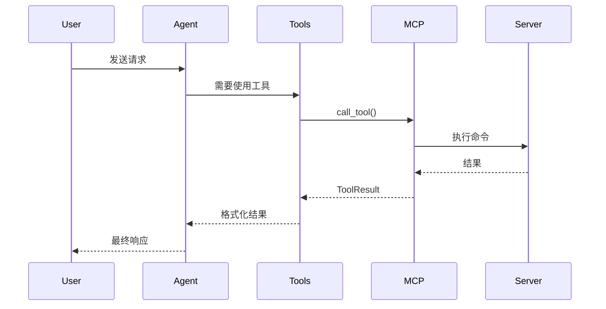

# RFC 0007: MCP 集成

## 概述

定义 Acme 与 MCP (Model Context Protocol) 的集成方案，支持连接外部 MCP Server 并使用其提供的工具。

| 属性 | 值 |
|------|-----|
| RFC ID | 0007 |
| 状态 | 草稿 |
| 作者 | BlackCater |
| 创建日期 | 2026-03-11 |
| 最终更新 | 2026-03-11 |

## 背景

MCP (Model Context Protocol) 是一个开放协议，允许 AI 模型与外部工具和服务进行交互。Acme 通过 MCP 集成，可以扩展 Agent 的能力，实现文件操作、Git 操作、Web 搜索等功能。

## MCP 架构

### 整体架构



### MCP 协议流程



## MCP 客户端实现

### 客户端类

```typescript
// packages/mcp/src/client.ts

export interface MCPClient {
  connect(): Promise<void>;
  disconnect(): Promise<void>;
  listTools(): Promise<MCPTool[]>;
  callTool(name: string, args: Record<string, unknown>): Promise<ToolResult>;
}

export class MCPClientImpl implements MCPClient {
  private transport: Transport | null = null;
  private capabilities: ServerCapabilities | null = null;

  async connect(config: MCPServerConfig): Promise<void> {
    // 创建传输层
    if (config.command) {
      this.transport = new StdioTransport(
        config.command,
        config.args || [],
        config.env
      );
    } else if (config.url) {
      this.transport = new SSETransport(config.url);
    } else {
      throw new Error('Invalid MCP server config');
    }

    // 初始化连接
    const response = await this.transport.send({
      jsonrpc: '2.0',
      id: 1,
      method: 'initialize',
      params: {
        protocolVersion: '2024-11-05',
        capabilities: {},
        clientInfo: {
          name: 'acme',
          version: '0.1.0',
        },
      },
    });

    this.capabilities = response.result.capabilities;

    // 发送初始化通知
    await this.transport.send({
      jsonrpc: '2.0',
      method: 'notifications/initialized',
    });
  }

  async listTools(): Promise<MCPTool[]> {
    const response = await this.transport.send({
      jsonrpc: '2.0',
      id: 2,
      method: 'tools/list',
    });

    return response.result.tools.map((t: any) => ({
      name: t.name,
      description: t.description,
      inputSchema: t.inputSchema,
    }));
  }

  async callTool(
    name: string,
    args: Record<string, unknown>
  ): Promise<ToolResult> {
    const response = await this.transport.send({
      jsonrpc: '2.0',
      id: 3,
      method: 'tools/call',
      params: {
        name,
        arguments: args,
      },
    });

    return response.result;
  }
}
```

### 传输层

```typescript
// packages/mcp/src/transport/stdio.ts

export class StdioTransport implements Transport {
  private process: ChildProcess | null = null;
  private writeStream: Writable | null = null;

  constructor(
    private readonly command: string,
    private readonly args: string[] = [],
    private readonly env: Record<string, string> = {}
  ) {}

  async connect(): Promise<void> {
    this.process = spawn(this.command, this.args, {
      env: { ...process.env, ...this.env },
      stdio: ['pipe', 'pipe', 'pipe'],
    });

    this.writeStream = this.process.stdin;

    // 处理 stdout
    this.process.stdout?.on('data', (data) => {
      this.handleMessage(data.toString());
    });

    // 处理 stderr
    this.process.stderr?.on('data', (data) => {
      console.error('[MCP Server]:', data.toString());
    });
  }

  async send(message: JSONRPCMessage): Promise<JSONRPCResponse> {
    return new Promise((resolve, reject) => {
      const messageStr = JSON.stringify(message) + '\n';
      this.writeStream?.write(messageStr, (error) => {
        if (error) reject(error);
        else this.pendingRequests.set(message.id, resolve);
      });
    });
  }
}
```

## MCP Server 管理

### Server 配置

```typescript
// packages/core/src/mcp/index.ts

export interface MCPServerConfig {
  id: string;
  workspaceId: string;
  name: string;
  command: string;
  args?: string[];
  env?: Record<string, string>;
  enabled: boolean;
}

export interface MCPServer {
  id: string;
  name: string;
  command: string;
  args: string[];
  env?: Record<string, string>;
  enabled: boolean;
  tools?: MCPTool[];
}
```

### Server 管理器

```typescript
// apps/desktop/src/main/services/mcp-manager.ts

export class MCPManager {
  private servers: Map<string, MCPClient> = new Map();

  async startServer(config: MCPServerConfig): Promise<void> {
    if (!config.enabled) return;

    const client = new MCPClientImpl();
    await client.connect(config);

    // 获取可用工具
    const tools = await client.listTools();

    this.servers.set(config.id, client);
    console.log(`MCP Server "${config.name}" started with ${tools.length} tools`);
  }

  async stopServer(id: string): Promise<void> {
    const client = this.servers.get(id);
    if (client) {
      await client.disconnect();
      this.servers.delete(id);
    }
  }

  async callTool(
    serverId: string,
    toolName: string,
    args: Record<string, unknown>
  ): Promise<ToolResult> {
    const client = this.servers.get(serverId);
    if (!client) {
      throw new Error(`MCP Server ${serverId} not running`);
    }

    return client.callTool(toolName, args);
  }

  getAllTools(): MCPTool[] {
    const tools: MCPTool[] = [];
    for (const [serverId, client] of this.servers) {
      // 从缓存获取工具列表
      tools.push(...this.toolCache.get(serverId) || []);
    }
    return tools;
  }
}
```

## 工具调用集成

### Agent 工具集成

```typescript
// packages/agent/src/tools/mcp-tools.ts

export class MCPToolAdapter {
  constructor(private readonly mcpManager: MCPManager) {}

  getToolsForAgent(): Tool[] {
    const mcpTools = this.mcpManager.getAllTools();

    return mcpTools.map((tool) => ({
      name: tool.name,
      description: tool.description,
      input_schema: tool.inputSchema,
      handler: async (args: Record<string, unknown>) => {
        // 查找对应的 MCP Server
        const serverId = this.findServerForTool(tool.name);
        if (!serverId) {
          throw new Error(`Tool ${tool.name} not found`);
        }

        const result = await this.mcpManager.callTool(
          serverId,
          tool.name,
          args
        );

        return this.formatResult(result);
      },
    }));
  }

  private findServerForTool(toolName: string): string | null {
    // 查找拥有该工具的 Server
    for (const [serverId, tools] of this.toolCache) {
      if (tools.some((t) => t.name === toolName)) {
        return serverId;
      }
    }
    return null;
  }

  private formatResult(result: ToolResult): string {
    if (result.isError) {
      return `Error: ${result.content}`;
    }
    return result.content;
  }
}
```

### 工具调用流程



## 常用 MCP Servers

### MVP 内置支持

| Server | 用途 | 命令 |
|--------|------|------|
| filesystem | 文件操作 | npx @modelcontextprotocol/server-filesystem |
| git | Git 操作 | npx @modelcontextprotocol/server-git |
| fetch | Web 抓取 | npx @modelcontextprotocol/server-fetch |

### 配置示例

```typescript
// 工作区配置示例
const workspaceConfig = {
  mcpServers: [
    {
      name: '文件系统',
      command: 'npx',
      args: ['-y', '@modelcontextprotocol/server-filesystem', '/Users/user/projects'],
      enabled: true,
    },
    {
      name: 'Git',
      command: 'npx',
      args: ['-y', '@modelcontextprotocol/server-git', '/Users/user/repos'],
      enabled: true,
    },
  ],
};
```

## 错误处理

### 错误类型

```typescript
// packages/core/src/error/mcp.ts

export enum MCPErrorCode {
  CONNECTION_FAILED = 'CONNECTION_FAILED',
  TOOL_NOT_FOUND = 'TOOL_NOT_FOUND',
  TOOL_EXECUTION_FAILED = 'TOOL_EXECUTION_FAILED',
  SERVER_CRASHED = 'SERVER_CRASHED',
}

export class MCPError extends AcmeError {
  constructor(
    code: MCPErrorCode,
    message: string,
    public readonly serverId: string,
    public readonly toolName?: string
  ) {
    super(ErrorScope.MCP, ErrorDomain.PROTOCOL, code, message);
  }
}
```

## 验收标准

- [ ] MCP 客户端已实现
- [ ] Stdio 传输层已实现
- [ ] SSE 传输层已实现
- [ ] Server 管理器已实现
- [ ] 工具调用集成已实现
- [ ] 错误处理已定义

## 相关 RFC

- [RFC 0003: 数据模型设计](./0003-data-models.md)
- [RFC 0010: Agent 运行时集成](./0010-agent-runtime.md)
