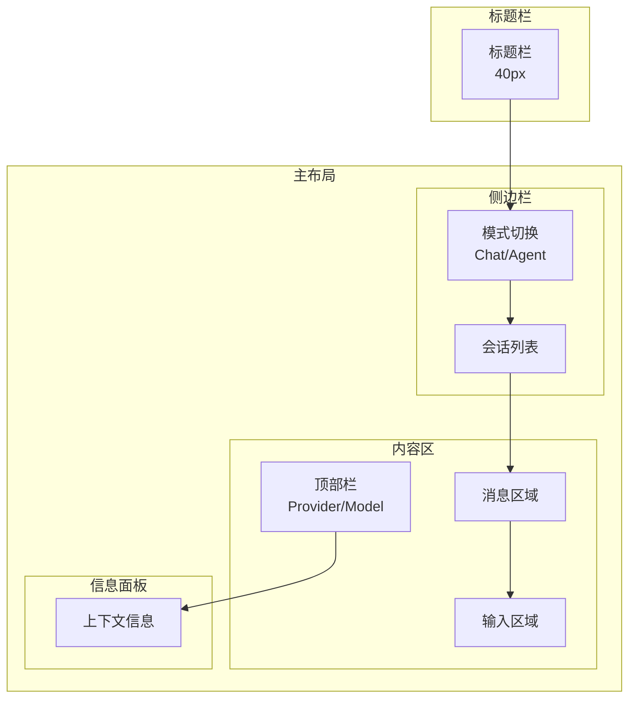

# RFC 0009: UI/UX 设计系统

## 概述

定义 Acme 桌面应用的 UI/UX 设计系统，包括组件规范、主题系统、布局设计和交互模式。

| 属性 | 值 |
|------|-----|
| RFC ID | 0009 |
| 状态 | 草稿 |
| 作者 | BlackCater |
| 创建日期 | 2026-03-11 |
| 最终更新 | 2026-03-11 |

## 背景

本文档定义 Acme 的用户界面设计系统，确保产品的一致性和可用性。设计系统基于现代桌面应用最佳实践，结合项目特点进行定制。

## 设计原则

### 核心原则

1. **简洁**: 界面元素精简，聚焦核心功能
2. **高效**: 最小化用户操作步骤，快速完成任务
3. **一致**: 统一的视觉语言和交互模式
4. **可访问**: 支持键盘导航，考虑色盲等特殊用户

### 设计参考

- **macOS**: 简洁、优雅、半透明效果
- **Figma**: 工具栏 + 画布 + 属性面板的三列布局
- **VS Code**: 高度可定制、面板化

## 布局设计

### 主窗口布局



### 布局尺寸

| 区域 | 最小宽度 | 默认宽度 | 最大宽度 | 可调整 |
|------|----------|----------|----------|--------|
| 侧边栏 | 180px | 240px | 320px | 是 |
| 内容区 | 400px | 自适应 | - | 是 |
| 信息面板 | 200px | 280px | 400px | 是 |

### 响应式断点

| 断点 | 宽度 | 布局 |
|------|------|------|
| 小 | < 768px | 隐藏侧边栏和面板 |
| 中 | 768-1200px | 显示侧边栏，隐藏面板 |
| 大 | > 1200px | 完整三列布局 |

## 组件规范

### 组件层级

```
├── Button
│   ├── Primary
│   ├── Secondary
│   ├── Ghost
│   └── Danger
├── Input
│   ├── Text
│   ├── Textarea
│   ├── Select
│   └── Search
├── Card
├── Modal
├── Dropdown
├── Tabs
├── Toast
└── Avatar
```

### 按钮组件

```tsx
// Button 组件属性
interface ButtonProps {
  variant: 'primary' | 'secondary' | 'ghost' | 'danger';
  size: 'sm' | 'md' | 'lg';
  icon?: ReactNode;
  iconPosition?: 'left' | 'right';
  loading?: boolean;
  disabled?: boolean;
}
```

### 按钮样式

| Variant | 背景 | 文字 | 边框 | 用途 |
|---------|------|------|------|------|
| Primary | primary | white | none | 主要操作 |
| Secondary | secondary | primary | 1px | 次要操作 |
| Ghost | transparent | current | none | 辅助操作 |
| Danger | danger | white | none | 危险操作 |

## 主题系统

### 颜色变量

```css
/* 亮色主题 */
:root {
  /* 品牌色 */
  --color-primary: #4F46E5;
  --color-primary-hover: #4338CA;
  --color-primary-foreground: #FFFFFF;

  /* 语义色 */
  --color-success: #22C55E;
  --color-warning: #F59E0B;
  --color-error: #EF4444;
  --color-info: #3B82F6;

  /* 中性色 */
  --color-background: #FFFFFF;
  --color-foreground: #18181B;
  --color-muted: #F4F4F5;
  --color-muted-foreground: #71717A;
  --color-border: #E4E4E7;
  --color-ring: #4F46E5;

  /* 交互态 */
  --color-hover: #F9FAFB;
  --color-active: #F3F4F6;
}

/* 暗色主题 */
[data-theme="dark"] {
  --color-primary: #818CF8;
  --color-primary-hover: #6366F1;
  --color-primary-foreground: #18181B;

  --color-background: #09090B;
  --color-foreground: #FAFAFA;
  --color-muted: #18181B;
  --color-muted-foreground: #A1A1AA;
  --color-border: #27272A;
  --color-ring: #818CF8;

  --color-hover: #18181B;
  --color-active: #27272A;
}
```

### 字体系统

```css
/* 字体栈 */
--font-sans: 'Inter', 'SF Pro Display', -apple-system, BlinkMacSystemFont, 'Segoe UI', Roboto, sans-serif;
--font-mono: 'JetBrains Mono', 'Fira Code', 'SF Mono', Consolas, monospace;

/* 字号 */
--text-xs: 12px;
--text-sm: 13px;
--text-base: 14px;
--text-lg: 16px;
--text-xl: 18px;
--text-2xl: 20px;
--text-3xl: 24px;

/* 行高 */
--leading-tight: 1.25;
--leading-normal: 1.5;
--leading-relaxed: 1.625;

/* 字重 */
--font-normal: 400;
--font-medium: 500;
--font-semibold: 600;
--font-bold: 700;
```

### 间距系统

```css
--space-1: 4px;
--space-2: 8px;
--space-3: 12px;
--space-4: 16px;
--space-5: 20px;
--space-6: 24px;
--space-8: 32px;
--space-10: 40px;
--space-12: 48px;
```

### 圆角

```css
--radius-sm: 4px;
--radius-md: 6px;
--radius-lg: 8px;
--radius-xl: 12px;
--radius-full: 9999px;
```

## 交互模式

### 消息气泡

```tsx
// 消息组件布局
<MessageBubble role={role}>
  <Avatar />
  <Content>
    <Header>
      <Name />
      <Time />
    </Header>
    <Body>
      {content}
    </Body>
  </Content>
</MessageBubble>
```

### 消息样式

| 角色 | 背景 | 对齐 |
|------|------|------|
| System | muted | 居中 |
| User | primary | 右侧 |
| Assistant | secondary | 左侧 |
| Tool | muted | 左侧 |

### 输入区域

```tsx
// 输入组件
<InputArea>
  <Toolbar>
    <AttachmentButton />
    <CodeBlockButton />
    <MermaidButton />
    <EmojiButton />
  </Toolbar>
  <Editor>
    <Textarea />
  </Editor>
  <Footer>
    <ContextIndicator />
    <SendButton />
  </Footer>
</InputArea>
```

### 快捷键提示

```tsx
<KeyboardShortcut hint="⌘K">
  <Badge>Ctrl</Badge>
</KeyboardShortcut>
```

## 组件示例

### 侧边栏

```tsx
<Sidebar>
  <SidebarHeader>
    <Logo />
    <WorkspaceSelect />
  </SidebarHeader>

  <SidebarTabs>
    <Tab value="chat" icon={ChatIcon} />
    <Tab value="agent" icon={AgentIcon} />
    <Tab value="mcp" icon={McpIcon} />
  </SidebarTabs>

  <ThreadList>
    <ThreadItem active />
    <ThreadItem />
    <ThreadItem />
  </ThreadList>

  <SidebarFooter>
    <SettingsButton />
  </SidebarFooter>
</Sidebar>
```

### 设置面板

```tsx
<Settings>
  <SettingsTabs>
    <Tab value="general">通用</Tab>
    <Tab value="appearance">外观</Tab>
    <Tab value="providers">渠道</Tab>
    <Tab value="shortcuts">快捷键</Tab>
    <Tab value="about">关于</Tab>
  </SettingsTabs>

  <SettingsContent>
    {activeTab === 'providers' && <ProviderSettings />}
    {activeTab === 'appearance' && <AppearanceSettings />}
  </SettingsContent>
</Settings>
```

## 动画效果

### 过渡动画

```css
/* 基础过渡 */
* {
  transition-duration: 150ms;
  transition-timing-function: cubic-bezier(0.4, 0, 0.2, 1);
}

/* 淡入淡出 */
.fade-enter {
  opacity: 0;
}
.fade-enter-active {
  opacity: 1;
}
.fade-exit {
  opacity: 1;
}
.fade-exit-active {
  opacity: 0;
}

/* 滑动 */
.slide-enter {
  transform: translateX(-100%);
}
.slide-enter-active {
  transform: translateX(0);
}
```

### 加载状态

```tsx
// 流式输出动画
<StreamingText>
  {displayedText}
  <Cursor blink />
</StreamingText>
```

## 可访问性

### 键盘导航

- Tab 键在可聚焦元素间切换
- 方向键在列表中导航
- Enter/Space 激活元素
- Escape 关闭弹窗

### 焦点管理

```tsx
// 弹窗焦点管理
<Modal
  onClose={() => {
    focusTrigger(); // 关闭后返回触发元素
  }}
>
  <FocusTrap>
    {/* 焦点限制在弹窗内 */}
  </FocusTrap>
</Modal>
```

### 屏幕阅读器

- 使用语义化 HTML
- 添加 ARIA 标签
- 提供替代文本

## 验收标准

- [ ] 布局结构已定义
- [ ] 颜色变量已定义
- [ ] 字体系统已定义
- [ ] 组件规范已定义
- [ ] 主题切换已支持
- [ ] 动画效果已定义
- [ ] 可访问性已考虑

## 相关 RFC

- [RFC 0002: 系统架构设计](./0002-system-architecture.md)
- [RFC 0005: 桌面应用核心功能](./0005-desktop-core-features.md)
