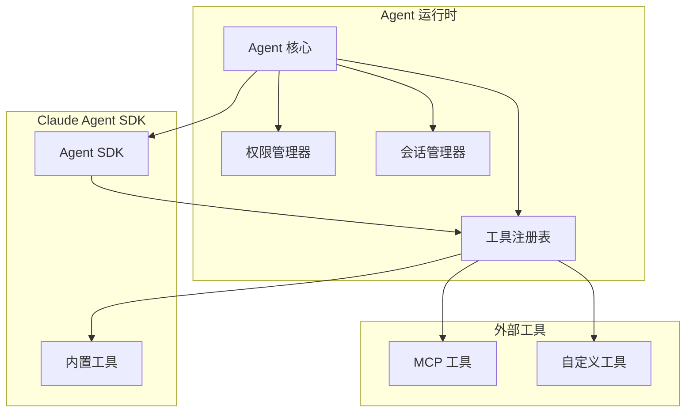
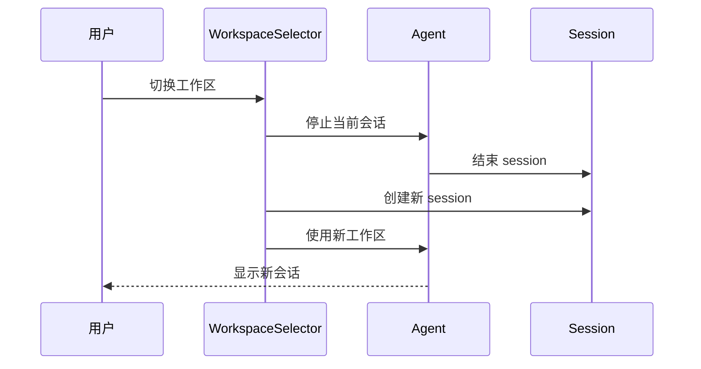

# RFC 0010: Agent 运行时集成

## 概述

定义 Acme 与 Claude Agent SDK 的集成方案，实现自主 Agent 功能，包括工具执行、权限管理和工作区隔离。

| 属性 | 值 |
|------|-----|
| RFC ID | 0010 |
| 状态 | 草稿 |
| 作者 | BlackCater |
| 创建日期 | 2026-03-11 |
| 最终更新 | 2026-03-11 |

## 背景

Agent 模式是 Acme MVP 的核心功能之一，允许 AI 自主执行代码编辑、文件操作等复杂任务。本文档定义 Agent 运行时的实现方案。

## Agent 架构

### 整体架构



### Agent 服务层

```typescript
// packages/agent/src/agent-service.ts

import Anthropic from '@anthropic-ai/claude-agent-sdk';

export class AgentService {
  private sessions: Map<string, AgentSession> = new Map();

  async createSession(config: AgentSessionConfig): Promise<AgentSession> {
    const session = new AgentSession({
      id: crypto.randomUUID(),
      workspaceId: config.workspaceId,
      provider: config.provider,
      model: config.model,
      tools: config.tools,
      permissionMode: config.permissionMode || 'ask',
      cwd: config.cwd,
    });

    this.sessions.set(session.id, session);
    return session;
  }

  async execute(
    sessionId: string,
    prompt: string,
    options?: AgentExecuteOptions
  ): Promise<AsyncIterable<AgentEvent>> {
    const session = this.sessions.get(sessionId);
    if (!session) {
      throw new Error('Session not found');
    }

    const sdk = this.createSDK(session);

    // 构建 Agent 请求
    const agent = sdk.agent({
      model: session.model,
      tools: this.buildTools(session),
      permissionMode: session.permissionMode,
    });

    // 执行并转换事件流
    const result = await agent.execute(prompt, {
      cwd: session.cwd,
      env: session.env,
      ...options,
    });

    return this.convertEvents(result);
  }
}
```

### Agent 会话

```typescript
// packages/agent/src/session.ts

export interface AgentSession {
  id: string;
  workspaceId: string;
  provider: Provider;
  model: string;
  permissionMode: PermissionMode;
  cwd: string;
  env: Record<string, string>;
  status: SessionStatus;
  createdAt: Date;
}

export enum PermissionMode {
  SAFE = 'safe',           // 只读操作
  ASK = 'ask',            // 询问用户
  BYPASS = 'bypass',      // 允许所有操作
}

export enum SessionStatus {
  IDLE = 'idle',
  RUNNING = 'running',
  WAITING_PERMISSION = 'waiting_permission',
  DONE = 'done',
  ERROR = 'error',
}
```

## 工具系统

### 工具接口

```typescript
// packages/agent/src/tools/tool.ts

export interface Tool {
  name: string;
  description: string;
  inputSchema: JSONSchema;
  execute: ToolExecutor;
}

export type ToolExecutor = (
  input: Record<string, unknown>,
  context: ToolContext
) => Promise<ToolResult>;

export interface ToolContext {
  sessionId: string;
  workspaceId: string;
  cwd: string;
  permissions: PermissionSet;
}

export interface ToolResult {
  success: boolean;
  output?: string;
  error?: string;
}
```

### 内置工具

```typescript
// packages/agent/src/tools/builtin-tools.ts

export const builtinTools: Tool[] = [
  {
    name: 'Read',
    description: 'Read contents of a file',
    inputSchema: {
      type: 'object',
      properties: {
        file_path: { type: 'string' },
      },
      required: ['file_path'],
    },
    execute: async (input, context) => {
      const content = await fs.promises.readFile(input.file_path, 'utf8');
      return { success: true, output: content };
    },
  },
  {
    name: 'Write',
    description: 'Write contents to a file',
    inputSchema: {
      type: 'object',
      properties: {
        file_path: { type: 'string' },
        content: { type: 'string' },
      },
      required: ['file_path', 'content'],
    },
    execute: async (input, context) => {
      await fs.promises.writeFile(input.file_path, input.content);
      return { success: true, output: 'File written successfully' };
    },
  },
  {
    name: 'Bash',
    description: 'Execute a shell command',
    inputSchema: {
      type: 'object',
      properties: {
        command: { type: 'string' },
        description: { type: 'string' },
      },
      required: ['command'],
    },
    execute: async (input, context) => {
      const result = await exec(input.command, {
        cwd: context.cwd,
        env: context.permissions.env,
      });
      return { success: result.exitCode === 0, output: result.stdout, error: result.stderr };
    },
  },
  {
    name: 'Glob',
    description: 'Glob pattern matching for files',
    inputSchema: {
      type: 'object',
      properties: {
        pattern: { type: 'string' },
        path: { type: 'string' },
      },
      required: ['pattern'],
    },
    execute: async (input, context) => {
      const files = await glob(input.pattern, { cwd: input.path || context.cwd });
      return { success: true, output: files.join('\n') };
    },
  },
  {
    name: 'Grep',
    description: 'Search for patterns in files',
    inputSchema: {
      type: 'object',
      properties: {
        pattern: { type: 'string' },
        path: { type: 'string' },
      },
      required: ['pattern'],
    },
    execute: async (input, context) => {
      const results = await grep(input.pattern, input.path || context.cwd);
      return { success: true, output: results };
    },
  },
];
```

### MCP 工具集成

```typescript
// packages/agent/src/tools/mcp-tools.ts

export class MCPToolAdapter {
  constructor(private readonly mcpManager: MCPManager) {}

  getTools(): Tool[] {
    const mcpTools = this.mcpManager.getAllTools();

    return mcpTools.map((mcpTool) => ({
      name: mcpTool.name,
      description: mcpTool.description,
      inputSchema: mcpTool.inputSchema,
      execute: async (input, context) => {
        try {
          const result = await this.mcpManager.callTool(
            this.findServer(mcpTool.name),
            mcpTool.name,
            input
          );
          return { success: !result.isError, output: result.content };
        } catch (error) {
          return { success: false, error: String(error) };
        }
      },
    }));
  }
}
```

## 权限管理

### 权限模式

```typescript
// packages/agent/src/permissions/permission-manager.ts

export class PermissionManager {
  private pendingRequests: Map<string, PermissionRequest> = new Map();

  async requestPermission(
    sessionId: string,
    tool: string,
    input: Record<string, unknown>
  ): Promise<PermissionResponse> {
    const request: PermissionRequest = {
      id: crypto.randomUUID(),
      sessionId,
      tool,
      input,
      timestamp: new Date(),
    };

    this.pendingRequests.set(request.id, request);

    // 根据权限模式决定响应
    const mode = this.getSessionMode(sessionId);

    switch (mode) {
      case PermissionMode.SAFE:
        // 只允许安全操作
        if (this.isSafeOperation(tool)) {
          return { allowed: true, requestId: request.id };
        }
        return { allowed: false, requestId: request.id, reason: 'Unsafe operation' };

      case PermissionMode.BYPASS:
        // 允许所有操作
        return { allowed: true, requestId: request.id };

      case PermissionMode.ASK:
        // 等待用户确认
        return { allowed: false, requiresUserConfirmation: true, requestId: request.id };

      default:
        return { allowed: false, requestId: request.id };
    }
  }

  async confirmPermission(requestId: string): Promise<void> {
    const request = this.pendingRequests.get(requestId);
    if (request) {
      request.status = 'confirmed';
      // 通知 Agent 继续执行
    }
  }

  async denyPermission(requestId: string): Promise<void> {
    const request = this.pendingRequests.get(requestId);
    if (request) {
      request.status = 'denied';
      // 通知 Agent 终止执行
    }
  }
}
```

### 权限请求 UI

```tsx
// 渲染进程组件
<PermissionBanner>
  <Icon type="warning" />
  <Content>
    <Title>Agent 请求权限</Title>
    <Description>
      Agent 尝试执行 <Code>{toolName}</Code> 命令
    </Description>
    <Details>
      <JSONPreview data={input} />
    </Details>
  </Content>
  <Actions>
    <Button variant="secondary" onClick={deny}>
      拒绝
    </Button>
    <Button variant="primary" onClick={confirm}>
      允许
    </Button>
  </Actions>
</PermissionBanner>
```

## 工作区隔离

### 工作区配置

```typescript
// packages/agent/src/workspace/workspace-isolation.ts

export interface WorkspaceContext {
  id: string;
  name: string;
  cwd: string;
  env: Record<string, string>;
  allowedPaths: string[];
  blockedPaths: string[];
}

export class WorkspaceIsolator {
  validatePath(session: AgentSession, path: string): boolean {
    const workspace = this.getWorkspace(session.workspaceId);

    // 检查是否在允许路径内
    const allowed = workspace.allowedPaths.some((p) =>
      path.startsWith(p)
    );

    // 检查是否在禁止路径内
    const blocked = workspace.blockedPaths.some((p) =>
      path.startsWith(p)
    );

    return allowed && !blocked;
  }

  getEnvironment(session: AgentSession): Record<string, string> {
    const workspace = this.getWorkspace(session.workspaceId);

    return {
      ...process.env,
      ...workspace.env,
      // 覆盖用户环境变量
      HOME: workspace.cwd,
      PWD: workspace.cwd,
    };
  }
}
```

### 工作区切换



## 事件流

### Agent 事件

```typescript
// packages/agent/src/events/agent-event.ts

export type AgentEvent =
  | AgentTextEvent
  | AgentToolStartEvent
  | AgentToolResultEvent
  | AgentThinkingEvent
  | AgentDoneEvent
  | AgentErrorEvent;

export interface AgentTextEvent {
  type: 'text';
  content: string;
}

export interface AgentToolStartEvent {
  type: 'tool_start';
  tool: string;
  input: Record<string, unknown>;
}

export interface AgentToolResultEvent {
  type: 'tool_result';
  tool: string;
  output: string;
  error?: string;
}

export interface AgentThinkingEvent {
  type: 'thinking';
  content: string;
}

export interface AgentDoneEvent {
  type: 'done';
  summary: string;
  usage: TokenUsage;
}

export interface AgentErrorEvent {
  type: 'error';
  error: string;
}
```

### 事件处理

```typescript
// apps/desktop/src/main/services/agent-stream.ts

export async function* handleAgentStream(
  sessionId: string,
  stream: AsyncIterable<SDKEvent>
): AsyncGenerator<AgentEvent> {
  for await (const event of stream) {
    // 转换 SDK 事件为 Agent 事件
    yield convertSDKEvent(event);
  }
}

function convertSDKEvent(event: SDKEvent): AgentEvent {
  switch (event.type) {
    case 'text':
      return { type: 'text', content: event.text };
    case 'tool_use':
      return {
        type: 'tool_start',
        tool: event.name,
        input: event.input,
      };
    case 'tool_result':
      return {
        type: 'tool_result',
        tool: event.toolName,
        output: event.output,
        error: event.error,
      };
    case 'message_delta':
      return {
        type: 'done',
        summary: event.delta?.text || '',
        usage: event.usage,
      };
    default:
      return { type: 'text', content: '' };
  }
}
```

## IPC 接口

### Agent 接口

```typescript
// apps/desktop/src/contracts/agent.ts

export const agentContracts = {
  // 会话管理
  createSession: oc
    .input(createSessionSchema)
    .output(agentSessionSchema),

  closeSession: oc
    .input(z.object({ sessionId: z.string() }))
    .output(z.boolean()),

  // 执行
  execute: oc
    .input(executeSchema)
    .output(z.string()), // session id

  abort: oc
    .input(z.object({ sessionId: z.string() }))
    .output(z.boolean()),

  // 权限
  confirmPermission: oc
    .input(z.object({ requestId: z.string() }))
    .output(z.boolean()),

  denyPermission: oc
    .input(z.object({ requestId: z.string() }))
    .output(z.boolean()),

  // 事件流
  onEvent: eventContract<AgentEvent>,
};
```

## 状态管理

### Agent Atoms

```typescript
// renderer/atoms/agent-atoms.ts

export const agentSessionsAtom = atom<AgentSession[]>([]);
export const currentSessionIdAtom = atom<string | null>(null);
export const currentSessionAtom = atom((get) => {
  const id = get(currentSessionIdAtom);
  return get(agentSessionsAtom).find((s) => s.id === id);
});

export const pendingPermissionsAtom = atom<PermissionRequest[]>([]);
export const agentEventsAtom = atom<AgentEvent[]>([]);

export const agentStatusAtom = atom((get) => {
  const session = get(currentSessionAtom);
  return session?.status || 'idle';
});
```

## 验收标准

- [ ] Agent 会话管理已实现
- [ ] Claude Agent SDK 集成已完成
- [ ] 内置工具已实现
- [ ] MCP 工具集成已完成
- [ ] 权限管理模式已定义
- [ ] 权限请求 UI 已实现
- [ ] 工作区隔离已实现
- [ ] 事件流处理已实现

## 相关 RFC

- [RFC 0004: 多 Provider 抽象层](./0004-multi-provider-abstraction.md)
- [RFC 0006: 会话与消息管理](./0006-session-message-management.md)
- [RFC 0007: MCP 集成](./0007-mcp-integration.md)
